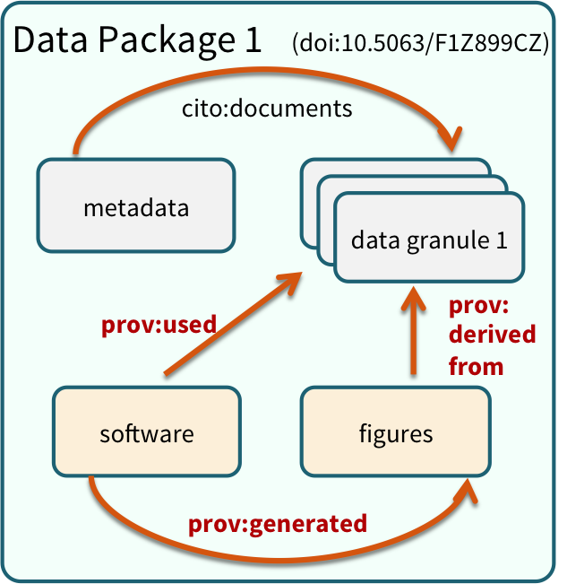

# Data packaging and managing large data sets

```{r setup_packaging, include=FALSE}
knitr::opts_chunk$set(echo = TRUE, eval = FALSE)
```

## Learning Objectives

In this lesson, you will learn:

- Why one might want to use a repository for reproducible research
- How to package large data sets
- How to programatically access data from repositories
- How to use R to programatically upload data sets to a repository

This document briefly covers three common tasks:

- Downloading and using data from the Arctic Data Center
- Uploading a data file to the Arctic Data Center
- Uploading an entire Data Package to the Arctic Data Center

## Data Packages

Within many repositories, including the Arctic Data Center, data sets are organized
as collections of files grouped together into *data packages* that are meaningful for
a particular scientific purpose.  For example, a data package might include:

- the raw data from a research experiment
- the raw data from one year of an observational monitoring program
- derived data that was a cleaned and gridded version of an original raw source data set
- the data inputs and output figures and data from a particular set of analyses for a paper



## Reproducible workflows

Data that are stored locally on your computer are not accessible to collaborators, 
reviewers, or colleagues that might want to build upon your work.  In addition, local
file systems generally do not have good mecahnisms for versioning data and providing
reliable pointers to particular versions of a data set.  One convenient solution
is to upload data packages to a versioned data repository like the Arctic Data Center,
and then to use those online, versioned copies of your data directly in your 
analytical code so that it is explictly using a versioned copy of a data file.

There are several mechanisms for doing this, including:

- directly access the file over web links using HTTP
- use a helper library (`dataone`) that has functions for remotely accessing a data set

In both of these cases, your code has direct references to the data using its unique, 
global identifer.  This means that, anybody who has the code will be able to execute
the code and it will directly access the data.  It also avoids the common problems
that people have with arranging their data in different directory structures on their
local disks, which can often prevent others from accessing your data.

## Accessing and using data from a repository

Let's start by accessing some data from the Arctic Data Center, loading it into 
a data frame, and plotting that data.  This mini-workflow shows how powerful 
it can be to combine archival repositories with scripted analysis:

```{r}
# Read and plot data from doi:10.18739/A25T3FZ8X
bg_chem_url <- "https://arcticdata.io/metacat/d1/mn/v2/object/urn%3Auuid%3A35ad7624-b159-4e29-a700-0c0770419941"
bg_chem = read.csv(bg_chem_url, stringsAsFactors = FALSE)
plot(bg_chem$CTD_Depth, bg_chem$CTD_Temperature)
```

Everything one needs to read and understand that analysis is contained in those three lines of code. 
But where did `bg_chem_url` come from?  I copied it from the [data set landing page](https://doi.org/doi:10.18739/A25T3FZ8X) on
the Arctic Center repository.

## Setup for the dataone package

The R `dataone` package offers some convenient ways to do this, particularly some custom R classes which encapsulate a lot of the complexity of Objects and Data Packages.

First, let's install and load libraries needed for connecting to DataONE repositories:

```{r, eval = F}
packages <- c( "datapack", "dataone", "EML")
for (package in packages) { if (!(package %in% installed.packages())) { install.packages(package) } }
rm(packages) #remove variables from workspace
```

```{r}
library(dataone)
library(datapack)
```

Here we use a `D1Client` which is one way of connecting to a repository:

```{r}
client <- D1Client("PROD", "urn:node:KNB")
```

and then we use that client object to access the entire `DataPackage`, which includes
both the data from all of the data files as well as the metadata that describes
the data.

```{r}
doi <- "doi:10.5063/F1Z036CP"
client <- D1Client("PROD", "urn:node:KNB")
doi <- "doi:10.5063/F1Z036CP"
pkg <- getDataPackage(client, doi)
```

Now grab the data for the CSV file from that package:

```{r}
getIdentifiers(pkg)
do <- getMember(pkg, getIdentifiers(pkg)[3])
csvtext <- rawToChar(getData(do))
dframe <- read.csv(textConnection(csvtext), stringsAsFactors = FALSE)
head(dframe)
```

## Authentication
Before uploading any data to a DataONE repository, you must login to get an *authentication token*, which is a character string used to identify yourself. This token can be retrieved by logging into the test repository and copying the token into your R session.

We will be using a test server, so login and retrieve your token at https://test.arcticdata.io

Once you are logged in, navigate to your Profile Settings, and locate the "Authentication Token" section, and then copy the token for R to your clipboard. Finally, paste the token into the R Console to register it as an option for this R session.  You are now logged in.  But note that you need to keep this token private; don't paste it into scripts or check it into Git, as it is just as sensitive as your password.


## Upload a single data file

For uploading data, let's use a test repository:
```{r}
client <- D1Client("STAGING", "urn:node:mnTestARCTIC")
```

First let's make an example data file (CSV in this case) to upload:

```{r}
data("co2") # Built-in dataset in R
write.csv(co2, "./co2.csv")
```

Every Object we upload then just needs a `DataObject` class instance for it:

```{r}
my_object <- new("DataObject", 
                 filename = "./co2.csv",
                 format = "text/csv")

my_object <- setPublicAccess(my_object) # Make it public readable!
```

And then we just need to upload it:

```{r}
uploadDataObject(client, my_object)
```

## Upload a simple Data Package

The steps to upload an entire package aren't that much more complex.
First, let's create an example EML file:

```{r}
library(EML)

title <- "Test dataset to show submitting via R client"
me <- as.person("Bryce Mecum <mecum@nceas.ucsb.edu>")
dataset <- new("dataset",
               title = title,
               creator = me,
               contact = me)

eml_pid <- paste0("urn:uuid", uuid::UUIDgenerate())

eml <- new("eml",
           packageId = eml_pid,
           system = "uuid",
           dataset = dataset)

eml_path <- "~/my_eml.xml"
write_eml(eml, eml_path)
eml_validate(eml_path)
```

And then we just use the `DataPackage` class:

```{r}
my_package <- new("DataPackage")

my_metadata <- new("DataObject", 
                   format = "eml://ecoinformatics.org/eml-2.1.1", 
                   filename = eml_path)

my_metadata <- setPublicAccess(my_metadata) # Make it public readable!

my_object <- new("DataObject", 
                 filename = "./co2.csv",
                 format = "text/csv")

my_object <- setPublicAccess(my_object) # Make it public readable!

my_package <- addMember(my_package, my_object, mo = my_metadata)
```

```{r}
uploadDataPackage(client, my_package, public = TRUE)
```
