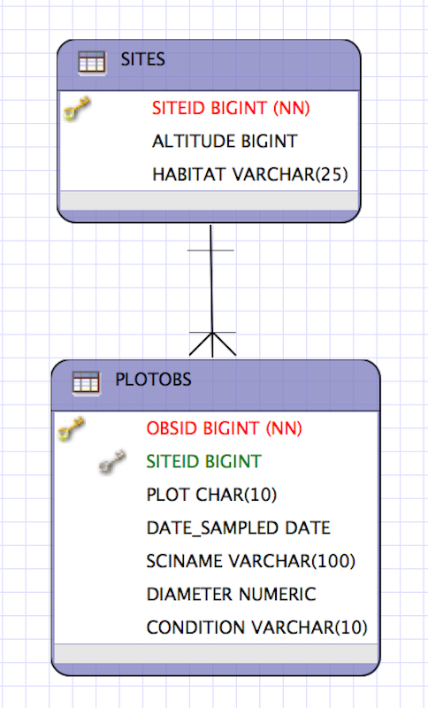
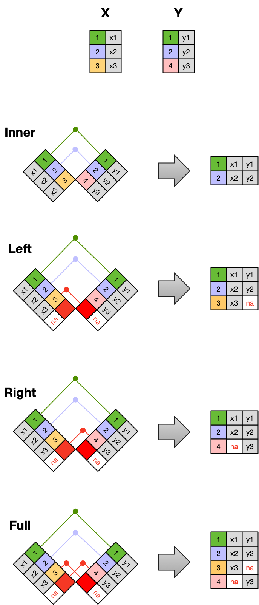
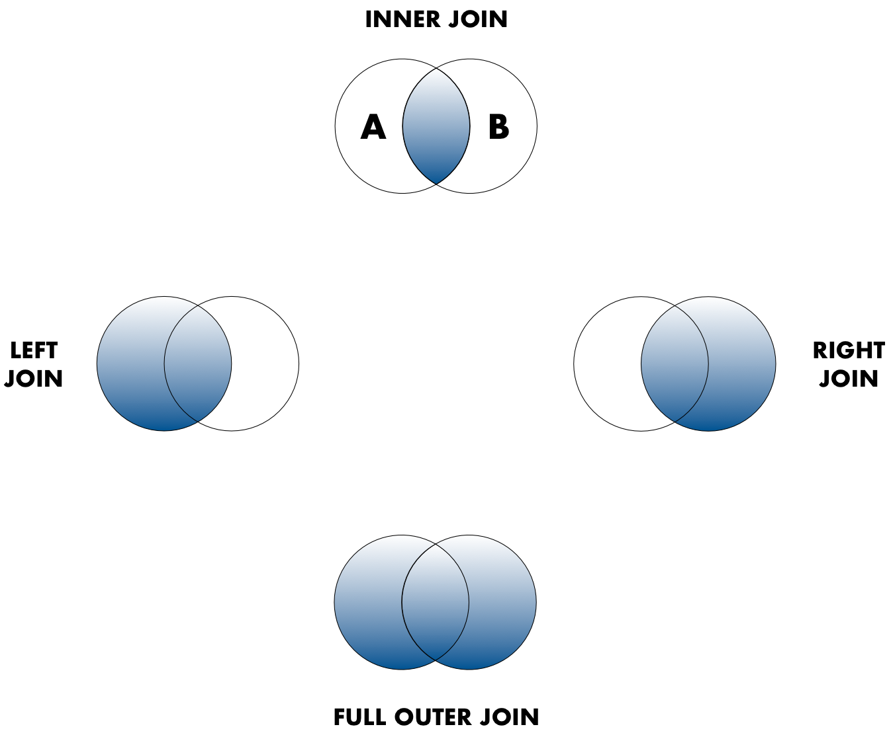

# Data Modeling & Tidy Data

## Learning Objectives

- Understand basics of relational data models aka tidy data
- Learn how to design and create effective data tables

## Benefits of relational data systems

- Powerful search and filtering
- Handle large, complex data sets
- Enforce data integrity
- Decrease errors from redundant updates

## Data Organization


## Multiple tables


## Inconsistent observations


## Inconsistent variables


## Marginal sums and statistics


## Good enough data modeling

### Denormalized data

- Observations about different entities combined


In the above example, each row has measurements about both the `site` at which observations
occurred, as well as observations of two individuals of possibly different species
found at that site.  This is *not normalized* data.

People often refer to this as *wide* format, because the observations are spread across a
wide number of columns.  Note that, should one encounter a new species in the survey, we
wold have to add new columns to the table.  This is difficult to analyze, understand, and
maintain.

### Tabular data

__Observations__. A better way to model data is to organize the observations about each type of entity in its own table.  This results in:

- Separate tables for each type of entity measured
- Each row represents a single observed entity
- Observations (rows) are all unique

- This is *normalized* data (aka *tidy data*)

__Variables__. In addition, for normalized data, we expect the variables to be organized such that:

- All values in a column are of the same type
- All columns pertain to the same observed entity (e.g., row)
- Each column represents either an identifying variable or a measured variable

Here's an example of tidy (normalized) data in which the top table is the collection
of observations about individuals of several species, and the bottom table are the
observations containing properties of the sites at which the species occurred.


## Primary and Foreign Keys

When one has normalized data, we often use unique identifiers to reference
particular observations, which allows us to link across tables.  Two types of
identifiers are common within relational data:

- Primary Key: unique identifier for each observed entity, one per row
- Foreign Key: reference to a primary key in another table (linkage)

For example, in the second table below, the `site` column is the *primary key* 
of that table, because it uniquely identifies each row of the table as a unique
observation of a site.  Inthe first table, however, the `site` column is a 
*foreign key* that references the primary key from the second table.  This linkage
tells us that the first height measurement for the `DAPU` observation occurred
at the site with the name `Taku`.


## Entity-Relationship Model (ER)

An Entity-Relationship model allows us to compactly draw the structure of the
tables in a relational database, including the primary and foreign keys in the tables.



In the above model, one can see that each site in the `SITES` table must have one
or more observations in the `PLOTOBS` table, whereas each `PLOTOBS` has one and 
only one `SITE`.

## Merging data

Frequently, analysis of data will require merging these separately managed tables
back together.  There are multiple ways to join the observations in two tables, based
on how the rows of one table are merged with the rows of the other.

When conceptualizing merges, one can think of two tables, one on the *left* and
one on the *right*. The most common (and often useful) join is when you merge the subset 
of rows that have matches in both the left table and the right table: 
this is called an *INNER JOIN*.  Other types of join are possible as well. 
A *LEFT JOIN* takes all of the rows from the left table, and merges on the data from matching rows in the right table.  Keys that don't match from the left table are still provided with a missing value (na) from the right table.  A *RIGHT JOIN* is the same, except that all of the rows from the right table are included with matching data from the left, or a missing value. Finally, a *FULL OUTER JOIN* includes all data from all rows in both tables, and includes missing values wherever necessary.



Sometimes people represent these as Venn diagrams showing which parts of the left and
right tables are included in the results for each join.  These however, miss part of the
story related to where the missing value come from in each result.



In the figure above, the blue regions show the set of rows that are included in the result.
For the INNER join, the rows returned are all rows in A that have a matching row in B.

## Simple Guidelines for Effective Data

- Design to add rows, not columns
- Each column one type
- Eliminate redundancy
- Uncorrected data file
- Header line
- Nonproprietary formats
- Descriptive names
- No spaces

- [Borer et al. 2009. **Some Simple Guidelines for Effective Data Management.** Bulletin of the Ecological Society of America.](http://matt.magisa.org/pubs/borer-esa-2009.pdf)
- [White et al. 2013. **Nine simple ways to make it easier to (re)use your data.** Ideas in Ecology and Evolution 6.](https://doi.org/10.4033/iee.2013.6b.6.f)

## Data modeling exercise

- Break into groups, 1 per table

To demonstrate, we'll be working with a tidied up version of a dataset from ADF&G containing commercial catch data from 1878-1997.
The dataset and reference to the original source can be viewed at its public archive: https://knb.ecoinformatics.org/#view/df35b.304.2.
That site includes metadata describing the full data set, including column definitions.  Here's the first `catch` table:

```{r catch, cache=TRUE, echo=FALSE}
library(DT)
catch <- read.csv(url("https://knb.ecoinformatics.org/knb/d1/mn/v2/object/df35b.302.1", method = "libcurl"),
                  stringsAsFactors = FALSE)
datatable(catch)
```

And here's the `region_defs` table:
```{r regions, cache=TRUE, echo=FALSE}
region_defs <- read.csv(url("https://knb.ecoinformatics.org/knb/d1/mn/v2/object/df35b.303.1", method = "libcurl"),
                        stringsAsFactors = FALSE)
datatable(region_defs)
```

- Draw an ER model for the tables
  - Indicate the primary and foreign keys
- Is the `catch` table in normal (aka tidy) form?
  - If so, what single type of entity was observed?
  - If not, how might you restructure the data table to make it tidy?
    - Draw a new ER diatram showing this re-designed data structure


## Related resources

- [Borer et al. 2009. **Some Simple Guidelines for Effective Data Management.** Bulletin of the Ecological Society of America.](http://matt.magisa.org/pubs/borer-esa-2009.pdf)
- [White et al. 2013. **Nine simple ways to make it easier to (re)use your data.** Ideas in Ecology and Evolution 6.](https://doi.org/10.4033/iee.2013.6b.6.f)
- [Software Carpentry SQL tutorial](https://swcarpentry.github.io/sql-novice-survey/)
- [Tidy Data](http://vita.had.co.nz/papers/tidy-data.pdf)

