--- 
title: "Arctic Data Center Training"
date: "August 13-17, 2018"
site: bookdown::bookdown_site
output: bookdown::gitbook
documentclass: book
bibliography: [book.bib]
biblio-style: apalike
link-citations: yes
description: "description here"
always_allow_html: yes
---

# Data Science Training for the Arctic Data Center

[](https://arcticdata.io)

The [Arctic Data Center](https://arcticdata.io) conducts training in data science and management,
both of which are critical skills for stewardship of data, software, and other
products of research that are preserved at the [Arctic Data Center](https://arcticdata.io).

## Schedule

```{r schedule, echo=FALSE, out.width = '100%', fig.align = 'center'}
knitr::include_graphics("images/adc-schedule.png")
```

### Acknowledgements
Work on this package was supported by:

- [NSF award #1546024](http://www.nsf.gov/awardsearch/showAward?AWD_ID=1546024) to M. B. Jones, S. Baker-Yeboah, A. Budden, J. Dozier, and M. Schildhauer

Additional support was provided for working group collaboration by the National Center for Ecological Analysis and Synthesis, a Center funded by the University of California, Santa Barbara, and the State of California.

```{r footer_logo, echo=FALSE, out.width = '100%', fig.align = 'center'}
knitr::include_graphics("images/nceas-logo.png")
```


<!--chapter:end:index.Rmd-->

# Introduction to the Arctic Data Center and NSF Standards and Policies

## Learning Objectives

In this lesson, you will learn:

- About the mission and structure of the Arctic Data Center
- How the Arctic Data Center supports the research community
- About data policies from the NSF Arctic program

## Materials

Download slides: [Arctic Data Center Overview and NSF Policies](files/081318_Session2_Arctic_Training_Budden_v2.pdf)

<!--chapter:end:02_intro-adc-policies.Rmd-->

# Best Practices: Data and Metadata

## Learning Objectives

In this lesson, you will learn:

- Why preserving computational workflows is important
- How to acheive practical reproducibility
- What are some best practices for data and metadata management

Download slides: [Best Practices: Data and Metadata](03-best-practices-data-metadata.pdf)

## Preserving computational workflows

Preservation enables:

- Understanding
- Evaluation
- Reuse

All for `Future You`!  And your collaborators and colleagues across disciplines.

```{r components01, echo=FALSE, out.width = '50%', fig.align = 'center', fig.cap = 'Scientific products that need to be preserved from computational workflows include data, software, metadata, and other products like graphs and figures.'}

```

While the [Arctic Data Center](https://arcticdata.io) and similar repositories do
focus on preserving data, we really set our sights much more broadly on preserving
entire computational workflows that are instrumental to advances in science.  A 
computational workflow represents the sequence of computational tasks that are
performed from raw data acquisition through data quality control, integration, 
analysis, modeling, and visualization.

```{r compworkflow01, echo=FALSE, out.width = '100%', fig.align = 'center', fig.cap = 'Computational steps can be organized as a workflow streaming raw data through to derived products.'}
knitr::include_graphics("images/comp-workflow-1.png")
```

In addition, these workflows are often not executed all at once, but rather are
divided into multiple workflows, earch with its own purpose.  For example, a data
acquistion and cleaning workflow often creates a derived and integrated data product
that is then picked up and used by multiple downstream analytical workflows that
produce specific scientific findings.  These workflows can each be archived as 
distinct data packages, with the output of the first workflow becoming the input
of the second and subsequent workflows.

```{r compworkflow02, echo=FALSE, out.width = '100%', fig.align = 'center', fig.cap = 'Computational workflows can be archived and preserved in multiple dat apackages that are linked by their shared components, in this case an intermediate data file.'}
knitr::include_graphics("images/comp-workflow-2.png")
```

## Best Practices: Overview

- Who Must Submit?
- Organizing Data
- File Formats
- Large Data Packages
- Metadata
- Data Identifiers
- Provenance
- Licensing and Distribution


```{r fjord, echo=FALSE, out.width = '100%', fig.align = 'center'}

```

## Organizing Data: Best Practices

Both (@borer_simple_2009) and (@white_nine_2013) provide some practical guidelines
for organizing and structuring data.  Critical aspects of their recommendations
include:

- Write scripts for all data manipulation
    - Uncorrected raw data file
    - Document processing in scripts
- Design to add rows, not columns
    - Each column one variable
    - Each row one observation
- Use nonproprietary file formats
    - Descriptive names, no spaces
    - Header line
    

<!--chapter:end:03_best-practices-data-metadata.Rmd-->

# Data Documentation and Publishing 

## Learning Objectives

In this lesson, you will learn:

- About open data archives, especially the Arctic Data Center
- What science metadata are and how they can be used
- How data and code can be documented and published in open data archives
    - Web-based submission
    - Submission using R

## Data sharing and preservation


## Data repositories: built for data (and code)

- GitHub is not an archival location
- Dedicated data repositories: KNB, Arctic Data Center, Zenodo, FigShare
  + Rich metadata
  + Archival in their mission
- Data papers, e.g., Scientific Data
- List of data repositories: http://re3data.org


## Arctic Data Center


## Metadata

Metadata are documentation describing the content, context, and structure of 
data to enable future interpretation and reuse of the data.  Generally, metadata
describe who collected the data, what data were collected, when and where they were 
collected, and why they were collected.  

For consistency, metadata are typically structured following metadata content 
standards such as the [Ecological Metadata Language (EML)](https://knb.ecoinformatics.org/software/eml/).
For example, here's an excerpt of the metadata for a sockeye salmon dataset:

```xml
<?xml version="1.0" encoding="UTF-8"?>
<eml:eml packageId="df35d.442.6" system="knb" 
    xmlns:eml="eml://ecoinformatics.org/eml-2.1.1">
    <dataset>
        <title>Improving Preseason Forecasts of Sockeye Salmon Runs through 
            Salmon Smolt Monitoring in Kenai River, Alaska: 2005 - 2007</title>
        <creator id="1385594069457">
            <individualName>
                <givenName>Mark</givenName>
                <surName>Willette</surName>
            </individualName>
            <organizationName>Alaska Department of Fish and Game</organizationName>
            <positionName>Fishery Biologist</positionName>
            <address>
                <city>Soldotna</city>
                <administrativeArea>Alaska</administrativeArea>
                <country>USA</country>
            </address>
            <phone phonetype="voice">(907)260-2911</phone>
            <electronicMailAddress>mark.willette@alaska.gov</electronicMailAddress>
        </creator>
        ...
    </dataset>
</eml:eml>
```

That same metadata document can be converted to HTML format and displayed in a much
more readable form on the web: https://knb.ecoinformatics.org/#view/doi:10.5063/F1F18WN4


And as you can see, the whole dataset or its components can be downloaded and
reused.

Also note that the repository tracks how many times each file has been downloaded,
which gives great feedback to researchers on the activity for their published data.

## Structure of a data package

Note that the dataset above lists a collection of files that are contained within
the dataset.  We define a *data package* as a scientifically useful collection of 
data and metadata that a researcher wants to preserve.  Sometimes a data package
represents all of the data from a particular experiment, while at other times it
might be all of the data from a grant, or on a topic, or associated with a paper.
Whatever the extent, we define a data package as having one or more data files,
software files, and other scientific products such as graphs and images, all tied
together with a descriptive metadata document.


These data repositories all assign a unique identifier to every version of every
data file, similarly to how it works with source code commits in GitHub.  Those identifiers
usually take one of two forms.  A *DOI* identifier is often assigned to the metadata
and becomes the publicly citable identifier for the package.  Each of the other files
gets a global identifier, often a UUID that is globally unique.  In the example above,
the package can be cited with the DOI `doi:10.5063/F1F18WN4`,and each of the individual
files would have their own identifiers as well.

## DataONE Federation

DataONE is a federation of dozens of data repositories that work together to make their 
systems interoperable and to provide a single unified search system that spans
the repositories.  DataONE aims to make it simpler for researchers to publish
data to one of its member repositories, and then to discover and download that
data for reuse in synthetic analyses.

DataONE can be searched on the web (https://search.dataone.org/), which effectively
allows a single search to find data from the dozens of members of DataONE, rather
than visiting each of the currently 43 repositories one at a time.


## Publishing data from the web

Each data repository tends to have its own mechanism for submitting data and
providing metadata.  With repositories like the KNB Data Repository and the
Arctic Data Center, we provide some easy to use web forms for editing and submitting
a data package.  Let's walk through a web submission to see what you might expect.

### Download the data to be used for the tutorial

I've already uploaded the test data package, and so you can access the data here:

- https://demo.arcticdata.io/#view/urn:uuid:0702cc63-4483-4af4-a218-531ccc59069f

Grab both CSV files, and the R script, and store them in a convenient folder.


### Login via ORCID

We will walk through web submission on https://demo.arcticdata.io, and start 
by logging in with an ORCID account. ORCID provides a common account for sharing
scholarly data, so if you don't have one, you can create one when you are redirected
to ORCID from the *Sign In* button.


When you sign in, you will be redirected to [orcid.org](https://orcid.org), where you can either provide your existing ORCID credentials, or create a new account.  ORCID provides multiple ways to login, including using your email address, institutional logins from many universities, and logins from social media account providers.  Choose the one that is best suited to your use as a scholarly record, such as your university or agency login.


### Create and submit the dataset

After signing in, you can access the data submission form using the *Submit* button.
Once on the form, upload your data files and follow the prompts to provide the 
required metadata.

#### Click **Add Files** to choose the data files for your package

You can select multiple files at a time to efficiently upload many files.


The files will upload showing a progress indicator.  You can continue editing 
metadata while they upload.


#### Enter Overview information

This includes a descriptive title, abstract, and keywords.


And you also must enter a funding award number and choose a license.  The funding field will 
search for an NSF award identifier based on words in its title or the number itself.


#### People Information

Information about the people associated with the dataset is essential to provide 
credit through citation and to help people understand who made contributions to
the product.  Enter information for the following people:

- Creators - **all the people who should be in the citation for the dataset**
- Contacts - one is required, but defaults to the first Creator if omitted
- Principal Investigators
- and any other that are relevant

For each, please strive to provide their [ORCID](https://orcid.org) identifier, which
helps link this dataset to their other scholarly works.


#### Location Information

The geospatial location that the data were collected is critical for discovery 
and interpretation of the data.  Coordinates are entered in decimal degrees, and
be sure to use negative values for West longitudes.  The editor allows you to 
enter multiple locations, which you should do if you had noncontiguous sampling
locations.  This is particularly important if your sites are separated by large
distances, so that spatial search will be more precise.


Note that, if you miss fields that are required, they will be highlighted in red
to draw your attention. In this case, for the description, provide a comma-separated 
place name, ordered from the local to global:

- Mission Canyon, Santa Barbara, California, USA

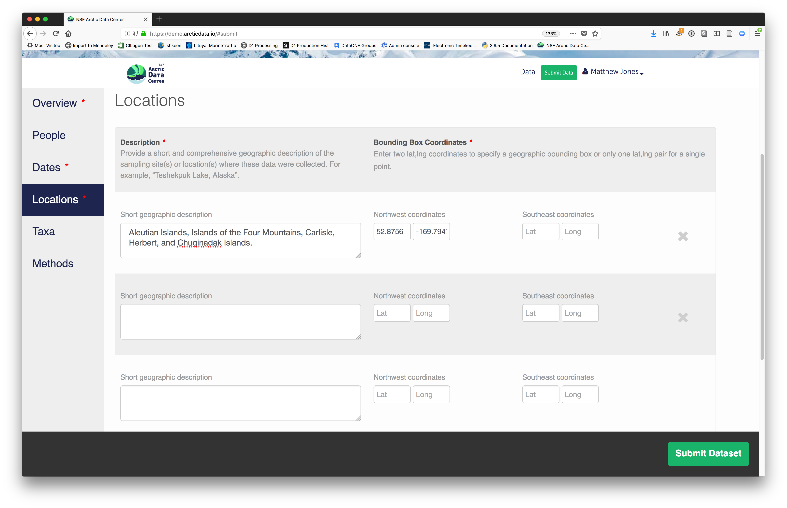

#### Temporal Information

Add the temporal coverage of the data, which represents the time period to which
data apply.  Again, use multiple date ranges if your sampling was discontinuous.


#### Methods

Methods are critical to accurate interpretation and reuse of your data.  The editor 
allows you to add multiple different methods sections, include details of 
sampling methods, experimental design, quality assurance procedures, and computational
techniques and software.  Please be complete with your methods sections, as they
are fundamentally important to reuse of the data.


#### Save a first version with **Submit**

When finished, click the *Submit Dataset* button at the bottom.  
If there are errors or missing fields, they will be highlighted.  
Correct those, and then try submitting again.  When you are successful, you should
see a large green banner with a link to the current dataset view.  Click the `X` 
to close that banner, if you want to continue editing metadata.

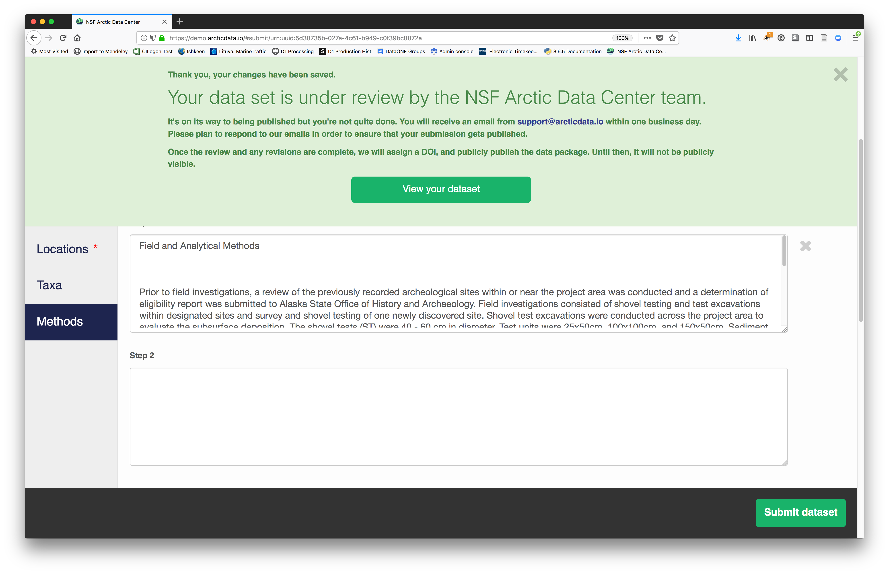
Success!

### File and variable level metadata 

The final major section of metadata concerns the structure and contents
of your data files. In this case, provide the names and descriptions of
the data contained in each file, as well as details of their internal structure.

For example, for data tables, you'll need the name, label, and definition of 
each variable in your file.  Click the **Describe** button to access a dialog to enter this information.


The **Attributes** tab is where you enter variable (aka attribute)
information, including:

- variable name (for programs)
- variable label (for display)

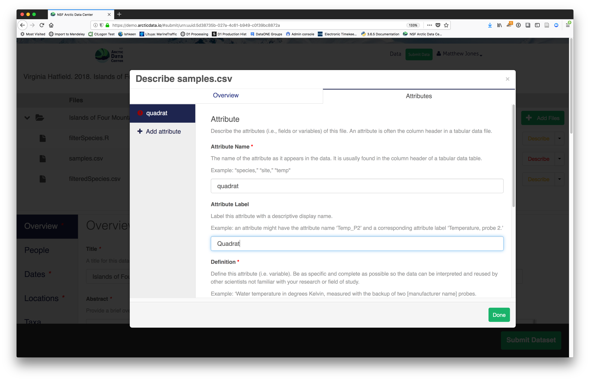
- variable definition (be specific)
- type of measurement

- units & code definitions 


You'll need to add these definitions for every variable (column) in 
the file. When done, click **Done**.

Now the list of data files will show a green checkbox indicating that you have
full described that file's internal structure.  Proceed with the other CSV
files, and then click **Submit Dataset** to save all of these changes.


After you get the big green success message, you can visit your 
dataset and review all of the information that you provided. If
you find any errors, simply click **Edit** again to make changes.

### Add workflow provenance

Understanding the relationships between files in a package is critically important,
especially as the number of files grows.  Raw data are transformed and integrated
to produce derived data, that are often then used in analysis and visualization code
to produce final outputs.  In DataONE, we support structured descriptions of these
relationships, so one can see the flow of data from raw data to derived to outputs.

You add provenance by navigating to the data table descriptions, and selecting the 
`Add` buttons to link the data and scripts that were used in your computational 
workflow.  On the left side, select the `Add` circle to add an input data source
to the filteredSpecies.csv file.  This starts building the provenance graph to
explain the origin and history of each data object.


The linkage to the source dataset should appear.


Then you can add the link to the source code that handled the conversion
between the data files by clicking on `Add` arrow and selecting the R script:


The diagram now shows the relationships among the data files and the R script, so
click **Submit** to save another version of the package.


Et voilà!  A beatifully preserved data package!

## Publishing data from R

Now let's see how to use the *dataone* and *datapack* R packages to upload data to DataONE
member repositories like the [KNB Data Repository](https://knb.ecoinformatics.org) and the [Arctic Data Center](https://arcticdata.io).

The *dataone* R package provides methods to enable R scripts to interact with DataONE to search for, download, upload and update data and metadata. The purpose of uploading data from R is to automate the repetitive tasks for large datasets with many files.  For small datasets, the web submission for will certainly be simpler.

The *dataone* R package represents the set of files in a dataset as a `datapack::DataPackage`.  We will create a `DataPackage` locally, and then upload it to a test version of the Arctic Data Center repository using `dataone`.

### Logging in
Before uploading any data to a DataONE repository, you must login to get an *authentication token*, which is a character string used to identify yourself. This token can be retrieved by logging into the test repository and copying the token into your R session.

### Obtain an ORCID
ORCID is a researcher identifier that provides a common way to link your researcher identity to your articles and data.  An ORCID is to a researcher as a DOI is to a research article.  To obtain an ORCID, register at https://orcid.org.

### Log in to the test repository and copy your token
We will be using a test server, so login and retrieve your token at https://demo.arcticdata.io

Once you are logged in, navigate to your Profile Settings, and locate the "Authentication Token" section, and then copy the token for R to your clipboard.

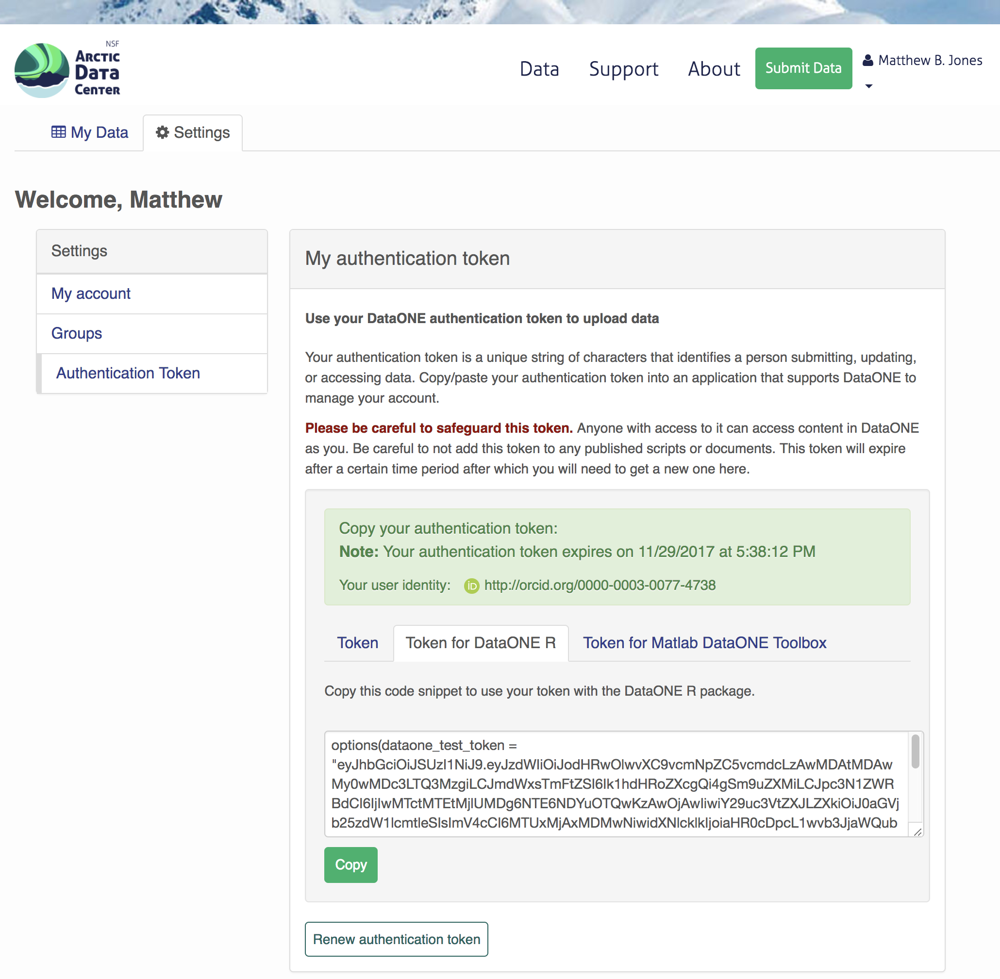
Finally, paste the token into the R Console to register it as an option for this R session.  You are now logged in.  But note that you need to keep this token private; don't paste it into scripts or check it into Git, as it is just as sensitive as your password.

### Modifying metadata
Next, modify the metadata file associated with the package to set yourself as the owner.  This will help us differentiate the test data later.  Open the `strix-pacific-northwest.xml` file in RStudio, and change the `givenName` and `surName` fields at the top to your name.

```{r modify-eml, eval=FALSE}
library(EML)
source("misc/eml_helpers.R")

# Load the EML file into R
emlFile <- "data/strix/strix-pacific-northwest.xml"
doc <- read_eml(emlFile)

# Change creator to us
doc@dataset@creator <- c(eml_creator("Matthew", "Jones", email = "jones@nceas.ucsb.edu"))

# Change abstract to the better one we wrote
doc@dataset@abstract <- as(set_TextType("data/strix/better-abstract.md"), "abstract")

# Save it back to the filesystem
write_eml(doc, emlFile)
```

### Uploading A Package Using R with `uploadDataPackage`
Datasets and metadata can be uploaded individually or as a collection. Such a collection, whether contained in local 
R objects or existing on a DataONE repository, will be informally referred to as a `package`. The steps necessary to prepare and upload a package to DataONE using the `uploadDataPackage` method 
will be shown. A complete script that uses these steps is shown here.

In the first section, we create a 'DataPackage as a container for our data, metadata, and scripts.
It starts out as empty.

```{r data-package, eval=FALSE}
library(dataone)
library(datapack)
library(uuid)

d1c <- D1Client("STAGING2", "urn:node:mnTestKNB")
dp <- new("DataPackage")
show(dp)
```

We then add a metadata file, data file, R script and output data file to this package.
Our first order is to generate identifiers for the files that are part of the 
package, and add EML metadata that references those identifiers.

```{r entity-metadata, eval=FALSE}
# Generate identifiers for our data and program objects, and add them to the metadata
sourceId <- paste0("urn:uuid:", uuid::UUIDgenerate())
progId <- paste0("urn:uuid:", uuid::UUIDgenerate())
outputId <- paste0("urn:uuid:", uuid::UUIDgenerate())
doc@dataset@otherEntity[[1]]@id <- new("xml_attribute", sourceId)
doc@dataset@otherEntity[[2]]@id <- new("xml_attribute", progId)
doc@dataset@otherEntity[[3]]@id <- new("xml_attribute", outputId)
repo_obj_service <- paste0(d1c@mn@endpoint, "/object/")
doc@dataset@otherEntity[[1]]@physical[[1]]@distribution[[1]]@online@url <- 
  new("url", paste0(repo_obj_service, sourceId))
doc@dataset@otherEntity[[2]]@physical[[1]]@distribution[[1]]@online@url <- 
  new("url", paste0(repo_obj_service, progId))
doc@dataset@otherEntity[[3]]@physical[[1]]@distribution[[1]]@online@url <- 
  new("url", paste0(repo_obj_service, outputId))

write_eml(doc, emlFile)
```

Now we have a full metadata document ready to be uploaded.  In the next section, we'll
add the data files and metadata to a `DataPackage`, and then upload that to a
test repository.

```{r build-package, eval=FALSE}
# Add the metadata document to the package
metadataObj <- new("DataObject", 
                   format="eml://ecoinformatics.org/eml-2.1.1", 
                   filename=paste(getwd(), emlFile, sep="/"))
dp <- addMember(dp, metadataObj)

# Add our input data file to the package
sourceData <- "data/strix/sample.csv"
sourceObj <- new("DataObject",
                 id = sourceId,
                 format="text/csv", 
                 filename=paste(getwd(), sourceData, sep="/"))
dp <- addMember(dp, sourceObj, metadataObj)

# Add our processing script to the package
progFile <- "data/strix/filterSpecies.R"
progObj <- new("DataObject",
               id = progId,
               format="application/R", 
               filename=paste(getwd(), progFile, sep="/"), 
               mediaType="text/x-rsrc")
dp <- addMember(dp, progObj, metadataObj)

# Add our derived output data file to the package
outputData <- "data/strix/filteredSpecies.csv"
outputObj <- new("DataObject", 
               id = outputId,
               format="text/csv", 
               filename=paste(getwd(), outputData, sep="/"))
dp <- addMember(dp, outputObj, metadataObj)

myAccessRules <- data.frame(subject="http://orcid.org/0000-0003-0077-4738", permission="changePermission") 

# Add the provenance relationships to the data package
dp <- describeWorkflow(dp, sources=sourceObj, program=progObj, derivations=outputObj)

show(dp)
```

Finally, we upload the package to the Testing server for the KNB.
```{r upload-package, eval=FALSE}
packageId <- uploadDataPackage(d1c, dp, public=TRUE, accessRules=myAccessRules, quiet=FALSE)
```

This particular package contains the R script `filterSpecies.R`, the input 
file `sample.csv` that was read by the script and the output file 
`filteredSpecies.csv` that was created by the R script, which was run at a
previous time.  

You can now search for and view the package at https://dev.nceas.ucsb.edu:


In addition, each of the uploaded entities shows the relevant provenance information, showing how the source data are linked to the derived data via the R program that was used to process the raw data:


<!--chapter:end:04_data-documentation-publishing.Rmd-->

# RStudio and Git/GitHub Setup and Motivation

## Learning Objectives

In this lesson, you will learn:

- What computational reproducibility is and why it is useful
- How version control can increase computational reproducibility
- How to check to make sure your RStudio environment is set up properly for analysis
- How to set up git


## Reproducible Research
Reproducibility is the hallmark of science, which is based on empirical observations 
coupled with explanatory models.  While reproducibility encompasses 
the full science lifecycle, and includes issues such as methodological consistency and
treatment of bias, in this course we will focus on **computational reproducibility**: 
the ability to document data, analyses, and models sufficiently for other researchers 
to be able to understand and ideally re-execute the computations that led to 
scientific results and conclusions.

### The Reproducibility Crisis

@ioannidis_why_2005 highlighted a growing crisis in reproducibility of science when 
he wrote that "Most Research Findings Are False for Most Research Designs 
and for Most Fields". Ioannidis outlined ways in which the research process
has lead to inflated effect sizes and hypothesis tests that codify existing biases.
Subsequent research has confirmed that reproducibility is low across many fields,
including genetics [@ioannidis_repeatability_2009], ecology [@fraser_questionable_2018], and 
psychology [@open_science_collaboration_estimating_2015], among others.  For example,
effect size has been shown to significantly decrease in repeated experiments in 
psychology (\@ref(fig:effectsize)).

```{r effectsize4, echo=FALSE, out.width = '100%', fig.align = 'center', fig.cap = 'Effect size decreases in replicated experiments [@open_science_collaboration_estimating_2015].'}
knitr::include_graphics("images/effect-size.png")
```

### What is needed for computational reproducibility?

The first step towards addressing these issues is to be able to evaluate the data,
analyses, and models on which conclusions are drawn.  Under current practice, 
this can be difficult because data are typically unavailable, the method sections
of papers do not detail the computational approaches used, and analyses and models
are often conducted in graphical programs, or, when scripted analyses are employed,
the code is not available.

And yet, this is easily remedied.  Researchers can achieve computational 
reproducibility through open science approaches, including straightforward steps 
for archiving data and code openly along with the scientific workflows describing 
the provenance of scientific results (e.g., @hampton_tao_2015, @munafo_manifesto_2017).

### Conceptualizing workflows

Scientific workflows encapsulate all of the steps from data acquisition, cleaning,
transformation, integration, analysis, and visualization.  

```{r workflow, echo=FALSE, out.width = '100%', fig.align = 'center', fig.cap = 'Scientific workflows and provenance capture the multiple steps needed to reproduce a scientific result from raw data.'}
knitr::include_graphics("images/workflow.png")
```

Workflows can range in detail from simple flowcharts (\@ref(fig:workflow))
to fully executable scripts. R scripts and python scripts are a textual form 
of a workflow, and when researchers publish specific versions of the scripts and 
data used in an analysis, it becomes far easier to repeat their computations and 
understand the provenance of their conclusions.

## Why use git?

### The problem with filenames


Every file in the scientific process changes.  Manuscripts are edited.
Figures get revised.  Code gets fixed when problems are discovered.  Data files
get combined together, then errors are fixed, and then they are split and 
combined again. In the course of a single analysis, one can expect thousands of
changes to files.  And yet, all we use to track this are simplistic *filenames*.  
You might think there is a better way, and you'd be right: __version control__.

Version control systems help you track all of the changes to your files, without
the spaghetti mess that ensues from simple file renaming.  In version control systems
like `git`, the system tracks not just the name of the file, but also its contents,
so that when contents change, it can tell you which pieces went where.  It tracks
which version of a file a new version came from.  So its easy to draw a graph
showing all of the versions of a file, like this one:


Version control systems assign an identifier to every version of every file, and 
track their relationships. They also allow branches in those versions, and merging
those branches back into the main line of work.  They also support having 
*multiple copies* on multiple computers for backup, and for collaboration.
And finally, they let you tag particular versions, such that it is easy to return 
to a set of files exactly as they were when you tagged them.  For example, the 
exact versions of data, code, and narrative that were used when a manuscript was 
submitted might be `R2` in the graph above.

## Checking the RStudio environment

### R Version

We will use R version 3.5.0, which you can download and install from [CRAN](https://cran.rstudio.com). To check your version, run this in your RStudio console:

```
R.version$version.string
```

### RStudio Version

We will be using RStudio version 1.1.447 or later, which you can download and install [here](https://www.rstudio.com/products/rstudio/download/) To check your RStudio version, run the following in your RStudio console:

```
RStudio.Version()$version
```

If the output of this does not say `1.1.447`, you should update your RStudio. Do this by selecting Help -> Check for Updates and follow the prompts.

### Package installation

Run the following lines to check that all of the packages we need for the training are installed on your computer.

```{r, eval = F}

packages <- c( "devtools", "dplyr", "DT", "ggplot2", "ggpmisc", "kableExtra", "leaflet", "readxl", "remotes", "tidyr")
for (package in packages) { if (!(package %in% installed.packages())) { install.packages(package) } }


rm(packages) #remove variables from workspace
```

If you haven't installed all of the packages, this will automatically start installing them. If they are installed, it won't do anything.

Next, create a new R Markdown (File -> New File -> R Markdown). If you have never made an R Markdown document before, a dialog box will pop up asking if you wish to install the required packages. Click yes.


## Setting up git

If you haven't already, go to [github.com](http://github.com) and create an account. If you haven't downloaded git already, you can download it [here](https://git-scm.com/downloads).

Before using git, you need to tell it who you are, also known as setting the global options. The only way to do this is through the command line. Newer versions of RStudio have a nice feature where you can open a terminal window in your RStudio session. Do this by selecting Tools -> Terminal -> New Terminal.

A terminal tab should now be open where your console usually is. To set the global options, type the following into the command prompt, with your actual name, and press enter:

```
git config --global user.name "Your Name"
```

Next, enter the following line, with the email address you used when you created your account on github.com:

```
git config --global user.email "yourEmail@emaildomain.com"
```

Note that these lines need to be run one at a time.

Finally, check to make sure everything looks correct by entering this line, which will return the options that you have set.

```
git config --global --list
```

### Note for Windows Users

If you get "command not found" (or similar) when you try these steps through the RStudio terminal tab, you may need to set the type of terminal that gets launched by RStudio. Under some git install senerios, the git executable may not be available to the default terminal type.

<!--chapter:end:05_rstudio-git-setup-motivation.Rmd-->

# Introduction to R and RMarkdown

## Learning Objectives

In this lesson we will:

- get oriented to the RStudio interface
- work with R in the console
- explore RMarkdown
- be introduced to built-in R functions
- learn to use the help pages

## Introduction and Motivation

There is a vibrant community out there that is collectively developing increasingly easy to use and powerful open source programming tools. The changing landscape of programming is making learning how to code easier than it ever has been. Incorporating programming into analysis workflows not only makes science more efficient, but also more computationally reproducible. In this course, we will use the programming language R, and the accompanying integrated development environment (IDE) RStudio. R is a great language to learn for data-oriented programming because it is widely adopted, user-friendly, and (most importantly) open source!

So what is the difference between R and RStudio? Here is an analogy to start us off. **If you were a pilot, R is an an airplane.** You can use R to go places! With practice you'll gain skills and confidence; you can fly further distances and get through tricky situations. You will become an awesome pilot and can fly your plane anywhere. 

And **if R were an airplane, RStudio is the airport**. RStudio provides support! Runways, communication, community, and other services, and just makes your overall life easier. So it's not just the infrastructure (the user interface or IDE), although it is a great way to learn and interact with your variables, files, and interact directly with GitHub. It's also data science philosophy, R packages, community, and more. So although you can fly your plane without an airport and we could learn R without RStudio, that's not what we're going to do. We are going to take advantage of the great RStudio support, and learn R and RStudio together.

Something else to start us off is to mention that you are learning a new language here. It's an ongoing process, it takes time, you'll make mistakes, it can be frustrating, but it will be overwhelmingly awesome in the long run. We all speak at least one language; it's a similar process, really. And no matter how fluent you are, you'll always be learning, you'll be trying things in new contexts, learning words that mean the same as others, etc, just like everybody else. And just like any form of communication, there will be miscommunications that can be frustrating, but hands down we are all better off because of it. 

While language is a familiar concept, programming languages are in a different context from spoken languages, but you will get to know this context with time. For example: you have a concept that there is a first meal of the day, and there is a name for that: in English it's "breakfast". So if you're learning Spanish, you could expect there is a word for this concept of a first meal. (And you'd be right: 'desayuno'). **We will get you to expect that programming languages also have words (called functions in R) for concepts as well**. You'll soon expect that there is a way to order values numerically. Or alphabetically. Or search for patterns in text. Or calculate the median. Or reorganize columns to rows. Or subset exactly what you want. We will get you increase your expectations and learn to ask and find what you're looking for.


### Resources

This lesson is a combination of excellent lessons by others. Huge thanks to Julie Lowndes for writing most of this content and letting us build on her material, which in turn was built on Jenny Bryan's materials. I definitely recommend reading through the original lessons and using them as reference:   

[Julie Lowndes' Data Science Training for the Ocean Health Index](http://ohi-science.org/data-science-training/)

- [R, RStudio, RMarkdown](http://ohi-science.org/data-science-training/rstudio.html)
- [Programming in R](http://ohi-science.org/data-science-training/programming.html)


[Jenny Bryan's lectures from STAT545 at UBC](https://stat545-ubc.github.io/)

- [R basics, workspace and working directory, RStudio projects](http://stat545-ubc.github.io/block002_hello-r-workspace-wd-project.html)
- [Basic care and feeding of data in R](http://stat545-ubc.github.io/block006_care-feeding-data.html)


RStudio has great resources as well: 

- [webinars](https://www.rstudio.com/resources/webinars/) 
- [cheatsheets](https://www.rstudio.com/resources/cheatsheets/)

Finally, Hadley Wickham's book R for Data Science is a great resource to get more in depth. 

-[R for Data Science](http://r4ds.had.co.nz/)

## R at the console

Launch RStudio/R.


Notice the default panes:

  * Console (entire left)
  * Environment/History (tabbed in upper right)
  * Files/Plots/Packages/Help (tabbed in lower right)

FYI: you can change the default location of the panes, among many other things: [Customizing RStudio](https://support.rstudio.com/hc/en-us/articles/200549016-Customizing-RStudio). 


An important first question: **where are we?** 

If you've just opened RStudio for the first time, you'll be in your Home directory. This is noted by the `~/` at the top of the console. You can see too that the Files pane in the lower right shows what is in the Home directory where you are. You can navigate around within that Files pane and explore, but note that you won't change where you are: even as you click through you'll still be Home: `~/`. 


OK let's go into the Console, where we interact with the live R process.

We use R to calculate things for us, so let's do some simple math.

```{r}
3*4
```

You can assign the value of that mathematic operation to a variable, or object, in R. You do this using the assignment operator, `<-`.

Make an assignment and then inspect the object you just created.

```{r}
x <- 3 * 4
x
```
In my head I hear, e.g., "x gets 12".

All R statements where you create objects -- "assignments" -- have this form: `objectName <- value`.  

I'll write it in the console with a hash `#`, which is the way R comments so it won't be evaluated. 
```{r eval = FALSE}
## objectName <- value

## This is also how you write notes in your code to explain what you are doing.
```

Object names cannot start with a digit and cannot contain certain other characters such as a comma or a space. You will be wise to adopt a [convention for demarcating words](http://en.wikipedia.org/wiki/Snake_case) in names.

```{r}
# i_use_snake_case
# other.people.use.periods
# evenOthersUseCamelCase
```

Make an assignment
```{r}
this_is_a_really_long_name <- 2.5
```

To inspect this variable, instead of typing it, we can press the up arrow key and call your command history, with the most recent commands first. Let's do that, and then delete the assignment: 

```{r}
this_is_a_really_long_name
```

Another way to inspect this variable is to begin typing `this_`...and RStudio will automagically have suggested completions for you that you can select by hitting the tab key, then press return. 

One more:
```{r}
science_rocks <- "yes it does!"
```

You can see that we can assign an object to be a word, not a number. In R, this is called a "string", and R knows it's a word and not a number because it has quotes `" "`. You can work with strings in your data in R pretty easily, thanks to the [`stringr`](http://stringr.tidyverse.org/) and [`tidytext`](https://github.com/juliasilge/tidytext#tidytext-text-mining-using-dplyr-ggplot2-and-other-tidy-tools) packages. We won't talk about strings very much specifically, but know that R can handle text, and it can work with text and numbers together. 

Strings and numbers lead us to an important concept in programming: that there are different "classes" or types of objects. An object is a variable, function, data structure, or method that you have written to your environment. You can see what objects you have loaded by looking in the "environment" pane in RStudio. The operations you can do with an object will depend on what type of object it is. This makes sense! Just like you wouldn't do certain things with your car (like use it to eat soup), you won't do certain operations with character objects (strings), for example.

Try running the following line in your console:

```{r, eval = F}
"Hello world!" * 3
```

What happened? Why?


You may have noticed that when assigning a value to an object, R does not print anything. You can force R to print the value by using parentheses or by typing the object name:

```{r, purl=FALSE}
weight_kg <- 55    # doesn't print anything
(weight_kg <- 55)  # but putting parenthesis around the call prints the value of `weight_kg`
weight_kg          # and so does typing the name of the object
```

Now that R has `weight_kg` in memory, we can do arithmetic with it. For
instance, we may want to convert this weight into pounds (weight in pounds is 2.2 times the weight in kg):

```{r}
2.2 * weight_kg
```

We can also change a variable's value by assigning it a new one:

```{r}
weight_kg <- 57.5
2.2 * weight_kg
```

This means that assigning a value to one variable does not change the values of
other variables.  For example, let's store the animal's weight in pounds in a new
variable, `weight_lb`:

```{r}
weight_lb <- 2.2 * weight_kg
```

and then change `weight_kg` to 100.

```{r}
weight_kg <- 100
```

What do you think is the current content of the object `weight_lb`? 126.5 or 220? Why?

### Error messages are your friends

Implicit contract with the computer / scripting language: Computer will do tedious computation for you. In return, you will be completely precise in your instructions. Typos matter. Case matters. Pay attention to how you type.

Remember that this is a language, not unsimilar to English! There are times you aren't understood -- it's going to happen. There are different ways this can happen. Sometimes you'll get an error. This is like someone saying 'What?' or 'Pardon'? Error messages can also be more useful, like when they say 'I didn't understand this specific part of what you said, I was expecting something else'. That is a great type of error message. Error messages are your friend. Google them (copy-and-paste!) to figure out what they mean. 

<div style="width:400px">
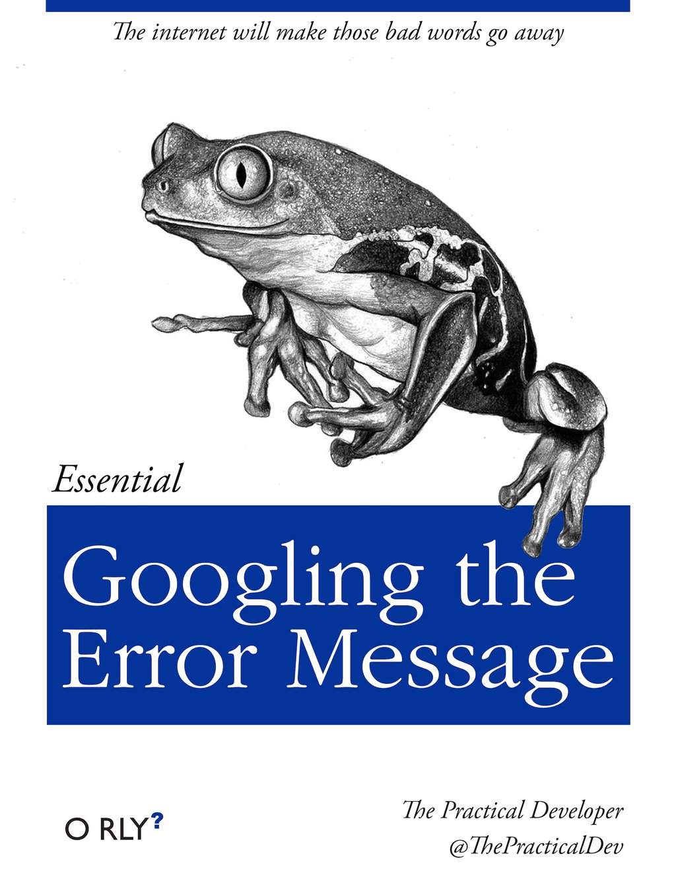
</div>

And also know that there are errors that can creep in more subtly, without an error message right away, when you are giving information that is understood, but not in the way you meant. Like if I'm telling a story about tables and you're picturing where you eat breakfast and I'm talking about data. This can leave me thinking I've gotten something across that the listener (or R) interpreted very differently. And as I continue telling my story you get more and more confused... So write clean code and check your work as you go to minimize these circumstances!

### Logical operators and expressions

A moment about **logical operators and expressions**. We can ask questions about the objects we just made. 

- `==` means 'is equal to'
- `!=` means 'is not equal to'
- `<` means ` is less than'
- `>` means ` is greater than'
- `<=` means ` is less than or equal to'
- `>=` means ` is greater than or equal to'
```{r}
weight_kg == 2
weight_kg >= 30
weight_kg != 5
```

> Shortcuts
You will make lots of assignments and the operator `<-` is a pain to type. Don't be lazy and use `=`, although it would work, because it will just sow confusion later. Instead, utilize **RStudio's keyboard shortcut: Alt + - (the minus sign)**.
Notice that RStudio automagically surrounds `<-` with spaces, which demonstrates a useful code formatting practice. Code is miserable to read on a good day. Give your eyes a break and use spaces.
RStudio offers many handy [keyboard shortcuts](https://support.rstudio.com/hc/en-us/articles/200711853-Keyboard-Shortcuts). Also, Alt+Shift+K brings up a keyboard shortcut reference card.


### Clearing the environment
Now look at the objects in your environment (workspace) -- in the upper right pane. The workspace is where user-defined objects accumulate. 


You can also get a listing of these objects with a few different R commands:

```{r}
objects()
ls()
```

If you want to remove the object named `weight_kg`, you can do this:

```{r}
rm(weight_kg)
```

To remove everything:

```{r}
rm(list = ls())
```

or click the broom in RStudio's Environment pane.

## RMarkdown

Now that we know some basic R syntax, let's learn a little about RMarkdown. You will drive yourself crazy (and fail to generate a reproducible workflow!) running code directly in the console. RMarkdown is really key for collaborative research, so we're going to get started with it early and then use it for the rest of the course. 

An RMarkdown file will allow us to weave markdown text with chunks of R code to be evaluated and output content like tables and plots.

File -> New File -> RMarkdown... -> Document of output format HTML, OK.

<div style="width:300px">

</div>

You can give it a Title like "My Project". Then click OK. 

OK, first off: by opening a file, we are seeing the 4th pane of the RStudio console, which is essentially a text editor. This lets us organize our files within RStudio instead of having a bunch of different windows open.

Let's have a look at this file — it's not blank; there is some initial text is already provided for you. Notice a few things about it: 

- There are white and grey sections. R code is in grey sections, and other text is in white. 

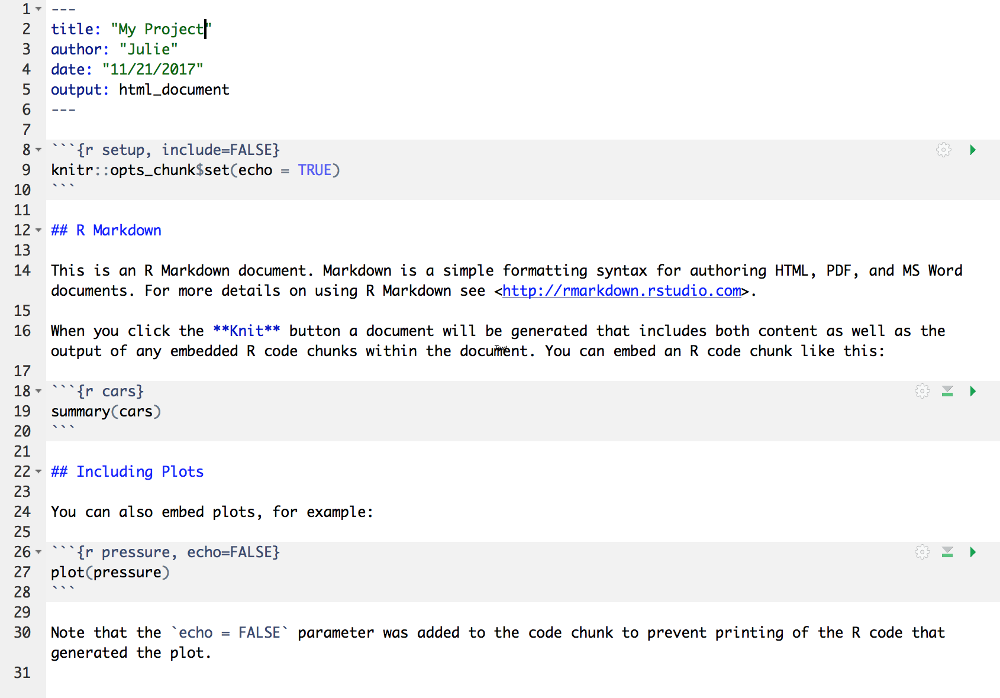

<br>

Let's go ahead and "Knit HTML" by clicking the blue yarn at the top of the RMarkdown file. When you first click this button, RStudio will prompt you to save this file. Create a new folder for it somewhere that you will be able to find again (such as your Desktop or Documents), and name that folder something you'll remember (like `arctic_training_files`).

<br>


What do you notice between the two? 

Notice how the grey **R code chunks** are surrounded by 3 backticks and `{r LABEL}`. These are evaluated and return the output text in the case of `summary(cars)` and the output plot in the case of `plot(pressure)`.

Notice how the code `plot(pressure)` is not shown in the HTML output because of the R code chunk option `echo=FALSE`.

More details...

This RMarkdown file has 2 different languages within it: **R** and **Markdown**. 

We don't know that much R yet, but you can see that we are taking a summary of some data called 'cars', and then plotting. There's a lot more to learn about R, and we'll get into it for the next few days. 

The second language is Markdown. This is a formatting language for plain text, and there are only about 15 rules to know. 

Notice the syntax for:

- **headers** get rendered at multiple levels: `#`, `##`
- **bold**: `**word**`

There are some good [cheatsheets](https://github.com/adam-p/markdown-here/wiki/Markdown-Here-Cheatsheet) to get you started, and here is one built into RStudio: Go to Help > Markdown Quick Reference
<br />
<br />

**Important**: note that the hashtag `#` is used differently in Markdown and in R: 

- in R, a hashtag indicates a comment that will not be evaluated. You can use as many as you want: `#` is equivalent to `######`. It's just a matter of style.
- in Markdown, a hashtag indicates a level of a header. And the number you use matters: `#` is a "level one header", meaning the biggest font and the top of the hierarchy. `###` is a level three header, and will show up nested below the `#` and `##` headers.

Learn more: http://rmarkdown.rstudio.com/

### Your Turn

1. In Markdown, Write some italic text, and make a numbered list. And add a few subheaders.
Use the Markdown Quick Reference (in the menu bar: Help > Markdown Quick Reference). 
1. Reknit your html file. 


### Code chunks

OK. Now let's practice with some of those commands.

Create a new chunk in your RMarkdown first in one of these ways: 

- click "Insert > R" at the top of the editor pane
- type by hand 
   \```{r}
   \```
- if you haven't deleted a chunk that came with the new file, edit that one

Now, let's write some R code. 

```
x <- 4*3
x
```

Now, hitting return does not execute this command; remember, it's just a text file. To execute it, we need to get what we typed in the the R chunk (the grey R code) down into the console. How do we do it? There are several ways (let's do each of them):

1. copy-paste this line into the console.
1. select the line (or simply put the cursor there), and click 'Run'. This is available from 
    a. the bar above the file (green arrow)
    b. the menu bar: Code > Run Selected Line(s)
    c. keyboard shortcut: command-return
1. click the green arrow at the right of the code chunk

### Your turn

Add a few more commands to your file. Execute them by trying the three ways above. Then, save your R Markdown file. 


## R functions, help pages

So far we've learned some of the basic syntax and concepts of R programming, how to navigate RStudio, and RMarkdown, but we haven't done any complicated or interesting programming processes yet. This is where functions come in!

R has a mind-blowing collection of built-in functions that are used with the same syntax: function name with parentheses around what the function needs in order to do what it was built to do. When you type a function like this, we say we are "calling the function". `function_name(argument1 = value1, argument2 = value2, ...)`. 

As our first function, we will introduce `read.csv`, which will be in the first lines of many of your future scripts. It does exactly what it says, it reads in a csv file to R, but we don't quite know how to use it yet. The help pages in RStudio will help us with this!

To access the help page for `read.csv`, enter the following into your console:

```{r, eval = F}
?read.csv
```

The help pane will show up in the lower right hand corner of your RStudio.

You can see from this pane that the help page for this function is actually for a family of related functions that read in data. The help page tells the name of the package in the top left, and is broken down into sections:

 - Description: An extended description of what the function does.
 - Usage: The arguments of the function(s) and their default values.
 - Arguments: An explanation of the data each argument is expecting.
 - Details: Any important details to be aware of.
 - Value: The data the function returns.
 - See Also: Any related functions you might find useful.
 - Examples: Some examples for how to use the function.

The help for `read.csv` has a lot of information in it, as this function has a lot of arguments, but the first one seems pretty critical. We have to tell it what file to look for. Let's get a file!

### Download a file from the Arctic Data Center

Navigate to this dataset by Craig Tweedie that is published on the Arctic Data Center. [Craig Tweedie. 2009. North Pole Environmental Observatory Bottle Chemistry. Arctic Data Center. doi:10.18739/A25T3FZ8X.](http://doi.org/10.18739/A25T3FZ8X), and download the first csv file called "BGchem2008data.csv"

Move this file from your Downloads folder into a place you can more easily find it. I recommend creating a folder called `data` in your previously-created directory `arctic_training_files`, and putting the file there.

### Use a function to read a file into R

Now we have to tell `read.csv` how to find the file. We do this using the `file` argument which you can see in usage section in the help page. In RMarkdown, you can either use absolute paths (which will start with your home directory `~/`) or paths **relative to the location of the RMarkdown.** RStudio and RMarkdown have some great autocomplete capabilities when using relative paths, so we will go that route. Assuming you have moved your file to a folder within `arctic_training_files` called `data`, your `read.csv` call will look like this:

```{r, eval = F}
bg_chem <- read.csv("data/BGchem2008data.csv")
```

You should now have an object of the class `data.frame` in your environment called `bg_chem`. Check your environment pane to ensure this is true.

Note that in the help page there are a whole bunch of arguments that we didn't use in the call above. Some of the arguments in function calls are optional, and some are required. Optional arguments will be shown in the usage section with a `name = value` pair, with the default value shown. If you do not specify a `name = value` pair for that argument in your function call, the function will assume the default value (example: `header = TRUE` for `read.csv`). Required arguments will only show the name of the argument, without a value. Note that the only required argument for `read.csv` is `file`.

You can always specify arguments in `name = value` form. But if you do not, R attempts to resolve by position. So above, it is assumed that we want `file = "data/BGchem2008data.csv"`, since file is the first argument. If we wanted to add another argument, say `stringsAsFactors`, we need to specify it explicitly using the `name = value` pair, since the second argument is `header`. For functions I call often, I use this resolve by position for the first argument or maybe the first two. After that, I always use `name = value`.

Many R users (including myself) will override the default `stringsAsFactors` argument using the following call:

```{r}
bg_chem <- read.csv("data/BGchem2008data.csv", stringsAsFactors = FALSE)
```

### Your turn

> Exercise: Talk to your neighbor(s) and look up the help file for a function that you know or expect to exist. Here are some ideas: `?getwd()`, `?plot()`,  `min()`, `max()`, `?mean()`, `?log()`).

And there's also help for when you only sort of remember the function name: double-questionmark:
```{r, eval=F}
??install 
```

Not all functions have (or require) arguments:
```{r}
date()
```


## Using `data.frames`

A `data.frame` is a two dimensional data structure in R that mimics spreadsheet behavior. It is a collection of rows and columns of data, where each column has a name and represents a variable, and each row represents a measurement of that variable. When we ran `read.csv`, the object `bg_chem` that we created is a `data.frame`. There are a a bunch of ways R and RStudio help you explore data frames. Here are a few, give them each a try:

- click on the word `bg_chem` in the environment pane
- click on the arrow next to `bg_chem` in the environment pane
- execute `head(bg_chem)` in the console
- execute `View(bg_chem)` in the console

Usually we will want to run functions on individual columns in a `data.frame`. To call a specific column, we use the list subset operator `$`. Say you want to look at the first few rows of the `Date` column only. This would do the trick:

```{r}
head(bg_chem$Date)
```

How about calculating the mean temperature of all the CTD samples?

```{r}
mean(bg_chem$CTD_Temperature)
```

Or, if we want to save this to a variable to use later:

```{r}
mean_temp <- mean(bg_chem$CTD_Temperature)
```

You can also create basic plots using the list subset operator.

```{r}
plot(bg_chem$CTD_Depth, bg_chem$CTD_Temperature)
```

There are many more advancted tools and functions in R that will enable you to make better plots using cleaner syntax, we will cover some of these later in the course. 

### Your Turn

> Exercise: Spend a few minutes exploring this dataset. Try out different functions on columns using the list subset operator and experiment with different plots. 

## Troubleshooting

Here are two common errors for new users:

### I just entered a command and nothing is happening

It may be because you didn't complete a command: is there a little `+` in your console? R is saying that it is waiting for you to finish. In the example below, I need to close that parenthesis.

```{r, eval=FALSE}
> x <- seq(1, 10
+ 
```

You can either just type the closing parentheses here and push return, or push the `esc` button twice.

### R says my object is not found

New users will frequently see errors that look like this: `Error in mean(myobject) : object 'myobject' not found`

This means that you do not have an object called `myobject` saved in your environment. The common reasons for this are:

- **typeo**: make sure your object name is spelled exactly like what shows up in the console. Remember R is case sensitive.
- **not writing to a variable**: note that the object is only saved in the environment if you use the assignment operator, eg: `myobject <- read.csv(...)`
- **not executing the line in your RMarkdown**: remember that writing a line of code in RMarkdown is not the same as writing in the console, you have to execute the line of code using command + enter, running the chunk, or one of the other ways outlined in the RMarkdown section of this training


<!--chapter:end:06_intro-r-rmarkdown.Rmd-->

# Writing Good Data Management Plans

## Learning Objectives

In this lesson, you will learn:

- Why create data management plans
- What are the major components of data management plans
- Tools that can help create a data management plan
- Festures and functionality of the DMPTool

## Materials

Download slides: [Writing Good Data Management Plans](files/081418_Session7_DMP_Arctic_Training_Budden.pdf)

<!--chapter:end:07_writing-data-management-plans.Rmd-->

# Data packaging and managing large data sets

## Learning Objectives

In this lesson, you will learn:

- Why one might want to use a repository for reproducible research
- How to package large data sets
- How to programatically access data from repositories
- How to use R to programatically upload data sets to a repository

This document briefly covers three common tasks:

- Downloading and using data from the Arctic Data Center
- Uploading a data file to the Arctic Data Center
- Uploading an entire Data Package to the Arctic Data Center

## Data Packages

Within many repositories, including the Arctic Data Center, data sets are organized
as collections of files grouped together into *data packages* that are meaningful for
a particular scientific purpose.  For example, a data package might include:

- the raw data from a research experiment
- the raw data from one year of an observational monitoring program
- derived data that was a cleaned and gridded version of an original raw source data set
- the data inputs and output figures and data from a particular set of analyses for a paper


## Reproducible workflows

Data that are stored locally on your computer are not accessible to collaborators, 
reviewers, or colleagues that might want to build upon your work.  In addition, local
file systems generally do not have good mecahnisms for versioning data and providing
reliable pointers to particular versions of a data set.  One convenient solution
is to upload data packages to a versioned data repository like the Arctic Data Center,
and then to use those online, versioned copies of your data directly in your 
analytical code so that it is explictly using a versioned copy of a data file.

There are several mechanisms for doing this, including:

- directly access the file over web links using HTTP
- use a helper library (`dataone`) that has functions for remotely accessing a data set

In both of these cases, your code has direct references to the data using its unique, 
global identifer.  This means that, anybody who has the code will be able to execute
the code and it will directly access the data.  It also avoids the common problems
that people have with arranging their data in different directory structures on their
local disks, which can often prevent others from accessing your data.

## Accessing and using data from a repository

Let's start by accessing some data from the Arctic Data Center, loading it into 
a data frame, and plotting that data.  This mini-workflow shows how powerful 
it can be to combine archival repositories with scripted analysis:

```{r, eval = F}
# Read and plot data from doi:10.18739/A25T3FZ8X
bg_chem_url <- "https://arcticdata.io/metacat/d1/mn/v2/object/urn%3Auuid%3A35ad7624-b159-4e29-a700-0c0770419941"
bg_chem = read.csv(url(bg_chem_url), stringsAsFactors = FALSE)
plot(bg_chem$CTD_Depth, bg_chem$CTD_Temperature)
```

Everything one needs to read and understand that analysis is contained in those three lines of code. 
But where did `bg_chem_url` come from?  I copied it from the [data set landing page](https://doi.org/doi:10.18739/A25T3FZ8X) on
the Arctic Center repository.

## Setup for the dataone package

The R `dataone` package offers some convenient ways to do this, particularly some custom R classes which encapsulate a lot of the complexity of Objects and Data Packages.

First, let's install and load libraries needed for connecting to DataONE repositories:

```{r, eval = F}
packages <- c( "datapack", "dataone", "EML")
for (package in packages) { if (!(package %in% installed.packages())) { install.packages(package) } }
rm(packages) #remove variables from workspace
```

```{r, eval = F}
library(dataone)
library(datapack)
```

Here we use a `D1Client` which is one way of connecting to a repository:

```{r, eval = F}
client <- D1Client("PROD", "urn:node:KNB")
```

and then we use that client object to access the entire `DataPackage`, which includes
both the data from all of the data files as well as the metadata that describes
the data.

```{r, eval = F}
doi <- "doi:10.5063/F1Z036CP"
pkg <- getDataPackage(client, doi)
```

Now grab the data for the CSV file from that package:

```{r, eval = F}
getIdentifiers(pkg)
do <- getMember(pkg, getIdentifiers(pkg)[3])
csvtext <- rawToChar(getData(do))
dframe <- read.csv(textConnection(csvtext), stringsAsFactors = FALSE)
head(dframe)
```

## Authentication
Before uploading any data to a DataONE repository, you must login to get an *authentication token*, which is a character string used to identify yourself. This token can be retrieved by logging into the test repository and copying the token into your R session.

We will be using a test server, so login and retrieve your token at https://test.arcticdata.io

Once you are logged in, navigate to your Profile Settings, and locate the "Authentication Token" section, and then copy the token for R to your clipboard. Finally, paste the token into the R Console to register it as an option for this R session.  You are now logged in.  But note that you need to keep this token private; don't paste it into scripts or check it into Git, as it is just as sensitive as your password.


## Upload a single data file

For uploading data, let's use a test repository:
```{r, eval = F}
client <- D1Client("STAGING", "urn:node:mnTestARCTIC")
```

First let's make an example data file (CSV in this case) to upload:

```{r, eval = F}
data("co2") # Built-in dataset in R
write.csv(co2, "./co2.csv")
```

Every Object we upload then just needs a `DataObject` class instance for it:

```{r, eval = F}
my_object <- new("DataObject", 
                 filename = "./co2.csv",
                 format = "text/csv")

my_object <- setPublicAccess(my_object) # Make it public readable!
```

And then we just need to upload it:

```{r, eval = F}
uploadDataObject(client, my_object)
```

## Upload a simple Data Package

The steps to upload an entire package aren't that much more complex.
First, let's create an example EML file:

```{r, eval = F}
library(EML)

title <- "Test dataset to show submitting via R client"
me <- as.person("Bryce Mecum <mecum@nceas.ucsb.edu>")
dataset <- new("dataset",
               title = title,
               creator = me,
               contact = me)

eml_pid <- paste0("urn:uuid", uuid::UUIDgenerate())

eml <- new("eml",
           packageId = eml_pid,
           system = "uuid",
           dataset = dataset)

eml_path <- "~/my_eml.xml"
write_eml(eml, eml_path)
eml_validate(eml_path)
```

And then we just use the `DataPackage` class:

```{r, eval = F}
my_package <- new("DataPackage")

my_metadata <- new("DataObject", 
                   format = "eml://ecoinformatics.org/eml-2.1.1", 
                   filename = eml_path)

my_metadata <- setPublicAccess(my_metadata) # Make it public readable!

my_object <- new("DataObject", 
                 filename = "./co2.csv",
                 format = "text/csv")

my_object <- setPublicAccess(my_object) # Make it public readable!

my_package <- addMember(my_package, my_object, mo = my_metadata)
```

```{r, eval = F}
uploadDataPackage(client, my_package, public = TRUE)
```

<!--chapter:end:08_managing-large-data.Rmd-->

# Creating R Functions

Many people write R code as a single, continuous stream of commands, often drawn
from the R Console itself and simply pasted into a script.  While any script 
brings benefits over non-scripted solutions, there are advantages to breaking
code into small, reusable modules.  This is the role of a `function` in R.  In
this lesson, we will review the advantages of coding with functions, practice 
by creating some functions and show how to call them, and then do some exercises
to build other simple functions.

## Leaning outcomes

- Learn why we should write code in small functions
- Write code for one or more functions
- Document functions to improve understanding and code communication

## Why functions?

In a word:

- DRY: Don't Repeat Yourself

By creating small functions that only one logical task and do it well, we quickly 
gain:

- Improved understanding
- Reuse via decomposing tasks into bite-sized chunks
- Improved error testing


## Temperature conversion

Imagine you have a bunch of data measured in Fahrenheit and you want to convert
that for analytical purposes to Celsius.  You might have an R script
that does this for you.

```{r}
airtemps <- c(212, 30.3, 78, 32)
celsius1 <- (airtemps[1]-32)*5/9
celsius2 <- (airtemps[2]-32)*5/9
celsius3 <- (airtemps[3]-32)*5/9
```

Note the duplicated code, where the same formula is repeated three times.  This
code would be both more compact and more reliable if we didn't repeat ourselves.

## Creating a function

Functions in R are a mechanism to process some input and return a value.  Similarly
to other variables, functions can be assigned to a variable so that they can be used
throughout code by reference.  To create a function in R, you use the `function` function (so meta!) and assign its result to a variable.  Let's create a function that calculates
celsius temperature outputs from fahrenheit temperature inputs.

```{r}
fahr_to_celsius <- function(fahr) {
  celsius <- (fahr-32)*5/9
  return(celsius)
}
```

By running this code, we have created a function and stored it in R's global environment.  The `fahr` argument to the `function` function indicates that the function we are creating takes a single parameter (the temperature in fahrenheit), and the `return` statement indicates that the function should return the value in the `celsius` variable that was calculated inside the function.  Let's use it, and check if we got the same value as before:

```{r}
celsius4 <- fahr_to_celsius(airtemps[1])
celsius4
celsius1 == celsius4
```

Excellent.  So now we have a conversion function we can use.  Note that, because 
most operations in R can take multiple types as inputs, we can also pass the original vector of `airtemps`, and calculate all of the results at once:

```{r}
celsius <- fahr_to_celsius(airtemps)
celsius
```

This takes a vector of temperatures in fahrenheit, and returns a vector of temperatures in celsius.

## Exercise

Now, create a function named `celsius_to_fahr` that does the reverse, it takes temperature data in celsius as input, and returns the data converted to fahrenheit.  Then use that formula to convert the `celsius` vector back into a vector of fahrenheit values, and compare it to the original `airtemps` vector to ensure that your answers are correct.

```{r}
# Your code goes here
```

Did you encounter any issues with rounding or precision?

## Documenting R functions

Functions need documentation so that we can communicate what they do, and why.  The `roxygen2` package provides a simple means to document your functions so that you can explain what the function does, the assumptions about the input values, a description of the value that is returned, and the rationale for decisions made about implementation.

Documentation in ROxygen is placed immediately before the function definition, and is indicated by a special comment line that always starts with the characters `#'`.  Here's a documented version of a function:

```{r}
#' Convert temperature data from Fahrenheit to Celsius
#'
#' @param fahr Temperature data in degrees Fahrenheit to be converted
#' @return temperature value in degrees Celsius
#' @keywords conversion
#' @export
#' @examples
#' fahr_to_celsius(32)
#' fahr_to_celsius(c(32, 212, 72))
fahr_to_celsius <- function(fahr) {
  celsius <- (fahr-32)*5/9
  return(celsius)
}
```

Note the use of the `@param` keyword to define the expectations of input data, and the `@return` keyword for defining the value that is returned from the function.  The `@examples` function is useful as a reminder as to how to use the function.  Finally, the `@export` keyword indicates that, if this function were added to a package, then the function should be available to other code and packages to utilize.

## Summary

- Functions are useful to reduce redundancy, reuse code, and reduce errors
- Build functions with the `function` function
- Document functions with `roxygen2` comments

<!--chapter:end:09_creating-r-functions.Rmd-->


# Version Control With git and GitHub

## Learning Objectives

In this lesson, you will learn:

- Why __git__ is useful for reproducible analysis
- How to use __git__ to track changes to your work over time
- How to use __GitHub__ to collaborate with others
- How to structure your commits so your changes are clear to others
- How to write effective commit messages

## The problem with filenames


Every file in the scientific process changes.  Manuscripts are edited.
Figures get revised.  Code gets fixed when problems are discovered.  Data files
get combined together, then errors are fixed, and then they are split and 
combined again. In the course of a single analysis, one can expect thousands of
changes to files.  And yet, all we use to track this are simplistic *filenames*.  
You might think there is a better way, and you'd be right: __version control__.

Version control systems help you track all of the changes to your files, without
the spaghetti mess that ensues from simple file renaming.  In version control systems
like `git`, the system tracks not just the name of the file, but also its contents,
so that when contents change, it can tell you which pieces went where.  It tracks
which version of a file a new version came from.  So its easy to draw a graph
showing all of the versions of a file, like this one:


Version control systems assign an identifier to every version of every file, and 
track their relationships. They also allow branches in those versions, and merging
those branches back into the main line of work.  They also support having 
*multiple copies* on multiple computers for backup, and for collaboration.
And finally, they let you tag particular versions, such that it is easy to return 
to a set of files exactly as they were when you tagged them.  For example, the 
exact versions of data, code, and narrative that were used when a manuscript was 
submitted might be `R2` in the graph above.

## Version control and Collaboration using Git and GitHub

Let's distinguish between git and GitHub:

- __git__: version control software used to track files in a folder (a repository)
    - git creates the versioned history of a repository
- __GitHub__: web site that allows users to store their git repositories and share them with others


## Let's look at a GitHub repository

This screen shows the copy of a repository stored on GitHub,
with its list of files, when the files and directories were last modified, 
and some information on who made the most recent changes.  


If we drill into the 
"commits" for the repository, we can see the history of changes made to all of 
the files.  Looks like `kellijohnson` and `seananderson` were fixing things in
June and July:


And finally, if we drill into the changes made on June 13, we can see exactly what
was changed in each file:


Tracking these changes, how they relate to released versions of software and files
is exactly what Git and GitHub are good for.  And we will show how they can really 
be effective for tracking versions of scientific code, figures, and manuscripts
to accomplish a reproducible workflow.

## The Git lifecycle

As a git user, you'll need to understand the basic concepts associated with versioned
sets of changes, and how they are stored and moved across repositories.  Any given
git repository can be cloned so that it exist both locally, and remotely.  But each of
these cloned repositories is simply a copy of all of the files and change history
for those files, stored in git's particular format.  For our purposes, we can consider
a git repository just a folder with a bunch of additional version-related metadata.

In a local git-enabled folder, the folder contains a workspace containing the 
current version of all files in the repository. These working files are linked to
a hidden folder containing the 'Local repository', which contains all of the other
changes made to the files, along with the version metadata.

So, when working with files using git, you can use git commands to indicate specifically
which changes to the local working files should be staged for versioning 
(using the `git add` command), and when to record those changes as a version in
the local repository (using the command `git commit`).

The remaining concepts are involved in synchronizing the changes in your local 
repository with changes in a remote repository.  The `git push` command is used to
send local changes up to a remote repository (possibly on GitHub), and the `git pull`
command is used to fetch changes from a remote repository and merge them into the
local repository.

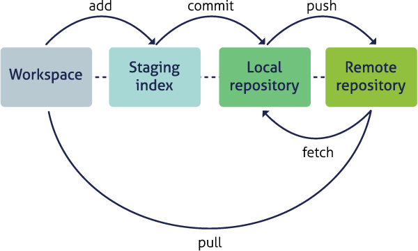

- `git clone`: to copy a whole remote repository to local
- `git add` (stage): notify git to track particular changes
- `git commit`: store those changes as a version
- `git pull`: merge changes from a remote repository to our local repository
- `git push`: copy changes from our local repository to a remote repository
- `git status`: determine the state of all files in the local repository
- `git log`: print the history of changes in a repository

Those seven commands are the majority of what you need to successfully use git.  
But this is all super abstract, so let's explore with some real examples.

## Create a remote repository on GitHub

Let's start by creating a repository on GitHub, then we'll edit some files.

- Log into [GitHub](https://github.com)
- Click the New repository button
- Name it `sasap-test`
- Create a README.md
- Set the LICENSE to Apache 2.0


You've now created your first repository! It has a couple of files that GitHub created
for you, like the README.md file, and the LICENSE file, and the .gitignore file.


For simple changes to text files, you can make edits right in the GitHub web interface.  For example,
navigate to the `README.md` file in the file listing, and edit it by clicking on the *pencil* icon.
This is a regular Markdown file, so you can just add text, and when done, add a commit message, and 
hit the `Commit changes` button.  


Congratulations, you've now authored your first versioned commit.  If you navigate back to 
the GitHub page for the repository, you'll see your commit listed there, as well as the
rendered README.md file.


Let's point out a few things about this window.  It represents a view of the repository
that you created, showing all of the files in the repository so far.  For each file,
it shows when the file was last modified, and the commit message that was used to last
change each file.  This is why it is important to write good, descriptive commit
messages.  In addition, the blue header above the file listing shows the most recent
commit, along with its commit message, and its SHA identifer.  That SHA identifier is
the key to this set of versioned changes.  If you click on the SHA identifier (*810f314*), 
it will display the set of changes made in that particular commit.

In the next section we'll use the GitHub URL for the GitHub repository you created 
to `clone` the repository onto your local machine so that you can edit the files 
in RStudio.  To do so, start by copying the GitHub URL, which represents the repository
location:


## Working locally with Git via RStudio

RStudio knows how to work with files under version control with Git, but only if
you are working within an RStudio project folder.  In this next section, we will
clone the repository that you created on GitHub into a local repository as an 
RStudio project.  Here's what we're going to do:

- Create the new project
- Inspect the Git tab and version history
- Commit a change to the README.md file
- Commit the changes that RStudio made
- Inspect the version history
- Add and commit an Rmd file
- Push these changes to GitHub
- View the change history on GitHub

__Create a New Project.__ Start by creating a *New Project...* in R Studio, select the *Version Control* 
option, and paste the GitHub URL that you copied into the field for the 
remote repository *Repository URL*.  While you can name the local copy of the 
repository anything, its typical to use the same name as the GitHub repository to
maintain the correspondence.  You can choose any folder for your local copy, in
my case I used my standard `development` folder.


Once you hit `Create Project, a new RStudio windo will open with all of the files
from the remote repository copied locally.  Depending on how your version of RStudio
is configured, the location and size of the panes may differ, but they should all
be present, including a *Git* tab and the normal *Files* tab listing the files that 
had been created in the remote repository.


You'll note that there is one new file `sasap-test.Rproj`, and three files that we
created earlier on GitHub (`.gitignore`, `LICENSE`, and `README.md`).

In the *Git* tab, you'll note that two files are listed.  This is the status pane
that shows the current modification status of all of the files in the repository.
In this case, the `.gitignore` file is listed as *M* for Modified, and `sasap-test.Rproj` 
is listed with a *? ?* to indicate that the file is untracked.  This means that
git has not stored any versions of this file, and knows nothing about the file.
As you make version control decisions in RStudio, these icons will change to reflect
the current version status of each of the files.

__Inspect the history.__ For now, let's click on the *History* button in the Git tab, which will show the
log of changes that occurred, and will be identical to what we viewed on GitHub.
By clicking on each row of the history, you can see exactly what was added and
changed in each of the two commits in this repository.

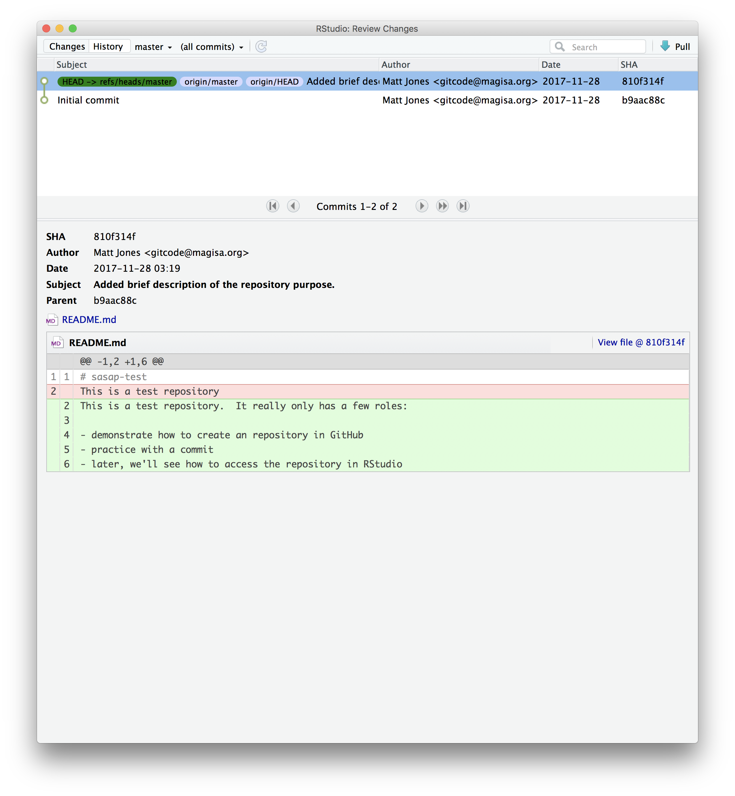
__Commit a README.md change.__ Next let's make a change to the README.md file
in RStudio. Add a new section, with a markdown block like this:

<pre><code>
## Git from RStudio

From within RStudio, we can perform the same versioning actions that we can
in GitHub, and much more.  Plus, we have the natural advantages of the 
programming IDE with code completion and other features to make our work
easier.

- Add files to version control
- Commit changes
- Push commits to GitHub
</code></pre>

Once you save, you'll immediately see the *README.md* file show up in the Git
tab, marks as a modification.  You can select the file in the Git tab, and click
*Diff* to see the differences that you saved (but which are not yet committed to
your local repository).

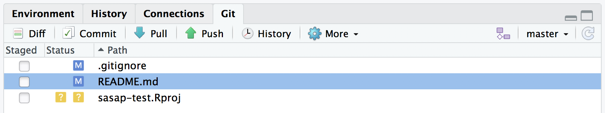

And here's what the newly made changes look like compared to the original file.
New lines are highlighted in green, while removed lines are in red.


__Commit the RStudio changes.__

To commit the changes you made to the README.md file, check the *Staged*
checkbox next to the file (which tells Git which changes you want included in
the commit), then provide a descriptive Commit message, and then click *Commit*.


Note that some of the changes in the repository, namely `.gitignore` and 
`sasap-test.Rproj` are still listed as having not been committed.  This means
there are still pending changes to the repository.  You can also see the note
that says:

<code>Your branch is ahead of 'origin/master' by 1 commit.</code>

This means that we have committed 1 change in the local repository, but that 
commit has not yet been pushed up to the `origin` repository, where `origin`
is the typical name for our remote repository on GitHub.  So, let's commit the
remaining project files by staging them and adding a commit message.


When finished, you'll see that no changes remain in the *Git* tab, and the repository
is clean.  

__Inspect the history.__ Note that the message now says:

<code>Your branch is ahead of 'origin/master' by 2 commits.</code>

These 2 commits are the two we just made, and have not yet been pushed to GitHub.
By clicking on the *History* button, we can see that there are now a total of
four commits in the local repository (while there had only been two on GitHub).

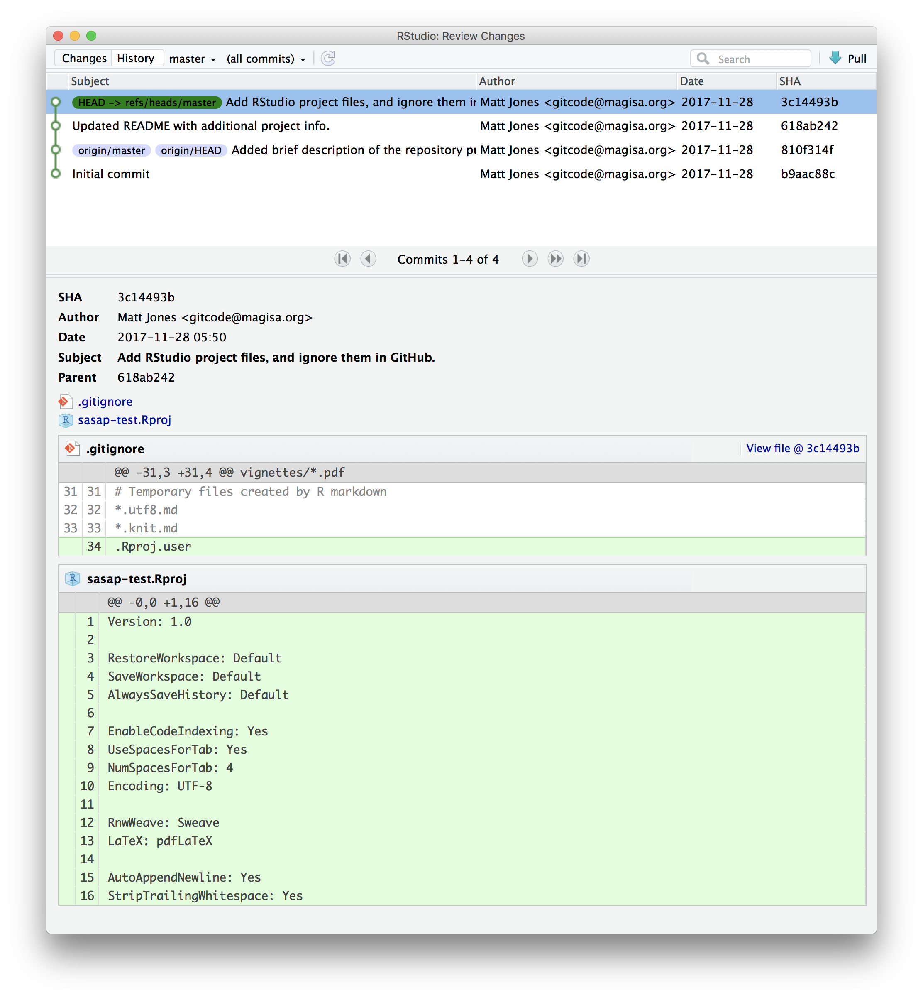

__Push these changes to GitHub.__ Now that everything has been changed as desired
locally, you can *push* the changes to GitHub using the *Push* button.  This will
prompt you for your GitHub username and password, and upload the changes, leaving
your repository in a totally clean and synchronized state.  When finished, looking
at the history shows all four commits, including the two that were done on GitHub
and the two that were done locally on RStudio.  

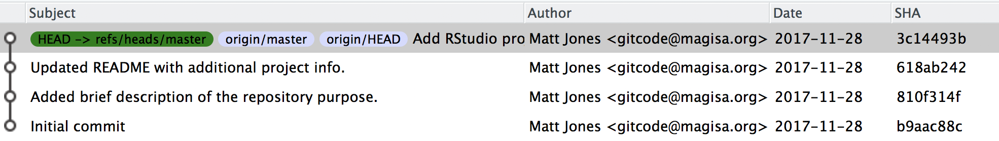
And note that the labels indicate that both the local repository (`HEAD`) and the
remote repository (`origin/HEAD`) are pointing at the same version in the history.
So, if we go look at the commit history on GitHub, all the commits will be shown
there as well.

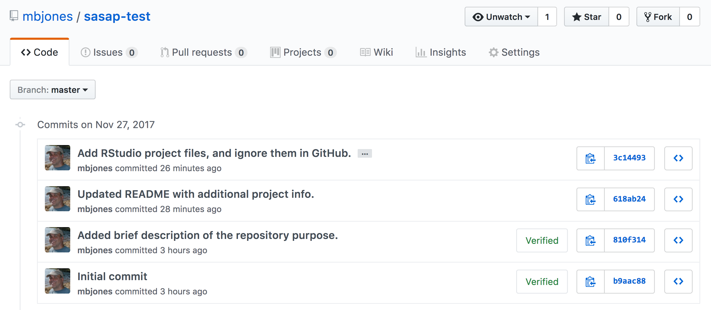

## On good commit messages

Clearly, good documentation of what you've done is critical to making the version
history of your repository meaningful and helpful.  Its tempting to skip the 
commit message altogether, or to add some stock blurd like 'Updates'.  Its better
to use messages that will be helpful to your future self in deducing not just what
you did, but why you did it.  Also, commit messaged are best understood if they
follow the active verb convention.  For example, you can see that my commit
messages all started with a past tense verb, and then explained what was changed.

While some of the changes we illustrated here were simple and so easily explained
in a short phrase, for more complext changes, its best to provide a more complete
message.  The convention, however, is to always have a short, terse first sentence, 
followed by a more verbose explanation of the details and rationale for the change.
This keeps the high level details readable in the version log.  I can't count the
number of times I've looked at the commit log from 2, 3, or 10 years prior and
been so grateful for diligence of my past self and collaborators.

## Collaboration and conflict free workflows

Up to now, we have been focused on using Git and GitHub for yourself, which is a 
great use. But equally powerful is to share a GitHib repository with other
researchers so that you can work on code, analyses, and models together.  When
working together, you will need to pay careful attention to the state of the 
remote repository to avoid and handle merge conflicts.  A *merge conflict* occurs
when two collaborators make two separate commits that change the same lines of the
same file.  When this happens, git can't merge the changes together automatically,
and will give you back an error asking you to resolve the conflict. Don't be afraid
of merge conflicts, they are pretty easy to handle.  and there are some 
[great](https://help.github.com/articles/resolving-a-merge-conflict-using-the-command-line/) [guides](https://stackoverflow.com/questions/161813/how-to-resolve-merge-conflicts-in-git).

That said, its truly painless if you can avoid merge conflicts in the first place.
You can minimize conflicts by:

- Ensure that you pull down changes just before you commit
  + Ensures that you have the most recent changes
  + But you may have to fix your code if conflict would have occurred
- Coordinate with your collaborators on who is touching which files
  + You still need to comunicate to collaborate

## Exercise

Use RStudio to add a new RMarkdown file to your `sasap-test`
repository, build a basic structure for the file, and then save it.

Next, stage and commit the file locally, and push it up to GitHub.

## Advanced topics

There's a lot we haven't covered in this brief tutorial.  There are some great
and much longer tutorials that cover advanced topics, such as:

- Using git on the command line
- Resolving conflicts
- Branching and merging
- Pull requests versus direct contributions for collaboration
- Using .gitignore to protect sensitive data
- GitHub Issues and why they are useful
- and much, much more

- [Try Git](https://try.github.io) is a great interactive tutorial
- Software Carpentry [Version Control with Git](http://swcarpentry.github.io/git-novice/)
- Codecademy [Learn Git](https://www.codecademy.com/learn/learn-git) (some paid)


<!--chapter:end:10_version-control-git.Rmd-->

# Data Modeling & Tidy Data

## Learning Objectives

- Understand basics of relational data models aka tidy data
- Learn how to design and create effective data tables

## Benefits of relational data systems

- Powerful search and filtering
- Handle large, complex data sets
- Enforce data integrity
- Decrease errors from redundant updates

## Data Organization


## Multiple tables


## Inconsistent observations


## Inconsistent variables


## Marginal sums and statistics


## Good enough data modeling

### Denormalized data

- Observations about different entities combined


In the above example, each row has measurements about both the `site` at which observations
occurred, as well as observations of two individuals of possibly different species
found at that site.  This is *not normalized* data.

People often refer to this as *wide* format, because the observations are spread across a
wide number of columns.  Note that, should one encounter a new species in the survey, we
wold have to add new columns to the table.  This is difficult to analyze, understand, and
maintain.

### Tabular data

__Observations__. A better way to model data is to organize the observations about each type of entity in its own table.  This results in:

- Separate tables for each type of entity measured
- Each row represents a single observed entity
- Observations (rows) are all unique

- This is *normalized* data (aka *tidy data*)

__Variables__. In addition, for normalized data, we expect the variables to be organized such that:

- All values in a column are of the same type
- All columns pertain to the same observed entity (e.g., row)
- Each column represents either an identifying variable or a measured variable

Here's an example of tidy (normalized) data in which the top table is the collection
of observations about individuals of several species, and the bottom table are the
observations containing properties of the sites at which the species occurred.


## Primary and Foreign Keys

When one has normalized data, we often use unique identifiers to reference
particular observations, which allows us to link across tables.  Two types of
identifiers are common within relational data:

- Primary Key: unique identifier for each observed entity, one per row
- Foreign Key: reference to a primary key in another table (linkage)

For example, in the second table below, the `site` column is the *primary key* 
of that table, because it uniquely identifies each row of the table as a unique
observation of a site.  Inthe first table, however, the `site` column is a 
*foreign key* that references the primary key from the second table.  This linkage
tells us that the first height measurement for the `DAPU` observation occurred
at the site with the name `Taku`.


## Entity-Relationship Model (ER)

An Entity-Relationship model allows us to compactly draw the structure of the
tables in a relational database, including the primary and foreign keys in the tables.


In the above model, one can see that each site in the `SITES` table must have one
or more observations in the `PLOTOBS` table, whereas each `PLOTOBS` has one and 
only one `SITE`.

## Merging data

Frequently, analysis of data will require merging these separately managed tables
back together.  There are multiple ways to join the observations in two tables, based
on how the rows of one table are merged with the rows of the other.

When conceptualizing merges, one can think of two tables, one on the *left* and
one on the *right*. The most common (and often useful) join is when you merge the subset 
of rows that have matches in both the left table and the right table: 
this is called an *INNER JOIN*.  Other types of join are possible as well. 
A *LEFT JOIN* takes all of the rows from the left table, and merges on the data from matching rows in the right table.  A *RIGHT JOIN* is the same, except that all of the rows from the right table are included with matching data from the left. Finally, a *FULL OUTER JOIN* includes all data from all rows in both tables (and is rarely practical).


In the figure above, the blue regions show the set of rows that are included in the result.
For the INNER join, the rows returned are all rows in A that have a matching row in B.

## Simple Guidelines for Effective Data

- Design to add rows, not columns
- Each column one type
- Eliminate redundancy
- Uncorrected data file
- Header line
- Nonproprietary formats
- Descriptive names
- No spaces

- [Borer et al. 2009. **Some Simple Guidelines for Effective Data Management.** Bulletin of the Ecological Society of America.](http://matt.magisa.org/pubs/borer-esa-2009.pdf)

## Data modeling exercise

- Break into groups, 1 per table

To demonstrate, we'll be working with a tidied up version of a dataset from ADF&G containing commercial catch data from 1878-1997.
The dataset and reference to the original source can be viewed at its public archive: https://knb.ecoinformatics.org/#view/df35b.304.2.
That site includes metadata describing the full data set, including column definitions.  Here's the first `catch` table:

```{r catch, cache=TRUE, echo=FALSE}
library(DT)
catch <- read.csv(url("https://knb.ecoinformatics.org/knb/d1/mn/v2/object/df35b.302.1", method = "libcurl"),
                  stringsAsFactors = FALSE)
datatable(catch)
```

And here's the `region_defs` table:
```{r regions, cache=TRUE, echo=FALSE}
region_defs <- read.csv(url("https://knb.ecoinformatics.org/knb/d1/mn/v2/object/df35b.303.1", method = "libcurl"),
                        stringsAsFactors = FALSE)
datatable(region_defs)
```

- Draw an ER model for the tables
  - Indicate the primary and foreign keys

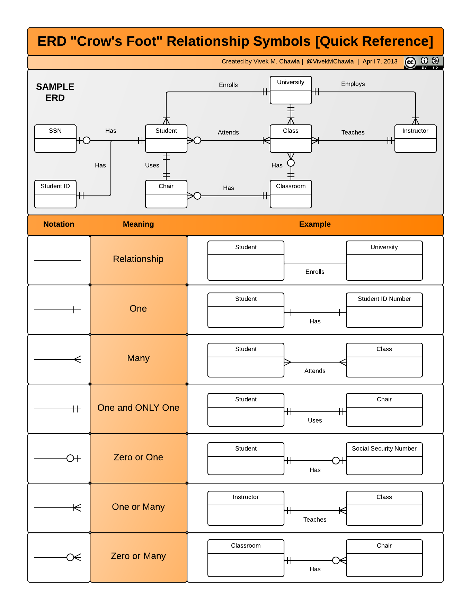

## Related resources

- [Borer et al. 2009. **Some Simple Guidelines for Effective Data Management.** Bulletin of the Ecological Society of America.](http://matt.magisa.org/pubs/borer-esa-2009.pdf)
- [Software Carpentry SQL tutorial](https://swcarpentry.github.io/sql-novice-survey/)
- [Tidy Data](http://vita.had.co.nz/papers/tidy-data.pdf)


<!--chapter:end:11_data-modeling-101.Rmd-->

# Data Cleaning and Manipulation

## Learning Objectives

In this lesson, you will learn:

- What the Split-Apply-Combine strategy is and how it applies to data
- The difference between wide vs. tall table formats and how to convert between them
- How to use `dplyr` and `tidyr` to clean and manipulate data for analysis
- How to join multiple `data.frame`s together using `dplyr`

## Introduction

The data we get to work with are rarely, if ever, in the format we need to do our analyses.
It's often the case that one package requires data in one format, while another package requires the data to be in another format.
To be efficient analysts, we should have good tools for reformatting data for our needs so we can do our actual work like making plots and fitting models.
The `dplyr` and `tidyr` R packages provide a fairly complete and extremely powerful set of functions for us to do this reformatting quickly and learning these tools well will greatly increase your efficiency as an analyst.

Analyses take many shapes, but they often conform to what is known as the Split-Apply-Combine strategy.
This strategy follows a usual set of steps:

- **Split**: Split the data into logical groups (e.g., area, stock, year)
- **Apply:** Calculate some summary statistic on each group (e.g. mean total length by year)
- **Combine:** Combine the groups back together into a single table


As shown above (Figure 1), our original table is split into groups by `year`, we calculate the mean length for each group, and finally combine the per-year means into a single table.

`dplyr` provides a fast and powerful way to express this.
Let's look at a simple example of how this is done:

Assuming our length data is already loaded in a `data.frame` called `length_data`:

| year| length_cm|
|----:|---------:|
| 1991|  5.673318|
| 1991|  3.081224|
| 1991|  4.592696|
| 1992|  4.381523|
| 1992|  5.597777|
| 1992|  4.900052|
| 1992|  4.139282|
| 1992|  5.422823|
| 1992|  5.905247|
| 1992|  5.098922|

We can do this calculation using `dplyr` like this:

```{r, eval = FALSE}
length_data %>% 
  group_by(year) %>% 
  summarise(mean_length_cm = mean(length_cm))
```

Another exceedingly common thing we need to do is "reshape" our data.
Let's look at an example table that is in what we will call "wide" format:

| site   | 1990 | 1991 | ... | 1993 |
|--------|------|------|-----|------|
| gold   | 100  | 118  | ... | 112  |
| lake   | 100  | 118  | ... | 112  |
| ...    | ...  | ...  | ... | ...  |
| dredge | 100  | 118  | ... | 112  |

You are probably quite familiar with data in the above format, where values of the variable being observed are spread out across columns (Here: columns for each year).
Another way of describing this is that there is more than one measurement per row.
This wide format works well for data entry and sometimes works well for analysis but we quickly outgrow it when using R.
For example, how would you fit a model with year as a predictor variable?
In an ideal world, we'd be able to just run:

```{r eval = FALSE}
lm(length ~ year)
```

But this won't work on our wide data because `lm` needs `length` and `year` to be columns in our table.

Or how would we make a separate plot for each year?
We could call `plot` one time for each year but this is tedious if we have many years of data and hard to maintain as we add more years of data to our dataset.

The `tidyr` package allows us to quickly switch between wide format and what is called tall format using the `gather` function:

```{r, eval=FALSE}
site_data %>% 
  gather(year, length, -site)
```

| site   | year | length |
|--------|------|-------:|
| gold   | 1990 |    101 |
| lake   | 1990 |    104 |
| dredge | 1990 |    144 |
| ...    | ...  |    ... |
| dredge | 1993 |    145 |

In this lesson we're going to walk through the functions you'll most commonly use from the `dplyr` and `tidyr` packages:

- `dplyr`
    - `mutate()`
    - `group_by()`
    - `summarise()`
    - `select()`
    - `filter()`
    - `arrange()`
    - `left_join()`
    - `rename()`
- `tidyr`
    - `gather()`
    - `spread()`
    - `extract()`
    - `separate()`

## Setup

Let's start going over the most common functions you'll use from the `dplyr` package.
To demonstrate, we'll be working with a tidied up version of a dataset from ADF&G containing commercial catch data from 1878-1997.
The dataset and reference to the original source can be found at its public archive: https://knb.ecoinformatics.org/#view/df35b.304.2.

First, let's load `dplyr` and `tidyr`:

```{r, eval=FALSE}
library(dplyr)
library(tidyr)
```

```{r, include=FALSE}
# This chunk looks like a duplicate of the above chunk but I did it this way
# so the renderd output (above chunk) looks clean.
suppressPackageStartupMessages({
  library(dplyr)
  library(tidyr)
})
```

Then let's read in the data and take a look at it:

```{r, cache=TRUE}
catch_df <- read.csv(url("https://knb.ecoinformatics.org/knb/d1/mn/v2/object/df35b.302.1", method = "libcurl"),
                    stringsAsFactors = FALSE)
head(catch_df)
```

Note: I copied the URL from the Download button on https://knb.ecoinformatics.org/#view/df35b.304.2

This dataset is relatively clean and easy to interpret as-is.
But while it may be clean, it's in a shape that makes it hard to use for some types of analyses so we'll want to fix that first.

## About the pipe (`%>%`) operator

Before we jump into learning `tidyr` and `dplyr`, we first need to explain the `%>%`.

Both the `tidyr` and the `dplyr` packages use the pipe operator - `%>%`, which may look unfamiliar. The pipe is a powerful way to efficiently chain together operations. The pipe will take the output of a previous statement, and use it as the input to the next statement.

Say you want to both `filter` out rows of a dataset, and `select` certain columns. Instead of writing

```
df_filtered <- filter(df, ...)
df_selected <- select(df_filtered, ...)
```

You can write

```
df_cleaned <- df %>% 
              filter(...) %>%
              select(...)
```

If you think of the assignment operator (`<-`) as reading like "gets", then the pipe operator would read like "then."

So you might think of the above chunk being translated as:

The cleaned dataframe gets the original data, and then a filter (of the original data), and then a select (of the filtered data).

The benefits to using pipes are that you don't have to keep track of (or overwrite) intermediate data frames. The drawbacks are that it can be more difficult to explain the reasoning behind each step, especially when many operations are chained together. It is good to strike a balance between writing efficient code (chaining operations), while ensuring that you are still clearly explaining, both to your future self and others, what you are doing and why you are doing it.

RStudio has a keyboard shortcut for `%>%` : Ctrl + Shift + M (Windows), Cmd + Shift + M (Mac).

## Selecting/removing columns: `select()`

The first issue is the extra columns `All` and `notesRegCode`.
Let's select only the columns we want:

```{r}
catch_df %>% 
  select(Region, Year, Chinook, Sockeye, Coho, Pink, Chum) %>% 
  head()
```

Much better!

`select` also allows you to say which columns you *don't* want, by passing unquoted column names preceded by minus (-) signs:

```{r}
catch_df %>% 
  select(-All, -notesRegCode) %>% 
  head()
```

Let's save our changes by overwriting the `catch_df` variable:

```{r}
catch_df <- catch_df %>% 
  select(-All, -notesRegCode)
```

## Changing shape: `gather()` and `spread()`

The next issue is that the data are in a wide format and, we want the data in a tall format instead.
`gather()` from the `tidyr` package helps us do just this conversion:

```{r}
catch_df <- catch_df %>% 
  gather(species, catch, -Region, -Year)

head(catch_df)
```

The syntax we used above for `gather()` might be a bit confusing so let's look at an annotated diagram:

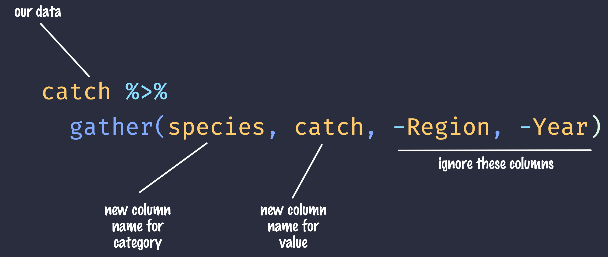

The first two arguments to `gather()` are the names of new columns that will be created and the other arguments with `-` symbols in front of them are columns to keep around in this process.
The opposite of `gather()`, `spread()`, works in a similar declarative fashion:

```{r}
catch_df %>% 
  spread(species, catch) %>% 
  head()
```

## Renaming columns with `rename()`

If you scan through the data, you may notice the values in the `catch` column are very small (these are supposed to be annual catches).
If we look at [the metadata](https://knb.ecoinformatics.org/#view/df35b.304.2) we can see that the `catch` column is in thousands of fish so let's convert it before moving on.

Let's first rename the `catch` column to be called `catch_thousands`:

```{r}
catch_df <- catch_df %>% 
  rename(catch_thousands = catch)

head(catch_df)
```

## Adding columns: `mutate()`

Now let's create a new column called `catch` with units of fish (instead of thousands of fish):

```{r, eval=FALSE}
catch_df <- catch_df %>%
  mutate(catch = catch_thousands * 1000)
```

You'll notice that we get an error:

> Error in mutate_impl(.data, dots) : Evaluation error: non-numeric argument to binary operator.

This is an extremely cryptic error -- what is it telling us?
These kinds of errors can be very hard to diagnose, but maybe the `catch` column isn't quite what we are expecting.
How could we find out?
R provides a number of handy utility functions for quickly summarizing a large table:

```{r}
summary(catch_df)
```

- **Exercise:** What are some other ways (functions) we could've found out what our problem was?

Notice in the above output that the `catch_thousands` column shows up as `Class :character`.
That seems wrong since catch should be whole numbers (in R, these show up as integers).

Let's try to convert the values to integers and see what happens:

```{r}
catch_integers <- as.integer(catch_df$catch_thousands)
```

We get an error "NAs introduced by coercion" which is R telling us that it couldn't convert every value to an integer and, for those values it couldn't convert, it put an `NA` in its place.
This is behavior we commonly experience when cleaning datasets and it's important to have the skills to deal with it when it crops up.
We can find out which values are NAs with a combination of `is.na()` and `which()`:

```{r}
which(is.na(catch_integers))
```

It looks like the 401st value is the problem.
Let's look at the 401s row of the `catch` data.frame:

```{r}
catch_df[401,]
```

Well that's odd: The value in `catch_thousands` is `I` which is isn't even a number.
It turns out that this dataset is from a PDF which was automatically converted into a CSV and this value of `I` is actually a 1.
Let's fix it:

```{r}
catch_df <- catch_df %>%
  mutate(catch_thousands = ifelse(catch_thousands == "I", 1, catch_thousands),
         catch_thousands = as.integer(catch_thousands))
```

Note that, in the above pipeline call to `mutate()`, we mutate `catch_thousands` twice.
This works because `mutate()` processes each of the mutations in a step-wise fashion so the results of one mutation are available for the next.

Now let's try our conversion again:

```{r}
catch_df <- catch_df %>%
  mutate(catch = catch_thousands * 1000)

summary(catch_df)
```

Looks good, no warnings!
Now let's remove the `catch_thousands` column for now since we don't need it:

```{r}
catch_df <- catch_df %>% 
  select(-catch_thousands)

head(catch_df)
```

We're now ready to start analyzing the data.

## `group_by` and `summarise`

As I outlined in the Introduction, `dplyr` lets us employ the Split-Apply-Combine strategy and this is exemplified through the use of the `group_by()` and `summarise()` functions:

```{r}
catch_df %>% 
  group_by(Region) %>%
  summarise(mean(catch))
```

- **Exercise:** Find another grouping and statistic to calculate for each group.
- **Exercise:** Find out if you can group by multiple variables.

Another common use of `group_by()` followed by `summarize()` is to count the number of rows in each group.
We have to use a special function from `dplyr`, `n()`.

```{r}
catch_df %>% 
  group_by(Region) %>%
  summarize(n = n())
```

## Filtering rows: `filter()`

`filter()` is the verb we use to filter our `data.frame` to rows matching some condition.
It's similar to `subset()` from base R.

Let's go back to our original `data.frame` and do some `filter()`ing:

```{r}
catch_df %>% 
  filter(Region == "SSE") %>% 
  head() # head() Show just the first n (default:  6) rows
```

- **Exercise:** Filter to just catches of over one million fish.
- **Exercise:** Filter to just SSE Chinook

## Sorting your data: `arrange()`

`arrange()` is how we sort the rows of a `data.frame`.
In my experience, I use `arrange()` in two common cases:

- When I want to calculate a cumulative sum (with `cumsum()`) so row order matters
- When I want to display a table (like in an `.Rmd` document) in sorted order

Let's re-calculate mean catch by region, and then `arrange()` the output by mean catch:

```{r}
catch_df %>% 
  group_by(Region) %>% 
  summarise(mean_catch = mean(catch)) %>% 
  arrange(mean_catch)
```

The default sorting order of `arrange()` is to sort in ascending order.
To reverse the sort order, wrap the column name inside the `desc()` function:

```{r}
catch_df %>% 
  group_by(Region) %>% 
  summarise(mean_catch = mean(catch)) %>% 
  arrange(desc(mean_catch))
```

## Joins in dplyr

So now that we're awesome at manipulating a single `data.frame`, where do we go from here?
Manipulating **more than one** `data.frame`.

If you've ever used a database, you may have heard of or used what's called a "join", which allows us to to intelligently merge two tables together into a single table based upon a shared column between the two.
We've already covered joins in [Data Modeling & Tidy Data] so let's see how it's done with `dplyr`.

The dataset we're working with, https://knb.ecoinformatics.org/#view/df35b.304.2, contains a second CSV which has the definition of each `Region` code.
This is a really common way of storing auxiliary information about our dataset of interest (catch) but, for analylitcal purposes, we often want them in the same `data.frame`.
Joins let us do that easily. 

Let's look at a preview of what our join will do by looking at a simplified version of our data:


First, let's read in the region definitions data table.


```{r, cache=TRUE}
region_defs <- read.csv(url("https://knb.ecoinformatics.org/knb/d1/mn/v2/object/df35b.303.1", method = "libcurl"),
                        stringsAsFactors = FALSE)
```


If you examine the `region_defs` `data.frame`, you'll see that the column names don't exactly match the image above. If the names of the key columns are not the same, you can explicitly specify which are the key columns in the left and right side as shown below:

```{r}
catch_df %>% 
  group_by(Region) %>% 
  summarise(total_catch = sum(catch)) %>% 
  left_join(region_defs, by = c("Region" = "code"))
```

Another way is to use `rename` to change the column name `code` to `Region` in the `region_defs` `data.frame`, and run the `left_join` this way:

```{r, eval = F}
region_defs <- region_defs %>% 
  rename(Region = code, mgmtArea = Region_Name)

catch_df %>% 
  group_by(Region) %>% 
  summarise(total_catch = sum(catch)) %>% 
  left_join(region_defs, by = c("Region"))
```


Now our catches have the auxiliary information from the region definitions file alongside them.
Note: `dplyr` provides a complete set of joins: inner, left, right, full, semi, anti, not just left_join.

## `separate()` and `unite()`

`separate()` and its complement, `unite()` allow us to easily split a single column into numerous (or numerous into a single).
This can come in really handle when we have a date column and we want to group by year or month.
Let's make a new `data.frame` with fake data to illustrate this:

```{r}
dates_df <- data.frame(date = c("5/24/1930",
                                "5/25/1930",
                                "5/26/1930",
                                "5/27/1930",
                                "5/28/1930"),
                       stringsAsFactors = FALSE)

dates_df %>% 
  separate(date, c("month", "day", "year"), "/")
```

- **Exercise:** Split the `city` column in the following `data.frame` into `city` and `state_code` columns:

```{r}
cities_df <- data.frame(city = c("Juneau AK", 
                                 "Sitka AK", 
                                 "Anchorage AK"),
                        stringsAsFactors = FALSE)

# Write your solution here
```

`unite()` does just the reverse of `separate()`:

```{r}
dates_df %>% 
  separate(date, c("month", "day", "year"), "/") %>% 
  unite(date, month, day, year, sep = "/")
```

- **Exercise:** Use `unite()` on your solution above to combine the `cities_df` back to its original form with just one column, `city`:

```{r}
# Write your solution here
```

## Summary

We just ran through the various things we can do with `dplyr` and `tidyr` but if you're wondering how this might look in a real analysis.
Let's look at that now:

```{r, catch=TRUE}
catch_df <- read.csv(url("https://knb.ecoinformatics.org/knb/d1/mn/v2/object/df35b.302.1", method = "libcurl"),
                  stringsAsFactors = FALSE)
region_defs <- read.csv(url("https://knb.ecoinformatics.org/knb/d1/mn/v2/object/df35b.303.1", method = "libcurl"),
                        stringsAsFactors = FALSE)

catch_df %>%
  select(-All, -notesRegCode) %>% 
  gather(species, catch, -Region, -Year) %>%
  mutate(catch = ifelse(catch == "I", 1, catch)) %>% 
  mutate(catch = as.integer(catch)) %>% 
  group_by(Region) %>% 
  summarize(mean_catch = mean(catch)) %>% 
  left_join(region_defs, by = c("Region" = "code"))
```

<!--chapter:end:12_data-cleaning-and-manipulation.Rmd-->

# Arctic Data Center Design Session

## Objectives

In this session, we will present new tooling ideas and work collaboratively with
researchers to design useful new dat management features, particularly:

- Metadata editing and submission tools
- Custom award and project pages for data collections


## Project view mockups

Mockups allow us to envision a feature before we start the process of implementing
it, and therefore let's us consider several design iterations before we invest in code
development.  

The goal of the Project Views feature for our data systems is to enable more custom views
of collections of data along either disciplinary themes or organizational groupings
such as research projects or lab groups.  Our initial design supports:

- Custom project pages that can present:
    - Specific collections of data that are filtered from the whole
    - A project logo and high-level title
    - Project descriptions, images, and results in markdown
    - Custom filters for subsetting and finding data

- [Project View mockups](https://projects.invisionapp.com/share/57NINXC8F4U#/screens/314362717)

## Editor review

Similarly, we are constantly evolving the design and features of our metadata editing
editing system, MetacatUI.  In this session we will look at a new set of features
for MetacatUI, and get feedback on what works and needs improvement.

- [Metadata editor survey](https://goo.gl/forms/mfNOB3uzzBcKXecu2)

- [MetacatUI feature list](https://github.com/NCEAS/metacatui/wiki/Feature-Ideas)

<!--chapter:end:13_adc-design-session.Rmd-->

# Data visualization for web-based maps

## Learning Objectives

In this lesson, you will learn:

- How to use RMarkdown to build a web site
- A quick overview of producing nice visualizations in R with `ggplot`
- How to create interactive maps with `leaflet`
- Publishing interactive maps using RMarkdown to make a GitHub web site

## Introduction

Sharing your work with others in engaging ways is an important part of the scientific process.
So far in this course, we've introduced a small set of powerful tools for doing open science:

- R and its many packages
- RStudio
- git
- GiHub
- RMarkdown

RMarkdown, in particular, is amazingly powerful for creating scientific reports but, so far, we haven't tapped its full potential for sharing our work with others.

In this lesson, we're going to take an existing GitHub repository and turn it into a beautiful and easy to read web page using the tools listed above.

## A Minimal Example

- Create a new repository on GitHub
- Initialize the repository on GitHub without any files in it
- In RStudio,
    - Create a new Project
    - When creating, select the option to create from Version Control -> Git
    - Enter your repository's clone URL in the Repository URL field and fill in the rest of the details
- Add a new file at the top level called `index.Rmd`. The easiest way to do this is through the RStudio menu. Choose File -> New File -> RMarkdown...  This will bring up a dialog box. You should create a "Document" in "HTML" format. These are the default options.
- Open `index.Rmd` (if it isn't already open)
- Press Knit
    - Observe the rendered output
    - Notice the new file in the same directory `index.html`. This is our RMarkdown file rendered as HTML (a web page)
- Commit your changes (to both index.Rmd and index.html)
- Open your web browser to the GitHub.com page for your repository
- Go to Settings > GitHub Pages and turn on GitHub Pages for the `master` branch

    Now, the rendered website version of your repo will show up at a special URL.
    
    GitHub Pages follows a convention like this:
    
     ```
     https://{username}.github.io/{repository}/
     https://mbjones.github.io/arctic-training-repo/
     ```
     
    Note that it will no longer be at github.com but github.io. 
     
- Go to https://{username}.github.io/{repo_name}/ (Note the trailing `/`)
    Observe the awesome rendered output
    

## A Less Minimal Example

Now that we've seen how to create a web page from RMarkdown, let's create a website that uses some of the cool functionality available to us.
We'll use the same git repository and RStudio Project as above, but we'll be adding some files to the repository and modifying `index.Rmd`.

First, let's get some data. We'll re-use the salmon escapement data from the ADF&G OceanAK database:

- Navigate to [Escapement Counts](https://knb.ecoinformatics.org/#view/urn:uuid:c14d3e59-e5e3-4696-996d-558446b577fd) (or visit the KNB and search for 'oceanak') and copy the Download URL for the `ADFG_firstAttempt_reformatted.csv` file
- Download that file into R using `read.csv` to make the script portable
- Calculate median annual escapement by species using the `dplyr` package
- Make a bar plot of the median annual escapement by species using the `ggplot2` package
- Display it in an interactive table with the `datatable` function from the `DT` package
- And lastly, let's make an interactive, Google Maps-like map of the escapement sampling locations.

To do this, we'll use the [`leaflet`](https://rstudio.github.io/leaflet/) package to create an interactive map with markers for all the sampling locations:

First, let's load the packages we'll need:

```{r load_packages}
suppressPackageStartupMessages({
  library(leaflet)
  library(dplyr)
  library(tidyr)
  library(ggplot2)
  library(DT)
})
```

### Load salmon escapement data

You can load the data table directly from the KNB Data Repository, if it isn't
already present on your local computer.  This technique 

```{r read_data}
data_url <- "https://knb.ecoinformatics.org/knb/d1/mn/v2/object/knb.92020.1"
# data_url <- "https://knb.ecoinformatics.org/knb/d1/mn/v2/object/urn%3Auuid%3Af119a05b-bbe7-4aea-93c6-85434dcb1c5e"
esc <- tryCatch(
    read.csv("data/escapement.csv", stringsAsFactors = FALSE),
    error=function(cond) {
        message(paste("Escapement file does not seem to exist, so get it from the KNB."))
        esc <- read.csv(url(data_url, method = "libcurl"), stringsAsFactors = FALSE)
        return(esc)
    }
)

head(esc)
```

### Plot median escapement

Now that we have the data loaded, let's calculate median annual escapement by species:

```{r mean_esc}
median_esc <- esc %>% 
  separate(sampleDate, c("Year", "Month", "Day"), sep = "-") %>% 
  group_by(Species, SASAP.Region, Year, Location) %>% 
  summarize(escapement = sum(DailyCount)) %>% 
  group_by(Species) %>% 
  summarize(median_escapement = median(escapement))

head(median_esc)
```

That command used a lot of the dplyr commands that we've used, and some that are new.
The `separate` function is used to divide the sampleDate column up into Year, Month, and Day columns,
and then we use `group_by` to indicate that we want to calculate our results for
the unique combinations of species, region, year, and location.  We next use `summarize`
to calculate an escapement value for each of these groups, which we then proceed to further 
group by species to caluclate the median for each species.

Now, let's plot our results:

```{r plot_esc}
ggplot(median_esc, aes(Species, median_escapement)) +
  geom_col() +
  coord_flip()
```

Now let's convert the escapement data into a table of just the unique locations:

```{r uniq_locations}
locations <- esc %>% 
  distinct(Location, Latitude, Longitude) %>% 
  drop_na()
```

And display it as an interactive table:

```{r display_locations}
datatable(locations)
```

Then making a leaflet map is (generally) only a couple of lines of code:

```{r simple_map}
leaflet(locations) %>% 
  addTiles() %>% 
  addMarkers(~ Longitude, ~ Latitude, popup = ~ Location)
```

The `addTiles()` function gets a base layer of tiles from [OpenStreetMap](https://www.openstreetmap.org/) which is an open alternative to Google Maps.
`addMarkers` use a bit of an odd syntax in that it looks kind of like `ggplot2` code but uses `~` before the column names.
This is similar to how the `lm` function (and others) work but you'll have to make sure you type the `~` for your map to work.

This map hopefully gives you an idea of how powerful the combination of RMarkdown and GitHub pages can be. ...and it makes a problem with these data much more obvious than in tabular form. Do you see all those points way over in Russia? This is an Alaskan data set. Those aren't supposed to be there. Can you guess why they're showing up over there? If you glance through the coordinates in the `locations` table above it should become obvious. Here's how to fix it:

```{r fix_locations}
locs <- locations %>% mutate(Longitude = abs(Longitude) * -1)

leaflet(locs) %>% 
  addTiles() %>% 
  addMarkers(~ Longitude, ~ Latitude, popup = ~ Location)
```


### Missing map markers

When you knit and view the results of this cell locally (on your own computer), you will see a map with icons marking the locations. However, sometimes when you push the html to GitHub and view your page there, you'll see a map with no icons. This appears to be due to a certificate issue with server that provides the leaflet icons. There is a workaround, but it adds several more lines of code.  

First, we use `makeIcon` to create a local version of the icon symbols to be plotted on the map:

```{r fix_icons}
# Use a custom marker so Leaflet doesn't try to grab the marker images from 
# its CDN (this was brought up in 
# https://github.com/NCEAS/sasap-training/issues/22)
markerIcon <- makeIcon(
  iconUrl = "https://cdnjs.cloudflare.com/ajax/libs/leaflet/1.3.1/images/marker-icon.png",
  iconWidth = 25, iconHeight = 41,
  iconAnchorX = 12, iconAnchorY = 41,
  shadowUrl = "https://cdnjs.cloudflare.com/ajax/libs/leaflet/1.3.1/images/marker-shadow.png",
  shadowWidth = 41, shadowHeight = 41,
  shadowAnchorX = 13, shadowAnchorY = 41
)
```

and then we use that `markerIcon` explictly when we call leaflet to draw the map:

```{r fixed_map}
leaflet(locs) %>% 
  addTiles() %>% 
  addMarkers(~ Longitude, ~ Latitude, popup = ~ Location, icon = markerIcon)
```

Nowwhen the map is committed and pushed to GitHub, the markers should be present.  This
technique can also be used to create markers of shapes and sizes using images that
you provide.

<!--chapter:end:14_data-viz-maps-web.Rmd-->

# Social aspects of collaboration and data policies

## Learning Objectives

In this lesson, you will learn:

- Variation in thinking preferences
- Technique for group facilitation
- Policies surrounding data, authorship and community participation

## Resources

- [Thinking preferences overview](files/thinking-preferences.html)
- [Meeting facilitation technique](files/MtgFacilitation.pdf)

Example Code of Conduct

- [Mozilla Science Code of Conduct](https://science.mozilla.org/code-of-conduct)
- [Mozilla Community Participation Guidelines](https://www.mozilla.org/en-US/about/governance/policies/participation/)

Policy Templates: 

- [Authorship Policy](files/template-authorship-policy-ADC-training.docx)
- [Data Policy](files/template-data-policy-ADC-training.docx)

<!--chapter:end:15_social-collaboration.Rmd-->

# Git: Collaboration and Conflict Management

## Learning Objectives

In this lesson, you will learn:

- How to use Git and GitHub to collaborate with colleagues on code
- What typically causes conflicts when collaborating
- Workflows to avoid conflicts
- How to resolve a conflict

## Collaborating with Git

Git is a great tool for working on your own, but even better for working with friends
and colleagues.  Git allows you to work with confidence on your own local copy of files
with the confidence that you will be able to successfully synchronize your changes
with the changes made by others.

The simplest way to collaborate with Git is to use a shared repository on a hosting
service such as [GitHub](https://github.com), and use this shared repository as
the mechanism to move changes from one collaborator to another.  While there are other
more advanced ways to sync git repositories, this "hub and spoke" model works really 
well due to its simplicity.

### Activity: Collaborating with a trusted colleague

*Settings*. Working in pairs, choose one person as the 'Owner' and one as the 'Collaborator'.
Then, have the Owner visit their `arctic-training-repo` repository created earlier,
and visit the *Settings* page, and select the *Collaborators* screen, and add
the username of your Collaborator in the box.


Once the collaborator has been added, they should check their email for an invitation
from GitHub, and click on the acceptance link, which will enable them to collaborate
onthe repository.

*Collaborator clone*.  To be able to contribute to a repository, the collaborator
must clone the repository from the Owner's github account. To do this, the Collaborator
should visit the github page for the Owner's repository, and then copy the clone URL.
In R Studio, the Collaborator will create a new project from version control by pasting
this clone URL into the appropriate dialog (see the earlier chapter introducing GitHub).

*Collaborator Edits*. With a clone copied locally, the Collaborator can now make changes to the
`index.Rmd` file in the repository, adding a line or statment somewhere noticeable
near the top.  Save your changes.

*Collaborator commit and push*.  To sync changes, the collaborator will need to add, commit, and
push their changes to the Owner's repository.  But before doing so, its good practice
to `pull` immediately before committing to ensure you have the most recent changes
from the owner.  So, in R Studio's Git tab, first click the "Diff" button to
open the git window, and then press the green "Pull" down arrow button.  This will
fetch any recent changes from the origin repository and merge them.  Next, add
the changed index.Rmd file to be committed by cicking the checkbox next to it, 
type in a commit message, and click 'Commit.'  Once that finishes, then the collaborator can
immediately click 'Push' to send the commits to the Owner's GitHub repository.


*Owner pull*. Now, the owner can open their local working copy of the code
in RStudio, and `pull` those changes down to their local copy.

**Congrats, the owner now has your changes!**

*Owner edits, commit, and push*. Next, the owner should do the same. Make changes to
a file in the repository, save it, pull to make sure no new changes have been made
while editing, and then `add`, `commit`, and `push` the Owner changes to GitHub.

*Collaborator pull*.  The collaborator can now `pull` down those owner changes, 
and all copies are once again fully synced.  And you're off to collaborating.

## Merge conflicts

A merge conflict occurs when both the owner and collaborator change the same
lines in the same file without first pulling the changes that the other has made.
This is most easily avoided by good communication about who is working on various
sections of each file, and trying to avoid overlaps.  But sometimes it happens, 
and *git* is there to warn you about potential problems.  And git will not allow
you to overwrite one person's changes to a file with another's changes to the same
file if they were based on the same version.

The main problem with merge conflicts is that, when the Owner and Collaborator
both make changes to the same line of a file, git doesn't know whose changes
take precedence.  You have to tell git whose changes to use for that line.

## How to resolve a conflict

### Abort, abort, abort...

Sometimes you just made a mistake.  When you get a merge conflict, the repository
is placed in a 'Merging' state until you resolve it.  There's a commandline command
to abort doing the merge altogether:

```
git merge --abort
```

Of course, after doing that you stull haven't synced with your collaborator's
changes, so things are still unresolved.  But at least your repository is now
usable on your local machine.

### Checkout

The simplest way to resolve a conflict, given that you know whose version of the
file you want to keep, is to use the commandline `git` program to tell git to
use either *your* changes (the person doing the merge), or *their* changes (the other collaborator).

- keep your collaborators file: `git checkout --theirs conflicted_file.Rmd`
- keep your own file: `git checkout --ours conflicted_file.Rmd`

Once you have run that command, then run `add`, `commit`, and `push` the changes as normal.

### Pull and edit the file

But that requires the commandline. If you want to resolve from RStudio, or if 
you want to pick and choose some of your changes and some of your collaborator's,
then instead you can manually edit and fix the file.  When you `pull`ed the file
with a conflict, git notices that there is a conflict and modifies the file to show
both your own changes and your collaborator's changes in the file.  It also shows the
file in the Git tab with an orange `U` icon, which indicates that the file is `Unmerged`,
and therefore awaiting you help to resolve the conflict. It delimits
these blocks with a series of less than and greater than signs, so they are easy to find:


To resolve the conficts, simply find all of these blocks, and edit them so that
the file looks how you want (either pick your lines, your collaborators lines,
some combination, or something altogether new), and save. Be sure you removed the
delimiter lines that started with `<<<<<<<`, `=======`, and `>>>>>>>`.

Once you have made those changes, you simply add, commit, and push the files
to resolve the conflict.

## Workflows to avoid merge conflicts

Communicate often.  Tell each other what you are working on.

Pull -> Edit -> Add -> Pull -> Commit -> Push

Pull before every commit, and commit often in small chunks.


<!--chapter:end:16_git-collaboration-and-conflicts.Rmd-->

# Practice session: Data access, synthesis, and publication

## Learning Objectives

In this lesson, you will practice:

- Searching for and collating data of interst for reuse
- Downloading and accessing data via a browser and R
- Techniques for data integration using R tidyverse packages

Coming soon...

<!--chapter:end:17_data-access-synthesis-publication.Rmd-->

# Open Data in R and ROpenSci

This lesson was created by Bryce Mecum and Matt Jones.

## Learning Objectives

In this lesson, you will:

- Understand what open data is and why/how its useful
- Be aware of the open data ecosystem in R
- Become familiar with a few packages rOpenSci provides

## Introduction

Getting data is a critical step in most research, yet it can sometimes be one of the most difficult and time-consuming steps. This is especially true in synthesis research, which may incorporate hundreds of thousands of datasets in the analysis.

> The first report of the Open Research Data Task Force has found that two of the greatest challenges to effectively using open research data are that: even when it is notionally accessible researchers often simply cannot find that data, and if they do find it they cannot use it because of frustrating format variabilities and other compatibility issues.

From: http://www2.warwick.ac.uk/newsandevents/pressreleases/task_force_finds/

## Open data

Data can come from many sources.
On a continuum from least good to most good, we might have:

- Data on a researcher's hard drive
- Data on institution website or FTP server
- Data on some sort of portal behind a wall of some sort (e.g., accounts)
- Data in an open repository (no API)
- Data in an open repository (w/ public API)

A really great list of R packages for getting at open data can be found here:

- https://github.com/ropensci/opendata

So what is open data?
Open data is data that are:

- Properly licensed for re-use
- Accessible w/o gates (e.g., paywall, login)
- Use open formats (formats you can work with)

## What is rOpenSci?

From https://ropensci.org/:

> At rOpenSci we are creating packages that allow access to data repositories through the R statistical programming environment that is already a familiar part of the workflow of many scientists. 

Package categories:

- Data Publication
- Data Access
- Literature
- Altmetrics
- Scalable & Reproducible Computing
- Databases
- Data Vizualization
- Image Processing
- Data Tools
- Taxonomy
- HTTP tools
- Geospatial
- Data Analysis

Full list of packages: https://ropensci.org/packages/
Many of these are on CRAN and can be installed via `install.packages()` but some are not.
rOpenSci addresses the issues raised in that top quote. 

## Overview of some of the interetsing packages rOpenSci provides

Let's go through a couple of packages sponsored by rOpenSci to demonstrate the power of open data + APIs + R.

### `rfishbase`: R interface to the fishbase.org database

- Website: http://www.fishbase.org/search.php
- Package: https://github.com/ropensci/rfishbase
- The New RFishbase: https://cran.r-project.org/web/packages/rfishbase/vignettes/tutorial.html

```{r}
install.packages("fansi") #string formatting package
install.packages("rfishbase")
```

```{r}
library(rfishbase)
```

```{r}
fish <- c("Oreochromis niloticus", "Salmo trutta")
fish <- validate_names(c("Oreochromis niloticus", "Salmo trutta"))
fish <- species_list(Genus = "Labroides")
fish
```

```{r}
fish_common <- common_to_sci("trout")
fish_common
```
### `rnoaa`: R interface to many NOAA data APIs 

Access data like:

- Air temps
- Sea ice extent
- Buoy data
- Tons more!

https://github.com/ropensci/rnoaa/tree/master/R

```{r, eval = F}
install.packages("rnoaa")
```

```{r, eval = F}
library(rnoaa)

# Go here: http://www.ndbc.noaa.gov/
# Find a station ID, like https://www.ndbc.noaa.gov/station_page.php?station=46080
buoy(dataset = 'cwind', buoyid = 46080, year = 2016, datatype = "c")
```

```{r, eval = F}
bd <- buoy(dataset = 'cwind', buoyid = 46080, year = 2016, datatype = "c")
```

## Summary

- Open data greatly assist in the data aquisition step in research
- Finding open data is still hard
- R, via rOpenSci, has a lot of packages for accessing open data already available to you

## Resources

- https://ropensci.org/
- https://github.com/ropensci/opendata


<!--chapter:end:18_r-ropensci-open-data.Rmd-->

# Reproducibility and Provenance

## Learning Objectives

In this lesson, you will learn:

- About the importance of computational reproducibility
- The role of provenance metadata
- Tools and techniques for reproducibility supportred by the Arctic Data Center

Coming soon...


<!--chapter:end:19_reproducibility-provenance.Rmd-->

