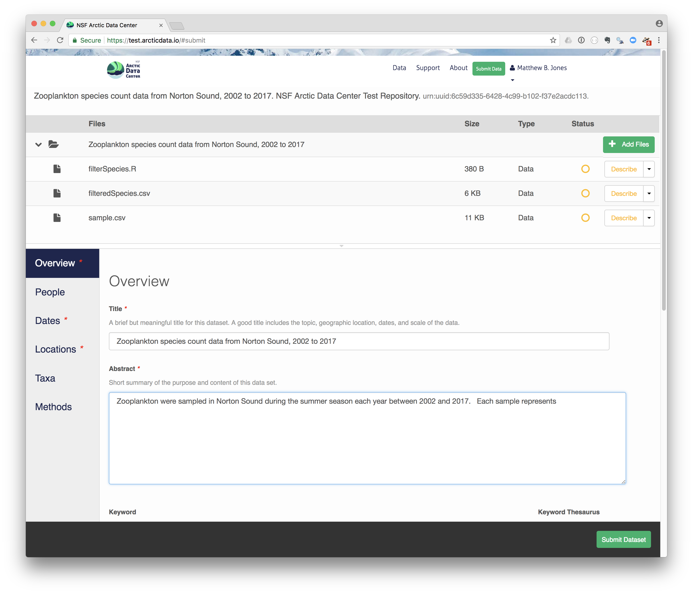
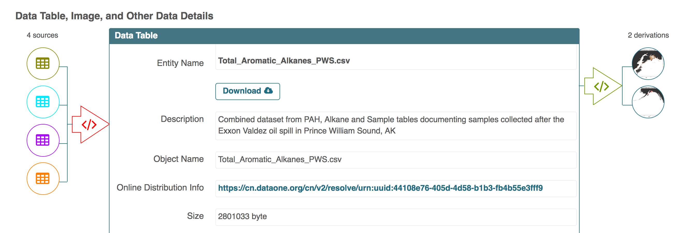

# Data Documentation and Publishing 

## Learning Objectives

In this lesson, you will learn:

- About open data archives
- What science metadata is and how it can be used
- How data and code can be documented and published in open data archives

## Data sharing and preservation


## Data repositories: built for data (and code)

- GitHub is not an archival location
- Dedicated data repositories: KNB, Arctic Data Center, Zenodo, FigShare
  + Rich metadata
  + Archival in their mission
- Data papers, e.g., Scientific Data
- List of data repositories: http://re3data.org


## Metadata

Metadata are documentation describing the content, context, and structure of 
data to enable future interpretation and reuse of the data.  Generally, metadata
describe who collected the data, what data were collected, when and where it was 
collected, and why it was collected.  

For consistency, metadata are typically structured following metadata content 
standards such as the [Ecological Metadata Language (EML)](https://knb.ecoinformatics.org/software/eml/).
For example, here's an excerpt of the metadata for a sockeye salmon data set:

```xml
<?xml version="1.0" encoding="UTF-8"?>
<eml:eml packageId="df35d.442.6" system="knb" 
    xmlns:eml="eml://ecoinformatics.org/eml-2.1.1">
    <dataset>
        <title>Improving Preseason Forecasts of Sockeye Salmon Runs through 
            Salmon Smolt Monitoring in Kenai River, Alaska: 2005 - 2007</title>
        <creator id="1385594069457">
            <individualName>
                <givenName>Mark</givenName>
                <surName>Willette</surName>
            </individualName>
            <organizationName>Alaska Department of Fish and Game</organizationName>
            <positionName>Fishery Biologist</positionName>
            <address>
                <city>Soldotna</city>
                <administrativeArea>Alaska</administrativeArea>
                <country>USA</country>
            </address>
            <phone phonetype="voice">(907)260-2911</phone>
            <electronicMailAddress>mark.willette@alaska.gov</electronicMailAddress>
        </creator>
        ...
    </dataset>
</eml:eml>
```

That same metadata document can be converted to HTML format and displayed in a much
more readable form on the web: https://knb.ecoinformatics.org/#view/doi:10.5063/F1F18WN4


And as you can see, the whole data set or its components can be downloaded and
reused.

Also note that the repository tracks how many times each file has been downloaded,
which gives great feedback to researchers on the activity for their published data.

## Structure of a data package

Note that the data set above lists a collection of files that are contained within
the data set.  We define a *data package* as a scientifically useful collection of 
data and metadata that a researcher wants to preserve.  Sometimes a data package
represents all of the data from a particular experiment, while at other times it
might be all of the data from a grant, or on a topic, or associated with a paper.
Whatever the extent, we define a data package as having one or more data files,
software files, and other scientific products such as graphs and images, all tied
together with a descriptive metadata document.


These data repositories all assign a unique identifier to every version of every
data file, similarly to how it works with source code commits in GitHub.  Those identifiers
usually take one of two forms.  A *DOI* identifier is often assigned to the metadata
and becomes the publicly citable identifier for the package.  Each of the other files
gets an internal identifier, often a UUID that is globally unique.  In the example above,
the package can be cited with the DOI `doi:10.5063/F1F18WN4`.

## DataONE Federation

DataONE is a federation of dozens of data repositories that work together to make their 
systems interoperable and to provide a single unified search system that spans
the repositories.  DataONE aims to make it simpler for researchers to publish
data to one of its member repositories, and then to discover and download that
data for reuse in synthetic analyses.

DataONE can be searched on the web (https://search.dataone.org/), which effectively
allows a single search to find data form the dozens of members of DataONE, rather
than visiting each of the currently 43 repositories one at a time.


## Publishing data from the web

Each data repository tends to have its own mechanism for submitting data and
providing metadata.  With repositories like the KNB Data Repository and the
Arctic Data Center, we provide some easy to use web forms for editing and submitting
a data package.  Let's walk through a web submission to see what you might expect.

### Download the data to be used for the tutorial

I've already uploaded the test data package, and so you can access the data here:

- https://test.arcticdata.io/#view/urn:uuid:630f4bcf-78f6-4c53-b495-b2f6f104202d

Grab both CSV files, and the R script, and store them in a convenient folder.

### Login via ORCID

We will walk through web submission on https://test.arcticdata.io, and start 
by logging in with an ORCID account. ORCID provides a common account for sharing
scholarly data, so if you don't have one, you can create one when you are redirected
to ORCID from the *Sign In* button.

### Create and submit the data set

After signing in, you can access the data submission form using the *Submit* button.
Once on the form, drag your two csv files and R script into the package, and then provide 
the required metadata, which is highlighted with a red asterisk.  When finished, click
the *Submit Dataset* button at the bottom.  If there are errors or missing fields,
they will be highlighted.  Correct those, and then try submitting again.



### Add workflow provenance

Understanding the relationships between files in a package is critically important,
especially as the number of files grows.  Raw data are transformed and integrated
to produce derived data, that are often then used in analysis and visualization code
to produce final outputs.  In DataONE, we support structured descriptions of these
relationships, so one can see the flow of data from raw data to derived to outputs.
Here's an example from a 
[hydrocarbon dataset](https://search.dataone.org/index.html#view/urn:uuid:3249ada0-afe3-4dd6-875e-0f7928a4c171) 
in Prince William Sound:




## Publishing data from R

Now lets see how to use the *dataone* and *datapack* R packages to upload data to DataONE
member repositories like the [KNB Data Repository](https://knb.ecoinformatics.org) and the [Arctic Data Center](https://arcticdata.io).

The *dataone* R package provides methods to enable R scripts to interact with DataONE to search for, download, upload and update data and metadata. The purpose of uploading data from R is to automate the repetitive tasks for large data sets with many files.  For small data sets, the web submission for will certainly be simpler.

The *dataone* R package represents the set of files in a data set as a `datapack::DataPackage`.  We will create a `DataPackage` locally, and then upload it to a test version of the Arctic Data Center repository using `dataone`.

### Logging in
Before uploading any data to a DataONE repository, you must login to get an *authentication token*, which is a character string used to identify yourself. This token can be retrieved by logging into the test repository and copying the token into your R session.

### Obtain an ORCID
ORCID is a researcher identifier that provides a common way to link your researcher identity to your articles and data.  An ORCID is to a researcher as a DOI is to a research article.  To obtain an ORCID, register at https://orcid.org.

### Log in to the test repository and copy your token
We will be using a test server, so login and retrieve your token at https://test.arcticdata.io

Once you are logged in, navigate to your Profile Settings, and locate the "Authentication Token" section, and then copy the token for R to your clipboard.


Finally, paste the token into the R Console to register it as an option for this R session.  You are now logged in.  But note that you need to keep this token private; don't paste it into scripts or check it into Git, as it is just as sensitive as your password.

### Modifying metadata
Next, modify the metadata file associated with the package to set yourself as the owner.  This will help us differentiate the test data later.  Open the `strix-pacific-northwest.xml` file in RStudio, and change the `givenName` and `surName` fields at the top to your name.

```{r modify-eml, eval=FALSE}
library(EML)
source("misc/eml_helpers.R")

# Load the EML file into R
emlFile <- "data/strix/strix-pacific-northwest.xml"
doc <- read_eml(emlFile)

# Change creator to us
doc@dataset@creator <- c(eml_creator("Matthew", "Jones", email = "jones@nceas.ucsb.edu"))

# Change abstract to the better one we wrote
doc@dataset@abstract <- as(set_TextType("data/strix/better-abstract.md"), "abstract")

# Save it back to the filesystem
write_eml(doc, emlFile)
```

### Uploading A Package Using R with `uploadDataPackage`
Datasets and metadata can be uploaded individually or as a collection. Such a collection, whether contained in local 
R objects or existing on a DataONE repository, will be informally referred to as a `package`. The steps necessary to prepare and upload a package to DataONE using the `uploadDataPackage` method 
will be shown. A complete script that uses these steps is shown here.

In the first section, we create a 'DataPackage as a container for our data and metadata and scripts.
It starts out as empty.

```{r data-package, eval=FALSE}
library(dataone)
library(datapack)
library(uuid)

d1c <- D1Client("STAGING", "urn:node:mnTestARCTIC")
dp <- new("DataPackage")
show(dp)
```

We then add a metadata file, data file, R script and output data file to this package.
Our first order is to generate identifiers for the files that are part of the 
package, and add EML metadata that references those identifiers.

```{r entity-metadata, eval=FALSE}
# Generate identifiers for our data and program objects, and add them to the metadata
sourceId <- paste0("urn:uuid:", uuid::UUIDgenerate())
progId <- paste0("urn:uuid:", uuid::UUIDgenerate())
outputId <- paste0("urn:uuid:", uuid::UUIDgenerate())
doc@dataset@otherEntity[[1]]@id <- new("xml_attribute", sourceId)
doc@dataset@otherEntity[[2]]@id <- new("xml_attribute", progId)
doc@dataset@otherEntity[[3]]@id <- new("xml_attribute", outputId)
repo_obj_service <- paste0(d1c@mn@endpoint, "/object/")
doc@dataset@otherEntity[[1]]@physical[[1]]@distribution[[1]]@online@url <- 
  new("url", paste0(repo_obj_service, sourceId))
doc@dataset@otherEntity[[2]]@physical[[1]]@distribution[[1]]@online@url <- 
  new("url", paste0(repo_obj_service, progId))
doc@dataset@otherEntity[[3]]@physical[[1]]@distribution[[1]]@online@url <- 
  new("url", paste0(repo_obj_service, outputId))

write_eml(doc, emlFile)
```

Now we have a full metadata document ready be uploaded.  In the next section, we'll
add the data files and metadata to a `DataPackage`, and then upload that to a
test repository.

```{r build-package, eval=FALSE}
# Add the metadata document to the package
metadataObj <- new("DataObject", 
                   format="eml://ecoinformatics.org/eml-2.1.1", 
                   filename=paste(getwd(), emlFile, sep="/"))
dp <- addMember(dp, metadataObj)

# Add our input data file to the package
sourceData <- "data/strix/sample.csv"
sourceObj <- new("DataObject",
                 id = sourceId,
                 format="text/csv", 
                 filename=paste(getwd(), sourceData, sep="/"))
dp <- addMember(dp, sourceObj, metadataObj)

# Add our processing script to the package
progFile <- "data/strix/filterSpecies.R"
progObj <- new("DataObject",
               id = progId,
               format="application/R", 
               filename=paste(getwd(), progFile, sep="/"), 
               mediaType="text/x-rsrc")
dp <- addMember(dp, progObj, metadataObj)

# Add our derived output data file to the package
outputData <- "data/strix/filteredSpecies.csv"
outputObj <- new("DataObject", 
               id = outputId,
               format="text/csv", 
               filename=paste(getwd(), outputData, sep="/"))
dp <- addMember(dp, outputObj, metadataObj)

myAccessRules <- data.frame(subject="http://orcid.org/0000-0003-0077-4738", permission="changePermission") 

# Add the provenance relationships to the data package
dp <- describeWorkflow(dp, sources=sourceObj, program=progObj, derivations=outputObj)

show(dp)
```

Finally, we upload the package to the Testing server for the KNB.
```{r upload-package, eval=FALSE}
packageId <- uploadDataPackage(d1c, dp, public=TRUE, accessRules=myAccessRules, quiet=FALSE)
```

This particular package contains the R script `filterSpecies.R`, the input 
file `sample.csv` that was read by the script and the output file 
`filteredSpecies.csv` that was created by the R script, which was run at a
previous time.  

You can now search for and view the package at https://dev.nceas.ucsb.edu:


In addition, each of the uploaded entities shows the relevant provenance information, showing how the source data is linked to the derived data via the R program that was used to process the raw data:


