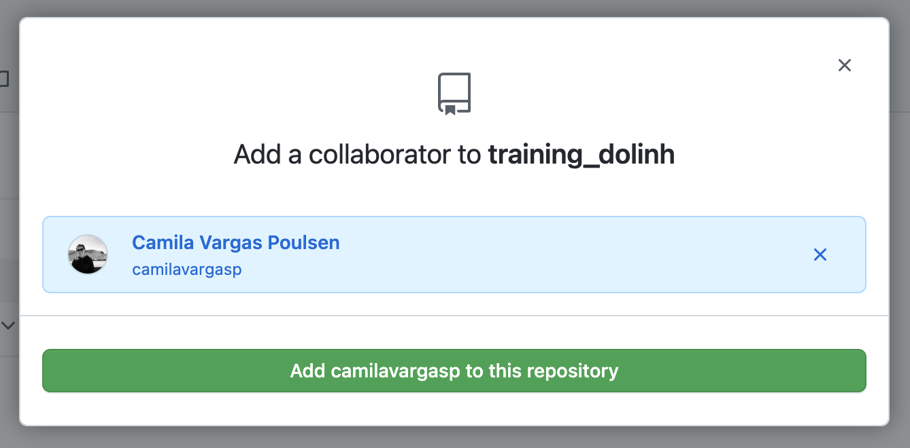
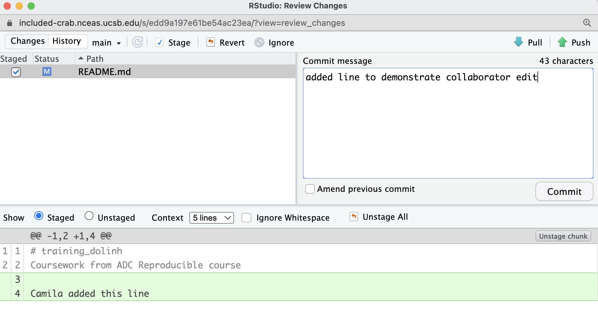
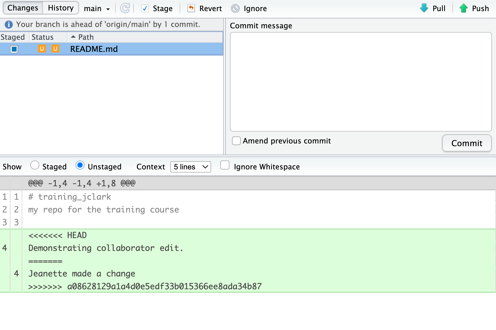

# Git: Collaboration and Conflict Management

## Learning Objectives

In this lesson, you will learn:

- How to use Git and GitHub to collaborate with colleagues on code
- What typically causes conflicts when collaborating
- Workflows to avoid conflicts
- How to resolve a conflict

## Collaborating with Git

Git is a great tool for working on your own, but even better for working with friends
and colleagues.  Git allows you to work with confidence on your own local copy of files
with the confidence that you will be able to successfully synchronize your changes
with the changes made by others.

The simplest way to collaborate with Git is to use a shared repository on a hosting
service such as [GitHub](https://github.com), and use this shared repository as
the mechanism to move changes from one collaborator to another.  While there are other
more advanced ways to sync git repositories, this "hub and spoke" model works really 
well due to its simplicity.

### Activity: Collaborating with a trusted colleague

*Settings*. Working in pairs, choose one person as the 'Owner' and one as the 'Collaborator'.
Then, have the Owner visit their `arctic-training-repo` repository created earlier,
and visit the *Settings* page, and select the *Collaborators* screen, and add
the username of your Collaborator in the box.



Once the collaborator has been added, they should check their email for an invitation
from GitHub, and click on the acceptance link, which will enable them to collaborate
onthe repository.

*Collaborator clone*.  To be able to contribute to a repository, the collaborator
must clone the repository from the Owner's github account. To do this, the Collaborator
should visit the github page for the Owner's repository, and then copy the clone URL.
In R Studio, the Collaborator will create a new project from version control by pasting
this clone URL into the appropriate dialog (see the earlier chapter introducing GitHub).

*Collaborator Edits*. With a clone copied locally, the Collaborator can now make changes to the
`index.Rmd` file in the repository, adding a line or statment somewhere noticeable
near the top.  Save your changes.

*Collaborator commit and push*.  To sync changes, the collaborator will need to add, commit, and
push their changes to the Owner's repository.  But before doing so, its good practice
to `pull` immediately before committing to ensure you have the most recent changes
from the owner.  So, in R Studio's Git tab, first click the "Diff" button to
open the git window, and then press the green "Pull" down arrow button.  This will
fetch any recent changes from the origin repository and merge them.  Next, add
the changed index.Rmd file to be committed by cicking the checkbox next to it, 
type in a commit message, and click 'Commit.'  Once that finishes, then the collaborator can
immediately click 'Push' to send the commits to the Owner's GitHub repository.



*Owner pull*. Now, the owner can open their local working copy of the code
in RStudio, and `pull` those changes down to their local copy.

**Congrats, the owner now has your changes!**

*Owner edits, commit, and push*. Next, the owner should do the same. Make changes to
a file in the repository, save it, pull to make sure no new changes have been made
while editing, and then `add`, `commit`, and `push` the Owner changes to GitHub.

*Collaborator pull*.  The collaborator can now `pull` down those owner changes, 
and all copies are once again fully synced.  And you're off to collaborating.

## Merge conflicts

A merge conflict occurs when both the owner and collaborator change the same
lines in the same file without first pulling the changes that the other has made.
This is most easily avoided by good communication about who is working on various
sections of each file, and trying to avoid overlaps.  But sometimes it happens, 
and *git* is there to warn you about potential problems.  And git will not allow
you to overwrite one person's changes to a file with another's changes to the same
file if they were based on the same version.

The main problem with merge conflicts is that, when the Owner and Collaborator
both make changes to the same line of a file, git doesn't know whose changes
take precedence.  You have to tell git whose changes to use for that line.

## How to resolve a conflict

### Abort, abort, abort...

Sometimes you just made a mistake.  When you get a merge conflict, the repository
is placed in a 'Merging' state until you resolve it.  There's a commandline command
to abort doing the merge altogether:

```
git merge --abort
```

Of course, after doing that you stull haven't synced with your collaborator's
changes, so things are still unresolved.  But at least your repository is now
usable on your local machine.

### Checkout

The simplest way to resolve a conflict, given that you know whose version of the
file you want to keep, is to use the commandline `git` program to tell git to
use either *your* changes (the person doing the merge), or *their* changes (the other collaborator).

- keep your collaborators file: `git checkout --theirs conflicted_file.Rmd`
- keep your own file: `git checkout --ours conflicted_file.Rmd`

Once you have run that command, then run `add`, `commit`, and `push` the changes as normal.

### Pull and edit the file

But that requires the commandline. If you want to resolve from RStudio, or if 
you want to pick and choose some of your changes and some of your collaborator's,
then instead you can manually edit and fix the file.  When you `pull`ed the file
with a conflict, git notices that there is a conflict and modifies the file to show
both your own changes and your collaborator's changes in the file.  It also shows the
file in the Git tab with an orange `U` icon, which indicates that the file is `Unmerged`,
and therefore awaiting you help to resolve the conflict. It delimits
these blocks with a series of less than and greater than signs, so they are easy to find:



To resolve the conficts, simply find all of these blocks, and edit them so that
the file looks how you want (either pick your lines, your collaborators lines,
some combination, or something altogether new), and save. Be sure you removed the
delimiter lines that started with `<<<<<<<`, `=======`, and `>>>>>>>`.

Once you have made those changes, you simply add, commit, and push the files
to resolve the conflict.

## Workflows to avoid merge conflicts

Communicate often.  Tell each other what you are working on.

Pull -> Edit -> Add -> Pull -> Commit -> Push

Pull before every commit, and commit often in small chunks.


