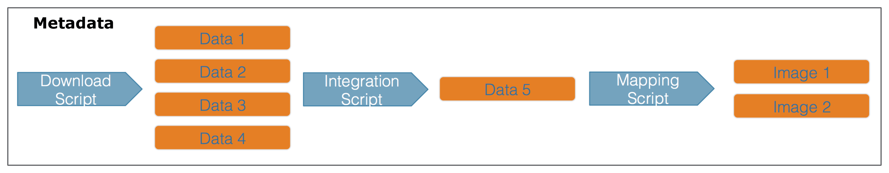
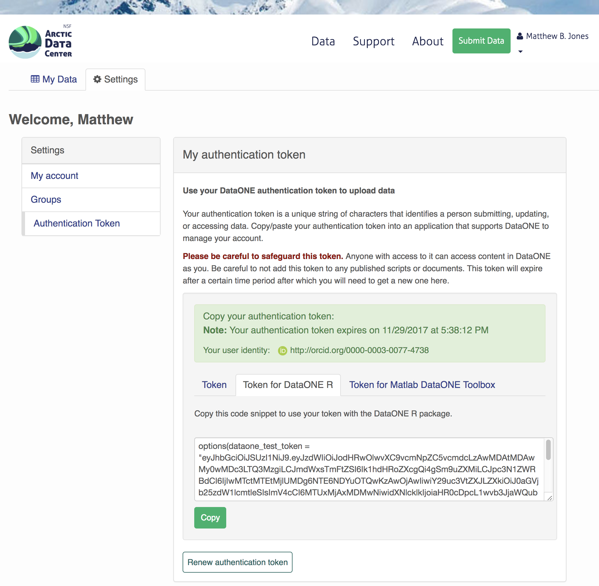

# Programming Metadata and Data Publishing

## Learning Objectives

In this lesson, you will learn:

- How to write standardized metadata in R
- How to publish data packages to the Arctic Data Center programmatically

For datasets with a relatively small number of files that do not have many columns, the Arctic Data Center web form is the most efficient way to create metadata. However, for datasets that have many hundreds of files with a similar structure, or a large number of attributes, programmatic metadata creation may be more efficent. Creating metadata and publishing programmatically also allows for more a streamlined approach to updating datasets that have been published. By incorporating this documentation and publishing approach into your scientific workflow, you can improve the reproducibility and transparency of your work.

## Creating Metadata

### About Ecological Metadata Language (EML)

EML, the metadata standard that the Arctic Data Center uses, looks like this:

```xml
<?xml version="1.0" encoding="UTF-8"?>
<eml:eml packageId="df35d.442.6" system="knb"
    xmlns:eml="eml://ecoinformatics.org/eml-2.1.1">
    <dataset>
        <title>Improving Preseason Forecasts of Sockeye Salmon Runs through
            Salmon Smolt Monitoring in Kenai River, Alaska: 2005 - 2007</title>
        <creator id="1385594069457">
            <individualName>
                <givenName>Mark</givenName>
                <surName>Willette</surName>
            </individualName>
            <organizationName>Alaska Department of Fish and Game</organizationName>
            <positionName>Fishery Biologist</positionName>
            <address>
                <city>Soldotna</city>
                <administrativeArea>Alaska</administrativeArea>
                <country>USA</country>
            </address>
            <phone phonetype="voice">(907)260-2911</phone>
            <electronicMailAddress>mark.willette@alaska.gov</electronicMailAddress>
        </creator>
        ...
    </dataset>
</eml:eml>
```

Earlier in this course we learned how to create an EML document like this using the Arctic Data Center web form. Now, we will learn how to create it using R. This can be especially useful to decrease the repetitiveness of metadata creation when you have many files with the same format, files with many attributes, or many data packages with a similar format.

When you create metadata using the web form, the form creates valid metadata for you. Valid, structured metadata is what enables computers to predictably parse the information in a metadata document, enabling search, display, and even meta-analysis. When we create metadata in R, there aren't as many user-friendly checks in place to ensure we create valid EML, so we need to understand the structure of the document more completely in order to make sure that it will be compatible with the Arctic Data Center.

Let's look at a simplified version of the example above:

```xml
<?xml version="1.0" encoding="UTF-8"?>
<eml:eml packageId="df35d.442.6" system="knb"
    xmlns:eml="eml://ecoinformatics.org/eml-2.1.1">
    <dataset>
        <title>Improving Preseason Forecasts of Sockeye Salmon Runs through
            Salmon Smolt Monitoring in Kenai River, Alaska: 2005 - 2007</title>
        <creator id="1385594069457">
            <individualName>
                <givenName>Mark</givenName>
                <surName>Willette</surName>
            </individualName>
        </creator>
        ...
    </dataset>
</eml:eml>
```

EML is written in XML (eXtensisble Markup Language). One of the key concepts in XML is the element. An XML element is everything that is encompassed by a start tag (`<...>`) and an end tag (`</...>`). So, a simple element in the example above is `<surName>Willette</surName>`. The name of this element is `surName` and the value is simple text, "Willette". Each element in EML has a specific (case sensitive!) name and description that is specified in the schema. The description of the `surName` element is: "The surname field is used for the last name of the individual associated with the resource. This is typically the family name of an individual..." The EML schema specifies not only the names and descriptions of all EML elements, but also certain requirements, like which elements must be included, what type of values are allowed within elements, and how the elements are organized. An EML document is valid when it adheres to all of the requirements speficied in the EML schema.

You'll notice that some elements, rather than having a simple value, instead contain other elements that are nested within them. Let's look at `individualName`.

```xml
<individualName>
    <givenName>Mark</givenName>
    <surName>Willette</surName>
</individualName>
```

This element is a collection of other elements (sometimes referred to as child elements). In this example, the `individualName` element has a `givenName` and a `surName` child element. We can check the requirements of any particular element by looking at the [schema documents](https://eml.ecoinformatics.org/schema/), which includes some helpful diagrams.

The diagram in the `individualName` [section](https://eml.ecoinformatics.org/schema/eml-party_xsd.html#ResponsibleParty_individualName) of the schema looks like this:


This shows that within `individualName` there are 3 possible child elements: `salutation`, `givenName`, and `surName`. The yellow circle icon with stacked papers tells you that the elements come in series, so you can include one or more of the child elements (as opposed to a switch symbol, which means that  you choose one element from a list of options). The bold line tells you that `surName` is required, and the `0..inf` indicates that you can include 0 or more `salultation` or `givenName` elements.

So, to summarize, EML is the metadata standard used by the Arctic Data Center. It is written in XML, which consists of a series of nested elements. The element definitions, required elements, and structure are all defined by a schema. When you write EML, in order for it to be valid, your EML document must conform to the requirements given in the schema.

### Metadata in R: a simple example

Now, let's learn how the [EML package](https://github.com/ropensci/EML) can help us create EML in R.

First, load the EML package in R.

```{r, warning = F, message = F}
library(EML)
```

The EML package relies on named list structures to generate name-value pairs for elements. "Named list structures" may sound unfamiliar, but they aren't dissimilar from `data.frames`. A `data.frame` is just a named list of vectors of the same length, where the name of the vector is the column name. In this section, we will use the familiar `$` operator to dig down into the named list structure that we generate.

To show how this works, let's create the `individualName` element, and save it as an object called `me`. Remember the schema requirements - `indvidualName` has child elements `salutation`, `givenName`, and `surName`. At least `surName` is required.

```{r}
me <- list(givenName = "Jeanette",
            surName = "Clark")
me
```

So we have created the contents of an `individualName` element, with child elements `givenName` and `surName`, and assigned the values of those child elements to my name.

This might look confusing, hard to remember, and if you aren't intimitely familiar with the EML schema, you are probably feeling a little intimidated. Luckily the `EML` package has a set of helper list constructor functions which tell you what child elements can be used in a parent element. The helper functions have the format `eml$elementName()`. When combined with the RStudio autocomplete functionality, the whole process gets a lot easier!

```{r}
me <- eml$individualName(givenName = "Jeanette",
                         surName = "Clark")
```

We can then use this object `me`, which represents the `individualName` element, and insert it into a larger EML document.

At the top level of a complete EML document are the `packageId` and `system` elements. This is how your document can be uniquely identified within whatever system manages it. The `packageId` element typically contains the DOI (Digital Object Identifier) or other identifier for the dataset. Nested within the top level is the `dataset` element. All EML documents must have, at a minimum, a `title`, `creator`, and `contact`, in addition to the `packageId` and `system`.

Let's create a minimal valid EML dataset, with an arbitrary `packageId` and `system`.

```{r}
doc <- list(packageId = "dataset-1", system = "local",
            dataset = eml$dataset(title = "A minimial valid EML dataset",
                                  creator = eml$creator(individualName = me),
                                  contact = eml$contact(individualName = me)))
```

Unlike the web editor, in R there is nothing stopping you from inserting arbitrary elements into your EML document. A critical step to creating EML is validating your EML document to make sure it conforms to the schema requirements. In R this can be done using the `eml_validate` function.

```{r}
eml_validate(doc)
```

We can write our EML using `write_eml`.

```{r}
write_eml(doc, "files/simple_example.xml")
```

Here is what the written file looks like:

```xml
<?xml version="1.0" encoding="UTF-8"?>
<eml:eml xmlns:eml="eml://ecoinformatics.org/eml-2.1.1" xmlns:xsi="http://www.w3.org/2001/XMLSchema-instance" xmlns:stmml="http://www.xml-cml.org/schema/stmml-1.1" packageId="id" system="system" xsi:schemaLocation="eml://ecoinformatics.org/eml-2.1.1/ eml.xsd">
  <dataset>
    <title>A minimial valid EML dataset</title>
    <creator>
      <individualName>
        <givenName>Jeanette</givenName>
        <surName>Clark</surName>
      </individualName>
    </creator>
    <contact>
      <individualName>
        <givenName>Jeanette</givenName>
        <surName>Clark</surName>
      </individualName>
    </contact>
  </dataset>
</eml:eml>
```

### Validation Errors

One of the hardest parts about creating EML in R is diagnosing validation errors. I won't get into too much detail, but here is a simple example. The `eml$...` family of helpers can help prevent validation errors, since they have a set list of arguments which are allowed. Here, I bypass the `eml$dataset()` helper function to show what the error looks like.

```{r}
doc <- list(packageId = "dataset-1", system = "local",
            dataset = list(title = "A minimial valid EML dataset",
                           creator = eml$creator(individualName = me),
                           contact = eml$contact(individualName = me),
                           arbitrary = "This element isn't in the schema"))

eml_validate(doc)
```

This error essentially says that the element `arbitrary` is not expected, and gives you a hint of some elements that were expected. Validation errors can be tricky, especially when there are lots of them. Validate early and often!

### Metadata in R: A more complete example

As you might imagine, creating a complete metadata record like what is shown on [this page](https://arcticdata.io/catalog/view/doi:10.18739/A26W9688B) would be pretty tedious if we did it just using the generic `list` or `eml$...` helpers, since the nesting structure can be very deep.

The `EML` package has a set of higher level helper functions beginning with `set_` that create some of the more complex elements.

To demonstrate the use of these we are going to create an EML document that contains the following information:

* title
* creator and contact
* abstract
* methods
* geographic and temporal coverage
* description of a tabular data file and a script

We will edit these elements using a mix of helpers and generic techniques.

To get set up, navigate to [this dataset](https://test.arcticdata.io/view/urn:uuid:da8b9bfc-ddea-4af4-9680-c2dafe4a1225) and download the CSV file and the R script. Put them in a directory called `files` that is a sub-directory of the location of this RMarkdown file.

#### Title, creator, contact

To start, lets create a basic EML skeleton using our example above, but with more information in the creator and contact information besides just my name.

```{r}
# eml creator and contact have identical schema requirements (both fall under `responsibleParty`)
me <- eml$creator(individualName = eml$individualName(givenName = "Jeanette",
                                                      surName = "Clark"),
                  organizationName = "National Center for Ecological Analysis and Synthesis",
                  electronicMailAddress = "jclark@nceas.ucsb.edu",
                  userId = list(directory = "https://orcid.org",
                                userId = "https://orcid.org/0000-0003-4703-1974"))

doc <- list(packageId = "dataset-1", system = "local",
            dataset = eml$dataset(title = "A more robust valid EML dataset",
                                  creator = me,
                                  contact = me))
```

Because we have used the `eml$dataset` helper, all of the possible sub-elements have been populated in our EML document, allowing us to easily access and edit them using R autocomplete.

#### Abstract

We can use this to dive down into sub-elements and edit them. Let's do the abstract. This is a simple element so we can just assign the value of the `abstract` to a character string.

```{r}
doc$dataset$abstract <- "A brief but comprehensive description of the who, what, where, when, why, and how of my dataset."
```

#### Methods

We can use the `set_methods` function to parse a markdown (or word) document and insert it into the methods section. This way of adding text is especially nice because it preserves formatting.

```{r}
doc$dataset$methods <- set_methods("files/methods.md")
doc$dataset$methods
```

#### Coverage

The geographic and temporal coverage can be set using `set_coverage`.

```{r}
doc$dataset$coverage <- set_coverage(beginDate = 2001,
                                     endDate = 2010,
                                     geographicDescription = "Alaska, United States",
                                     westBoundingCoordinate = -179.9,
                                     eastBoundingCoordinate = -120,
                                     northBoundingCoordinate = 75,
                                     southBoundingCoordinate = 55)
```

#### Data file: script

Information about data files (or `entity` level information) can be added in child elements of the `dataset` element. Here we will use the element `otherEntity` (other options include `spatialVector`, `spatialRaster`, and `dataTable`) to represent the R script.

First, some high level information.

```{r}
doc$dataset$otherEntity <- eml$otherEntity(entityName = "files/datfiles_processing.R",
                                           entityDescription = "Data processing script",
                                           entityType = "application/R")
```

We can use the `set_physical` helper to set more specific information about the file, like its size, delimiter, and checksum. This function automatically detects fundamental characteristics about the file if you give it a path to your file on your system.

```{r}
doc$dataset$otherEntity$physical <- set_physical("files/datfiles_processing.R")
```

#### Data file: tabular

Here we will use the element `dataTable` to describe the tabular data file.

As before, we set the `entityName`, `entityDescription`, and the `physical` sections.

```{r}
doc$dataset$dataTable <- eml$dataTable(entityName = "files/my-data.csv",
                                       entityDescription = "Temperature data from in-situ loggers")

doc$dataset$dataTable$physical <- set_physical("files/my-data.csv")
```

Next, perhaps the most important part of metadata, but frequently the most difficult to document in a metadata standard: attribute level information. An attribute is a variable in your dataset. For tabular data, this is information about columns within data tables, critical to understanding what kind of information is actually in the table!

The `set_attributes` function will take a `data.frame` that gives required attribute information. This `data.frame` contains rows corresponding to column names (or attributes) in the dataset, and columns:

* attributeName (any text)
* attributeDefinition (any text)
* unit (required for numeric data, use `get_unitList()` to see a list of standard units)
* numberType (required for numeric data, one of: real, natural, whole, integer)
* formatString (required for dateTime data)
* definition (required for textDomain data)

Two other sub-elements, the `domain` and `measurementScale`, can be inferred from the `col_classes` argument to `set_attributes`.

Let's create our attributes `data.frame`.

```{r}
atts <- data.frame(attributeName = c("time", "temperature", "site"),
                   attributeDefinition = c("time of measurement", "measured temperature in degrees Celsius", "site identifier"),
                   unit = c(NA, "celsius", NA),
                   numberType = c(NA, "real", NA),
                   formatString = c("HH:MM:SS", NA, NA),
                   definition = c(NA, NA, "site identifier"))
```

We will then use this in our `set_attributes` function, along with the `col_classes` argument, to generate a complete `attributeList`.

```{r}
doc$dataset$dataTable$attributeList <- set_attributes(attributes = atts,
                                                      col_classes = c("Date", "numeric", "character"))
```

As you might imagine, this can get VERY tedious with wide data tables. The function `shiny_attributes` calls an interactive table that can not only automatically detect and attempt to fill in attribute information from a `data.frame`, but also helps with on the fly validation.

Note: this requires that the `shinyjs` package is installed.

```{r, eval = F}
atts_shiny <- shiny_attributes(data = read.csv("files/my-data.csv"))
```

This produces a `data.frame` that you can insert into `set_attributes` as above.

#### Validating and writing the file

Finally, we need to validate and write our file.

```{r}
eml_validate(doc)
```

```{r}
write_eml(doc, "files/complex_example.xml")
```

## Publish data to the Arctic Data Center test site

### Setup and Introduction

Now let's see how to use the *dataone* and *datapack* R packages to upload data to DataONE
member repositories like the [KNB Data Repository](https://knb.ecoinformatics.org) and the [Arctic Data Center](https://arcticdata.io).

#### The `dataone` package

The *dataone* R package provides methods to enable R scripts to interact with DataONE to search for, download, upload and update data and metadata. The purpose of uploading data from R is to automate the repetitive tasks for large datasets with many files.  For small datasets, the web submission form will certainly be simpler.

The `dataone` package interacts with two major parts of the DataONE infrastructure: Coordinating Nodes (or `cn`) and Member Nodes (or `mn`). Coordinating nodes maintain a complete catalog of all data and provide the core DataONE services, including search and discovery. The `cn` that is exposed through [search.dataone.org](https://search.dataone.org) is called the production (or `PROD`) `cn`. Member Nodes expose their data and metadata through a common set of interfaces and services. The Arctic Data Center is an `mn`. To post data to the Arctic Data Center, we need to interact with both the coordinating and member nodes.

In addition to the production `cn`, there are also several test coordinating node environments, and corresponding test member node environments. In this tutorial, we will be posting data to the test Arctic Data Center environment.

#### The `datapack` package

The *datapack* R package represents the set of files in a dataset as a `datapack::DataPackage`. This `DataPackage` is just a special R object class that is specified in the `datapack` package. Each object in that `DataPackage` is represented as a `DataObject`, another R object class specified by `datapack`. 

When you are publishing your dataset, ideally you aren't only publishing a set of observations. There are many other artifacts of your research, such as scripts, derived data files, and derived figures, that should be archived in a data package. Each of the types of files shown in the workflow below should be considered a data object in your package, including the metadata file that describes the individual components of your workflow.



Each of the files in the diagram above has a relationship with the other files, and using `datapack` you can describe these relationships explicitly and unambiguously using controlled vocabularies and conceptual frameworks. For example, we know that the fine "Image 1" was generated by "Mapping Script." We also know that both "Image 1" and "Mapping Script" are described by the file "Metadata." Both of these relationsips are represented in `datapack` using speficic ontologies.  Using `datapack` we will create a `DataPackage` that represents a (very simple) scientific workflow and the data objects within it, where the relationships between those objects are explicitly described. Then, we will upload this `DataPackage` to a test version of the Arctic Data Center repository using `dataone`.

Before uploading any data to a DataONE repository, you must login to get an *authentication token*, which is a character string used to identify yourself. This token can be retrieved by logging into the test repository and copying the token into your R session.

#### Obtain an ORCID

ORCID is a researcher identifier that provides a common way to link your researcher identity to your articles and data.  An ORCID is to a researcher as a DOI is to a research article.  To obtain an ORCID, register at https://orcid.org.

#### Log in to the test repository and copy your token

We will be using a test server, so login and retrieve your token at https://test.arcticdata.io.

Once you are logged in, navigate to your Profile Settings, and locate the "Authentication Token" section, and then copy the token for R to your clipboard.



Finally, paste the token into the R Console to register it as an option for this R session.  You are now logged in.  But note that you need to keep this token private; don't paste it into scripts or check it into git, as it is just as sensitive as your password.

### Uploading A Package Using R with `uploadDataPackage`

Datasets and metadata can be uploaded individually or as a collection. Such a collection, whether contained in local R objects or existing on a DataONE repository, will be informally referred to as a `package`.

Load the libraries:

```{r data-package, warning = F, message = F}
library(dataone)
library(datapack)
```

First we need to create an R object that describes what coordinating and member nodes we will be uploading our dataset to. We do this with the `dataone` function `D1Client` (DataONE client). The first argument specifies the DataONE coordinating node (in this case a test node called STAGING) and the second specifices the member node.

We'll also create an object that only represents the member node, which is helpful for some functions.

```{r}
d1c <- D1Client("STAGING", "urn:node:mnTestARCTIC")
mn <- d1c@mn
```

Next, we create a `DataPackage` as a container for our data, metadata, and scripts using the `new` function. This just creates an empty object with the class `DataPackage`

```{r}
dp <- new("DataPackage")
dp
```

We then need to add a metadata file and data file to this package. First we generate some identifiers for the objects. We'll use the `uuid` scheme for all of our objects. If we were uploading to production, you would likely want use an identifier with the `doi` scheme for your metadata document.

```{r, eval = F}
data_id <- generateIdentifier(mn, scheme = "uuid")
script_id <- generateIdentifier(mn, scheme = "uuid")
metadata_id <- generateIdentifier(mn, scheme = "uuid")
```

```{r, echo = F}
# these are example pids used only to render the bookdown document
# they enable realistic output to be shown in the chunks below
data_id <- "urn:uuid:2a43d7f6-7843-4505-9e3b-d16434a4a4aa"
script_id <- "urn:uuid:fee29e22-3116-494b-817d-ea86d7038ed9"
metadata_id <- "urn:uuid:7c3663ca-0a18-4988-acc0-c2dcd0f7ffd1"
```

Now we need to modify our EML document to include these identifiers. This increases the accessibility of the files in our dataset.

First read in the EML that we created earlier.

```{r}
doc <- read_eml("files/complex_example.xml")
```

Let's replace the arbitrary `packageId` and `system` that we set in the example above to reflect the identifier we created for this package, and the system we are uploading the package to.

```{r}
doc$packageId <- metadata_id
doc$system <- mn@identifier
```

Now let's add a distribution URL to the `physical` section of our entity information. All of the distribution URLs look something like this `https://test.arcticdata.io/metacat/d1/mn/v2/object/urn:uuid:A0cc95b46-a318-4dd1-8f8a-0e6c280e1d95`, where `https://test.arcticdata.io/metacat/d1/mn/v2/` is the member node end point, and `urn:uuid:A0cc95b46-a318-4dd1-8f8a-0e6c280e1d95` is the identifier of the object.

We can easily construct this URL using the `paste0` function, and insert it into the `physical` section of the `dataTable` element.

```{r}
# set url for csv
doc$dataset$dataTable$physical$distribution$online$url <- paste0(mn@endpoint,
                                                                 "object/",
                                                                 data_id)
# set url for script
doc$dataset$otherEntity$physical$distribution$online$url <- paste0(mn@endpoint,
                                                                   "object/",
                                                                   script_id)

write_eml(doc, "files/complex_example.xml")
```

Now we have a full metadata document ready to be uploaded. We now need to add our files to the `DataPackage`.

First, let's create a new `DataObject`, which is another object class specific to `datapack`. Our metadata file, data file, and script will all need to be added as a `DataObject`. Remember that all files in a package are considered data objects, not just the ones that we you traditionally think of as being "data".

The `format` argument specifies the type of file, and should match one of the list of DataONE formatIds (listed in the Id field) [here](https://cn.dataone.org/cn/v2/formats).

```{r}
# Add the metadata document to the package
metadataObj <- new("DataObject",
                   id = metadata_id,
                   format ="eml://ecoinformatics.org/eml-2.1.1",
                   filename = "files/complex_example.xml")
```

After creating the `DataObject` that represents the metadata file, we add it to the data package using `addMember`.

```{r}
dp <- addMember(dp, metadataObj)
dp
```

We add the data file and the script similarly. The only difference is in the `addMember` function we have to set the `mo` (metadata object) argument equal to the `DataObject` that represents the metadata file. Adding our csv file to the package this way not only adds the file to the data package, but it also specifies that the csv is described by the metadata.

```{r}
# Add our data file to the package
sourceObj <- new("DataObject",
                 id = data_id,
                 format = "text/csv",
                 filename = "files/my-data.csv")

dp <- addMember(dp, sourceObj, mo = metadataObj)
dp
```

Next we add our script in the same way.

```{r}
# Add our script to the package
scriptObj <- new("DataObject",
                 id = script_id,
                 format = "application/R",
                 filename = "files/datfiles_processing.R")

dp <- addMember(dp, scriptObj, mo = metadataObj)
dp
```

You can also specify other information about the relationships between files in your data package by adding provenance information. Here, we specify that the R script (`program`) uses the csv (`sources`) by including them as the specified arguments in the `describeWorkflow` function.

```{r}
dp <- describeWorkflow(dp, sources = sourceObj, program = scriptObj)
dp
```

Each object in a data package has an access policy. There are three levels of access you can grant either to individual files, or the package as a whole.

* read: the ability to view when published
* write: the ablity to edit after publishing
* changePermission: the ability to grant other people read, write, or changePermission access

Here, I give my colleague (via his ORCID) "read" and "write" permission to my entire data package using `addAccessRule`.

```{r}
dp <- addAccessRule(dp,
                    subject = "http://orcid.org/0000-0003-0077-4738",
                    permission = c("read","write"),
                    getIdentifiers(dp))

```

Finally, we upload the package to the test server for the Arctic Data Center using `uploadDataPackage`. This function takes as arguments `d1c` (the DataONE client which specifies which coordinating and member nodes to use), `dp` (the data package itself), whether you want the package to include public read access (`public = TRUE`). 

```{r upload-package, eval = F}
packageId <- uploadDataPackage(d1c, dp, public = TRUE)
```

You can now search for and view the package at https://test.arcticdata.io:


