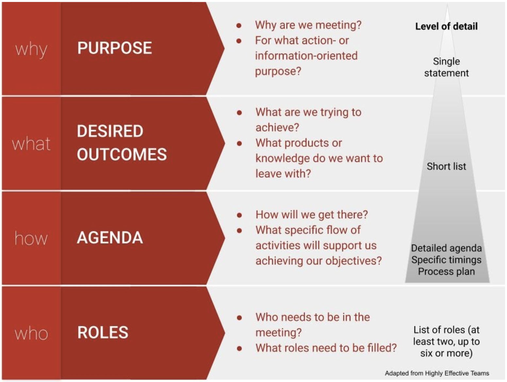
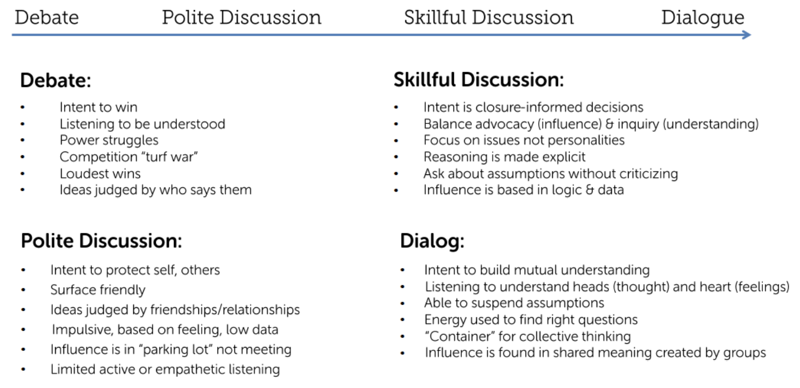
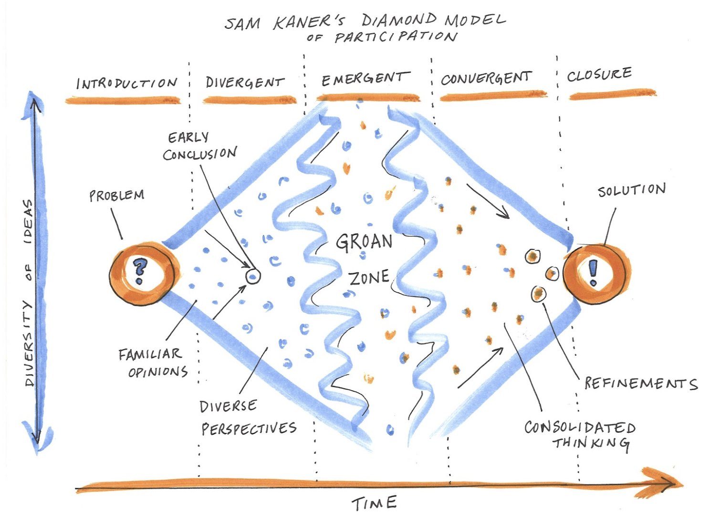
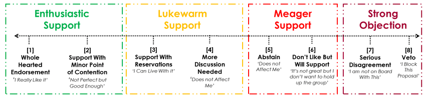
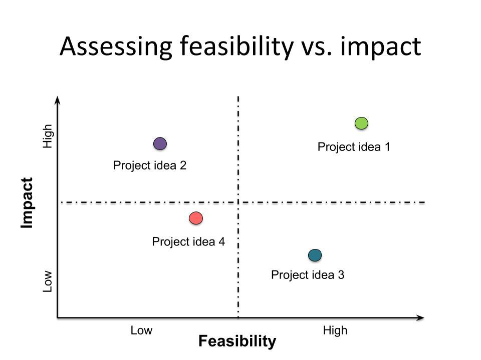

#  Collaboration: Designing and facilitating effective meetings

## Learning Objectives

In this lesson, you will learn:

- How to design creative, productive, inclusive team science meetings 
- How to facilitate more effective in person team science meetings 
- How to facilitate more effective virtual team science meetings

## What makes meetings effective? 

As humans, we are constantly coming together in groups for some common purpose. At our core, we are social animals, and our exceptional abilities to connect and collaborate may be among the main things that distinguish us as a species. So if meetings are just opportunities for groups of humans to connect and collaborate, why do so many of us find them “soul-sucking and painful?” Probably we are going about this the wrong way!

In general...

- Effective meetings have a clear purpose / goal. 
- They have clearly defined objectives (intended outcomes and/or outputs).
- The right people have been convened.
- Those people understand the purpose and objectives of the meeting.
- They understand their role, and they are ready to engage in the way that will best serve the collective purpose. 
- The agenda for the meeting has been designed with the outcomes and outputs in mind.
- The format, facilities, and activities suit the agenda and purpose of the meeting.
- The format, facilities, and activities encourage and empower people to contribute fully and openly.
- People listen, participate, and take responsibility for leadership in ways that support other participants, the process, and progress.
- Actions and next steps are clearly described (including roles, responsibilities, timelines, definition of success) and taken up by participants.
- Progress (during and after the meeting) is reviewed, tracked, and communicated.
Everyone is invited to review progress / success and feed learning back in to improve future meetings and ongoing work of the team. 

## Designing for successful team science meetings

**What are we trying to achieve when we design and facilitate a team science meeting?**

- First, we are working to build and sustain a [coalition of the willing](https://blogs.scientificamerican.com/observations/the-secret-sauce-for-environmental-problem-solving/). 
- Second, we want to foster creativity. When faced with complex problems without obvious solutions, we need to invite new ideas from all quarters and create the conditions where innovation and unconventional thinking are welcomed. We cannot know ahead of time where good ideas will come from.
- Third, we want results, so we need to foster a really productive environment.
   - The key to that productivity is good communication. 
   - And the style of communication that is most effective for interdisciplinary problem-solving is dialogue (versus debate). Dialogue will be covered in more depth down below.
- Finally, in most team science endeavors, we can and should also be designing for future collaborative potential. These people are part of your professional network and could become lifelong collaborators. How do you build and sustain a pool of collaborators who can become part of your future coalitions of the willing for new projects?

**The value of planning**

To design a successful meeting:

- Give yourself enough time - at least 2x the meeting length
- Determine who needs to be involved in planning
- Make sure all the key aspects of meeting planning are being handled by someone. Use your team and share the load!
   - Purpose and objectives - Getting these clear is the most important thing you can do to plan a good meeting!
   - Participant list 
   - Scheduling 
   - Venue, accommodations (if applicable) and logistics
   - A/V and remote participation technology
   - Invitations
   - Agenda design
   - Process design
   - Assigning pre-work - What can be accomplished ahead of the meeting to prepare for success?
   - Facilitation team - Who will lead the meeting? Who will facilitate? Who will take notes? Who can troubleshoot technology?
   - Recreation (field trips, opportunities for fun)
   - Food and beverages (group meals, catered working lunches, snacks)
   - Materials
   - Pre- and post-meeting communication with participants
   

## Sharing the load of effective meeting facilitation

Shared leadership is a critical element of creating a culture of collaboration. The agenda design should articulate specific roles and who is going to play them, which may include:

- Meeting chair – keeps an eye on the overall vision and progress of the meeting; this role may be shared among the working group leaders 
- Discussion leader(s) – each session
- Process facilitator – sets the tone and pace, mediates conflicts, and ensures all voices are being heard, interpersonal dynamics are positive/effective, and group is staying on task
- Timekeeper – may also be the chair or facilitator
- Notetaker – captures action items and notes, often in a google doc that can be viewed and added to by others; this role should be rotated and shared evenly among genders and career stage; could also produce a meeting summary 
- Scribe – captures important points that can be seen in real time by the whole group, usually on a whiteboard or flipchart
- Spotter – keeps a running list of who is waiting to speak (especially in large groups/intense discussions)
- Relationship monitor – tracks group dynamics and actively works to help everyone feel included and engaged on personal and social levels
- Participation monitor – engineers opportunities for participation, quells interrupters, amplifies and credits the messages of quieter participants. 

As you get to know your team members, you can start to match people to these different roles based on their skills and recruit them to help. 

## Creating the conditions for quality participation

Collaborative working groups convene diverse collections of participants not otherwise collaborating to catalyze novel insights and solutions. One primary method of catalyzing novel ideas is to allow the flow of dialogue during a working group meeting. In contrast to debate or discussion, dialogue allows groups to recognize the limits on their own and others’ individual perspectives and to strive for more coherent thought. This process can take working groups in directions not imagined or planned. 

In _discussion_, different views are presented and defended, and this may provide a useful analysis of the whole situation. In _dialogue_, all views are treated as equally valid and different views are presented as a means toward discovering a new view. In a _skillful discussion_, decisions are made. In a dialogue, complex issues are explored. Both are critical to the working group process, and the more artfully a group can move between these two forms of discourse (and out of less productive _debate_ and _polite discussion_) according to what is needed, the more effective the group will be.  

Agreements or principles can help enable dialogue. (See list of potential agreements in the resources section). Opportunities to build social cohesion and human connection also support dialogue. These could take the form of icebreakers or other exercises that invite people to connect on a personal level. Or they could be informal activities like coffee breaks, field trips, games or group dinners that offer opportunities for people to get to know each other and build connections.

## Techniques for democratizing participation

Remember that your goal is to enable the full participation of all group members so you can tap their diverse perspectives and catalyze creative problem-solving. To do this, you want to thoughtfully work to democratize participation so that a few voices don’t dominate discussion. 

A few simple techniques can help:
 
- Use tent cards to indicate when one wants to speak and have someone track the order they go up and call on people in order
- Allow time for silent reflection before inviting discussion
- Mix up the discussion format throughout the meeting - pairs, small groups, plenary
- Provide opportunities for small groups to go off and work on something and then report refined ideas back to the group
- Invite, amplify and credit the contributions of quieter participants

## The Groan Zone (aka the Diamond Participation Model)

## Techniques to support divergent and emergent thinking

Be creative and empathetic when you design your agenda. Think about your participants and what is going to help all of them participate fully and creatively. Here are a few techniques and microstructures we have found useful.

* Round robins, e.g. to get starting positions out on the table and hear from everyone
* [1,2,4,all](http://www.liberatingstructures.com/1-1-2-4-all/) to allow everyone’s participation and elevate themes and key insights (format goes from  individual to small group to whole group discussion)
* [Sticky note brainstorming](https://www.designkit.org/methods/28) + [clustering](https://www.designkit.org/methods/30)
* [Rotating stations](http://www.liberatingstructures.com/11-shift-share/)
* [World Cafe conversations](http://www.liberatingstructures.com/17-conversation-cafe/)
* Panel discussion or [User Experience Fishbowl](http://www.liberatingstructures.com/18-users-experience-fishbowl/) to explicitly draw out and contrast different expert perspectives
* Parallel breakout groups
* Scribing to capture participant’s viewpoints (use their own words)
* Encouraging and drawing out people, mirroring and validating what they say
* See other ideas in the Creative Problem Solving (CPS): Divergent Tools Quick Reference from Omni Skills linked below in Resources

## Making thinking visible 

Remember that there are many different ways that people learn. Encourage group members to synthesize and feed back the information that is being discussed in different ways to enhance understanding and learning. Visual tools - including written notes and graphics or drawings - can be a helpful complement to oral discussion. 

Consider using:

* Shared notes, e.g. in google docs

* Scribing on a flipchart or whiteboard 

* Grids to organize information and compare 

* Conceptual models to articulate shared understanding of complex systems

* Manifestos, abstracts and other written collateral to distill ideas

## Techniques to support convergent thinking (i.e., getting to agreement)

Coming to a clear decision can sometimes be the hardest work of a collaboration. Use tools and frameworks to help your group converge in its thinking and come to clear decisions. 

* Gradient of agreement

* Feasibility / impact matrix

* [Top five](https://www.designkit.org/methods/15)

* [Dot voting](https://en.wikipedia.org/wiki/Dot-voting)

* [Gut check](https://www.designkit.org/methods/42)

* See other ideas in the Creative Problem Solving (CPS): Convergent Tools Quick Reference from Omni Skills linked below in Resources

## Virtual meeting best practices

Running a virtual meeting is much like an in person meeting. Use all the tools and planning guidelines above to design an effective virtual meeting. To get the most out of virtual collaboration (list adapted from Young 2009, facilitate.com):

* Each virtual meeting should have the same level of planning as an in person meeting, i.e., twice the planning time as duration 

* Match the virtual technology to efficiently accomplish each objective

* Test your technology with participants in advance

* Prepare participants by circulating an agenda and pre-work in advance and hold them accountable for coming prepared

* Establish mutual agreement on virtual conferencing best practices, e.g., using a headset, video, muting when not talking, and remind participants of them at the outset

* To maximize engagement, actively request participants to remove distractions, take the pulse of the group frequently, create an interactive format, and stick to meeting start and end times 

* Use facilitation to build trust and social capital 

* Keep shared goals in sight, track progress, check in frequently, and celebrate achievements

See also the guidance in Hampton et al. 2017 in the Resource list below.

## Resources

Bohm, David. 2004. On Dialogue. Routledge Classics

Hampton, Stephanie et al. 2017. [Best Practices for Virtual Participation in Meetings: Experiences from Synthesis Centers. ](https://www.jstor.org/stable/10.2307/bullecosociamer.98.1.57)Bulletin of the Ecological Society of America

[IDEO Design Kit](https://www.designkit.org/methods)

Kaner, Sam. 2014. [Facilitator’s Guide to Participatory Decision-Making](https://www.amazon.com/Facilitators-Participatory-Decision-Making-Jossey-bass-Management/dp/1118404955). Jossey-Bass

Kappel, Carrie. 2019. [From groan zone to growth zone](https://i2insights.org/2019/05/28/collaboration-groan-zone/?fbclid=IwAR1QlwMg33G0DQg66F7IExCdLgNzqjdeWXUGD71-v0SkYLG6Fj6xdSB3-Nc). Integration and Implementation Insights

[Liberating Structures](http://www.liberatingstructures.com/ls-menu/)

Omni Skills. Creative Problem Solving (CPS): Convergent Tools Quick Reference 

Omni Skills. Creative Problem Solving (CPS): Divergent Tools Quick Reference 

Wilkie, David. 2019. [The secret sauce for environmental problem-solving. ](https://blogs.scientificamerican.com/observations/the-secret-sauce-for-environmental-problem-solving/)Scientific American

    
    