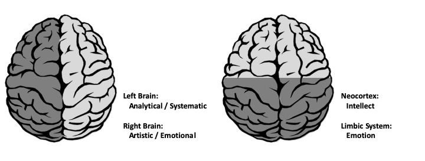
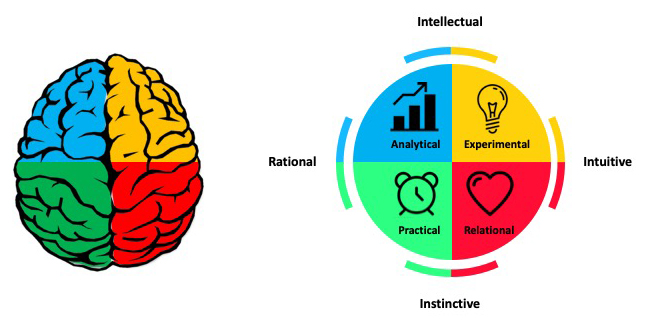
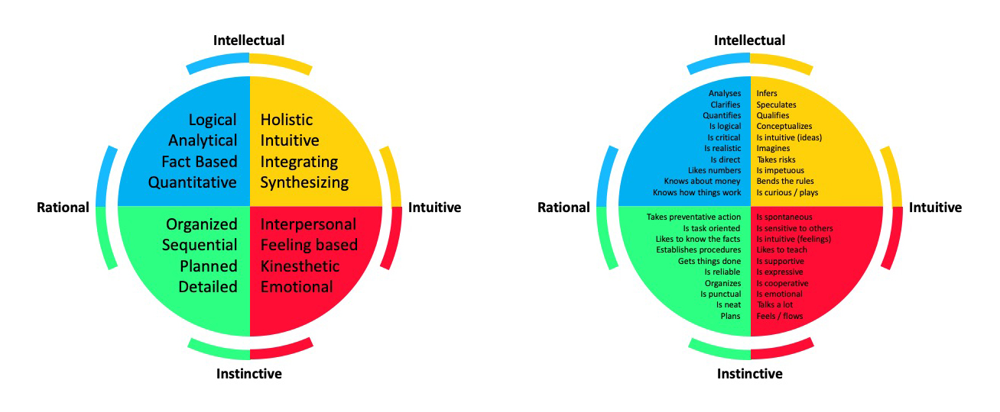
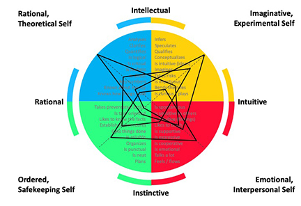
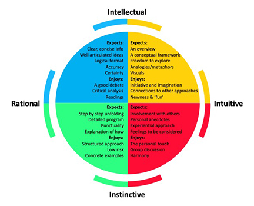

# Thinking preferences

## Learning Objectives

An ice-breaker activity that will provide: 

- Opportunity to get to know fellow participants and trainers 
- An introduction to variation in thinking preferences

## About the Whole Brain Thinking System

Everyone thinks differently. The way individuals think guide the way they work, and the way groups of individuals think quide how teams work. Understanding thinking preferences facilitates effective collaboration and team work.

The Whole Brain Model, developed by Ned Herrmann, builds builds upon our understanding of brain functioning. For example, the left and right hemispheres are associated with different types of information processing and our neocortex and limbic system regulate different functions and behaviours.

The Herrmann Brain Dominance Instrument (HBDI) provides insight into dominant characteristics based on thinking preferences. There are four major thinking styles that reflect the left cerebral, left limbic, right cerebral and right limbic.

- Analytical (Blue)
- Practical (Green)
- Relational (Red)
- Experimental (Yellow)

These four thinking styles are characterized by different traits. Those in the BLUE quadrant have a strong logical and rational side. They analyze information and may be technical in their approach to problems. They are interested in the 'what' of a situation. Those in the GREEN quadrant have a strong organizational and sequential side. They like to plan details and are methodical in their approach. They are interested in the 'when' of a situation.  The RED quadrant includes those that are feelings-based in their apporach. They have strong interpersonal skills and are good communicators. They are interested in the 'who' of a situation. Those in the YELLOW quadrant are ideas people. They are imaginative, conceptual thinkers that explore outside the box. Yellows are interested in the 'why' of a situation.  

Most of us identify with thinking styles in more than one quadrant and these different thinking preferences reflect a complex self made up of our rational, theoretical self; our ordered, safekeeping self; our emotional, interpersonal self; and our imaginitive, experimental self.

Undertsanding the complexity of how people think and process information helps us understand not only our own approach to problem solving, but also how individuals within a team can contribute. There is great value in diversity of thinking styles within collaborative teams, each type bringing stengths to different aspects of project development.

