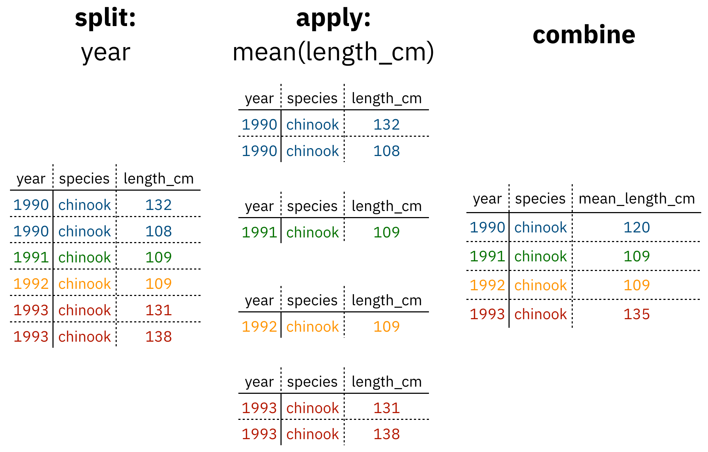

# Data Cleaning and Manipulation

## Learning Objectives

In this lesson, you will learn:

- What the Split-Apply-Combine strategy is and how it applies to data
- The difference between wide vs. tall table formats and how to convert between them
- How to use `dplyr` and `tidyr` to clean and manipulate data for analysis
- How to join multiple `data.frame`s together using `dplyr`

## Introduction

The data we get to work with are rarely, if ever, in the format we need to do our analyses.
It's often the case that one package requires data in one format, while another package requires the data to be in another format.
To be efficient analysts, we should have good tools for reformatting data for our needs so we can do our actual work like making plots and fitting models.
The `dplyr` and `tidyr` R packages provide a fairly complete and extremely powerful set of functions for us to do this reformatting quickly and learning these tools well will greatly increase your efficiency as an analyst.

Analyses take many shapes, but they often conform to what is known as the Split-Apply-Combine strategy.
This strategy follows a usual set of steps:

- **Split**: Split the data into logical groups (e.g., area, stock, year)
- **Apply:** Calculate some summary statistic on each group (e.g. mean total length by year)
- **Combine:** Combine the groups back together into a single table



As shown above (Figure 1), our original table is split into groups by `year`, we calculate the mean length for each group, and finally combine the per-year means into a single table.

`dplyr` provides a fast and powerful way to express this.
Let's look at a simple example of how this is done:

Assuming our length data is already loaded in a `data.frame` called `length_data`:

| year| length_cm|
|----:|---------:|
| 1991|  5.673318|
| 1991|  3.081224|
| 1991|  4.592696|
| 1992|  4.381523|
| 1992|  5.597777|
| 1992|  4.900052|
| 1992|  4.139282|
| 1992|  5.422823|
| 1992|  5.905247|
| 1992|  5.098922|

We can do this calculation using `dplyr` like this:

```{r, eval = FALSE}
length_data %>% 
  group_by(year) %>% 
  summarise(mean_length_cm = mean(length_cm))
```

Another exceedingly common thing we need to do is "reshape" our data.
Let's look at an example table that is in what we will call "wide" format:

| site   | 1990 | 1991 | ... | 1993 |
|--------|------|------|-----|------|
| gold   | 100  | 118  | ... | 112  |
| lake   | 100  | 118  | ... | 112  |
| ...    | ...  | ...  | ... | ...  |
| dredge | 100  | 118  | ... | 112  |

You are probably quite familiar with data in the above format, where values of the variable being observed are spread out across columns (Here: columns for each year).
Another way of describing this is that there is more than one measurement per row.
This wide format works well for data entry and sometimes works well for analysis but we quickly outgrow it when using R.
For example, how would you fit a model with year as a predictor variable?
In an ideal world, we'd be able to just run:

```{r eval = FALSE}
lm(length ~ year)
```

But this won't work on our wide data because `lm` needs `length` and `year` to be columns in our table.

Or how would we make a separate plot for each year?
We could call `plot` one time for each year but this is tedious if we have many years of data and hard to maintain as we add more years of data to our dataset.

The `tidyr` package allows us to quickly switch between wide format and what is called tall format using the `pivot_longer` function:

```{r, eval=FALSE}
site_data %>% 
  pivot_longer(-site, names_to = "year", values_to = "length")
```

| site   | year | length |
|--------|------|-------:|
| gold   | 1990 |    101 |
| lake   | 1990 |    104 |
| dredge | 1990 |    144 |
| ...    | ...  |    ... |
| dredge | 1993 |    145 |

In this lesson we're going to walk through the functions you'll most commonly use from the `dplyr` and `tidyr` packages:

- `dplyr`
    - `mutate()`
    - `group_by()`
    - `summarise()`
    - `select()`
    - `filter()`
    - `arrange()`
    - `left_join()`
    - `rename()`
- `tidyr`
    - `pivot_longer()`
    - `pivot_wider()`
    - `extract()`
    - `separate()`

## Setup

Let's start going over the most common functions you'll use from the `dplyr` package.
To demonstrate, we'll be working with a tidied up version of a dataset from ADF&G containing commercial catch data from 1878-1997.
The dataset and reference to the original source can be found at its public archive: https://knb.ecoinformatics.org/#view/df35b.304.2.

First, let's load `dplyr` and `tidyr`:

```{r, message = F, warning = F}
library(dplyr)
library(tidyr)
```

Then let's read in the data and take a look at it:

```{r, cache=TRUE}
catch_original <- read.csv(url("https://knb.ecoinformatics.org/knb/d1/mn/v2/object/df35b.302.1", method = "libcurl"),
                    stringsAsFactors = FALSE)
head(catch_original)
```

Note: I copied the URL from the Download button on https://knb.ecoinformatics.org/#view/df35b.304.2

This dataset is relatively clean and easy to interpret as-is.
But while it may be clean, it's in a shape that makes it hard to use for some types of analyses so we'll want to fix that first.

## About the pipe (`%>%`) operator

Before we jump into learning `tidyr` and `dplyr`, we first need to explain the `%>%`.

Both the `tidyr` and the `dplyr` packages use the pipe operator - `%>%`, which may look unfamiliar. The pipe is a powerful way to efficiently chain together operations. The pipe will take the output of a previous statement, and use it as the input to the next statement.

Say you want to both `filter` out rows of a dataset, and `select` certain columns. Instead of writing

```
df_filtered <- filter(df, ...)
df_selected <- select(df_filtered, ...)
```

You can write

```
df_cleaned <- df %>% 
              filter(...) %>%
              select(...)
```

If you think of the assignment operator (`<-`) as reading like "gets", then the pipe operator would read like "then."

So you might think of the above chunk being translated as:

The cleaned dataframe gets the original data, and then a filter (of the original data), and then a select (of the filtered data).

The benefits to using pipes are that you don't have to keep track of (or overwrite) intermediate data frames. The drawbacks are that it can be more difficult to explain the reasoning behind each step, especially when many operations are chained together. It is good to strike a balance between writing efficient code (chaining operations), while ensuring that you are still clearly explaining, both to your future self and others, what you are doing and why you are doing it.

RStudio has a keyboard shortcut for `%>%` : Ctrl + Shift + M (Windows), Cmd + Shift + M (Mac).

## Selecting/removing columns: `select()`

The first issue is the extra columns `All` and `notesRegCode`.
Let's select only the columns we want, and assign this to a variable called `catch_data`.

```{r}
catch_data <- catch_original %>% 
  select(Region, Year, Chinook, Sockeye, Coho, Pink, Chum)

head(catch_data)
```

Much better!

`select` also allows you to say which columns you *don't* want, by passing unquoted column names preceded by minus (-) signs:

```{r}
catch_data <- catch_original %>% 
  select(-All, -notesRegCode)

head(catch_data)
```

## Quality Check

Now that we have the data we are interested in using, we should do a little quality check to see that it seems as expected. One nice way of doing this is the `summary` function.

```{r}
summary(catch_data)
```

Notice something seems a bit off? The Chinook catch data are `character` class. Let's fix it using the function `mutate` before moving on.

## Changing column content: `mutate()`

We can use the `mutate` function to change a column, or to create a new column. First Let's try to just convert the Chinook catch values to `numeric` type using the `as.numeric()` function, and overwrite the old Chinook column.

```{r}
catch_clean <- catch_data %>% 
  mutate(Chinook = as.numeric(Chinook))

head(catch_clean)
```

We get a warning "NAs introduced by coercion" which is R telling us that it couldn't convert every value to an integer and, for those values it couldn't convert, it put an `NA` in its place. This is behavior we commonly experience when cleaning datasets and it's important to have the skills to deal with it when it crops up.

To investigate, let's isolate the issue. We can find out which values are NAs with a combination of `is.na()` and `which()`, and save that to a variable called `i`.

```{r}
i <- which(is.na(catch_clean$Chinook))
i
```

It looks like there is only one problem row, lets have a look at it in the original data.

```{r}
catch_data[i,]
```

Well that's odd: The value in `catch_thousands` is `I`.
It turns out that this dataset is from a PDF which was automatically converted into a CSV and this value of `I` is actually a 1.

Let's fix it by incorporating the `ifelse` function to our `mutate` call, which will change the value of the `Chinook` column to 1 if the value is equal to I, otherwise it will leave the column as the same value.

```{r}
catch_clean <- catch_data %>% 
  mutate(Chinook = ifelse(Chinook == "I", 1, Chinook)) %>%
  mutate(Chinook = as.integer(Chinook))

head(catch_clean)
```

## Changing shape: `pivot_longer()` and `pivot_wider()`

The next issue is that the data are in a wide format and, we want the data in a tall format instead.
`pivot_longer()` from the `tidyr` package helps us do just this conversion:

```{r}
catch_long <- catch_clean %>% 
  pivot_longer(cols = -c(Region, Year), names_to = "species", values_to = "catch")

head(catch_long)
```

The syntax we used above for `pivot_longer()` might be a bit confusing so let's walk though it.

The first argument to `pivot_longer` is the columns over which we are pivoting. You can select these by listing either the names of the columns you do want to pivot, or the names of the columns you are not pivoting over. The `names_to` argument takes the name of the column that you are creating from the column **names** you are pivoting over. The `values_to` argument takes the name of the column that you are creating from the **values** in the columns you are pivoting over.

The opposite of `pivot_longer()`, `pivot_wider()`, works in a similar declarative fashion:

```{r}
catch_wide <- catch_long %>% 
  pivot_wider(names_from = species, values_from = catch)

head(catch_wide)
```

## Renaming columns with `rename()`

If you scan through the data, you may notice the values in the `catch` column are very small (these are supposed to be annual catches). If we look at [the metadata](https://knb.ecoinformatics.org/#view/df35b.304.2) we can see that the `catch` column is in thousands of fish so let's convert it before moving on.

Let's first rename the `catch` column to be called `catch_thousands`:

```{r}
catch_long <- catch_long %>% 
  rename(catch_thousands = catch)

head(catch_long)
```

## Adding columns: `mutate()`

Now let's use `mutate` again to create a new column called `catch` with units of fish (instead of thousands of fish).

```{r, eval=FALSE}
catch_long <- catch_long %>% 
  mutate(catch = catch_thousands * 1000)

head(catch_long)
```

Now let's remove the `catch_thousands` column for now since we don't need it. Note that here we have added to the expression we wrote above by adding another function call (mutate) to our expression. This takes advantage of the pipe operator by grouping together a similar set of statements, which all aim to clean up the `catch_long` `data.frame`.

```{r}
catch_long <- catch_long %>% 
  mutate(catch = catch_thousands * 1000) %>% 
  select(-catch_thousands)

head(catch_long)
```

We're now ready to start analyzing the data.

## `group_by` and `summarise`

As I outlined in the Introduction, `dplyr` lets us employ the Split-Apply-Combine strategy and this is exemplified through the use of the `group_by()` and `summarise()` functions:

```{r}
mean_region <- catch_long %>% 
  group_by(Region) %>%
  summarise(catch_mean = mean(catch))

head(mean_region)
```

- **Exercise:** Find another grouping and statistic to calculate for each group.
- **Exercise:** Find out if you can group by multiple variables.

Another common use of `group_by()` followed by `summarize()` is to count the number of rows in each group.
We have to use a special function from `dplyr`, `n()`.

```{r}
n_region <- catch_long %>% 
  group_by(Region) %>%
  summarize(n = n())

head(n_region)
```

## Filtering rows: `filter()`

`filter()` is the verb we use to filter our `data.frame` to rows matching some condition.
It's similar to `subset()` from base R.

Let's go back to our original `data.frame` and do some `filter()`ing:

```{r}
SSE_catch <- catch_long %>% 
  filter(Region == "SSE")

head(SSE_catch)
```

- **Exercise:** Filter to just catches of over one million fish.
- **Exercise:** Filter to just SSE Chinook

## Sorting your data: `arrange()`

`arrange()` is how we sort the rows of a `data.frame`.
In my experience, I use `arrange()` in two common cases:

- When I want to calculate a cumulative sum (with `cumsum()`) so row order matters
- When I want to display a table (like in an `.Rmd` document) in sorted order

Let's re-calculate mean catch by region, and then `arrange()` the output by mean catch:

```{r}
mean_region <- catch_long %>% 
  group_by(Region) %>% 
  summarise(mean_catch = mean(catch)) %>% 
  arrange(mean_catch)

head(mean_region)
```

The default sorting order of `arrange()` is to sort in ascending order.
To reverse the sort order, wrap the column name inside the `desc()` function:

```{r}
mean_region <- catch_long %>% 
  group_by(Region) %>% 
  summarise(mean_catch = mean(catch)) %>% 
  arrange(desc(mean_catch))

head(mean_region)
```

## Joins in dplyr

So now that we're awesome at manipulating a single `data.frame`, where do we go from here?
Manipulating **more than one** `data.frame`.

If you've ever used a database, you may have heard of or used what's called a "join", which allows us to to intelligently merge two tables together into a single table based upon a shared column between the two.
We've already covered joins in [Data Modeling & Tidy Data] so let's see how it's done with `dplyr`.

The dataset we're working with, https://knb.ecoinformatics.org/#view/df35b.304.2, contains a second CSV which has the definition of each `Region` code.
This is a really common way of storing auxiliary information about our dataset of interest (catch) but, for analylitcal purposes, we often want them in the same `data.frame`.
Joins let us do that easily. 

Let's look at a preview of what our join will do by looking at a simplified version of our data:


First, let's read in the region definitions data table and select only the columns we want. Note that I have piped my `read.csv` result into a select call, creating a tidy chunk that reads and selects the data that we need.


```{r, cache=TRUE}
region_defs <- read.csv(url("https://knb.ecoinformatics.org/knb/d1/mn/v2/object/df35b.303.1",
                            method = "libcurl"),
                        stringsAsFactors = FALSE) %>% 
    select(code, mgmtArea)

head(region_defs)
```


If you examine the `region_defs` `data.frame`, you'll see that the column names don't exactly match the image above. If the names of the key columns are not the same, you can explicitly specify which are the key columns in the left and right side as shown below:

```{r}
catch_joined <- left_join(catch_long, region_defs, by = c("Region" = "code"))

head(catch_joined)
```

Notice that I have deviated from our usual pipe syntax (although it does work here!) because I prefer to see the `data.frames` that I am joining side by side in the syntax.

Another way you can do this join is to use `rename` to change the column name `code` to `Region` in the `region_defs` `data.frame`, and run the `left_join` this way:

```{r, eval = F}
region_defs <- region_defs %>% 
  rename(Region = code, Region_Name = mgmtArea)

catch_joined <- left_join(catch_long, region_defs, by = c("Region"))

head(catch_joined)
```


Now our catches have the auxiliary information from the region definitions file alongside them.
Note: `dplyr` provides a complete set of joins: inner, left, right, full, semi, anti, not just left_join.

## `separate()` and `unite()`

`separate()` and its complement, `unite()` allow us to easily split a single column into numerous (or numerous into a single).

This can come in really handle when we need to split a column into two pieces by a consistent separator (like a dash). 

Let's make a new `data.frame` with fake data to illustrate this. Here we have a set of site identification codes. with information about the island where the site is (the first 3 letters) and a site number (the 3 numbers). If we want to group and summarize by island, we need a column with just the island information.

```{r}
sites_df <- data.frame(site = c("HAW-101",
                                "HAW-103",
                                "OAH-320",
                                "OAH-219",
                                "MAI-039"),
                       stringsAsFactors = FALSE)

sites_df %>% 
  separate(site, c("island", "site_number"), "-")
```

- **Exercise:** Split the `city` column in the following `data.frame` into `city` and `state_code` columns:

```{r}
cities_df <- data.frame(city = c("Juneau AK", 
                                 "Sitka AK", 
                                 "Anchorage AK"),
                        stringsAsFactors = FALSE)

# Write your solution here
```

`unite()` does just the reverse of `separate()`. If we have a data.frame that contains columns for year, month, and day, we might want to unite these into a single date column.

```{r}
dates_df <- data.frame(year = c("1930",
                                "1930",
                                "1930"),
                       month = c("12",
                                "12",
                                "12"),
                       day = c("14",
                               "15",
                               "16"),
                       stringsAsFactors = FALSE)

dates_df %>% 
  unite(date, year, month, day, sep = "-")
```

- **Exercise:** Use `unite()` on your solution above to combine the `cities_df` back to its original form with just one column, `city`:

```{r}
# Write your solution here
```

## Summary

We just ran through the various things we can do with `dplyr` and `tidyr` but if you're wondering how this might look in a real analysis.
Let's look at that now:

```{r, catch=TRUE}
catch_original <- read.csv(url("https://knb.ecoinformatics.org/knb/d1/mn/v2/object/df35b.302.1", method = "libcurl"),
                  stringsAsFactors = FALSE)
region_defs <- read.csv(url("https://knb.ecoinformatics.org/knb/d1/mn/v2/object/df35b.303.1", method = "libcurl"),
                        stringsAsFactors = FALSE) %>% 
    select(code, mgmtArea)

mean_region <- catch_original %>%
  select(-All, -notesRegCode) %>% 
  mutate(Chinook = ifelse(Chinook == "I", 1, Chinook)) %>% 
  mutate(Chinook = as.numeric(Chinook)) %>% 
  pivot_longer(-c(Region, Year), names_to = "species", values_to = "catch") %>%
  mutate(catch = catch*1000) %>% 
  group_by(Region) %>% 
  summarize(mean_catch = mean(catch)) %>% 
  left_join(region_defs, by = c("Region" = "code"))

head(mean_region)
```
