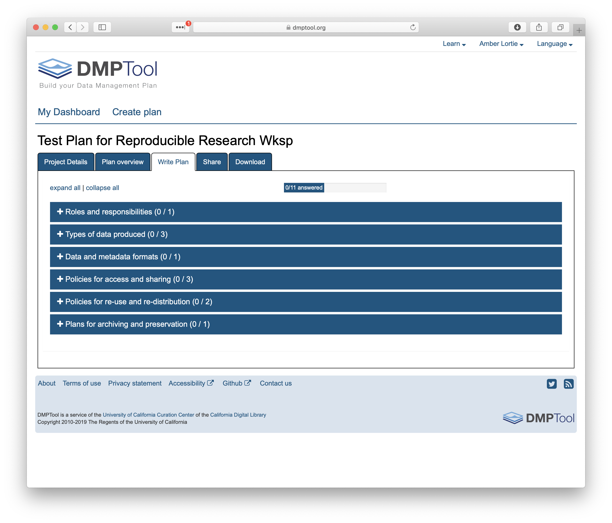

# Writing Good Data Management Plans

## Learning Objectives

In this lesson, you will learn:

- Why create data management plans
- The major components of data management plans
- Tools that can help create a data management plan
- Festures and functionality of the DMPTool

## When to Plan: The Data Life Cycle

Shown below is one version of the D[ata Life Cycle](https://www.dataone.org/data-life-cycle) that was developed by DataONE. The data life cycle provides a high level overview of the stages involved in successful management and preservation of data for use and reuse. Multiple versions of a data life cycle exist with differences attributable to variation in practices across domains or communities. It is not neccesary for researchers to move through the data life cycle in a cylical fashion and some research activities might use only part of the life cycle. For instance, a project involving meta-analysis might focus on the Discover, Integrate, and Analyze steps, while a project focused on primary data collection and analysis might bypass the Discover and Integrate steps. However, 'Plan' is at the top of the data life cycle as it is advisable to initiate your data management planning at the beginning of your research process, before any data has been collected.

## Why Plan?

Planning data management in advance povides a number of benefits to the researcher.

- **Saves time and increases efficiency**; Data management planning requires that a researcher think about data handling in advance of data collection, potentially raising any challenges before they are encountered. 
- **Engages your team**; Being able to plan effectively will require conversation with multiple parties, engaging project participants from the outset.
- **Allows you to stay organized**; It will be easier to organize your data for analysis and reuse.
- **Meet funder requirements**; Funders require a data management plan as part of the proposal process.
- **Share data**; Information in the DMP is the foundation for archiving and sharing data with community.

## How to Plan

1) As indicated above, engaging your team is a benefit of data management planning. You will benefit from everyone’s expertise that will be involved in the data collection and processing of your research data. Therefore, **plan in collaboration** with these individuals. 
2) Make sure to **plan from the start** to avoid confusion, data loss, and increase efficiency. With DMPs a requirement of funding agencies, it is nearly always neccesary to plan from the start but the same should apply to research that is being undertaken outside of a specific funded proposal.
3) Make sure to **utilize resources** that are available to assist you in helping to write a good DMP. These might include your institutional library or organization data manager, online resources and resources or educaiton materials such as these.
4) **Use tools** available to you; you don’t have to reinvent the wheel.
5) **Revise your plan** as situations change and you potentially adapt/alter your project. Like your research projects, data management plans are not static, they require changes and updates throughout the research project process.

## What to include in a DMP

If you are writing a data management plan as part of a solicitation proposal, the funding agency will have guidelines for the information they want to be provided in the plan. A good plan will provide information on the study design; data to be collected; metadata; policies for access, sharing & reuse; long-term storage & data management; and budget. 

*A note on Metadata: *
Both the basic metadata (such as title and researcher contact information) and comprehensive metadata (such as complete methods of data collection) is critical for accurate interpretation and understanding. The full definitions of variables, especially units, inside each dataset are also critical, as they relate to the methods used for creation. Knowing certain blocking or grouping methods, for example, would be necessary to understand studies for proper comparisons and synthesis. 

The article [Ten Simple Rules for Creating a Good Data Management Plan](https://journals.plos.org/ploscompbiol/article?id=10.1371/journal.pcbi.1004525) is a great resource for thinking about writing a data management plan and the information you should include within the plan. The ten simple rules are:

1) Determine the research sponsor requirements
2) Identify the data to be collected
3) Define how the data will be organized
4) Explain how the data will be documented
5) Describe how quality data will be assured
6) Present a sound storage & preservation strategy
7) Define the project’s data policies
8) Describe how the data will be disseminated
9) Assign roles & responsibilities
10) Prepare a realistic budget

## NSF DMP requirements

In the 2014 Proposal Preparation Instructions, Section J ['Special Information and Supplementary Documentation'](https://www.nsf.gov/pubs/policydocs/pappguide/nsf14001/gpg_2.jsp#IIC2j) NSF put foward the baseline requirements for a data management plan. In addition, there are specific divison and program requirements that provide additional detail. If you are working on a research project with funding that does not require a data management plan, or are developing a plan for unfunded research, the NSF generic requirements are a good sewt of guidelines to follow.

**Five Sections of the NSF DMP Requirements**

1) Products of research
Types of data, samples, physical collections, software, curriculum materials, other materials produced during project
2) Data formats and standards
Standards to be used for data and metadata format and content (for initial data collection, as well as subsequent storage and processing)
3) Policies for access and sharing
Provisions for appropriate protection of privacy, confidentiality, security, intellectual property, or other rights or requirements
4) Policies and provisions for re-use
Including re-distribution and the production of derivatives
5) Archiving of data
Plans for archiving data, samples, research products and for preservation of access

## Tools in Support of Creating a DMP

The [DMP Tool](https://dmptool.org) and [DMP Online](https://dmponline.dcc.ac.uk) are both easy to use web based tools that support the development of a DMP. The tools are partnered and share a code base; the DMPTool incorporates templates from US funding agencies and the DMP Online is focussed on EU requirements.

## Hands-On: Creating a DMP

Go to [https://dmptool.org](https://dmptool.org)

Click 'get Started' to login. You will have three options. Options 1 and 2 apply if your organization is partnered with the DMP Tool or if you already have an account, option 3 is in order to set up an account. Under Option 1 you will be prompted to search for your organization and can then log-in using your institutional ID.

Once logged in you will be taken to your DMP dashboard. Her you will find a list of all the plans that are affiliated with your account.

Before getting started, it is worth taking a look at a couple of resources within the DMPTool that are helpful. These can be found under 'Learn' at the top right.

The first is the list of Funder Requirements. This details the full set of funder / division / program DMP requirements that have been converted into templates within the tool. For each set of requirements you can download the template to use outside of the tool, review the date of the most recent update, refer to the oringal guidance directly from the funder website and review sample plans. 

Another place to discover example plans is under the 'Public Plans' section (Learn>Public Plans). Any plan submitted by a user that was marked as public can be found here. No information is provided on whether these plans were associated with a funded proposal, nor any evaliaiton of the plan quality. However, they are useful to review if writing a DMP for the first time.

OK, back to your dashboard. To creat a new plan, simply click 'Create Plan' on the right. You may also click on your second tab in the dashboard, they go to the same location. 

You are now in the DMP Tool editor which quides you through a series of quesitons in order to complete the plan. The first questions connect your plan to your institution and ensure the correct template is being used.

For the purposes of this workshop, when completing the title, also check the box next to it indicating that this plan is a test. This ensures that the plan does not get included in the DMPTool reporting metrics. The boxes for research organizaiton and funding agency will prompt you for organizaitons. If there are multiple plan templates for a given funding agency, another box will pop up asking you to select a template from the drop-down list. For this workshop, we are going to us the NSF: Generic template.

