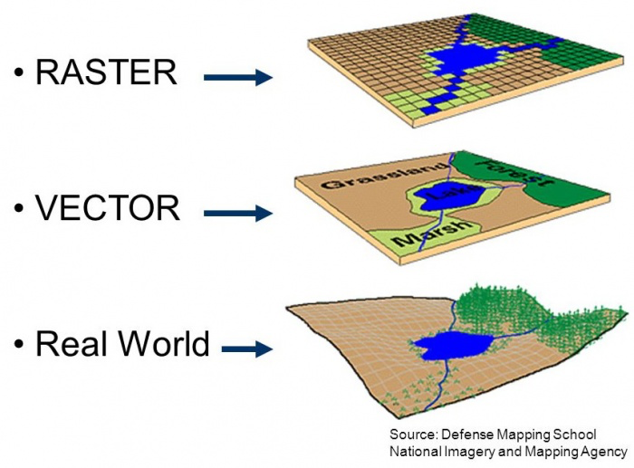
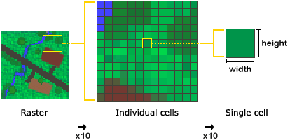
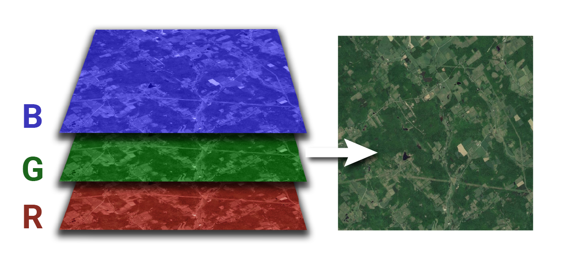

# Raster

## Learning Objectives

In this lesson, you will learn:

- How to use the `raster` package to import geospatial data
- how to combine raster and vector to conduct geospatial analysis in `R`

## Introduction

We just have seen how to conduct spatial analysis in R using **vector** data. There is a second categories of geospatial data: **raster** data.




In a nutshell, raster data is a matrix of cells (or pixels) organized into rows and columns. Each cell / pixels stores a value. Satellite imagery, aerial imagery and radar from Earth Observation Systems are a great source of environmental data. 



As discussed in the previous section, raster will have a Coordinate Reference System (CRS) defining the mathematical formula used to used to define the position of the raster pixels on earth. Few extra terms you might hear when talking about raster: 

- The **spatial resolution** of a raster refers to the size of a pixel. It is often defined as one number (e.g. 30m) assuming the pixels are squares; However it is not a requirement and pixels can be rectangular (have edges of different length).
- The **extent** of a raster refers to the area on Earth that is covered by the entire raster. It be defined in many ways, but it will often be defined using a specific corner, the pixel size, and the number of pixels along the x and y dimensions.
- The number of *bands* of a raster refers to a set of images over the same area but with value corresponding to different "bands" of the electromagnetic spectrum. For example, a typical RGB image will be made of 3: Red, Green, Blue. Often you want to stack those images to conduct an analysis as the area of observation matched perfectly. Satellite and other sensors can of course capture information far beyond the visible part of the electromagnetic spectrum.





### Raster File Formats

As vector data, raster data comes in various file formats:

#### `TIFF/GeoTIFF`

`TIFF/GeoTIFF` are probably the most common raster formats. GeoTIFFs consist of one file with a specific header that encapsulates the geospatial information. There is a second way to add geospatial information to a TIFF file by adding an extra "world" file `.tfw` with the same name as the TIFF file. This `.tfw` is a simple text file that defines various parameters to define the raster geospatial information.

#### `IMG`

This is a proprietary form from the remote sensing software ERDAS Imagine. It has the advantage to be able to store multiple bands in one file and also to have great compression capacity.

#### `NetCDF`

The Network Common Data Form, or netCDF, is an interface to a library of data access functions for storing and retrieving data in the form of arrays. A Subset of this format, the Hierarchical data format (HDF4 or HDF5), is a format that is often used by satellite imagery data providers. Through its great handling of multidimensional data, it can be used to store both space and time information.


One word on ESRI geospatial database storing raster data: it is unfortunately to sue R to read this data format. **R relies on [open source libraries](https://www.osgeo.org/choose-a-project/development/libraries/) to import and process geospatial data** (GDAL, GEOS, PROJ, ...), and ESRI has not yet opened this data format to those libraries.


## The `raster` Package

The raster package is THE package in R to import and process raster data. It can handle many of the formats mentioned above and more.

To import a raster in R, you will use the `raster` function for a single band raster. For multi-band raster, you can use the `brick()` function instead.

For this example, we are going to read a land cover map of Alaska from the The Multi-Resolution Land Characteristics ([MRLC](https://www.mrlc.gov)) consortium.

The original file was quite large quite large (~8GB), so we have already resampled to a lower spatial resolution of 50m and saved it in a shared directory on the server. 

```{r raster import}
library(dplyr)
library(sf)
library(raster)
library(ggplot2)
library(curl)


# House keeping to setup data from the last chapter
ak_regions <- read_sf("data/shapefiles/ak_regions_simp.shp")

ak_regions_3338 <- ak_regions %>%
  st_transform(crs = 3338)

pop <- read.csv("data/shapefiles/alaska_population.csv")

pop_4326 <- st_as_sf(pop, 
                  coords = c('lng', 'lat'),
                  crs = 4326,
                  remove = F)

pop_3338 <- st_transform(pop_4326, crs = 3338)

pop_joined <- st_join(pop_3338, ak_regions_3338, join = st_within)
```

Let us now read this raster into R:

```{r , eval=FALSE}
lc_3338 <- raster("/home/shares/scientist/ds-workshop/ak_nlcd_2011_landcover_50m_3338.tif")
```


```{r, echo=FALSE}
# lc_3338 <- raster("/home/shares/scientist/ds-workshop/ak_nlcd_2011_landcover_50m_3338.tif")

tmp <- tempfile()
curl_download("https://dev.nceas.ucsb.edu/knb/d1/mn/v2/object/urn%3Auuid%3A7326c060-0576-4865-879e-93731a189845",
              tmp)
lc_3338 <- raster(tmp)
```

Look at the raster:
```{r}
lc_3338
```

It is always good to check if everything aligns well:

```{r message=FALSE, warning=FALSE}
plot(lc_3338)
plot(pop_3338, add=TRUE)
```
### Extracting information from raster

OK, everything looks good. Now we want to find the most frequent land cover within a radius of 500m. To do so we can use the `extract` function. This function can handle, the buffering and even have a modal function that will let us find the mode.

```{r}
# Compute the most frequent land cover type around the population
raster_points <- extract(lc_3338, pop_3338, buffer=500, fun=modal)

# Add those values to our data
pop_joined$land_cover <- raster_points
```
Note that I am using `500` for the buffer radius because we know the unit is meter from the projection definition: `crs        : +proj=aea +lat_0=50 +lon_0=-154 +lat_1=55 +lat_2=65 +x_0=0 +y_0=0 +ellps=GRS80 +towgs84=0,0,0,0,0,0,0 **+units=m**`.


At this point, we only have the values for this raster and do not know yet what are the corresponding land covers. Luckily we can look at the metadata here: https://www.mrlc.gov/data/legends/national-land-cover-database-2011-nlcd2011-legend

This not a super friendly format. We have already processed this information (see the end of this chapter to learn how) and stored it in a csv:

```{r}
# Read the land cover legend
Legend_lc <- read_csv("data/legend_ak_nlcd_2011.csv")
Legend_lc
```

Now we can join this information to our main data frame and since the categories are pretty detailed, we will also aggregate them to a coarser level of information:

```{r}
# First let's drop the column we do not need
lc_cat <- Legend_lc %>%
  dplyr::select(ID,Land.Cover.Type)

# It is a lot of categories, let us consolidate this
lc_cat <- lc_cat %>%
  mutate(main_lc = ifelse(ID %in% 40:49, "Forest",
                              ifelse(ID %in% 20:29, "Urban",
                                     ifelse(ID %in% 50:59, "Shrub",
                                             ifelse(ID %in% 70:79, "Grass",
                                                     ifelse(ID %in% 80:89, "Crops",
                                                             ifelse(ID %in% 90:99, "Wetland", Land.Cover.Type)
                                                             )
                                                     )
                                             )
                                     )
                              )
  )


# Join the LC categories to the population data
pop_3338_cover <- left_join(pop_joined, lc_cat, by=c("land_cover"="ID")) 
```

### Plotting

```{r}
# Transforming the RGB color code into hex code
Legend_lc <- Legend_lc %>% 
  mutate(color_hex = rgb(Red, Green, Blue, max=255))

# Matching the consolidated categories with colors
Legend_lc_main <- left_join(Legend_lc, lc_cat, by=c("ID", "Land.Cover.Type"))

# Keeping the last color of the groups
pal <- Legend_lc_main %>% 
  group_by(main_lc) %>% 
  slice(n()) %>% # Keeping the last color of the groups
  ungroup %>% 
  arrange(ID) %>%
  dplyr::select(color_hex)


# Adding the color codes to the dataset
pal_color <- data.frame("main_lc"=unique(lc_cat$main_lc), 
                           "color_hex"=pal, 
                        stringsAsFactors = FALSE)

pop_3338_cover_hex <- left_join(pop_3338_cover, pal_color, by="main_lc")

# Getting the colors in the right order
final_pal <- pop_3338_cover_hex %>% arrange(main_lc) %>% pull(color_hex) %>% unique()


# Plot by region
ggplot(pop_3338_cover, aes(region, population, fill = main_lc)) +
    geom_col() +
    scale_fill_manual(values = final_pal) +
    theme_bw() +
    theme(axis.text.x = element_text(angle = 90, hjust = 1)) +
    ggtitle("Land cover type by region and population")
```

```{r}
ggplot() +
    geom_sf(data = ak_regions_3338, aes(), color = "black") +
    geom_sf(data = pop_3338_cover, aes(color = main_lc,
                                       size = population)) +
    scale_size_continuous(guide = F) +
    scale_color_manual(values = final_pal) +
    theme_bw() +
    theme(legend.position = "bottom")
```

### Calculation with raster

A Very useful function of the `raster` package is the function `calc`. As the name suggest this function helps you to do computation on raster. Continuing our example above, we want to compute a percentage of area that is forest.

The first step will be to create a binary mask for forest. The way `calc` works is that you need to create a function to be applied to the raster using `calc`

```{r}
# Function to create a binary mask for forest 
forest_masker <- function(x){
  x[x<40 | x>49] <- 0
  x[x>=40 & x<=49] <- 1
  x
}

```

Now we can use the `calc` function to apply this function to every pixels:
```{r}
forested <- calc(lc_3338, forest_masker)
forested
```

As previously,  we can now use the `extract` function to count the number of forested pixels:
```{r}
forested_count <- extract(forested, pop_3338, buffer=500, fun=sum)
```

Adding the values back to the main data set:
```{r}
pop_3338_cover$forest_cov <- 100 * forested_count / (20*20)
pop_3338_cover
```

Plotting the percentage of forested area in the 1km2 surround of the population centers:
```{r}
ggplot() +
    geom_sf(data = ak_regions_3338, aes(), color = "black") +
    geom_sf(data = pop_3338_cover, aes(color = forest_cov,
                                       size = population)) +
    scale_size_continuous(guide = F) +
    scale_colour_gradient(low="red", high = "green") +
    theme_bw() +
    theme(legend.position = "bottom")
```


## Other Thoughts

### Raster processing can be slow

Processing raster in R is not fast and raster processing can become quickly a processing involving large data.  This is especially true when reprojecting large raster. It is therefore also good to learn how to use other tools to do such tasks. `gdal` at the command line is a great one. 

It is also very important to process raster the correct way. Before starting the processing of large raster, we strongly recommend you read this information: https://rspatial.org/raster/appendix1.html

### Preprocessing we did

Actually because the original Land Cover raster was using a `img` format, it was possible to store more information then the pixel values. This format can handle categorical data and attach extra information, we can get the colors as specified by the data creator as well as the categories corresponding to a specific values. The the raster object in R use a S4 format that allows it to store specific information into slots. You can access these slots using the `@`. Here how we created the legend csv file you used: 

```{r eval=FALSE}

# Read teh original raster
lc <- raster("/home/shares/scientist/ds-workshop/ak_nlcd_2011_landcover_1_15_15.img")

# Look at the table attached
lc@data@attributes

# Remove the value without any pixel
legend_lc <- lc@data@attributes[[1]] %>%
  filter(COUNT!=0) %>% 
  dplyr::select(-Opacity)

# Write the csv
write_csv(legend_lc, "/home/shares/scientist/ds-workshop/legend_ak_nlcd_2011.csv")
```

This is how we reprojected to original data and resampled it to a 50m resolution instead of the 30m. Note that the use the Nearest Neighbor method `ngb` to compute the new raster as this algorithm keeps the original values

```{r eval=FALSE}
lc_3338 <- projectRaster(lc, crs=crs(ak_regions_3338), res=50, method = 'ngb', filename="/home/shares/scientist/ds-workshop/ak_nlcd_2011_landcover_50m_3338.tif")
```


## References


[Modern Geospatial Data Analysis in R](http://files.zevross.com/workshops/spatial/slides/html/0-deck-list.html)
[Geocomputation with R](https://geocompr.robinlovelace.net/)
[Raster analysis in R](http://jafflerbach.github.io/spatial-analysis-R/intro_spatial_data_R.html) 
[Spatial data science](https://rspatial.org/raster/spatial/index.html)
