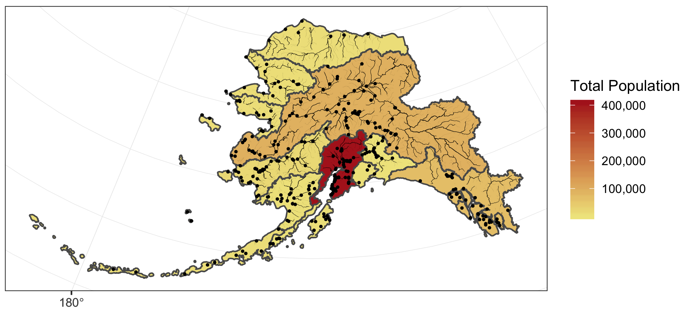

# Spatial vector analysis using `sf`

## Learning Objectives

In this lesson, you will learn:

- How to use the `sf` package to analyze geospatial data
- Static mapping with ggplot
- interactive mapping with `leaflet`

## Introduction

From the [**sf**](https://r-spatial.github.io/sf/articles/sf1.html) vignette:

> Simple features or simple feature access refers to a formal standard (ISO 19125-1:2004) that describes how objects in the real world can be represented in computers, with emphasis on the spatial geometry of these objects. It also describes how such objects can be stored in and retrieved from databases, and which geometrical operations should be defined for them.


The **sf** package is an R implementation of [Simple Features](https://en.wikipedia.org/wiki/Simple_Features). This package incorporates:  

- a new spatial data class system in R  
- functions for reading and writing data  
- tools for spatial operations on vectors  

Most of the functions in this package starts with prefix `st_` which stands for *spatial* and *temporal*.

In this tutorial, our goal is to use a shapefile of Alaska regions and data on population in Alaska by community to create a map that looks like this:



The data we will be using to create the map are:

* Alaska regional boundaries
* Community locations and population
* Alaksa rivers


## Reading a shapefile  

All of the data used in this tutorial are simplified versions of real datasets available on the KNB. I've simplified the original high-resolution geospatial datasets to ease the processing burden on your computers while learning how to do the analysis. These simplified versions of the datasets may contain topological errors. The original version of the datasets are indicated throughout the chapter.

For convience, I've hosted a zipped copy of all of the files on our test site. Please go to [this dataset](https://dev.nceas.ucsb.edu/view/urn:uuid:6f07cb25-a4a1-48e8-95cb-74f532f3ce2d) and download the zip folder. Put it in a sub-directory of your git repository and unzip it. You also will likely want to add that directory to your .gitignore file.

The first file we will use is a shapefile of regional boundaries in alaska derived from: Jared Kibele and Jeanette Clark. 2018. State of Alaska's Salmon and People Regional Boundaries. Knowledge Network for Biocomplexity. [doi:10.5063/F1125QWP](https://doi.org/10.5063/F1125QWP).

First load the libraries

```{r, warning = F, message = F}
library(sf)
library(dplyr)
library(ggplot2)
library(leaflet)
library(scales)
library(ggmap)
```

Read in the data and look at a plot of it.

```{r read_shp_sf}
## Read in shapefile using sf
ak_regions <- read_sf("data/shapefiles/ak_regions_simp.shp")

plot(ak_regions)  
```

We can also examine it's class.

```{r}
class(ak_regions)
```

**sf** objects usually have two types - `sf` and `data.frame`. Two main differences comparing to a regular `data.frame` object are spatial metadata (`geometry type`, `dimension`, `bbox`, `epsg (SRID)`, `proj4string`) and additional column - typically named `geometry`.

Since our shapefile object has the `data.frame` class, viewing the contents of the object using the `head` function shows similar results to data we read in using `read.csv`.

```{r}
head(ak_regions)
```

### Coordinate Reference System

Every `sf` object needs a coordinate reference system (or `crs`) defined in order to work with it correctly. A coordinate reference system contains both a datum and a projection. The datum is how you georeference your points (in 3 dimensions!) onto a spheroid. The projection is how these points are mathematically transformed to represent the georeferenced point on a flat piece of paper. All coordinate reference systems require a datum. However, some coordinate reference systems are "unprojected" (also called geographic coordinate systems). Coordinates in latitude/longitude use a geographic (unprojected) coordinate system. One of the most commonly used geographic coordinate systems is WGS 1984.

You can view what `crs` is set by using the function `st_crs`

```{r}
st_crs(ak_regions)
```

This is pretty confusing looking. Without getting into the details, that long string says that this data has a greographic coordinate system (WGS84) with no projection. A convenient way to reference `crs` quickly is by using the EPSG code, a number that represents a standard projection and datum. You can check out a list of (lots!) of EPSG codes [here](http://spatialreference.org/ref/epsg/?page=1). 

We will use several EPSG codes in this lesson. Here they are, along with their more readable names:

* 3338: Alaska Albers
* 4326: WGS84 (World Geodetic System 1984), used in GPS
* 3857: Pseudo-Mercator, used in Google Maps, OpenStreetMap, Bing, ArcGIS, ESRI

You will often need to transform your geospatial data from one coordinate system to another. The `st_transform` function does this quickly for us. You may have noticed the maps above looked wonky because of the dateline. We might want to set a different projection for this data so it plots nicer. A good one for Alaska is called the Alaska Albers projection, with an EPSG code of [3338](http://spatialreference.org/ref/epsg/3338/).


```{r}
ak_regions_3338 <- ak_regions %>%
  st_transform(crs = 3338)

st_crs(ak_regions_3338)
```

```{r}
plot(ak_regions_3338)
```

Much better!

### Attributes

**sf** objects can be used as a regular `data.frame` object in many operations. We already saw the results of `plot` and `head`. Here are a couple more:

```{r}
nrow(ak_regions_3338)
```

```{r}
ncol(ak_regions_3338)
```

```{r}
summary(ak_regions_3338)
```

## `sf` & the Tidyverse

Since `sf` objects are dataframes, they play nicely with packages in the tidyverse. Here are a couple of simple examples:

`select()`

```{r select}
ak_regions_3338 %>%
  select(region)
```

Note the sticky geometry column! The geometry column will stay with your `sf` object even if it is not called explicitly.

`filter()`

```{r filter}
ak_regions_3338 %>%
  filter(region == "Southeast")
```


### Joins

You can also use the `sf` package to create spatial joins, useful for when you want to utilize two datasets together. As an example, let's ask a question: **how many people live in each of these Alaska regions?**

We have some population data, but it gives the number of people by city, not by region. To determine the number of people per region we will need to:

+ read in the city data from a csv and turn it into an `sf` object
+ use a spatial join (`st_join`) to assign each city to a region
+ use `group_by` and `summarize` to calculate the total population by region


First, read in the population data as a regular `data.frame`. This data is derived from: Jeanette Clark, Sharis Ochs, Derek Strong, and National Historic Geographic Information System. 2018. Languages used in Alaskan households, 1990-2015. Knowledge Network for Biocomplexity. [doi:10.5063/F11G0JHX](https://doi.org/10.5063/F11G0JHX). Unnecessary columns were removed and the most recent year of data was selected.

```{r}
pop <- read.csv("data/shapefiles/alaska_population.csv")
```

The `st_join` function is a spatial left join. The arguments for both the left and right tables are objects of class `sf` which means we will first need to turn our population `data.frame` with latitude and longitude coordinates into an `sf` object. 

We can do this easily using the `st_as_sf` function, which takes as arguments the coordinates and the `crs`. The `remove = F` specification here ensures that when we create our `geometry` column, we retain our original `lat` `lng` columns, which we will need later for plotting. Although it isn't said anywhere explicitly in the file, let's assume that the coordinate system used to reference the latitude longitude coordinates is WGS84, which has a `crs` number of 4236.

```{r}
pop_4326 <- st_as_sf(pop, 
                  coords = c('lng', 'lat'),
                  crs = 4326,
                  remove = F)

head(pop_4326)
```

Now we can do our spatial join! You can specify what geometry function the join uses (`st_intersects`, `st_within`, `st_crosses`, `st_is_within_distance`, ...) in the `join` argument. The geometry function you use will depend on what kind of operation you want to do, and the geometries of your shapefiles.

In this case, we want to find what region each city falls within, so we will use `st_within`.

```{r, eval = F}
pop_joined <- st_join(pop_4326, ak_regions_3338, join = st_within)
```

This gives an error! 

```
Error: st_crs(x) == st_crs(y) is not TRUE
```

Turns out, this won't work right now because our coordinate reference systems are not the same. Luckily, this is easily resolved using `st_transform`, and projecting our population object into Alaska Albers.

```{r}
pop_3338 <- st_transform(pop_4326, crs = 3338)
```

```{r}
pop_joined <- st_join(pop_3338, ak_regions_3338, join = st_within)

head(pop_joined)
```

### Group and summarize

Next we compute the total population for each region. In this case, we want to do a `group_by` and `summarise` as this were a regular `data.frame` - otherwise all of our point geometries would be included in the aggreation, which is not what we want. Our goal is just to get the total population by region. We remove the sticky geometry using `as.data.frame`, on the advice of the `sf::tidyverse` help page.

```{r}
pop_region <- pop_joined %>% 
  as.data.frame() %>% 
  group_by(region) %>% 
  summarise(total_pop = sum(population))

head(pop_region)
```

And use a regular `left_join` to get the information back to the Alaska region shapefile. Note that we need this step in order to regain our region geometries so that we can make some maps.

```{r}
pop_region_3338 <- left_join(ak_regions_3338, pop_region)

#plot to check
plot(pop_region_3338["total_pop"])
```


So far, we have learned how to use `sf` and `dplyr` to use a spatial join on two datasets and calculate a summary metric from the result of that join. 

The `group_by` and `summarize` functions can also be used on `sf` objects to summarize within a dataset and combine geometries. Many of the `tidyverse` functions have methods specific for `sf` objects, some of which have additional arguments that wouldn't be relevant to the `data.frame` methods. You can run `?sf::tidyverse` to get documentation on the `tidyverse` `sf` methods.

Let's try some out. Say we want to calculate the population by Alaska management area, as opposed to region.

```{r}
pop_mgmt_338 <- pop_region_3338 %>% 
  group_by(mgmt_area) %>% 
  summarize(total_pop = sum(total_pop))

plot(pop_mgmt_338["total_pop"])
```

Notice that the region geometries were combined into a single polygon for each management area.

If we don't want to combine geometries, we can specifcy `do_union = F` as an argument.

```{r}
pop_mgmt_3338 <- pop_region_3338 %>% 
  group_by(mgmt_area) %>% 
  summarize(total_pop = sum(total_pop), do_union = F)

plot(pop_mgmt_3338["total_pop"])
```

### Save

Save the spatial object to disk using `write_sf()` and specifying the filename. Writing your file with the extension .shp will assume an ESRI driver [driver](http://www.gdal.org/ogr_formats.html), but there are many other format options available.

```{r plot, eval = F}
write_sf(pop_region_3338, "shapefiles/ak_regions_population.shp", delete_layer = TRUE)
```

## Visualize with ggplot

`ggplot2` now has integrated functionality to plot sf objects using `geom_sf()`.

We can plot `sf` objects just like regular data.frames using `geom_sf`.

```{r}
ggplot(pop_region_3338) +
  geom_sf(aes(fill = total_pop)) +
  theme_bw() +
  labs(fill = "Total Population") +
  scale_fill_continuous(low = "khaki", high =  "firebrick", labels = comma)
```

We can also plot multiple shapefiles in the same plot. Say if we want to visualize rivers in Alaska, in addition to the location of communities, since many communities in Alaska are on rivers. We can read in a rivers shapefile, doublecheck the `crs` to make sure it is what we need, and then plot all three shapefiles - the regional population (polygons), the locations of cities (points), and the rivers (linestrings).


The rivers shapefile is a simplified version of Jared Kibele and Jeanette Clark. Rivers of Alaska grouped by SASAP region, 2018. Knowledge Network for Biocomplexity. doi:10.5063/F1SJ1HVW.

```{r}
rivers_3338 <- read_sf("data/shapefiles/ak_rivers_simp.shp")
st_crs(rivers_3338)
```

Note that although no EPSG code is set explicitly, with some sluething we can determine that this is `EPSG:3338`. [This site](https://epsg.io) is helpful for looking up EPSG codes.

```{r}
ggplot() +
  geom_sf(data = pop_region_3338, aes(fill = total_pop)) +
  geom_sf(data = rivers_3338, aes(size = StrOrder), color = "black") +
  geom_sf(data = pop_3338, aes(), size = .5) +
  scale_size(range = c(0.01, 0.2), guide = F) +
  theme_bw() +
  labs(fill = "Total Population") +
  scale_fill_continuous(low = "khaki", high =  "firebrick", labels = comma)
```

## Incorporate base maps into static maps using `ggmap`

The `ggmap` package has some functions that can render base maps (as raster objects) from open tile servers like Google Maps, Stamen, OpenStreetMap, and others.

We'll need to transform our shapefile with population data by community to `EPSG:3857` which is the CRS used for rendering maps in Google Maps, Stamen, and OpenStreetMap, among others.

```{r}
pop_3857 <- pop_3338 %>%
  st_transform(crs = 3857)
```

Next, let's grab a base map from the Stamen map tile server covering the region of interest.
First we include a function that transforms the bounding box (which starts in `EPSG:4326`) to also be in the `EPSG:3857` CRS, which is the projection that the map raster is returned in from Stamen. This is an issue with `ggmap` described in more detail [here](https://github.com/dkahle/ggmap/issues/160#issuecomment-397055208)


```{r message=FALSE}
# Define a function to fix the bbox to be in EPSG:3857
# See https://github.com/dkahle/ggmap/issues/160#issuecomment-397055208
ggmap_bbox_to_3857 <- function(map) {
  if (!inherits(map, "ggmap")) stop("map must be a ggmap object")
  # Extract the bounding box (in lat/lon) from the ggmap to a numeric vector, 
  # and set the names to what sf::st_bbox expects:
  map_bbox <- setNames(unlist(attr(map, "bb")), 
                       c("ymin", "xmin", "ymax", "xmax"))
  
  # Coonvert the bbox to an sf polygon, transform it to 3857, 
  # and convert back to a bbox (convoluted, but it works)
  bbox_3857 <- st_bbox(st_transform(st_as_sfc(st_bbox(map_bbox, crs = 4326)), 3857))
  
  # Overwrite the bbox of the ggmap object with the transformed coordinates 
  attr(map, "bb")$ll.lat <- bbox_3857["ymin"]
  attr(map, "bb")$ll.lon <- bbox_3857["xmin"]
  attr(map, "bb")$ur.lat <- bbox_3857["ymax"]
  attr(map, "bb")$ur.lon <- bbox_3857["xmax"]
  map
}
```

Next, we define the bounding box of interest, and use `get_stamenmap()` to get the basemap. Then we run our function defined above on the result of the `get_stamenmap()` call.

```{r, message = F, warning = F}
bbox <- c(-170, 52, -130, 64)   # This is roughly southern Alaska
ak_map <- get_stamenmap(bbox, zoom = 4)
ak_map_3857 <- ggmap_bbox_to_3857(ak_map)
```

Finally, plot both the base raster map with the population data overlayed, which is easy now that everything is in the same projection (3857):

```{r message=FALSE}
ggmap(ak_map_3857) + 
  geom_sf(data = pop_3857, aes(color = population), inherit.aes = F) +
  scale_color_continuous(low = "khaki", high =  "firebrick", labels = comma)
```


## Visualize `sf` objects with leaflet

We can also make an interactive map from our data above using `leaflet`. 

Leaflet (unlike ggplot) will project data for you. The catch is that you have to give it both a projection (like Alaska Albers), and that your shapefile must use a geographic coordinate system. This means that we need to use our shapefile with the 4326 EPSG code. Remember you can always check what `crs` you have set using `st_crs`.

Here we define a leaflet projection for Alaska Albers, and save it as a variable to use later.

```{r}
epsg3338 <- leaflet::leafletCRS(
  crsClass = "L.Proj.CRS",
  code = "EPSG:3338",
  proj4def =  "+proj=aea +lat_1=55 +lat_2=65 +lat_0=50 +lon_0=-154 +x_0=0 +y_0=0 +ellps=GRS80 +towgs84=0,0,0,0,0,0,0 +units=m +no_defs",
  resolutions = 2^(16:7))
```

You might notice that this looks familiar! The syntax is a bit different, but most of this information is also contained within the `crs` of our shapefile:

```{r}
st_crs(pop_region_3338)
```

Since `leaflet` requires that we use an unprojected coordinate system, let's use `st_transform` yet again to get back to WGS84.

```{r}
pop_region_4326 <- pop_region_3338 %>% st_transform(crs = 4326)
```


```{r}
m <- leaflet(options = leafletOptions(crs = epsg3338)) %>%
        addPolygons(data = pop_region_4326, 
                    fillColor = "gray",
                    weight = 1)

m
```

We can add labels, legends, and a color scale.

```{r}
pal <- colorNumeric(palette = "Reds", domain = pop_region_4326$total_pop)

m <- leaflet(options = leafletOptions(crs = epsg3338)) %>%
        addPolygons(data = pop_region_4326, 
                    fillColor = ~pal(total_pop),
                    weight = 1,
                    color = "black",
                    fillOpacity = 1,
                    label = ~region) %>% 
        addLegend(position = "bottomleft",
                  pal = pal,
                  values = range(pop_region_4326$total_pop),
                  title = "Total Population")

m

```


We can also add the individual communities, with popup labels showing their population, on top of that!

```{r}

pal <- colorNumeric(palette = "Reds", domain = pop_region_4326$total_pop)

m <- leaflet(options = leafletOptions(crs = epsg3338)) %>%
        addPolygons(data = pop_region_4326, 
                    fillColor = ~pal(total_pop),
                    weight = 1,
                    color = "black",
                    fillOpacity = 1) %>% 
        addCircleMarkers(data = pop_4326,
                         lat = ~lat,
                         lng = ~lng,
                         radius = ~log(population/500), # arbitrary scaling
                         fillColor = "gray",
                         fillOpacity = 1,
                         weight = 0.25,
                         color = "black",
                         label = ~paste0(pop_4326$city, ", population ", comma(pop_4326$population))) %>%
        addLegend(position = "bottomleft",
                  pal = pal,
                  values = range(pop_region_4326$total_pop),
                  title = "Total Population")

m

```

There is a lot more functionality to `sf` including the ability to `intersect` polygons, calculate `distance`, create a `buffer`, and more. Here are some more great resources and tutorials for a deeper dive into this great package:


[Raster analysis in R](http://jafflerbach.github.io/spatial-analysis-R/intro_spatial_data_R.html)  
[Spatial analysis in R with the sf package](https://cdn.rawgit.com/rhodyrstats/geospatial_with_sf/bc2b17cf/geospatial_with_sf.html)  
[Intro to Spatial Analysis](https://cdn.rawgit.com/Nowosad/Intro_to_spatial_analysis/05676e29/Intro_to_spatial_analysis.html#1)  
[sf github repo](https://github.com/r-spatial/sf)    
[Tidy spatial data in R: using dplyr, tidyr, and ggplot2 with sf](http://strimas.com/r/tidy-sf/)    
[mapping-fall-foliage-with-sf](https://rud.is/b/2017/09/18/mapping-fall-foliage-with-sf/)    


