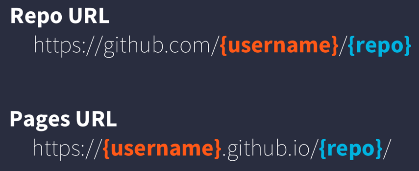
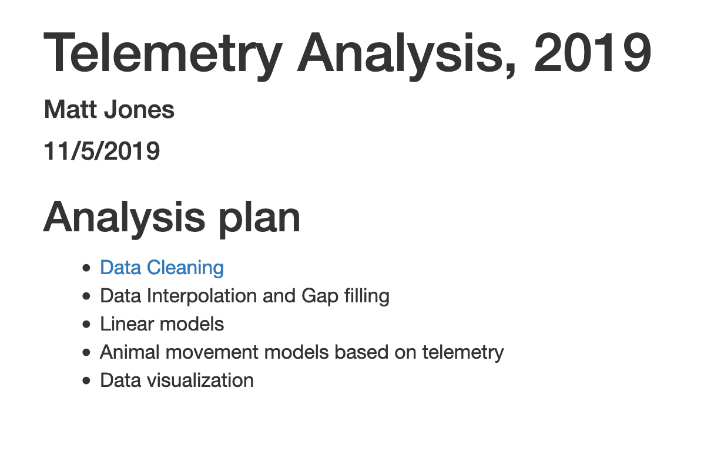

# Publishing Analyses to the Web

## Learning Objectives

In this lesson, you will learn:

- How to use git, GitHub (+Pages), and (R)Markdown to publish an analysis to the web

## Introduction

Sharing your work with others in engaging ways is an important part of the scientific process.
So far in this course, we've introduced a small set of powerful tools for doing open science:

- R and its many packages
- RStudio
- git
- GiHub
- RMarkdown

RMarkdown, in particular, is amazingly powerful for creating scientific reports but, so far, we haven't tapped its full potential for sharing our work with others.

In this lesson, we're going to take an existing GitHub repository and turn it into a beautiful and easy to read web page using the tools listed above.

## A Minimal Example

- Use your existing `nceas-training` repository if you have one
    - If not, Create a new repository on GitHub
    - Initialize the repository on GitHub without any files in it
    - In RStudio,
        - Create a new Project
        - When creating, select the option to create from Version Control -> Git
        - Enter your repository's clone URL in the Repository URL field and fill in the rest of the details
- Add a new file at the top level called `index.Rmd`. The easiest way to do this is through the RStudio menu. Choose File -> New File -> RMarkdown...  This will bring up a dialog box. You should create a "Document" in "HTML" format. These are the default options.  Be sure to use the exact capitalization (lower case 'index') as different operating systems handle capitalization differently and it can interfere with loading your web page later.
- Open `index.Rmd` (if it isn't already open)
- Press Knit
    - Observe the rendered output
    - Notice the new file in the same directory `index.html`.
    - This is our RMarkdown file rendered as HTML (a web page)
- Commit your changes (to both index.Rmd and index.html) and push to GitHub
- Open your web browser to the GitHub.com page for your repository
- Go to Settings > GitHub Pages and turn on GitHub Pages for the `master` branch

Now, the rendered website version of your repo will show up at a special URL.
    
GitHub Pages follows a convention like this:
    

     
Note that it will no longer be at github.com but github.io
     
- Go to https://{username}.github.io/{repo_name}/ (Note the trailing `/`)
    Observe the awesome rendered output
    
Now that we've successfully published a web page from an RMarkdown document, let's make a change to our RMarkdown document and follow the steps to actually publish the change on the web:

- Go back to our `index.Rmd`
- Delete all the content, except the YAML frontmatter
- Type "Hello world"
- Commit, push
- Go back to https://{username}.github.io/{repo_name}/

## Exercise: Sharing your work

RMarkdown web pages are a great way to share work in progress with your colleagues.  To do so simply requires thinking through your presentation so that it highlights the workflow to be reviewed.  You can also include multiple pages and build a simple web site for walking through your work that is accessible to people who aren't all set up to open your content in R.  In this exercise, we'll publish another RMarkdown page, and create a table of contents on the main page to guide people to the main page.

First, in your trainnig repository, create a new RMarkdown file that describes some piece of your work and note the name.  I'll use an RMarkdown named `data-cleaning.Rmd`.

Once you have an RMarkdown created, `Knit` the document which will create the HTML version of the file, which in this case will be named `data-cleaning.html`.  

Now, return to editing your `index.Rmd` file from the beginning of this lesson.  The index file represents the 'default' file for a web site, and is returned whenever you visit the web site but don't specify an explicit file to be returned.  Let's modify the index page, adding a bulleted list, and in that list, include a link to the new markdown page that we created:

```{markdown mdexample, eval=FALSE}
## Analysis plan

- [Data Cleaning](data-cleaning.html)
- Data Interpolation and Gap filling
- Linear models
- Animal movement models based on telemetry
- Data visualization
```

Commit and push the web page to GitHub.  Now when you visit your web site, you'll see the table of contents, and can navigate to the new data cleaning page.

```{r weboutput, echo=FALSE, out.width = '50%', fig.align = 'left'}

```


