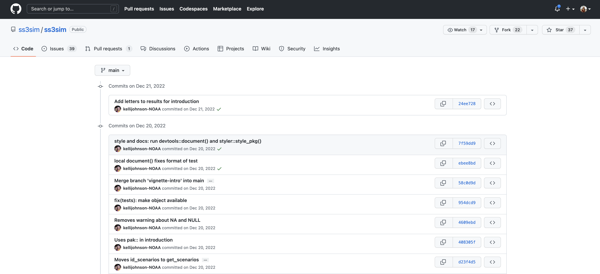
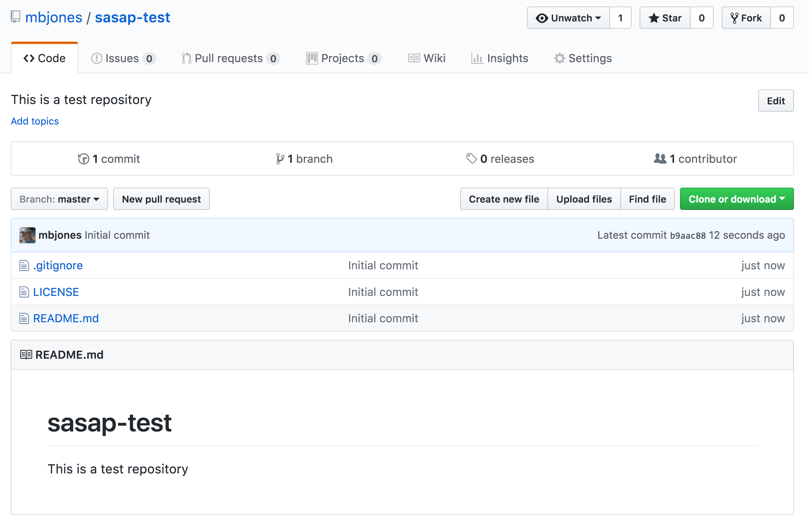
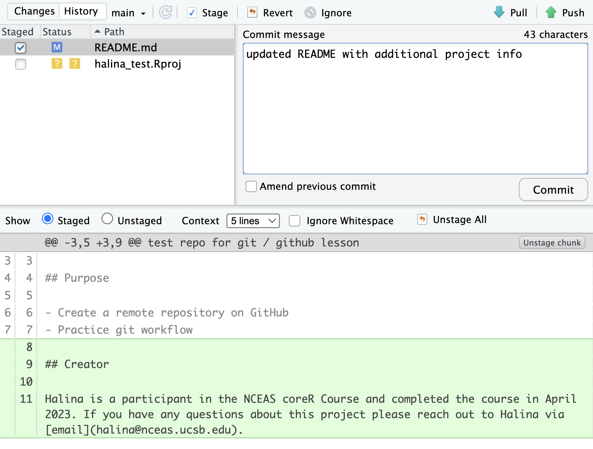
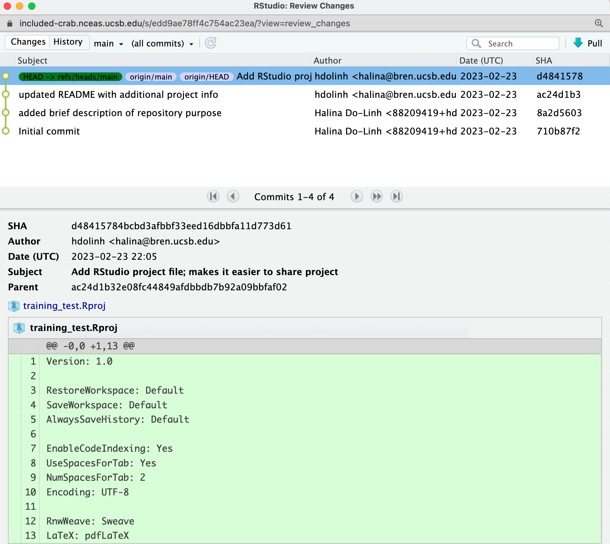
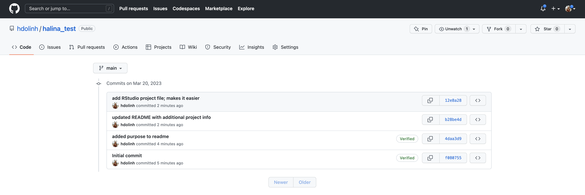

# Version Control With git and GitHub

## Learning Objectives

In this lesson, you will learn:

- Why __git__ is useful for reproducible analysis
- How to use __git__ to track changes to your work over time
- How to use __GitHub__ to collaborate with others
- How to structure your commits so your changes are clear to others
- How to write effective commit messages

## The problem with filenames

Every file in the scientific process changes.  Manuscripts are edited.
Figures get revised.  Code gets fixed when problems are discovered.  Data files
get combined together, then errors are fixed, and then they are split and 
combined again. In the course of a single analysis, one can expect thousands of
changes to files.  And yet, all we use to track this are simplistic *filenames*.  
You might think there is a better way, and you'd be right: __version control__.

Version control systems help you track all of the changes to your files, without
the spaghetti mess that ensues from simple file renaming.  In version control systems
like `git`, the system tracks not just the name of the file, but also its contents,
so that when contents change, it can tell you which pieces went where.  It tracks
which version of a file a new version came from.  So its easy to draw a graph
showing all of the versions of a file, like this one:

Version control systems assign an identifier to every version of every file, and 
track their relationships. They also allow branches in those versions, and merging
those branches back into the main line of work.  They also support having 
*multiple copies* on multiple computers for backup, and for collaboration.
And finally, they let you tag particular versions, such that it is easy to return 
to a set of files exactly as they were when you tagged them.  For example, the 
exact versions of data, code, and narrative that were used when a manuscript was originally 
submitted might be `eco-ms-1` in the graph above, and then when it was revised and resubmitted,
it was done with tag `eco-ms-2`.  A different paper was started and submitted with tag `dens-ms-1`, showing that you can be working on multiple manuscripts with closely related but not identical sets of code and data being used for each, and keep track of it all.

## Version control and Collaboration using Git and GitHub

First, just what are `git` and GitHub?

- __git__: version control software used to track files in a folder (a repository)
    - git creates the versioned history of a repository
- __GitHub__: web site that allows users to store their git repositories and share them with others

## Let's look at a GitHub repository

This screen shows the copy of a repository stored on GitHub,
with its list of files, when the files and directories were last modified, 
and some information on who made the most recent changes.  

If we drill into the 
"commits" for the repository, we can see the history of changes made to all of 
the files.  Looks like `kellijohnson` and `seananderson` were fixing things in
June and July:

And finally, if we drill into the changes made on June 13, we can see exactly what
was changed in each file:

Tracking these changes, how they relate to released versions of software and files
is exactly what Git and GitHub are good for.  And we will show how they can really 
be effective for tracking versions of scientific code, figures, and manuscripts
to accomplish a reproducible workflow.

## The Git lifecycle

As a git user, you'll need to understand the basic concepts associated with versioned
sets of changes, and how they are stored and moved across repositories.  Any given
git repository can be cloned so that it exist both locally, and remotely.  But each of
these cloned repositories is simply a copy of all of the files and change history
for those files, stored in git's particular format.  For our purposes, we can consider
a git repository just a folder with a bunch of additional version-related metadata.

In a local git-enabled folder, the folder contains a workspace containing the 
current version of all files in the repository. These working files are linked to
a hidden folder containing the 'Local repository', which contains all of the other
changes made to the files, along with the version metadata.

So, when working with files using git, you can use git commands to indicate specifically
which changes to the local working files should be staged for versioning 
(using the `git add` command), and when to record those changes as a version in
the local repository (using the command `git commit`).

The remaining concepts are involved in synchronizing the changes in your local 
repository with changes in a remote repository.  The `git push` command is used to
send local changes up to a remote repository (possibly on GitHub), and the `git pull`
command is used to fetch changes from a remote repository and merge them into the
local repository.

- `git clone`: to copy a whole remote repository to local
- `git add` (stage): notify git to track particular changes
- `git commit`: store those changes as a version
- `git pull`: merge changes from a remote repository to our local repository
- `git push`: copy changes from our local repository to a remote repository
- `git status`: determine the state of all files in the local repository
- `git log`: print the history of changes in a repository

Those seven commands are the majority of what you need to successfully use git.  
But this is all super abstract, so let's explore with some real examples.

## Create a remote repository on GitHub

Let's start by creating a repository on GitHub, then we'll edit some files.

- Log into [GitHub](https://github.com)
- Click the New repository button
- Name it `training-test`
- Create a README.md
- Set the LICENSE to Apache 2.0
- Add a .gitignore file for `R`

You've now created your first repository! It has a couple of files that GitHub created
for you, like the README.md file, and the LICENSE file, and the .gitignore file.

For simple changes to text files, you can make edits right in the GitHub web interface.  For example,
navigate to the `README.md` file in the file listing, and edit it by clicking on the *pencil* icon.
This is a regular Markdown file, so you can just add text, and when done, add a commit message, and 
hit the `Commit changes` button.  

Congratulations, you've now authored your first versioned commit.  If you navigate back to 
the GitHub page for the repository, you'll see your commit listed there, as well as the
rendered README.md file.

Let's point out a few things about this window.  It represents a view of the repository
that you created, showing all of the files in the repository so far.  For each file,
it shows when the file was last modified, and the commit message that was used to last
change each file.  This is why it is important to write good, descriptive commit
messages.  In addition, the blue header above the file listing shows the most recent
commit, along with its commit message, and its SHA identifer.  That SHA identifier is
the key to this set of versioned changes.  If you click on the SHA identifier (*810f314*), 
it will display the set of changes made in that particular commit.

In the next section we'll use the GitHub URL for the GitHub repository you created 
to `clone` the repository onto your local machine so that you can edit the files 
in RStudio.  To do so, start by copying the GitHub URL, which represents the repository
location:

## Working locally with Git via RStudio

RStudio knows how to work with files under version control with Git, but only if
you are working within an RStudio project folder.  In this next section, we will
clone the repository that you created on GitHub into a local repository as an 
RStudio project.  Here's what we're going to do:

- Create the new project
- Inspect the Git tab and version history
- Commit a change to the README.md file
- Commit the changes that RStudio made
- Inspect the version history
- Add and commit an Rmd file
- Push these changes to GitHub
- View the change history on GitHub

__Create a New Project.__ Start by creating a *New Project...* in R Studio, select the *Version Control* 
option, and paste the GitHub URL that you copied into the field for the 
remote repository *Repository URL*.  While you can name the local copy of the 
repository anything, its typical to use the same name as the GitHub repository to
maintain the correspondence.  You can choose any folder for your local copy, in
my case I used my standard `development` folder.

Once you hit `Create Project, a new RStudio windo will open with all of the files
from the remote repository copied locally.  Depending on how your version of RStudio
is configured, the location and size of the panes may differ, but they should all
be present, including a *Git* tab and the normal *Files* tab listing the files that 
had been created in the remote repository.

You'll note that there is one new file `sasap-test.Rproj`, and three files that we
created earlier on GitHub (`.gitignore`, `LICENSE`, and `README.md`).

In the *Git* tab, you'll note that two files are listed.  This is the status pane
that shows the current modification status of all of the files in the repository.
In this case, the `.gitignore` file is listed as *M* for Modified, and `sasap-test.Rproj` 
is listed with a *? ?* to indicate that the file is untracked.  This means that
git has not stored any versions of this file, and knows nothing about the file.
As you make version control decisions in RStudio, these icons will change to reflect
the current version status of each of the files.

__Inspect the history.__ For now, let's click on the *History* button in the Git tab, which will show the
log of changes that occurred, and will be identical to what we viewed on GitHub.
By clicking on each row of the history, you can see exactly what was added and
changed in each of the two commits in this repository.

__Commit a README.md change.__ Next let's make a change to the README.md file
in RStudio. Add a new section, with a markdown block like this:

<pre><code>
## Git from RStudio

From within RStudio, we can perform the same versioning actions that we can
in GitHub, and much more.  Plus, we have the natural advantages of the 
programming IDE with code completion and other features to make our work
easier.

- Add files to version control
- Commit changes
- Push commits to GitHub
</code></pre>

Once you save, you'll immediately see the *README.md* file show up in the Git
tab, marks as a modification.  You can select the file in the Git tab, and click
*Diff* to see the differences that you saved (but which are not yet committed to
your local repository).

And here's what the newly made changes look like compared to the original file.
New lines are highlighted in green, while removed lines are in red.

__Commit the RStudio changes.__

To commit the changes you made to the README.md file, check the *Staged*
checkbox next to the file (which tells Git which changes you want included in
the commit), then provide a descriptive Commit message, and then click *Commit*.

Note that some of the changes in the repository, namely `.gitignore` and 
`sasap-test.Rproj` are still listed as having not been committed.  This means
there are still pending changes to the repository.  You can also see the note
that says:

<code>Your branch is ahead of 'origin/master' by 1 commit.</code>

This means that we have committed 1 change in the local repository, but that 
commit has not yet been pushed up to the `origin` repository, where `origin`
is the typical name for our remote repository on GitHub.  So, let's commit the
remaining project files by staging them and adding a commit message.

When finished, you'll see that no changes remain in the *Git* tab, and the repository
is clean.  

__Inspect the history.__ Note that the message now says:

<code>Your branch is ahead of 'origin/master' by 2 commits.</code>

These 2 commits are the two we just made, and have not yet been pushed to GitHub.
By clicking on the *History* button, we can see that there are now a total of
four commits in the local repository (while there had only been two on GitHub).

__Push these changes to GitHub.__ Now that everything has been changed as desired
locally, you can *push* the changes to GitHub using the *Push* button.  This will
prompt you for your GitHub username and password, and upload the changes, leaving
your repository in a totally clean and synchronized state.  When finished, looking
at the history shows all four commits, including the two that were done on GitHub
and the two that were done locally on RStudio.  

And note that the labels indicate that both the local repository (`HEAD`) and the
remote repository (`origin/HEAD`) are pointing at the same version in the history.
So, if we go look at the commit history on GitHub, all the commits will be shown
there as well.

## On good commit messages

Clearly, good documentation of what you've done is critical to making the version
history of your repository meaningful and helpful.  Its tempting to skip the 
commit message altogether, or to add some stock blurd like 'Updates'.  Its better
to use messages that will be helpful to your future self in deducing not just what
you did, but why you did it.  Also, commit messaged are best understood if they
follow the active verb convention.  For example, you can see that my commit
messages all started with a past tense verb, and then explained what was changed.

While some of the changes we illustrated here were simple and so easily explained
in a short phrase, for more complext changes, its best to provide a more complete
message.  The convention, however, is to always have a short, terse first sentence, 
followed by a more verbose explanation of the details and rationale for the change.
This keeps the high level details readable in the version log.  I can't count the
number of times I've looked at the commit log from 2, 3, or 10 years prior and
been so grateful for diligence of my past self and collaborators.

## Collaboration and conflict free workflows

Up to now, we have been focused on using Git and GitHub for yourself, which is a 
great use. But equally powerful is to share a GitHib repository with other
researchers so that you can work on code, analyses, and models together.  When
working together, you will need to pay careful attention to the state of the 
remote repository to avoid and handle merge conflicts.  A *merge conflict* occurs
when two collaborators make two separate commits that change the same lines of the
same file.  When this happens, git can't merge the changes together automatically,
and will give you back an error asking you to resolve the conflict. Don't be afraid
of merge conflicts, they are pretty easy to handle.  and there are some 
[great](https://help.github.com/articles/resolving-a-merge-conflict-using-the-command-line/) [guides](https://stackoverflow.com/questions/161813/how-to-resolve-merge-conflicts-in-git).

That said, its truly painless if you can avoid merge conflicts in the first place.
You can minimize conflicts by:

- Ensure that you pull down changes just before you commit
  + Ensures that you have the most recent changes
  + But you may have to fix your code if conflict would have occurred
- Coordinate with your collaborators on who is touching which files
  + You still need to comunicate to collaborate

## Exercise

Use RStudio to add a new RMarkdown file to your `training-test`
repository, build a basic structure for the file, and then save it.

Next, stage and commit the file locally, and push it up to GitHub.

## Advanced topics

There's a lot we haven't covered in this brief tutorial.  There are some great
and much longer tutorials that cover advanced topics, such as:

- Using git on the command line
- Resolving conflicts
- Branching and merging
- Pull requests versus direct contributions for collaboration
- Using .gitignore to protect sensitive data
- GitHub Issues and why they are useful
- and much, much more

- [Try Git](https://try.github.io) is a great interactive tutorial
- Software Carpentry [Version Control with Git](http://swcarpentry.github.io/git-novice/)
- Codecademy [Learn Git](https://www.codecademy.com/learn/learn-git) (some paid)

