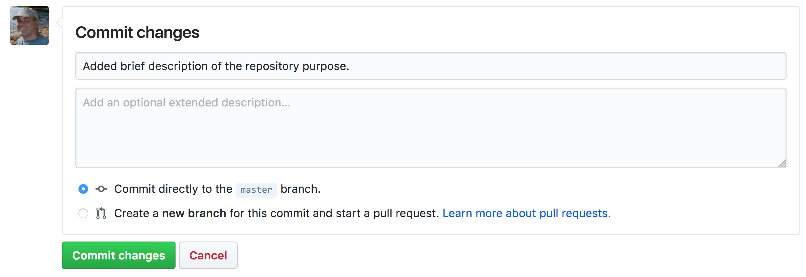
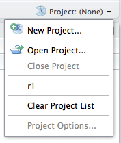

# Version Control with git and GitHub

## Learning Objectives

In this lesson, you will learn:

- Why __git__ is useful for reproducible analysis
- How to use __git__ to track changes to your work over time
- How to use __GitHub__ to collaborate with others
- How to structure your commits so your changes are clear to others
- How to write effective commit messages

## The problem with "save_as"


Every file in the scientific process changes.  Manuscripts are edited.
Figures get revised.  Code gets fixed when problems are discovered.  Data files
get combined together, then errors are fixed, and then they are split and 
combined again. In the course of a single analysis, one can expect thousands of
changes to files.  And yet, all we use to track this are simplistic *filenames*.  
You might think there is a better way, and you'd be right: __version control__.

Version control systems help you track all of the changes to your files, without
the spaghetti mess that ensues from simple file renaming.  In other words, version control is a system that helps you to manage the different versions of your files in an organized manner. It will help you to never have to duplicate files using `save as` as a way to keep different versions of a file (see below). Version control help you to create a timeline of snapshots containing the different versions of a file. At any point in time, you will be able to roll back to a specific version. Bonus: you can add a short description (commit message) to remember what each specific version is about.

**What is the difference between `git` and `GitHub`?**

- __git__: version control software used to track files in a folder (a repository)
    - git creates the versioned history of a repository
- __GitHub__: web site that allows users to store their git repositories and share them with others


## git

 

This training material focuses on the code versioning system called `Git`. Note that there are others, such as `Mercurial` or `svn` for example.

Git is a *free* and *open source* distributed *version control system*. It has many functionalities and was originally geared towards software development and production environment. In fact, Git was initially designed and developed in 2005 by Linux kernel developers (including Linus Torvalds) to track the development of the Linux kernel. Here is a [fun video](https://www.youtube.com/watch?v=4XpnKHJAok8) of Linus Torvalds touting Git to Google. 

**How does it work?**

Git can be enabled on a specific folder/directory on your file system to version files within that directory (including sub-directories). In git (and other version control systems) terms, this “tracked folder” is called a **repository** (which formally is a specific data structure storing versioning information).

**What git is not:**

- **Git is not a backup per se**
- Git is not good at versioning large files (there are workarounds) => not meant for data


## First Repository

Git can be enabled on a specific folder/directory on your file system to version files within that directory (including sub-directories). In git (and other version control systems) terms, this “tracked folder” is called a **repository** (which formally is a specific data structure storing versioning information).

Although there many ways to start a new repository, [GitHub](https://github.com/) (or any other cloud solutions, such as [GitLab](https://about.gitlab.com/)) provide among the most convenient way of starting a repository.


### GitHub  
	
**GitHub is a company that hosts git repositories online** and provides several collaboration features (among which `forking`). GitHub fosters a great user community and has built a nice web interface to git, also adding great visualization/rendering capacities of your data.

- **GitHub.com**: <https://github.com>
- **A user account**: <https://github.com/brunj7>
- **An organization account**: <https://github.com/nceas>
- **NCEAS GitHub instance**: <https://github.nceas.ucsb.edu/> 

### Let's look at a repository on GitHub

This screen shows the copy of a repository stored on GitHub,
with its <span style="color:red">list of files</span>, <span style="color:green">when the files and directories were last modified</span>, 
and <span style="color:blue">some information on who made the most recent changes.</span>  


If we drill into the 
"<span style="color:orange">commits</span>" for the repository, we can see the history of changes made to all of 
the files.  Looks like `kellijohnson` and `seananderson` were fixing things in
June and July:


And finally, if we drill into the changes made on June 13, we can see exactly what
was changed in each file:


Tracking these changes, and seeing how they relate to released versions of software and files
is exactly what Git and GitHub are good for. We will show how they can really 
be effective for tracking versions of scientific code, figures, and manuscripts
to accomplish a reproducible workflow.


### Creating a Repository on GitHub

We are going to create a new repository on your GitHub account. If you do not have an account yet, it is free to create one here: https://github.com/join?source=header-home

To create a new repository follow these steps:

- Click on 
- Enter a descriptive name for your new repository, **`training-repo`**
(avoid upper case and use `-` instead of spaces or `_`)
- Write a 1-sentence description about the repository content
- Choose **"Public"** (as of January 2019, GitHub now offers unlimited free private repositories with a maximum of 3 collaborators)
- Check **"Initialize this repository with a README"**
- Add a `.gitignore` file (optional). As the name suggest, the gitignore file is used to specify the file format that git should not track. GitHub offers pre-written gitignore files for commodity
- Add a license file (optional) 


 Here is a website to look for more pre-written`.gitignore` files: <https://github.com/github/gitignore>

<br>

**=> Here it is, you now have a repository in the cloud!!** 

 

<br>


### First commit

For simple changes to text files, you can make edits right in the GitHub web interface.  For example,
navigate to the `README.md` file in the file listing, and edit it by clicking on the *pencil* icon.
This is a regular Markdown file, so you can just add text, and when done, add a commit message, and 
hit the `Commit changes` button.  




Congratulations, you've now authored your first versioned commit.  If you navigate back to 
the GitHub page for the repository, you'll see your commit listed there, as well as the
rendered README.md file.


Let's point out a few things about this window.  It represents a view of the repository
that you created, showing all of the files in the repository so far.  For each file,
it shows when the file was last modified, and the commit message that was used to last
change each file.  This is why it is important to write good, descriptive commit
messages.  In addition, the blue header above the file listing shows the most recent
commit, along with its commit message, and its SHA identifer.  That SHA identifier is
the key to this set of versioned changes.  If you click on the SHA identifier (*ad96b85*), 
it will display the set of changes made in that particular commit.

In the next section we'll use the GitHub URL for the GitHub repository you created 
to `clone` the repository onto your local machine so that you can edit the files 
in RStudio.  


## Getting a Local Copy of a Repository

The next step is going to **get a local copy of this repository to your personal computer**. In git jargon, creating an exact copy of a repository on your local computer is called **cloning**.

RStudio can help us to clone a repository. *Since `RStudio Projects` also work at the folder/directory level, it is the "unit" that is going to be used to link a repository to RStudio.*

1. You can create a new `RStudio Project` from the upper-right corner of the RStudio IDE window, choosing *New Project*  
```{r RStudio project, out.width='30%', fig.align='center', echo = FALSE}

```
2. Choose *Version Control*  
```{r RStudio project version control panel, out.width='50%', fig.align='center', echo = FALSE}
knitr::include_graphics("images/rstudio-project-version-control.png")
```
3. Select `git`
4. Go back to your web browser and from the GitHub repository page click on the green `clone or download` button and copy the URL to your repository.  
_Note_: The URL should start with "https\://". If it starts with "git\@github.com", click "Use HTTPS" above the URL.

5. Paste this URL in the first box and leave the second box empty. Finally select a location on your HD where the repository will be cloned to.
```{r RStudio project git panel, out.width='50%', fig.align='center', echo = FALSE}
knitr::include_graphics("images/rstudio-project-clone.png")
```
6. Click `Create Project`


<br>

** => Congratulations!! you have cloned the repository to your computer and created a RStudio project out of it.**

```{r Cloned repository, fig.align='center', echo = FALSE}
knitr::include_graphics("images/repo-cloned.png")
```


<br>

You can also use your computer file browser to look at the files in the repository. You have two files:

- The `training-repo.Rproj` file for the RStudio Project you just created. Note that because we left the second box empty on step 5, the name of the repository was used to name the RStudio project. This file will be what you open to begin working on your R and RMarkdown scripts. The `Rproj` file will save your settings and open tabs when you close the project, and will restore these settings the next time you open it. 
- The `README.md` file that was automatically generated by GitHub when creating the repository

```{r Finder files view, out.width='50%', fig.align='center', echo = FALSE}

```

If you look again at your repository page on GitHub you will noticed that the `.Rproj` file is not there. It is because this file was created by RStudio on your local machine and you have not yet tried to synchronize the files between your local copy and the one in the cloud (remote copy in git jargon). Note also that the `.gitignore` file is not showing up in the Finder view. It is because files with a name starting with a dot are considered "hidden". By default most of OS will not show those files. However if you use the `Files` panel in RStudio, you can see the `.gitignore` file.

```{r rstudio files view, out.width='50%', fig.align='center', echo = FALSE}

```

We are going to edit the `README.md` file, adding more information about the repository (purpose of the this file). You can directly edit this file in RStudio. You can open the file by clicking on its name from the `Files` tab in the lower-right panel.


## Tracking File Changes with `git` 

### Basic Workflow Overview


1. You modify files in your working directory and save them as usual

2. You **add** snapshots of your changed files to your staging area

3. You do a **commit**, which takes the files as they are in the staging area and permanently stores them as snapshots to your Git directory.


We can make an analogy with taking a family picture, where each family member would represent a file.

- **Add**ing files (to the staging area), is like deciding which family member(s) are going to be on your next picture
- **Commit**ting is like taking the picture

These 2-step process enables you to flexibly group files into a specific commit.

These steps are repeated for every version you want to keep (every time you would like to use `save as`). Every time you commit, you create a new snapshot, you add the new version of the file to the git database, while keeping all the previous versions in the database. It creates an history of the content of your repository that is like a graph that you can navigate:


### Using git from Rstudio

#### Tracking changes

RStudio provides a great interface to git helping you navigating the git workflow and getting information about the state of your repository through nice icons and visualizations of the information.

If you click on the `Git` tab in your RStudio upper-right panel, you should see the following information

```{r RStudio git pane, out.width='60%', fig.align='center', echo = FALSE}
knitr::include_graphics("images/rstudio-git-panel.png")
```
The RStudio Git pane lists every file that’s been added, modified or deleted. The icon describes the change:

```{r RStudio git icons, out.width='80%', fig.align='left', fig.cap="from R packages, H. Wickham", echo = FALSE}
knitr::include_graphics("images/rstudio-git-icons.png")
```

In our case, it means that:

- the `.gitignore`file has been modified since the last commit
- the  `.Rproj` file has never been tracked by `git`  (remember RStudio just created this project file for us)

Note also that the `README.md` file is not listed, but it exists (see `Files`pane). It is because files with no modifications since last commit are not listed. 

GitHub has created the `.gitignore` file for us and we have not modified it since. So why is it listed as modified? We can check this by clicking on the `Diff` button (upper-left on the Git pane).

```{r RStudio git diff, out.width='70%', fig.align='center', echo = FALSE}
knitr::include_graphics("images/rstudio-git-diff.png")
```

We can see that a new line (in green) has been added at the end of the `.gitignore` file. In fact, RStudio did that when creating the project to make sure that some temporary files are not tracked by git.

Let us improve the content of the `README.md` file  as below to make it more descriptive.

```{r RStudio readme, out.width='70%', fig.align='center', echo = FALSE}

```

As soon as you saved your changes, you should see the `README.md` file listed as modified in the git pane.

```{r RStudio git pane mod, out.width='70%', fig.align='center', echo = FALSE}

```

Let us look at the diff of the `README.md` file. As you can see, the original lines are in red, in other words for git those lines have been deleted. The new lines that we just typed are in green, which indicates that these lines have been added for git. Note the line numbers in the left margin that help you to track which line have been removed and added.


```{r RStudio git diff readme, out.width='70%', fig.align='center', echo = FALSE}

```

#### Keeping Changes as Snapshots

Now we would like to save a snapshot of this version of the `README.md` file. Here are the steps we will need to do:

1. Add the file to the next commit by checking the box in front of the file name in the git pane.  
Note that the icon `M` will move to the left to show you that this file is now staged to be part of the next commit
2. Commit:
    a. Click the `Commit` button at the top of the git pane
    b. Write a short but descriptive commit message in the new window
    c. Click on the he `Commit` button to save this version of the file in the git database
    d. Close the windows to get back to the main RStudio window

```{r RStudio git first commit, out.width='70%', fig.align='center', echo = FALSE}

```


Once done, add both the `.gitignore` and the `training-repo.Rproj` and commit those files together.

 Note that the icons at the top of the git pane have been organized in sequence from left to right to match the git workflow.

#### Good Commit Message Tips

Clearly, good documentation of what you’ve done is critical to making the version history of your repository meaningful and helpful. Its tempting to skip the commit message altogether, or to add some stock blurd like ‘Updates’. Its better to use messages that will be helpful to your future self in deducing not just what you did, but why you did it. Also, commit messages are best understood if they follow the active verb convention. For example, you can see that my commit messages all started with a past tense verb, and then explained what was changed.

While some of the changes we illustrated here were simple and easily explained in a short phrase, for more complex changes, its best to provide a more complete message. The convention, however, is to always have a short, terse first sentence, followed by a more verbose explanation of the details and rationale for the change. This keeps the high level details readable in the version log. I can’t count the number of times I’ve looked at the commit log from 2, 3, or 10 years prior and been so grateful for diligence of my past self and collaborators.

### Looking at the Repository History

We have done 2 new commits at this point. Let us look at the commit timeline we have created so far. You can click on the `Clock` icon at the top to visualize the history.

```{r RStudio git history, out.width='70%', fig.align='center', echo = FALSE}
knitr::include_graphics("images/rstudio-git-history.png")
```

You can see that there has been 3 commits so far. The first one has been done by GitHub when we created the repository and the 2 commits we just did. The most recent commit is at the top.


### Sending changes back to GitHub

Now that we have created these two commits on our local machine, our local version of the repository is different from the version on GitHub. RStudio communicate this information to you. If you look below the icons on the git pane, you will see the warning message: "Your branch is ahead of 'origin/master' by two commits". This can be translated as you have two additional commits on your local machine that you never shared back to the remote repository on GitHub. Open your favorite web browser and look at the content of your repository on GitHub. You will see the old version of the `README.md` and `.gitignore` file and no trace of the `.Rproj` file.

```{r RStudio git 2 local commits, fig.align='center', echo = FALSE}

```

There are two git commands to exchange between a local and remote versions of a repository:
- `pull`: git will get the latest remote version and try to merge it with your local version
- `push`: git will send your local version to the remote version of the repository (in our case GitHub)

Before sending your local version to the remote, you should always get the latest remote version first. In other words, you should pull first and push second. This is the way git protects the remote version against incompatibilities with the local version. You always deal with potential problems on your local machine. Therefore your sequence will always be:

1. `pull`
2. `push`

Of course RStudio have icons for that on top of the git pane, with the blue arrow down being for `pull` and the green arrow up being for `push`. Remember the icons are organized in sequence!

Let us do the pull and push to synchronized the remote repositories. We have now synchronized the local (our computer) and remote (on GitHub) versions of our repository.

```{r RStudio git, repo in sync, fig.align='center', echo = FALSE}

```

You can now look at the page of your repository on GitHub, you should see 3 files with the exact same version that you have on your local!


## Collaboration and conflict free workflows

Up to now, we have been focused on using Git and GitHub for yourself, which is a 
great use. But equally powerful is to share a GitHib repository with other
researchers so that you can work on code, analyses, and models together.  When
working together, you will need to pay careful attention to the state of the 
remote repository to avoid and handle merge conflicts.  A *merge conflict* occurs
when two collaborators make two separate commits that change the same lines of the
same file.  When this happens, git can't merge the changes together automatically,
and will give you back an error asking you to resolve the conflict. Don't be afraid
of merge conflicts, they are pretty easy to handle.  and there are some 
[great](https://help.github.com/articles/resolving-a-merge-conflict-using-the-command-line/) [guides](https://stackoverflow.com/questions/161813/how-to-resolve-merge-conflicts-in-git).

That said, its truly painless if you can avoid merge conflicts in the first place.
You can minimize conflicts by:

- Ensure that you pull down changes just before you commit
  + Ensures that you have the most recent changes
  + But you may have to fix your code if conflict would have occurred
- Coordinate with your collaborators on who is touching which files
  + You still need to comunicate to collaborate

## Exercise

Use RStudio to add a new RMarkdown file to your `training-repo`
repository, build a basic structure for the file, and then save it.

Next, stage and commit the file locally, and push it up to GitHub.

## Advanced topics 

There's a lot we haven't covered in this brief tutorial.  There are some great
and much longer tutorials that cover advanced topics, such as:

- Using git on the command line
- Resolving conflicts
- Branching and merging
- Pull requests versus direct contributions for collaboration
- Using .gitignore to protect sensitive data
- GitHub Issues and why they are useful
- and much, much more


## References

Using RStudio:

- Happy Git and GitHub for the useR: http://happygitwithr.com/
- R packages - Git and GitHub: http://r-pkgs.had.co.nz/git.html#git-init
 
Mainly from the command line:

- Interactive git 101: [https://try.github.io/](https://try.github.io/)
- Very good tutorial about git: [https://www.atlassian.com/git/tutorials/what-is-version-control](https://www.atlassian.com/git/tutorials/what-is-version-control)
- Software Carpentry [Version Control with Git](http://swcarpentry.github.io/git-novice/)
- Git tutorial geared towards scientists: [http://nyuccl.org/pages/gittutorial/](http://nyuccl.org/pages/gittutorial/)
- Short intro to git basics: [https://github.com/mbjones/gitbasics](https://github.com/mbjones/gitbasics)
- Git documentation about the basics: [http://gitref.org/basic/](http://gitref.org/basic/)
- Git documentation - the basics: [https://git-scm.com/book/en/v2/Getting-Started-Git-Basics](https://git-scm.com/book/en/v2/Getting-Started-Git-Basics)
- Git terminology: [https://www.atlassian.com/git/glossary/terminology](https://www.atlassian.com/git/glossary/terminology)
- In trouble, guide to know what to do: [http://justinhileman.info/article/git-pretty/git-pretty.png](http://justinhileman.info/article/git-pretty/git-pretty.png)
- Want to undo something? <https://github.com/blog/2019-how-to-undo-almost-anything-with-git> 
- Git terminology: <https://www.atlassian.com/git/glossary/terminology>
- 8 tips to work better with git: <https://about.gitlab.com/2015/02/19/8-tips-to-help-you-work-better-with-git/>
- GitPro book (2nd edition): <https://git-scm.com/book/en/v2>


GitHub Workflow

- GitHub:
   - guides on how to use GitHub: [https://guides.github.com/](https://guides.github.com/)
   - GitHub from RStudio: [http://r-pkgs.had.co.nz/git.html#git-pull](http://r-pkgs.had.co.nz/git.html#git-pull)
- Forking:
   - [https://help.github.com/articles/fork-a-repo/](https://help.github.com/articles/fork-a-repo/)
   - [https://guides.github.com/activities/forking/](https://guides.github.com/activities/forking/)
- Comparison of git repository host services: <https://www.git-tower.com/blog/git-hosting-services-compared/>
- Branches
   - interactive tutorial on branches: <http://learngitbranching.js.org/>
   - using git in a collaborative environment: <https://www.atlassian.com/git/tutorials/comparing-workflows/centralized-workflow>
 
