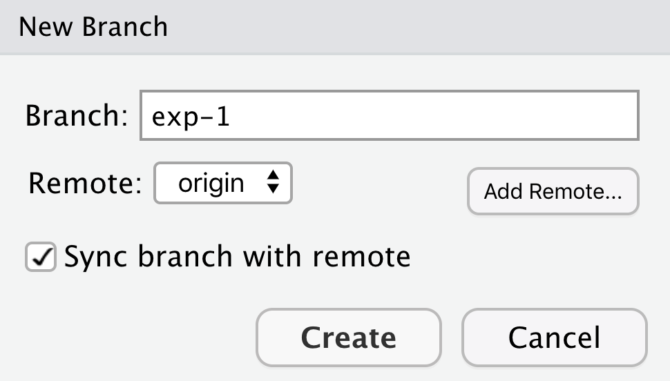

# Collaborating using Git

```{r gitcollab_setup, include=FALSE}
knitr::opts_chunk$set(echo = TRUE)
```

## Learning Objectives

In this lesson, you will learn:

- New mechanisms to collaborate using __git__
- What is a __Pull Request__ in Github
- How top contribute code to colleague's repository using Pull Requests
- What is a __branch__ in git
- How to use a branch to organize code
- What is a __tag__ in git and how is it useful for collaboration


## Pull requests

We've shown in other chapters how to directly collaborate on a repository with
colleagues by granting them `write` privileges as a collaborator to your repository.
This is useful with close collaborators, but also grants them tremendous latitude to
change files and analyses, to remove files from the working copy, and to modify all
files in the repository.  

Pull requests represent a mechanism to more judiciously collaborate, one in which 
a collaborator can suggest changes to a repository, the owner and collaborator can 
discuss those changes in a structured way, and the owner can then review and accept
all or only some of those changes to the repository.  This is useful with open source
code where a community is contributing to shared analytical software, to students in 
a lab working on related but not identical projects, and to others who want the 
capability to review changes as they are submitted.

To use pull requests, the general procedure is as follows.  The collaborator first
creates a `fork` of the owner's repository, which is a cloned copy of the original
that is linked to the original.  This cloned copy is in the collaborator's GitHub
account, which means they ave the ability to make changes to it.  But they don't have
the right to change the original owner's copy.  Pull requests are a mechanism for someone
that has a forked copy of a repository to **request** that the original owner review and
pull in their changes.  This allows them to collaborate, but keeps the owner in control of
exactly what changed.

### Exercise: Create and merge pull requests

In this exercise, work in pairs.  Each pair should create a `fork` of their partner's
training repository, and then clone that onto their local machine.  Then they can make changes
that forked repository, and, from the GitHub interface, create a pull request that the
owner can incorporate.

## Branches and tags

Branches are a mechanism to isolate a set of changes in their own thread, allowing multiple 
types of work to happen in parallel on a repository at the same time.  These are most often
used for trying out experimental work, or for managing bug fixes for historical releases
of software.  Here's an example graph showing a `branch2.1` that has changes in parallel 
to the main branch of development:


The default branch in almost all repositories is called `master`, and it is the
branch that is typically shown in the GitHub interface and elsewhere.
There are many mechanisms to create branches.  The one we will try is 
through RStudio, in which we use the branch dialog to create and switch 
between branches.

### Exercise:

Create a new branch in your training repository called `exp-1`, and then make 
changes to the RMarkdown files in the directory.  Commit and push those changes
to the branch.  Now you can switch between branches using the github interface.


