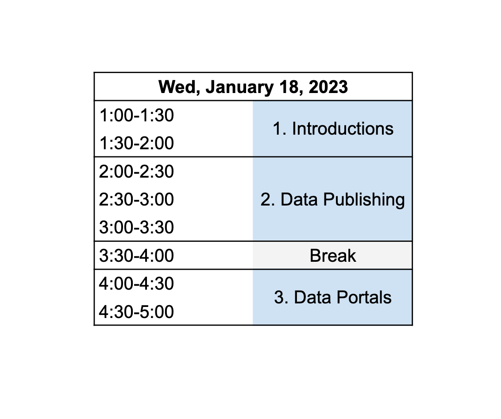

--- 
title: "Toolik Workshop: Intro to Data Publishing and Data Portals"
date: "January 19, 2023"
site: bookdown::bookdown_site
output: bookdown::gitbook
documentclass: book
bibliography: [book.bib]
biblio-style: apalike
link-citations: yes
description: ""
always_allow_html: yes
---

# Toolik Workshop: Intro to Data Publishing and Data Portals {-#open-science}

## About {-}

This half-day in-person workshop will provide researchers with an overview of reproducible and ethical research practices, steps and methods for more easily documenting and preserving their data at the Arctic Data Center, and an introduction to data portals. Responsible and reproducible data management practices will be discussed as they apply to all aspects of the data life cycle. This includes ethical data collection and data sharing, data sovereignty, and the [CARE](https://www.gida-global.org/care) principles. The CARE principles are guidelines that help ensure open data practices (like the [FAIR](https://www.go-fair.org/fair-principles/) principles) appropriately engage with Indigenous Peoples’ rights and interests.

### Schedule {-}

### Code of Conduct {-}
Please note that by participating in this activity you agree to abide by the [NCEAS Code of Conduct](https://www.nceas.ucsb.edu/sites/default/files/2021-11/NCEAS_Code-of-Conduct_Nov2021_0.pdf). 

### About this book {-}

These written materials reflect the continuous development of learning materials at the Arctic Data Center and NCEAS to support individuals to understand, adopt, and apply ethical open science practices. In bringing these materials together we recognize that many individuals have contributed to their development. The primary authors are listed alphabetically in the citation below, with additional contributors recognized for their role in developing previous iterations of these or similar materials.

This work is licensed under a [Creative Commons Attribution 4.0 International License](http://creativecommons.org/licenses/by/4.0/).

**Citation**: Amber E. Budden, S. Jeanette Clark, Natasha Haycock-Chavez, Noor Johnson, Matthew B. Jones, Daphne Virlar-Knight. 2023. Toolik Workshop: Intro to Data Publishing and Data Portals.

**Additional contributors**: Stephanie Hampton, Jim Regetz, Bryce Mecum, Julien Brun, Julie Lowndes, Erin McLean, Andrew Barrett, David LeBauer, Jessica Guo.
