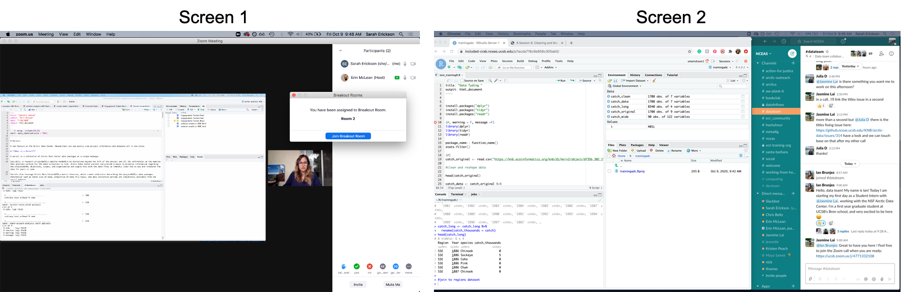
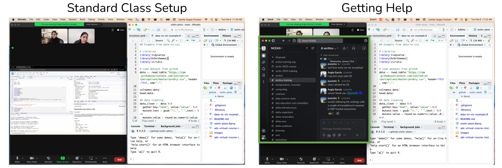
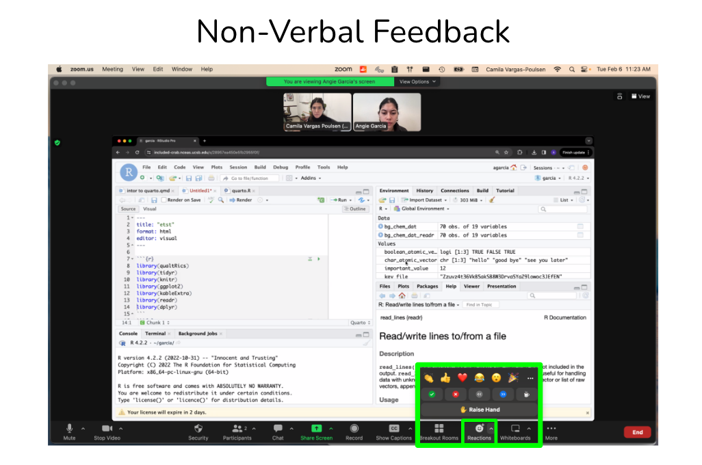
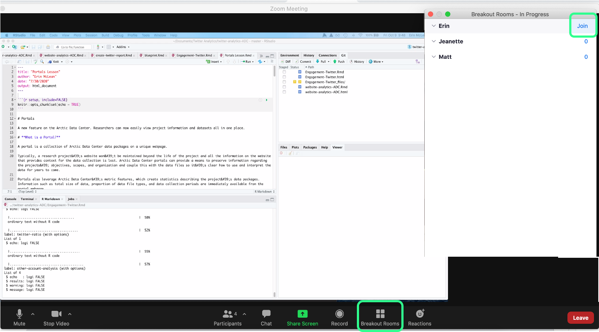

--- 
title: "Reproducible Research Techniques for Synthesis"
date: "November 12-13, 16-18, 2020"
site: bookdown::bookdown_site
output: bookdown::gitbook
documentclass: book
bibliography: [book.bib]
biblio-style: apalike
link-citations: yes
description: ""
always_allow_html: yes
---

# Reproducible Research Techniques for Synthesis


The research landscape is changing. Researchers are increasingly engaging in collaboration across networks; open science includes not just open publication but also open data, software, and workflows; and technology is evolving in support of this new paradigm. This five-day workshop is designed to help researchers stay abreast of current best practices and initiatives and get started on acquiring good data science skills to maximize their productivity, share their data with the scientific community effectively and efficiently, and benefit from the re-use of their data by others.

## Schedule

```{r schedule, echo=FALSE, out.width = '100%', fig.align = 'center'}
knitr::include_graphics("images/schedule.png")
```

### Code of Conduct

Please note that by participating in an NCEAS activity you agree to abide by our [Code of Conduct](https://www.nceas.ucsb.edu/files/NCEAS_Code-of-Conduct_2019.pdf)


```{r footer_logo, echo=FALSE, out.width = '100%', fig.align = 'center'}
knitr::include_graphics("images/nceas-logo.png")
```

### Logistics

#### Overview

Welcome to the NCEAS Reproducible Research Techniques for Synthesis short course. In previous years, we have been able to run this course on site as a 5-day intensive training between 8:00 am and 5:00 pm. Participants traveled to NCEAS in Santa Barbara and we asked that participants were as engaged as possible during the instructional period. Although we have had to switch to a remote training model due to COVID-19, we ask participants for the same level of commitment in this remote setting, while understanding that some conflicts are unavoidable.

We will be using the following tools to facilitate this training:

- Zoom (version 5.3.1)
- Slack (desktop app preferred)
- RStudio, accessed through a server on an up-to-date web browser:
	- Firefox (version 80+)
	- Chrome (version 80+)
	- Safari (version 13+)
	- Edge (version 81+)

#### Server

You should receive a separate email prompting you to change your password using the NCEAS account service. **Please change your password**, and then ensure that you can log in at https://included-crab.nceas.ucsb.edu/. 

#### Monitors

If you have a second monitor or second device, it would likely be useful for this training. You'll need enough screen real estate to handle the primary Zoom window, the participant pane in Zoom, Slack, and a browser with tabs for RStudio and our training curriculum. We recommend either using two monitors, or joining the Zoom room from a second device.



If you must be on one machine for everything, here’s an example of what it could look like when you are following along with the class and how your screen will shift when you have a more detailed question that requires breakout assistance.



When we're in session, please turn your camera on, and mute your microphone unless you would like to ask a question or contribute to a discussion. 

#### Working from Home

We recognize that working from home during the pandemic comes with challenges. The appearance or sound of other adults, children, and pets in remote meetings such as this is completely normal and understandable. Having your video on and enabling the instructors and your fellow participants to see you brings some humanity to this physically distant workshop, and we believe that this is a crucial element of its success. If you would like to use the Zoom virtual background feature to hide your surroundings, please do provided your background of choice fits within the code of conduct (and [here](https://www.arcus.org/resources/virtual-backgrounds) are some Arctic backgrounds if you need inspiration).

#### Non-Verbal Feedback

We'll be using the Zoom "Non Verbal Feedback" buttons throughout this course. We will ask you to put a green check by your name when you're all set or you understand, and a red x by your name if you're stuck or need assistance. These buttons can be found in the participants panel of the Zoom room. When you're asked to answer using these buttons, please ensure that you select one so that the instructor has the feedback that they need to either continue the lesson or pause until everyone gets back on the same page.



#### Questions and Getting Help

When you need to ask a question, please do so in one of the following ways:

- Turn your mic on and ask. If you are uncomfortable interrupting the instructor, you may also raise your virtual hand (in the participant panel) and the session facilitator will ask the instructor to pause and call upon you. 
- Ask your question in the slack channel.

If you have an issue/error and get stuck, you can ask for help in the following ways:

- Turn your mic on and ask for help. See also above regarding the use of a virtual raised hand.
- Let one of the instructors know in the slack channel.
- If prompted to do so, put a red X next to your name as your status in the participant window.

When you have detailed questions or need one on one coding assistance, we have three zoom breakout rooms available with helpers. The helper will try to help you in Slack first. If the issue requires more in-depth troubleshooting, the helper will invite you to join their named Breakout Room. 



#### The Power of Open

To facilitate a lively and interactive learning environment, we'll be calling on folks to share their code and to answer various questions posed by the instructor. It's completely okay to say "Pass" or "I Don't Know" - this is a supportive learning environment and we will all learn from each other. The instructors will be able to see your code as you go to help you if you get stuck, and the lead instructor may share participants' code to show a successful example or illustrate a teaching moment.

### Acknowledgements

Additional support was provided for working group collaboration by the National Center for Ecological Analysis and Synthesis, a Center funded by the University of California, Santa Barbara, and the State of California.

```{r, echo=FALSE, out.width = '100%', fig.align = 'center'}
knitr::include_graphics("images/nceas-logo.png")
```
