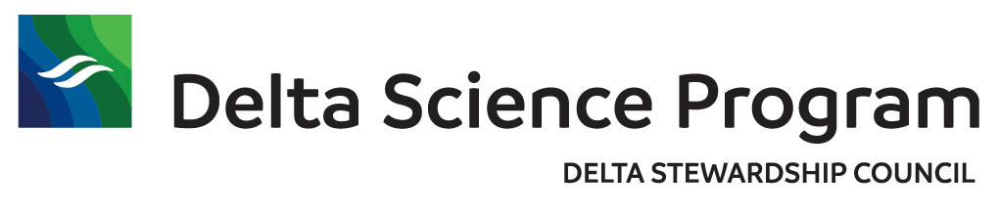

--- 
title: "Open Science Synthesis for the Delta Science Program: Week 2"
date: "October 24-29, 2021"
site: bookdown::bookdown_site
output: bookdown::gitbook
documentclass: book
bibliography: [book.bib]
biblio-style: apalike
link-citations: yes
description: ""
always_allow_html: yes
---

# Open Science Synthesis for the Delta Science Program: Week 2 {-#reproducible-research-techniques-for-synthesis}



This book is for week 2 of 3, one-week facilitated synthesis and training events for Delta researchers that will revolve around scientific computing and scientific software for reproducible science.

Week 2 will focus on advanced analysis techniques, and group synthesis work in analysis development of the synthesis developed in Week 1.


## Schedule


### Code of Conduct

Please note that by participating in an NCEAS activity you agree to abide by our [Code of Conduct](https://live-ncea-ucsb-edu-v01.pantheonsite.io/sites/default/files/2020-02/NCEAS_Code-of-Conduct_2019.pdf)


```{r footer_logo, echo=FALSE, out.width = '100%', fig.align = 'center'}
knitr::include_graphics("images/nceas-logo.png")
```

### Logistics

#### Computing Setup

#### The Power of Open

To facilitate a lively and interactive learning environment, we'll be calling on folks to share their code and to answer various questions posed by the instructor. It's completely okay to say "Pass" or "I Don't Know" - this is a supportive learning environment and we will all learn from each other. The instructors will be able to see your code as you go to help you if you get stuck, and the lead instructor may share participants' code to show a successful example or illustrate a teaching moment.


```{r, echo=FALSE, out.width = '100%', fig.align = 'center'}
knitr::include_graphics("images/nceas-logo.png")
```

### About this book

These written materials are the result of a continuous effort at NCEAS to help researchers make their work more transparent and reproducible. This work began in the early 2000's, and reflects the expertise and diligence of many, many individuals. The primary authors are listed in the citation below, with additional contributors recognized for their role in developing previous iterations of these or similar materials.

This work is licensed under a [Creative Commons Attribution 4.0 International License](http://creativecommons.org/licenses/by/4.0/).

Citation: Jones, Matthew B., Amber E. Budden, Bryce Mecum, S. Jeanette Clark, Julien Brun, Julie Lowndes, Erin McLean, Jessica S. Guo, David S. LeBauer. 2021. Reproducible Research Techniques for Synthesis. NCEAS Learning Hub.

Additional contributors: Ben Bolker, Stephanie Hampton, Samanta Katz, Deanna Pennington, Karthik Ram, Jim Regetz, Tracy Teal, Leah Wasser. 