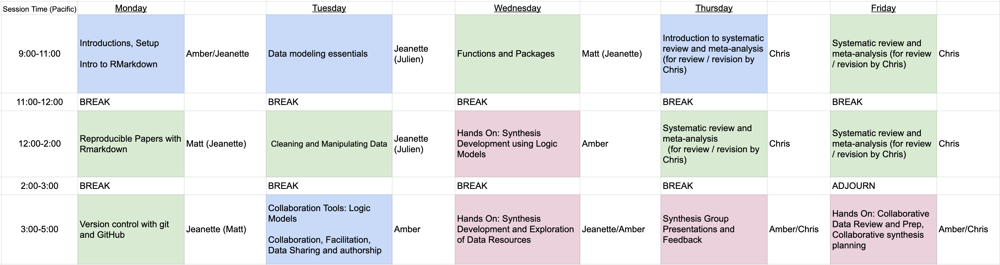
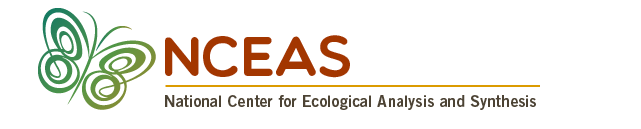

--- 
title: "Reproducible Research Techniques for Synthesis"
date: "November 4-8, 2019"
site: bookdown::bookdown_site
output: bookdown::gitbook
documentclass: book
bibliography: [book.bib]
biblio-style: apalike
link-citations: yes
description: ""
always_allow_html: yes
---

# Reproducible Research Techniques for Synthesis


The research landscape is changing. Researchers are increasingly engaging in collaboration across networks; open science includes not just open publication but also open data, software, and workflows; and technology is evolving in support of this new paradigm. This five-day workshop is designed to help researchers stay abreast of current best practices and initiatives and get started on acquiring good data science skills to maximize their productivity, share their data with the scientific community effectively and efficiently, and benefit from the re-use of their data by others.

## Schedule

```{r schedule, echo=FALSE, out.width = '100%', fig.align = 'center'}

```

### Code of Conduct

Please note that by participating in an NCEAS activity you agree to abide by our [Code of Conduct](https://www.nceas.ucsb.edu/files/NCEAS_Code-of-Conduct_2019.pdf)


```{r footer_logo, echo=FALSE, out.width = '100%', fig.align = 'center'}

```

