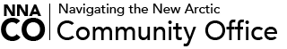

--- 
title: "Open Science: Best Practices, Data Sovereignty and Co-production"
date: "Mar 29 2022; 1600-2000 CEST"
site: bookdown::bookdown_site
output: bookdown::gitbook
documentclass: book
bibliography: [book.bib]
biblio-style: apalike
link-citations: yes
description: ""
always_allow_html: yes
---

# Open Science: Best Practices, Data Sovereignty and Co-production {-#reproducible-research-techniques-for-synthesis}

## About

These materials reflect a collaboration between the [Arctic Data Center](https://arcticdata.io), the [Navigating the New Arctic Community Office](https://nna-co.org), and [ELOKA](https://eloka-arctic.org) as part of our organizational commitments to raising awareness and promoting best practices in data management, increasing data literacy, and engaging the community in conversations about data governance. These materials are associated with a workshop presented as part of the [Arctic Science Summit Week 2022](https://www.assw.info).

### Schedule

This [workshop](https://assw.info/sessions/open-science-best-practices-data-sovereignty-and-co-production) is being held (online) on Tuesday March 29th at 1600 CEST, within the full [ASSW programme](https://assw.info/programme/assw-2022-full-programme). 

#### Agenda {-}

|CEST|Topic|
|:---|:--------------------------|
|1600|Welcome and Introductions|
||What is Open Science - Motivation for this workshop|
|1630|Research Reproducibility|
||Tidy Data best practices|
|1700|Data Ethics|
|1730|BREAK|
|1745|Community Data|
|1815|Tidy Data |
|1845|BREAK|
|1900|Tidy Data Exercise|
|1930|Discussion|
|2000|Adjourn|

### Code of Conduct

Please note that by participating in this activity you agree to abide by the [NCEAS Code of Conduct](https://www.nceas.ucsb.edu/sites/default/files/2021-11/NCEAS_Code-of-Conduct_Nov2021_0.pdf) and [NNA-CO Guiding Principles](https://nna-co.org/guiding-principles). 

### About this book

Citation ..
