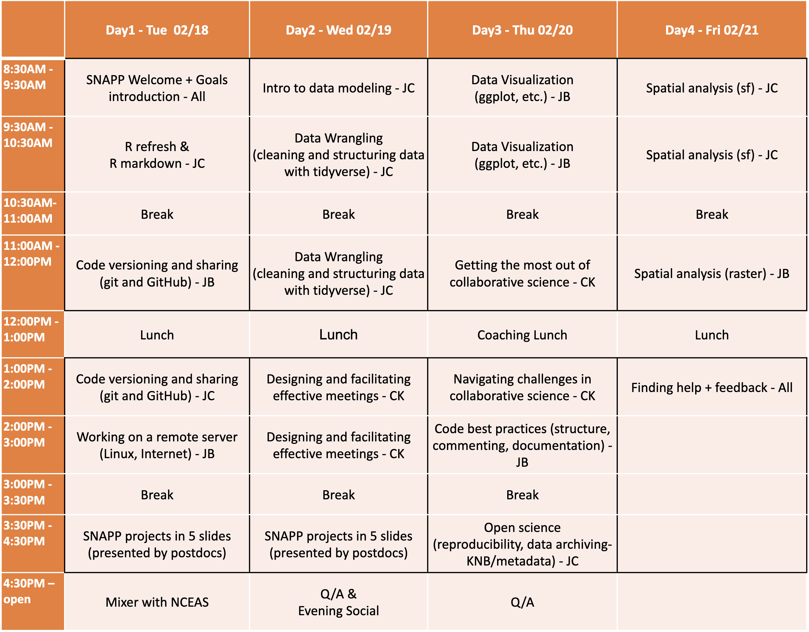

--- 
title: "Data Science and Collaboration Skills for Integrative Conservation Science"
date: "February 18-21, 2019"
site: bookdown::bookdown_site
output: bookdown::gitbook
documentclass: book
bibliography: [book.bib]
biblio-style: apalike
link-citations: yes
description: ""
always_allow_html: yes
---

# Data Science and Collaboration Skills for Integrative Conservation Science


This intensive 4-day workshop on Data Science and Collaboration Skills for Integrative Conservation Science will be held at NCEAS, Santa Barbara, CA from Feb 18 to Feb 21, 2020.

This training, sponsored by SNAPP, aims to bring together the SNAPP and NCEAS postdoctoral associates to foster communities and collaboration, as well as promote scientific computing and open science best practices.

## Schedule

```{r schedule, echo=FALSE, out.width = '100%', fig.align = 'center'}

```

### Code of Conduct

Please note that by participating in an NCEAS activity you agree to abide by our [Code of Conduct](https://www.nceas.ucsb.edu/files/NCEAS_Code-of-Conduct_2019.pdf)


```{r footer_logo, echo=FALSE, out.width = '100%', fig.align = 'center'}
knitr::include_graphics("images/nceas-logo.png")
```

