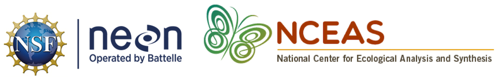

--- 
title: "NEON Onboarding Materials"
date: "Published December 2020"
site: bookdown::bookdown_site
output: bookdown::gitbook
documentclass: book
bibliography: [book.bib]
biblio-style: apalike
link-citations: yes
description: ""
always_allow_html: yes
---

# Overview {-}

## Rationale

The research landscape is changing. Researchers are increasingly engaging in collaboration across networks; open science includes not just open publication but also open data, software, and workflows; and technology is evolving in support of this new paradigm. This onboarding document is designed to support researchers beginning their postdoctoral work with NEON in a way that provides access to information, resources and training in open practices and team science. Developing good data science skills will enable researchers to maximize their productivity, share their data with the scientific community effectively and efficiently, and benefit from the re-use of their data by others.

## About this resource

This resource is provided as a self guided onboarding document that new postdocs should work through in the first weeks of joining NEON. The information contained in this document builds on the experience of ecological researchers, trainers, developers and information managers in collaborative, reproducible research practices and infrastructure. 

When working through Section 5: Reproducible Research Techniques, you will be using the following software. Please be sure these are all installed on your laptop. 

- R (version 3.6.2+)
- RStudio (version 1.2.5019+) 
- GitHub (via your preferred browser)

Please make sure to create a GitHub account if you do not already have one. 

**Refresh your skills**

This resource assumes a base level of experience using R for scientific and statistical analyses. However, we realize that not everyone will be at the same place in terms of familiarity with the tools we’ll be using. If you’d like to brush up on your R skills, check out this list of resources we like:

- The [Introduction to R](http://www.datacarpentry.org/R-ecology-lesson/01-intro-to-r.html) lesson in [Data Carpentry’s R for data analysis](http://www.datacarpentry.org/R-ecology-lesson/) course.
- The Stat 545 [course materials](https://stat545.com/r-basics.html)
- The QCBS [Introduction to R](https://qcbs.ca/wiki/r) lesson (French and English)
- RStudio’s [R education](https://education.rstudio.com/learn/) page
- Learn R in the console with [swirl](https://swirlstats.com/)

## Acknowledgements

Support for the development of this resource was provided by an award from NEON to the National Center for Ecological Analysis and Synthesis. 

Individual units were created by (in alphabetical order): Julien Brun, Amber Budden, Jeanette Clark, Matt Jones, Carrie Kappel, Erin McLean, Bryce Mecum, Julie Stewart Lowndes, Geoff Willard. 

```{r, echo=FALSE, out.width = '100%', fig.align = 'center'}

```
