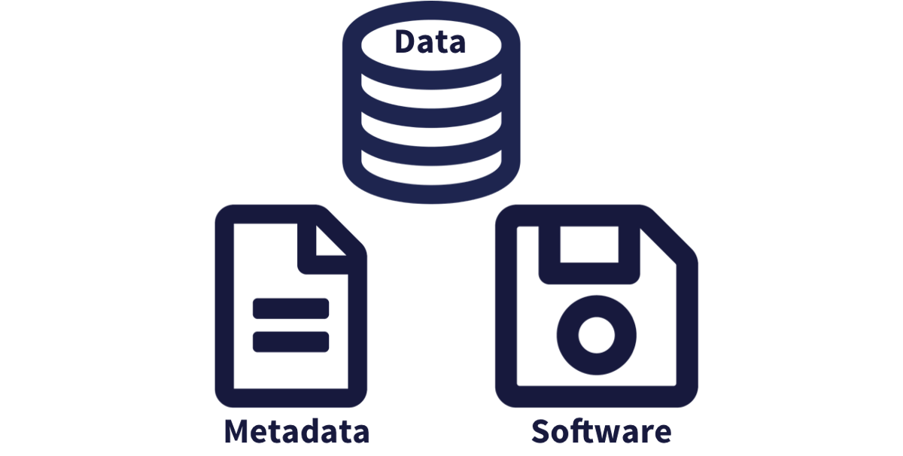

# Best Practices: Data and Metadata

## Learning Objectives

In this lesson, you will learn:

- Why preserving computational workflows is important
- How to acheive practical reproducibility
- What are some best practices for data and metadata management

Download slides: [Best Practices: Data and Metadata](files/metadata-data-best-practices.pdf)

## Preserving computational workflows

Preservation enables:

- Understanding
- Evaluation
- Reuse

All for `Future You`!  And your collaborators and colleagues across disciplines.

```{r components01, echo=FALSE, out.width = '50%', fig.align = 'center', fig.cap = 'Scientific products that need to be preserved from computational workflows include data, software, metadata, and other products like graphs and figures.'}

```

While the [Arctic Data Center](https://arcticdata.io), [Knowledge Network for Biocomplexity](https://knb.ecoinformatiocs.org) and similar repositories do
focus on preserving data, we really set our sights much more broadly on preserving
entire computational workflows that are instrumental to advances in science.  A 
computational workflow represents the sequence of computational tasks that are
performed from raw data acquisition through data quality control, integration, 
analysis, modeling, and visualization.

```{r compworkflow01, echo=FALSE, out.width = '100%', fig.align = 'center', fig.cap = 'Computational steps can be organized as a workflow streaming raw data through to derived products.'}
knitr::include_graphics("images/comp-workflow-1.png")
```

In addition, these workflows are often not executed all at once, but rather are
divided into multiple workflows, earch with its own purpose.  For example, a data
acquistion and cleaning workflow often creates a derived and integrated data product
that is then picked up and used by multiple downstream analytical workflows that
produce specific scientific findings.  These workflows can each be archived as 
distinct data packages, with the output of the first workflow becoming the input
of the second and subsequent workflows.

```{r compworkflow02, echo=FALSE, out.width = '100%', fig.align = 'center', fig.cap = 'Computational workflows can be archived and preserved in multiple data packages that are linked by their shared components, in this case an intermediate data file.'}
knitr::include_graphics("images/comp-workflow-2.png")
```

## Best Practices: Overview

- Who Must Submit?
- Organizing Data
- File Formats
- Large Data Packages
- Metadata
- Data Identifiers
- Provenance
- Licensing and Distribution


```{r fjord, echo=FALSE, out.width = '100%', fig.align = 'center'}
knitr::include_graphics("images/fjord.png")
```

## Organizing Data: Best Practices

Both [@borer_simple_2009] and [@white_nine_2013] provide some practical guidelines
for organizing and structuring data.  Critical aspects of their recommendations
include:

- Write scripts for all data manipulation
    - Uncorrected raw data file
    - Document processing in scripts
- Design to add rows, not columns
    - Each column one variable
    - Each row one observation
- Use nonproprietary file formats
    - Descriptive names, no spaces
    - Header line
    
