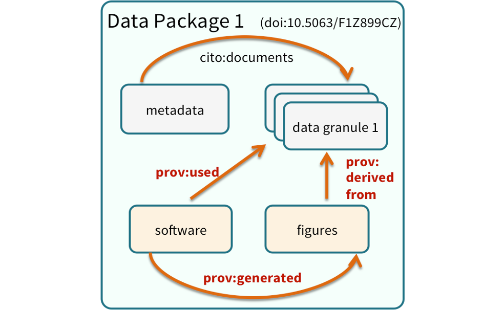
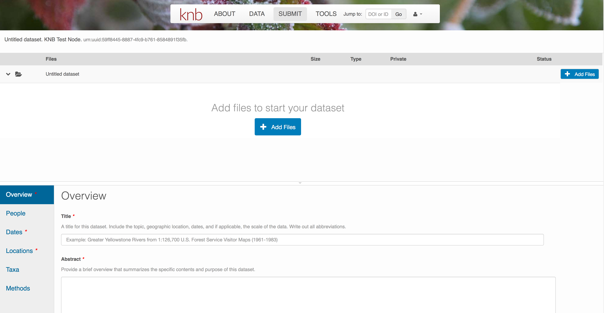

# Data Documentation and Publishing 

## Learning Objectives

In this lesson, you will learn:

- About open data archives
- What science metadata is and how it can be used
- How data and code can be documented and published in open data archives

## Data sharing and preservation


## Data repositories: built for data (and code)

- GitHub is not an archival location
- Dedicated data repositories: KNB, Arctic Data Center, Zenodo, FigShare
  + Rich metadata
  + Archival in their mission
- Data papers, e.g., Scientific Data
- List of data repositories: http://re3data.org


## Metadata

Metadata are documentation describing the content, context, and structure of 
data to enable future interpretation and reuse of the data.  Generally, metadata
describe who collected the data, what data were collected, when and where it was 
collected, and why it was collected.  

For consistency, metadata are typically structured following metadata content 
standards such as the [Ecological Metadata Language (EML)](https://knb.ecoinformatics.org/software/eml/).
For example, here's an excerpt of the metadata for a sockeye salmon data set:

```xml
<?xml version="1.0" encoding="UTF-8"?>
<eml:eml packageId="df35d.442.6" system="knb" 
    xmlns:eml="eml://ecoinformatics.org/eml-2.1.1">
    <dataset>
        <title>Improving Preseason Forecasts of Sockeye Salmon Runs through 
            Salmon Smolt Monitoring in Kenai River, Alaska: 2005 - 2007</title>
        <creator id="1385594069457">
            <individualName>
                <givenName>Mark</givenName>
                <surName>Willette</surName>
            </individualName>
            <organizationName>Alaska Department of Fish and Game</organizationName>
            <positionName>Fishery Biologist</positionName>
            <address>
                <city>Soldotna</city>
                <administrativeArea>Alaska</administrativeArea>
                <country>USA</country>
            </address>
            <phone phonetype="voice">(907)260-2911</phone>
            <electronicMailAddress>mark.willette@alaska.gov</electronicMailAddress>
        </creator>
        ...
    </dataset>
</eml:eml>
```

That same metadata document can be converted to HTML format and displayed in a much
more readable form on the web: https://knb.ecoinformatics.org/#view/doi:10.5063/F1F18WN4


And as you can see, the whole data set or its components can be downloaded and
reused.

Also note that the repository tracks how many times each file has been downloaded,
which gives great feedback to researchers on the activity for their published data.

## Structure of a data package

Note that the data set above lists a collection of files that are contained within
the data set.  We define a *data package* as a scientifically useful collection of 
data and metadata that a researcher wants to preserve.  Sometimes a data package
represents all of the data from a particular experiment, while at other times it
might be all of the data from a grant, or on a topic, or associated with a paper.
Whatever the extent, we define a data package as having one or more data files,
software files, and other scientific products such as graphs and images, all tied
together with a descriptive metadata document.


These data repositories all assign a unique identifier to every version of every
data file, similarly to how it works with source code commits in GitHub.  Those identifiers
usually take one of two forms.  A *DOI* identifier is often assigned to the metadata
and becomes the publicly citable identifier for the package.  Each of the other files
gets an internal identifier, often a UUID that is globally unique.  In the example above,
the package can be cited with the DOI `doi:10.5063/F1F18WN4`.

## DataONE Federation

DataONE is a federation of dozens of data repositories that work together to make their 
systems interoperable and to provide a single unified search system that spans
the repositories.  DataONE aims to make it simpler for researchers to publish
data to one of its member repositories, and then to discover and download that
data for reuse in synthetic analyses.

DataONE can be searched on the web (https://search.dataone.org/), which effectively
allows a single search to find data form the dozens of members of DataONE, rather
than visiting each of the currently 43 repositories one at a time.


## Publishing data from the web

Each data repository tends to have its own mechanism for submitting data and
providing metadata.  With repositories like the KNB Data Repository and the
Arctic Data Center, we provide some easy to use web forms for editing and submitting
a data package.  Let's walk through a web submission to see what you might expect.

### Download the data to be used for the tutorial

I've already uploaded the test data package, and so you can access the data here:

- https://dev.nceas.ucsb.edu/view/urn:uuid:0702cc63-4483-4af4-a218-531ccc59069f

Grab both CSV files, and the R script, and store them in a convenient folder.


### Login via ORCID

We will walk through web submission on https://demo.nceas.ucsb.edu, and start 
by logging in with an ORCID account. ORCID provides a common account for sharing
scholarly data, so if you don't have one, you can create one when you are redirected
to ORCID from the *Sign In* button.


When you sign in, you will be redirected to [orcid.org](https://orcid.org), where you can either provide your existing ORCID credentials, or create a new account.  ORCID provides multiple ways to login, including using your email address, institutional logins from many universities, and logins from social media account providers.  Choose the one that is best suited to your use as a scholarly record, such as your university or agency login.


### Create and submit the data set

After signing in, you can access the data submission form using the *Submit* button.
Once on the form, upload your data files and follow the prompts to provide the 
required metadata. Required sections are listed with a red asterisk.

#### Click **Add Files** to choose the data files for your package

You can select multiple files at a time to efficiently upload many files.




The files will upload showing a progress indicator.  You can continue editing 
metadata while they upload.


#### Enter Overview information

This includes a descriptive title, abstract, and keywords.

The title is the first way a potential user will get information about your dataset. It should be descriptive but succinct, lack acronyms,
and include some indication of the temporal and geospatial coverage of the data.

The abstract should be sufficently descriptive for a general scientific audience to understand your dataset at a high level. It should provide an overview of the scientific context/project/hypotheses, how this data package fits into the larger context, a synopsis of the experimental or sampling design, and a summary of the data contents.


Keywords, while not required, can help increase the searchability of your dataset, particularly if they come from a semantically defined keyword thesaurus. 


Optionally, you can also enter funding information, including a funding number, which can help link multiple datasets collected under the same grant.

Selecting a distribution license - either [CC-0](https://creativecommons.org/publicdomain/zero/1.0/) or [CC-BY](https://creativecommons.org/licenses/by/4.0/) is required.


#### People Information

Information about the people associated with the dataset is essential to provide 
credit through citation and to help people understand who made contributions to
the product.  Enter information for the following people:

- Creators - **all the people who should be in the citation for the dataset**
- Contacts - one is required, but defaults to the first Creator if omitted
- Principal Investigators
- and any other that are relevant

For each, please strive to provide their [ORCID](https://orcid.org) identifier, which
helps link this dataset to their other scholarly works.


#### Temporal Information

Add the temporal coverage of the data, which represents the time period to which
data apply. 


#### Location Information

The geospatial location that the data were collected is critical for discovery 
and interpretation of the data.  Coordinates are entered in decimal degrees, and
be sure to use negative values for West longitudes.  The editor allows you to 
enter multiple locations, which you should do if you had noncontiguous sampling
locations.  This is particularly important if your sites are separated by large
distances, so that a spatial search will be more precise.


Note that, if you miss fields that are required, they will be highlighted in red
to draw your attention. In this case, for the description, provide a comma-separated 
place name, ordered from the local to global. For example:

- Mission Canyon, Santa Barbara, California, USA


#### Methods

Methods are critical to accurate interpretation and reuse of your data.  The editor 
allows you to add multiple different methods sections, include details of 
sampling methods, experimental design, quality assurance procedures, and computational
techniques and software.  Please be complete with your methods sections, as they
are fundamentally important to reuse of the data.


#### Save a first version with **Submit**

When finished, click the *Submit Dataset* button at the bottom.  
If there are errors or missing fields, they will be highlighted.  
Correct those, and then try submitting again.  When you are successful, you should
see a green banner with a link to the current dataset view.  Click the `X` 
to close that banner, if you want to continue editing metadata.


Success!

### File and variable level metadata 

The final major section of metadata concerns the structure and contents
of your data files. In this case, provide the names and descriptions of
the data contained in each file, as well as details of their internal structure.

For example, for data tables, you'll need the name, label, and definition of 
each variable in your file.  Click the **Describe** button to access a dialog to enter this information.


The **Attributes** tab is where you enter variable (aka attribute) information. In the case of 
tabular data (such as csv files) each column is an attribute, thus there should be one attribute defined for
every column in your dataset. Attribute metadata includes:

- variable name (for programs)
- variable label (for display)


- variable definition (be specific)
- type of measurement


- units & code definitions 


You'll need to add these definitions for every variable (column) in 
the file. When done, click **Done**.


Now the list of data files will show a green checkbox indicating that you have
full described that file's internal structure.  Proceed with the other CSV
files, and then click **Submit Dataset** to save all of these changes.

Note that attribute information is not relevant for data files that do not contain variables, such as the R script in this example. Other examples of data files that might not need attributes are images, pdfs, and non-tabular text documents (such as readme files). The yellow circle in the editor indicates that attributes have not been filled out for a data file, and serves as a warning that they might be needed, depending on the file.


After you get the green success message, you can visit your 
dataset and review all of the information that you provided. If
you find any errors, simply click **Edit** again to make changes.

### Add workflow provenance

Understanding the relationships between files in a package is critically important,
especially as the number of files grows.  Raw data are transformed and integrated
to produce derived data, that are often then used in analysis and visualization code
to produce final outputs.  In DataONE, we support structured descriptions of these
relationships, so one can see the flow of data from raw data to derived to outputs.

You add provenance by navigating to the data table descriptions, and selecting the 
`Add` buttons to link the data and scripts that were used in your computational 
workflow.  On the left side, select the `Add` circle to add an input data source
to the filteredSpecies.csv file.  This starts building the provenance graph to
explain the origin and history of each data object.


The linkage to the source dataset should appear.


Then you can add the link to the source code that handled the conversion
between the data files by clicking on `Add` arrow and selecting the R script:


Select the R script and click "Done."


The diagram now shows the relationships among the data files and the R script, so
click **Submit** to save another version of the package.


Et voilà!  A beatifully preserved data package!

