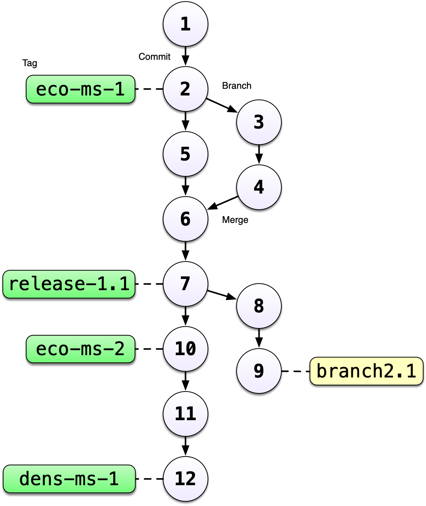

# Motivation

## Learning Objectives

In this lesson, you will learn:

- What computational reproducibility is and why it is useful
- How version control can increase computational reproducibility
- How to check to make sure your RStudio environment is set up properly for analysis
- How to set up git

## Reproducible Research

Reproducibility is the hallmark of science, which is based on empirical observations 
coupled with explanatory models.  While reproducibility encompasses 
the full science lifecycle, and includes issues such as methodological consistency and
treatment of bias, in this course we will focus on **computational reproducibility**: 
the ability to document data, analyses, and models sufficiently for other researchers 
to be able to understand and ideally re-execute the computations that led to 
scientific results and conclusions.

### What is needed for computational reproducibility?

The first step towards addressing these issues is to be able to evaluate the data,
analyses, and models on which conclusions are drawn.  Under current practice, 
this can be difficult because data are typically unavailable, the method sections
of papers do not detail the computational approaches used, and analyses and models
are often conducted in graphical programs, or, when scripted analyses are employed,
the code is not available.

And yet, this is easily remedied.  Researchers can achieve computational 
reproducibility through open science approaches, including straightforward steps 
for archiving data and code openly along with the scientific workflows describing 
the provenance of scientific results (e.g., @hampton_tao_2015, @munafo_manifesto_2017).

### Conceptualizing workflows

Scientific workflows encapsulate all of the steps from data acquisition, cleaning,
transformation, integration, analysis, and visualization.  

Workflows can range in detail from simple flowcharts 
to fully executable scripts. R scripts and python scripts are a textual form 
of a workflow, and when researchers publish specific versions of the scripts and 
data used in an analysis, it becomes far easier to repeat their computations and 
understand the provenance of their conclusions.

## How can version control help?

### The problem with renaming files

Every file in the scientific process changes.  Manuscripts are edited.
Figures get revised.  Code gets fixed when problems are discovered.  Data files
get combined together, then errors are fixed, and then they are split and 
combined again. In the course of a single analysis, one can expect thousands of
changes to files.  And yet, often all we use to track all these changes are duplicating files and embedding some logic into *filenames*.  
You might think there is a better way, and you'd be right: __version control__.

Version control systems help you track all of the changes to your files, without
the spaghetti mess that ensues from simple file renaming and duplication.  In version control systems
like `git`, the system tracks not just the name of the file, but also its contents,
so that when contents change, it can tell you which pieces went where.  It tracks
which version of a file a new version came from.  So its easy to draw a graph
showing all of the versions of a file, like this one:

Version control systems assign an identifier to every version of every file, and 
track their relationships. They also allow branches in those versions, and merging
those branches back into the main line of work.  They also support having 
*multiple copies* on multiple computers for backup, and for collaboration.
And finally, they let you tag particular versions, such that it is easy to return 
to a set of files exactly as they were when you tagged them.  For example, the 
exact versions of data, code, and narrative that were used when a manuscript was 
submitted might be `R2` in the graph above.

These versions a tight together as an history that you can navigate to go back to any specific version of a file. A more concrete example will be an R script. After implementing several modifications, you realize that your code is not working anymore, with version control you can go back to the previous version that used to work. 

## Collaborative Research

Most of the environmental sciences research is done in a collaborative set up. This especially true with the synthesis working group model that NCEAS has been using and refining over the years. These groups of experts with different background, tools and methods, have to collaborate together and build on others work (particularly data).

In this tight collaborative setup involving people from many different institutions, we recommend to manage your data and codes on a unique server / remote machine using the following strategies to centralize and share your work.

### Using Shared Folders for Data Sets

To centralize the management of your data, we recommend to set up shared folder (or also named directories) on the server and give access to all the members of your group. This will prevent the duplication of data and reduce the risk of people working on different versions of your data sets. Regarding your input data, we recommend to write protect them, so nobody can overwrite your original data on accident. For output data, you can develop different strategies. Note it is often useful to see the outputs data more as a secondary product of a specific version of your code. In other words, you should be always able to reproduce a specific results if you go back to the corresponding version of your code.

### Using git and GitHub for Codes

For code sharing, we recommend a different setup than the one for data. Your scripts should be stored under your personal folder on the server and you should not be sharing this folder with others. You should rely on a version control system to version and share your code. This will allow to manage more efficiently potential conflict between different versions of the same script. In this workshop, we will use git a version control system and relying on the service GitHub to share or code. T
