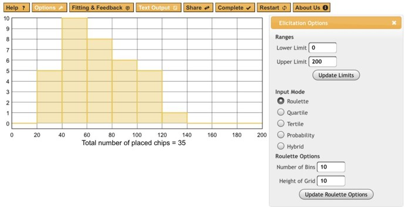

## Priors

### Learning Objectives

In this lesson you will learn: - Why and when to use informative priors, and how they can be helpful - How to elicit priors from yourself or other experts - How to specify priors from limited data - How to evaluate the sensitivity of your results to priors

### Background

What are priors?

Even outside of Bayesian statistics, the concept of priors is a core component of the scientific process - building on existing knowledge. Further, the use of informative priors is a way of getting the most out of your statistical analysis.

$$
\overbrace{P(\theta \mid X)}^{posterior} \propto \overbrace{P(X\mid \theta)}^{likelihood}\,\overbrace{P(\theta)}^{prior}
$$

### Conjugate Priors

Probability distributions have useful relationships. For simple models, Bayes' Theorem can be solved mathematically. This is very appealing when it applies.

The figure below shows some relationships among probability distributions are related. It comes from an [interactive website](https://www.johndcook.com/blog/conjugate_prior_diagram/) created by John Cook, which brings the paper "A compendium of conjugate priors" by Daniel Fink to life.


Digging into the math is mostly beyond the scope of this lesson, except for the following illustrative example. This example is provided to show how the prior, the sample size, and the variance of data influence the posterior estimate.

Consider the solution to the 'normal-normal' conjugate prior and likelihood.

If the prior mean is $\mu_0$ and the prior variance is $\sigma_0^2$

And the likelihood mean $\bar{x}$ and variance $s^2$:

Then the posterior mean is

$$
\frac{1}{\frac{1}{\sigma_0^2}+\frac{n}{\sigma^2}} \left(           \frac{\mu_0}{\sigma_0^2}+ \frac{\sum_{i=1}^{n}{x_i}}{\sigma^2}\right)
$$

And the posterior variance is:

$$
\left(
\frac{1}{\sigma_0^2} +\frac{n}{\sigma^2} 
\right)^{-1}
$$

**Questions:**

-   Is that math there just to scare you? (hint: *no*)
-   What happens when the prior variance, $\sigma^2_0$ , is very large?
-   What happens when the sample size, $n$, is very large?

<details>

Yes, that is correct. When the sample size and/or the prior variance is large, the influence of the prior diminishes to 0.

</details>

See also <https://ocw.mit.edu/courses/mathematics/18-05-introduction-to-probability-and-statistics-spring-2014/readings/MIT18_05S14_Reading15a.pdf> and <https://en.wikipedia.org/wiki/Conjugate_prior>

### Uniformative / Weak / Flat Priors

It is common to use what is known as a 'noninformative' or 'flat' prior. This is often the easiest approach, and is roughly defined by the fact that the priors have no influence on the model.

Some common non-informative priors include a standard normal with large variance, such as $N(0, 10^4)$ or a wide uniform distribution - such as $U(-10^4, 10^4)$.

**Discussion:**

-   If you were setting a prior on the size of a fish, what would your prior be?
-   That was a trick question - is size measured as mass or length? Hint: Consider a spherical fish with radius 1cm and density of 1g/ml. Recall $V=\frac{4}{3}\pi r^3$
-   When are informative priors useful?

```{r fig.height=3}
length <- runif(100000, -10000, 10000)
mass <- 4/3 * pi * (length / 2) ^ 3
par(mfrow=c(1,2))
hist(length, probability = TRUE, breaks = 100)
hist(mass, probability = TRUE, breaks = 100)
```

Correct, even a non-informative prior or 'flat' prior on length is not so flat on a different scale. Consider other transformations.

What else do you notice about the *range* of values? Correct, most of the measurements that we make are greater than zero. At a minimum, it is useful to have a prior with a lower bound at zero. These include the log-Normal, Gamma, Weibull, and many other distributions. But as soon as you specify a prior distribution, you are imposing your understanding on the model. This is okay! This is The Way!

In conclusion, there really is no such thing as a non-informative prior. However, it is often vastly easier to specify a weak prior than to go through the trouble of justifying an informative prior.

### Regularizing priors

Regularization priors are relatively non-informative, but on a similar scale as the data. These provide a way to assign 0 probability to impossible values (e.g. a boundary at zero) and to down weight extreme outlines.

### Informative Priors

Informative priors are particularly useful in contexts with limited available data.

In many cases, it will be possible for an expert to use what is already known about a variable to specify a more informative prior. In the ideal case, a posterior from a previous study can be used as the prior for the subsequent study. This is the first step toward iterative forecasting - updating a prediction as new information becomes available.

In practice, however, it is often wise to inflate the variance to account for differences across systems - the specific study system (Delta) and what is generally known about freshwater systems.

There are many sources of information from which you can specify priors, including:

1.  Expert knowledge, including biophysical constraints, logical bounds, or reasonable values based on experience (what are the upper and lower bounds for the length of a mouse?)
2.  Lots of data from prior studies on the same system.
3.  A little bit of data.
4.  A lot or a little bit of data, but from a related system
5.  Posterior from a related model, or from the same model at a prior time-step.

**Prior sensitivity**

It is prudent to test the sensitivity of your model to your prior assumptions. Having a model that is sensitive to priors is OK, especially when there is a strong rationale and support from data. However, it is necessary to understand how the use of an informative prior affects your posterior estimates.

It is very common when using strong priors to find that the MCMC chains do not converge, because the posteriors exist where the priors have very low probaility. This often leads you to uncover differences between how you and the computer understand your model (what you think the code says and what it actually says); it can also point to errors in the data (often related to scale, or unexpected factors that differ), and other assumptions.

If applicable, you can plot the data against the prior on Y. Plot the data against The easiest way to do this is to plot the prior PDFs and posterior histograms, and to compare the prior and posterior variances of each parameter. If the ratio of posterior:prior SD \> 0.1, you have an informative prior and you should be careful.

Think of this in the same way that you think of model specification. You can compare model posteriors fit with different priors in the same way that you can compare models with different structures or parameters, both visually and statistically.

### **Generating Priors based or Expert knowledge:**

**Package `rriskDistributions`**

The [rriskDistributions](http://cran.r-project.org/web/packages/rriskDistributions/index.html) is useful for estimating priors.

Individual functions for each distribution such as `get.<somedist>.par` include diagnostic plots that compare chosen points to cdf.

As an example, compute the parameters of a Gamma distribution that fits a median of 2.5 and has a 95%CI of [1, 10]:

```{r}
library(rriskDistributions)
get.gamma.par(p = c(0.025, 0.50, 0.975), q = c(1, 2.5, 10), tol = 0.1)
```

The function `fit.pecr` provides a GUI to explore the fits of a range of distributions, e.g.:

```{r eval=FALSE}
fit.perc(p = c(0.1, 0.5, 0.9), q = c(30, 60, 90), tolConv = 0.1)
```


**Web based elicitation tool**

<http://optics.eee.nottingham.ac.uk/match/uncertainty.php#> (Morris et al 2013)

 **Activity: Create your own priors**

Work with a partner in your project group

1.  Choose a parameter in one of the models that you are developing (e.g. growth rate of a fish population, lag between flooding event and peak phytoplankton concentration);
2.  Write down what you know about this based on your experience. Start with plausible ranges (max, min) then location of tails - 95% CI. Estimate most likely values and central tendencies (median, mode) last.
3.  Choose one of the tools above and generate a set of flat, weak / regularizing, and a strong prior.

### Statistical fitting to data

More formal, data driven examples are provided in LeBauer et al 2013. Not always worth the trouble. Some code in https://github.com/PecanProject/pecan/blob/develop/modules/priors/vignettes/priors_demo.Rmd

-   Maximum likelihood fitting of parametric distributions to related data


-   Bayesian 'posterior prediction' of an unobserved class for which data has been collected from other classes.

```r
model{  
    for (k in 1:length(Y)){
        Y[k]  ~ dnorm(beta.ft[ft[k]], tau.y[k])T(0,)
        tau.y[k] <- prec.y*n[k]
        u1[k] <- n[k]/2                             
        u2[k] <- n[k]/(2*prec.y)
        obs.prec[k] ~ dgamma(u1[k], u2[k])
    }
    for (f in 1:5){
        beta.ft[f] ~ dnorm(0, tau.ft)
    }
    tau.ft ~ dgamma(0.1, 0.1)
    prec.y    ~ dgamma(0.1, 0.1)     
    sd.y      <- 1 / sqrt(prec.y)
    ## estimating posterior predictive for new C4 species
    pi.pavi <- Y[length(Y)]	     
    diff <- beta.ft[1] - beta.ft[2]
}
```

{width="372"}

### References and further reading

David E. Morris, Jeremy E. Oakley, John A. Crowe, A web-based tool for eliciting probability distributions from experts, Environmental Modelling & Software, Volume 52, February 2014, Pages 1-4, ISSN 1364-8152, <http://dx.doi.org/10.1016/j.envsoft.2013.10.010>.

Gelman, Lawrence, et al "Prior choice recommendations" Stan Community Wiki <https://github.com/stan-dev/stan/wiki/Prior-Choice-Recommendations>
