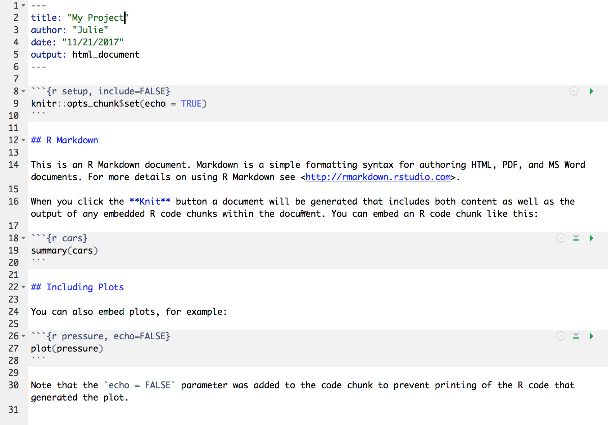

## Literate Analysis with RMarkdown

### Learning Objectives

In this lesson we will:

-   explore an example of RMarkdown as literate analysis
-   learn markdown syntax
-   write and run R code in RMarkdown
-   build and knit an example document

### Introduction and motivation

The concept of literate analysis dates to a [1984 article by Donald Knuth](http://www.literateprogramming.com/knuthweb.pdf). In this article, Knuth proposes a reversal of the programming paradigm.

> Instead of imagining that our main task is to instruct a *computer* what to do, let us concentrate rather on explaining to *human beings* what we want a computer to do.

If our aim is to make scientific research more transparent, the appeal of this paradigm reversal is immediately apparent. All too often, computational methods are written in such a way as to be borderline incomprehensible - even to the person who originally wrote the code! The reason for this is obvious, computers interpret information very differently than people do. By switching to a literate analysis model, you help enable human understanding of what the computer is doing. As Knuth describes, in the literate analysis model, the author is an "essayist" who chooses variable names carefully, explains what they mean, and introduces concepts in the analysis in a way that facilitates understanding.

RMarkdown is an excellent way to generate literate analysis, and a reproducible workflow. RMarkdown is a combination of two things - R, the programming language, and markdown, a set of text formatting directives. In R, the language assumes that you are writing R code, unless you specify that you are writing prose (using a comment, designated by `#`). The paradigm shift of literate analysis comes in the switch to RMarkdown, where instead of assuming you are writing code, Rmarkdown assumes that you are writing prose unless you specify that you are writing code. This, along with the formatting provided by markdown, encourages the "essayist" to write understandable prose to accompany the code that explains to the human-beings reading the document what the author told the computer to do, as opposed to just explaining to the computer what to do.

Before we dive in deeper, let's look at an example of what literate analysis with RMarkdown can look like using a real example. [Here](https://nceas.github.io/sasap-training/materials/reproducible_research_in_r_fairbanks/example-brood-table-analysis.html) is an example of a real analysis workflow written using RMarkdown.

Here are some things to notice about this document, which assembles a set of similar data sources on salmon brood tables with different formatting into a single data source.

-  It introduces the data sources using in-line images, links, interactive tables, and interactive maps.
-  An example of document formatting using R is shown.
-  The document executes a set of formatting scripts in a directory to generate a single merged file.
-  Some simple quality checks are performed (and their output shown) on the merged data.
-  Simple analysis and plots are shown.

In addition to achieving literate analysis, this document also represents a **reproducible analysis.** Because the entire merging and quality control of the data is done using the R code in the RMarkdown, if a new data source and formatting script are added, the document can be run all at once with a single click to re-generate the quality control, plots, and analysis of the updated data.

RMarkdown is an amazing tool to use for collaborative research, so we will spend some time learning it well now, and use it through the rest of the course.

### Setup

File -\> New File -\> RMarkdown... -\> Document of output format HTML, OK.

::: {style="width:300px"}

:::

You can give it a Title like "My Project". Then click OK.

### RMarkdown syntax

OK, first off: by opening a file, we are seeing the 4th pane of the RStudio console, which is essentially a text editor. This lets us organize our files within RStudio instead of having a bunch of different windows open.

Let's have a look at this file --- it's not blank; there is some initial text is already provided for you. Notice a few things about it:

-   There are white and grey sections. R code is in grey sections, and other text is in white.



<br>

Let's go ahead and "Knit HTML" by clicking the blue yarn at the top of the RMarkdown file. When you first click this button, RStudio will prompt you to save this file. Create a new folder for it somewhere that you will be able to find again (such as your Desktop or Documents), and name that folder something you'll remember (like `arctic_training_files`).

<br>


What do you notice between the two?

Notice how the grey **R code chunks** are surrounded by 3 backticks and `{r LABEL}`. These are evaluated and return the output text in the case of `summary(cars)` and the output plot in the case of `plot(pressure)`.

Notice how the code `plot(pressure)` is not shown in the HTML output because of the R code chunk option `echo=FALSE`.

More details...

This RMarkdown file has 2 different languages within it: **R** and **Markdown**.

We don't know that much R yet, but you can see that we are taking a summary of some data called 'cars', and then plotting. There's a lot more to learn about R, and we'll get into it for the next few days.

The second language is Markdown. This is a formatting language for plain text, and there are only about 15 rules to know.

Notice the syntax for:

-   **headers** get rendered at multiple levels: `#`, `##`
-   **bold**: `**word**`

There are some good [cheatsheets](https://github.com/adam-p/markdown-here/wiki/Markdown-Here-Cheatsheet) to get you started, and here is one built into RStudio: Go to Help \> Markdown Quick Reference <br /> <br />

**Important**: note that the hashtag `#` is used differently in Markdown and in R:

-   in R, a hashtag indicates a comment that will not be evaluated. You can use as many as you want: `#` is equivalent to `######`. It's just a matter of style.
-   in Markdown, a hashtag indicates a level of a header. And the number you use matters: `#` is a "level one header", meaning the biggest font and the top of the hierarchy. `###` is a level three header, and will show up nested below the `#` and `##` headers.

Learn more: <http://rmarkdown.rstudio.com/>

#### Your Turn

1.  In Markdown, Write some italic text, and make a numbered list. And add a few subheaders. Use the Markdown Quick Reference (in the menu bar: Help \> Markdown Quick Reference).
2.  Reknit your html file.

#### Code chunks

OK. Now let's practice with some of those commands.

Create a new chunk in your RMarkdown first in one of these ways:

-   click "Insert \> R" at the top of the editor pane
-   type by hand \`\`\`{r} \`\`\`
-   if you haven't deleted a chunk that came with the new file, edit that one

Now, let's write some R code.

    x <- 4*3
    x

Now, hitting return does not execute this command; remember, it's just a text file. To execute it, we need to get what we typed in the the R chunk (the grey R code) down into the console. How do we do it? There are several ways (let's do each of them):

1.  copy-paste this line into the console.

2.  select the line (or simply put the cursor there), and click 'Run'. This is available from

    a.  the bar above the file (green arrow)
    b.  the menu bar: Code \> Run Selected Line(s)
    c.  keyboard shortcut: command-return

3.  click the green arrow at the right of the code chunk

#### Your turn

Add a few more commands to your file. Execute them by trying the three ways above. Then, save your R Markdown file.

### Troubleshooting

#### My RMarkdown won't knit to PDF

If you get an error when trying to knit to PDF that says your computer doesn't have a LaTeX installation, one of two things is likely happening:

1.  Your computer doesn't have LaTeX installed
2.  You have an installation of LaTeX but RStudio cannot find it (it is not on the path)

If you already use LaTeX (like to write papers), you fall in the second category. Solving this requires directing RStudio to your installation - and isn't covered here.

If you fall in the first category - you are sure you don't have LaTeX installed - can use the R package `tinytex` to easily get an installation recognized by RStudio, as long as you have administrative rights to your computer.

To install `tinytex` run:

```{r, eval = F}
install.packages("tinytex")
tinytex::install_tinytex()
```

If you get an error that looks like `destination /usr/local/bin not writable`, you need to give yourself permission to write to this directory (again, only possible if you have administrative rights). To do this, run this command in the terminal:

    sudo chown -R `whoami`:admin /usr/local/bin

and then try the above install instructions again. More information about `tinytex` can be found [here](https://yihui.name/tinytex/)

### Exercise

Create an RMarkdown document with some of your own data. If you don't have a good dataset handy, use the example dataset here:

[Craig Tweedie. 2009. North Pole Environmental Observatory Bottle Chemistry. Arctic Data Center. doi:10.18739/A25T3FZ8X.](http://doi.org/10.18739/A25T3FZ8X)

Your document should contain the following sections:

-   Introduction to your dataset

    -   Include an external link

-   Simple analysis

-   Presentation of a result

    -   A plot
    -   In-line description of results

### Resources

-   [RMarkdown Reference Guide](https://www.rstudio.com/wp-content/uploads/2015/03/rmarkdown-reference.pdf)
