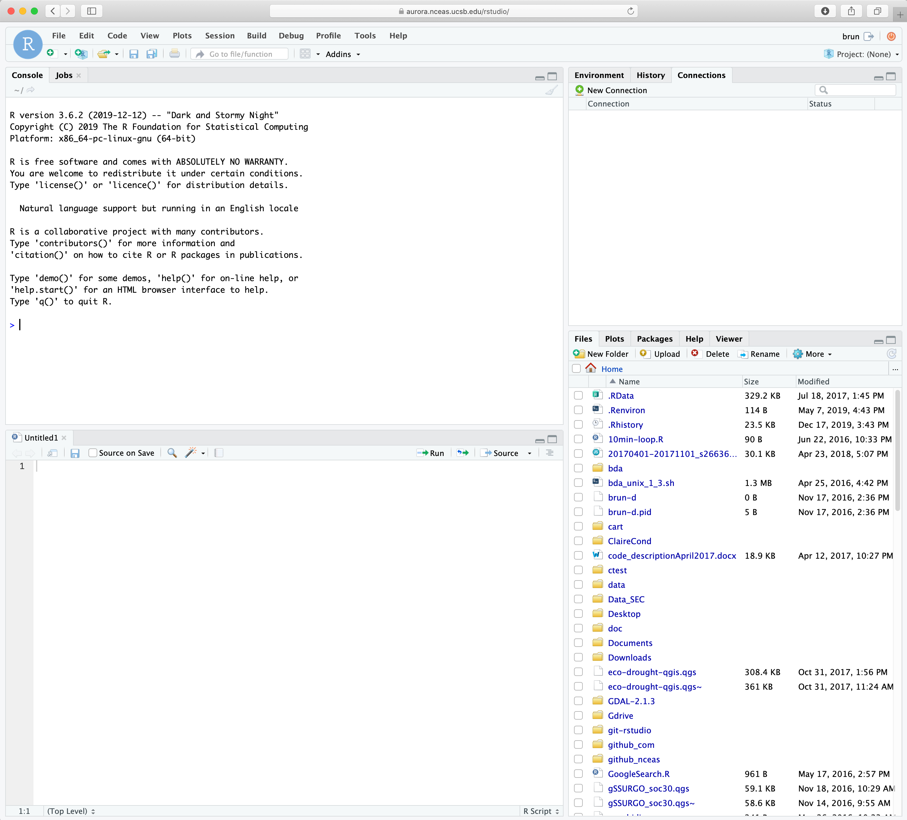

# Working on a Remote Machine

## Learning Objectives

In this lesson, you will learn:

- How to connect to a remote server 
- Get familiar with RStudio server


## Why working on a remote machine?

Often the main motivation is to **scale your analysis beyond what a personal computer can handle**. R being pretty memory intensive, moving to a server often provides you more RAM and thus allows to load larger data in R without the need of slicing your data into chunks. But there are also other advantages, here are the main for scientits:
* **Power**: More *CPUs/Cores* (24/32/48), More RAM (256/384GB) 
* **Capacity**: More *disk space* and generally* faster storage* (in highly optimized RAID arrays)
* **Security**: Data are spread across *multiple drives* and have nightly *backups*
* **Collaboration**: *shared folders* for code, data, and other materials; same *software versions*


### NCEAS analytical server

 - **88 logical cores** (vCPUs) / 44 physical cores with hyperthreading
 - **3.6 GHz Turbo** / 2.6 GHz minimum
 - **512 GB** 2133 MHz ECC DDR4 memory
 - **48 TB fast storage** array (RAID10 with 800GB SSD cache)
 - **Nightly Backups**

_=> For more info about Aurora: [https://help.nceas.ucsb.edu/high\_performance\_computing](https://help.nceas.ucsb.edu/high_performance_computing)_


### Working Group / Collaborative Setup

There are additional reasons of particular importance in a collaborative set up, such as a working group:
- **Centralizing data management**: As you know synthesis science is data intensive and often require to deal with a large number of heterogeneous data files. It can be complicated to make sure every collaborators as access to all the data they need. It is even harder to ensure that the exact same version of the data is used by everyone. Moving your workflow to a server, will allow to have only one copy of the data that you can share with all your collaborators. Even better, since everyone can access the same data, everybody will have the exact same path in their script!!
- **Make sure your files are safe**: Generally, servers are managed by a System Administrator. This person is in charge of keeping the server up-to-date, secured from malwares and set up back up strategies to ensure all the files on the server are backed up. When using cloud solutions, you should always check if a back up plan is available for the resources your using.


### What does working on a remote server means?

What does it mean for your workflow? The good news is that RStudio Server makes it very easy for RStudio users to start using a server for their analysis. The main changes are  about:
- File management: you will need to learn to move files (incluing your R scripts) to the server
- Package installation: You can still install the R packages you need under your user (with some limitations). However some R packages will be already installed at the server level.


## RStudio Server

```{r RStudio Server, echo=FALSE, out.width='90%', fig.align="center", fig.subcap="RStudio server IDE"}
  
```


From an user perspective, _RStudio Server is your familiar RStudio interface in your web browser_. The big difference however is that with RStudio Server the computation will be running on the remote machine instead of your local personal computer. This also means that **the files you are seeing through the RStudio Server interface are located on the remote machine. And this also include your R packages!!!** This remote file management is the main change you will have to adopt in your workflow. 

To help with remote files management, the RStudio Server interface as few additional features that we will be discussing in the following sections.


### Connecting to NCEAS Analytical Server

1. Got to: <https://aurora.nceas.ucsb.edu/> 

2. Select `Login to RStudio Server`

3. Enter your credentials

4. You are in!


