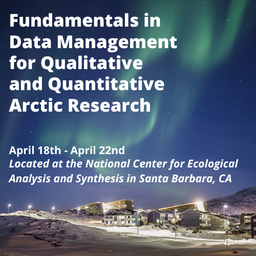
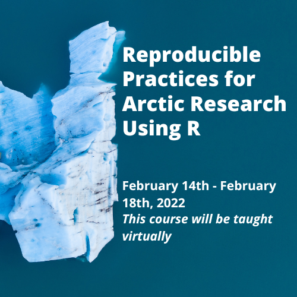
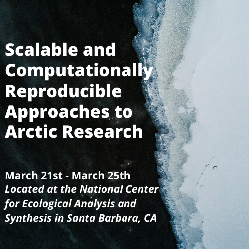

# Welcome and Introductions


This course is one of three that we are currently offering, covering fundamentals of open data sharing, reproducible research, ethical data use and reuse, and scalable computing for reusing large data sets.

```{r, course-figs, echo = FALSE}
par(mfrow=c(1,3))



```

```{r, child = 'sections/adc-intro-to-policies.Rmd'}
```
