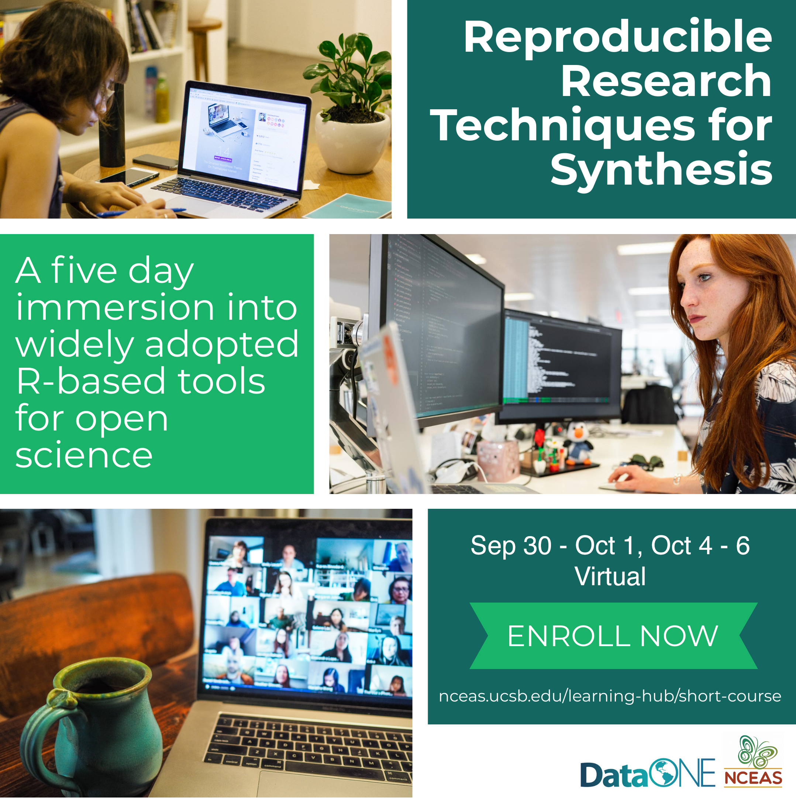

# Session 2: Data Modeling

```{r, child = 'sections/data-modeling.Rmd'}
```

## For more learning: Reproducible Research in R

This workshop is a shortened version of our week long course in reproducible research. The week long course expands on these ideas and teaches software tools such as:

* git/GitHub
* Rmarkdown
* wrangling data with the `tidyverse` in R
* data visualization in R
* writing functions and packages
* writing reproducible papers

Learn more about our short course at: [https://www.nceas.ucsb.edu/learning-hub/short-course](https://www.nceas.ucsb.edu/learning-hub/short-course)


## Zoom chat transcript

10:36:11 From Jeanette Clark to Everyone: https://learning.nceas.ucsb.edu/2021-08-esa/index.html
10:39:24 From Linda Auker to Everyone: Hi Everyone - I am an Assistant Professor of Biology at Misericordia University (in Northeastern PA). I teach upper level ecology courses and biostats. I feel like I should be better at data management since i am an active researcher because I never really got “formal” training in it! :) So glad for this course to fill the gaps.
10:39:39 From Gina Contolini to Everyone: Hello! I’m Gina, I work with California Sea Grant and the California Department of Fish and Wildlife. I use data for marine research and management. *thumbs up* for data mgmt.
10:39:39 From Kristin Kaser to Everyone: Hello all,
10:39:43 From Emily Booth (she/they) to Everyone: Hi! I'm Emily and I'm a postdoc in forest/fire ecology at Temple University (Pennsylvania, USA). I've worked mostly with large datasets collected by other people so....data cleaning PARTY
10:40:53 From Elizabeth Sudduth (she/her) to Everyone: Hey, y’all. I teach biology and environmental science at Georgia Gwinnett College in suburban Atlanta and do urban stream research. I’m self-taught in data management and know that I have gaps in things no one ever told me.
10:40:53 From Angelica Patterson to Everyone: Nice to meet everyone. I'm Angie from Black Rock Forest (Cornwall, NY) and we collect long-term environmental data and I am interested in using it more efficiently for K-12 education.
10:41:12 From Elizabeth Bach to Everyone: Elizabeth Bach, I work with The Nature Conservancy at a preserve, Nachusa Grasslands, in northern Illinois. I'm looking forward to learning more about data management as I work to coalesce and use monitoring data from Nachusa for analysis.
10:41:17 From Kristin Kaser to Everyone: I'm a Plant Ecologist for the Idaho National Laboratory located in sagebrush steppe in eastern Idaho. I work with compiled long term data sets on vegetation composition.
10:41:37 From Nick Anderson (he/him) to Everyone: Hello! I'm Nick and I'm a new postdoc in pollinator ecology at the University of Illinois. I collect lots of community and environmental data at different scales so managing it can get... tricky.
10:41:48 From Amy Wyeth (she/her) to Everyone: Im Amy Wyeth. Im a graduate student at the University of Washington, School of Oceanography. My research looks at the effects of climate change (mostly hypoxia) on zooplankton ecology/behavior/distributions. Data management is getting better but still novice.
10:41:50 From Matteo Rizzuto (he/him) to Everyone: Hello everyone. I am a PhD Candidate at Memorial University of Newfoundland and Labrador (Canada), joining remotely from Italy. I work with both empirical data and math models. I am here because I am mostly self-taught at data management and I feel like I need some more formal, structure training as I get into the postdoc-stage of my career.
10:41:53 From Scott to Everyone: Hello, I am a PhD student at the University of Louisville studying the ecology and behavior of cave salamanders, since we take long term data on each individual we can identify.
10:41:53 From Katie Eckhoff to Everyone: Hi! I'm a PhD candidate at the University of Kansas. My project involves a lot of long-term data, so I've been trying to clean and organize very messy data, and create a plan for future data collection/management.
10:42:04 From ned.fetcher to Everyone: I’m a plant ecologist at Wilkes University. I’ve collected a lot of data, but management has always been haphazard
10:45:18 From Karen M. Pedersen to Everyone: Hello! I am a PhD student at the TU Darmstadt in Germany. I have a lot of small interoperable data sets. But I am also starting to help with the data organization for a large international project. I really need to up my game :).
10:45:43 From Vallari Sheel to Everyone: I'm a PhD candidate at North Carolina State University. I have been collecting data, and while I know data management is of the utmost importance, I have really struggled with following good data management practices.
10:55:59 From Chloe Wasteneys to Everyone: Hi everyone! My name is Chloe Wasteneys. I am an MS student at Montana State University where I am researching inter- and intraspecific variation in physiological traits and stress tolerances of 3 species of high-elevation pines. I am beginning to write my thesis and will be done in May, so good data organization and analysis are very important to me right now :) Nice to meet you all.
11:06:17 From Elizabeth Bach to Everyone: I'm working with a lot of data that was collected by contract ecologists/botanists, who were paid for collecting the data. I always include their names as original data collectors and acknowledgements, but struggle with whether to include them as authors on data publications. Are there any best practices for this?
11:08:04 From Jeanette Clark to Everyone: Authorship is often difficult to navigate. Frequently, the easiest way to resolve these issues is to have an authorship policy document that is agreed to by all parties prior to starting the project - so that way as a group you can decide what types of contributions merit an author role
11:09:33 From Jeanette Clark to Everyone: I think the best practices are less associated with who should or should not be included on the list, but instead the best practices are around the methodology used to come to that list
11:13:17 From Elizabeth Bach to Everyone: Thanks, helpful. A lot of this data was collected 20-30 years ago and the contractors are not always contactable anymore. Are there any resources or samples of these methodologies? I'd like to work on putting together a universal approach for our work moving forward.
11:13:32 From Jeanette Clark to Everyone: Yes let me find you one
11:14:52 From Jeanette Clark to Everyone: Here is a link to a module we taught on this in our last full-length course: https://learning.nceas.ucsb.edu/2021-07-RRCourse/session-11a-social-aspects-of-collaboration.html#collaboration-authorship-and-data-policies
11:15:06 From Elizabeth Bach to Everyone: Thanks!
11:15:19 From Jeanette Clark to Everyone: embedded there is an example authorship agreement (hopefully this link works) http://training.arcticdata.io/2020-10-arctic/files/template-authorship-policy-ADC-training.docx
11:15:23 From Jeanette Clark to Everyone: you are welcome!
11:16:29 From Elizabeth Bach to Everyone: Perfect!
11:19:16 From Vallari Sheel to Everyone: What about the Dryad data repository?
11:20:22 From Jeanette Clark to Everyone: Dryad is a great repository, they use a different metadata standard than EML but follow similar principles described here
11:21:06 From Vallari Sheel to Everyone: Ok, thanks!
11:21:53 From Jeanette Clark to Everyone: There are many, many repositories out there. One place to search them all is re3data.org
11:22:23 From Vallari Sheel to Everyone: Ok
11:24:50 From ned.fetcher to Everyone: I  have been using JMP for years. It has scripting capabilities, but the scripts may not be usable by folks without JMP licenses. Do I have to convert my scripts to R?
11:27:42 From Jeanette Clark to Everyone: Using JMP is a step up from many other GUI based processing tools. It might not be my first choice though, because of the licensing issues that you describe. It falls into a similar camp of MATLAB and SAS for me, in that it requires a license, but it is a powerful processing tool that many people have very good reason to use. I think ideally, it would be good to consider moving to an open source language like R or Python, but that’s likely something that is better to consider as a long term shift as opposed to trying to convert all of your scripts right now, for example
11:34:17 From Gina Contolini to Everyone: I agree with Jeanette on that one
11:35:49 From Jeanette Clark to Everyone: I could type much more - even convering
11:36:24 From Gina Contolini to Everyone: re: JMP to R, I think it if you explain your analyses clearly, folks could conceivably reproduce your analysis in R given the original data. So maybe have a more robust stats analysis description in your methods section?
11:36:33 From Jeanette Clark to Everyone: even converting to R or Python isn’t an assurance that someone will be able to actually run your code - there are many other factors including how the code was written, library dependencies, version changes, etc
11:38:13 From Gina Contolini to Everyone: JMP scripts aren’t in plain text?
11:40:53 From Jeanette Clark to Everyone: My intuition tells me that they likely are though I haven’t used JMP myself so couldn’t say for sure.
11:43:28 From ned.fetcher to Everyone: Yes, they are, but only JMP can interpret them. They would need to be translated to be used in R or Python
11:43:53 From Jeanette Clark to Everyone: jclark@nceas.ucsb.edu
11:44:34 From Gina Contolini to Everyone: I have not explored this at all yet, but something to consider if you haven’t looked into JMP to R integration methods: https://www.jmp.com/en_us/events/ondemand/mastering-jmp/jmp-and-r-integration.html
11:45:25 From Gina Contolini to Everyone: apologies if you are already well aware of stuff like that
11:51:01 From Karen M. Pedersen to Everyone: Are there some examples of good files names? I always struggle with this.
11:51:59 From Gina Contolini to Everyone: author_shortdescription_date.csv ??
11:52:25 From Gina Contolini to Everyone: [date in unambiguous format, like YYY-MM-DD]
11:52:31 From Gina Contolini to Everyone: YYYY*
11:52:49 From Elizabeth Bach to Everyone: I like to use: YearMonthDay_Project_datatype example: 20210806_DataWorkshop_plants.csv
11:53:04 From ned.fetcher to Everyone: Can you enlarge the type? It’s very small on my laptop
11:53:18 From Emily Booth (she/they) to Everyone: I don't know if you're ever in this position, but when I write protocol for the foresters I work with I specify the exact file format in the directions, so everyone (foresters, technicians, interns) will be saving them the same way. helps a lot down the line
11:53:59 From Emily Booth (she/they) to Everyone: like the YearMonthDay_Project_datatype.csv that Elizabeth gave
11:54:12 From ned.fetcher to Everyone: good
11:54:29 From Karen M. Pedersen to Everyone: Thanks! That is helpful.
11:55:01 From Gina Contolini to Everyone: Just a reminder to folks that all the slides are available here: https://learning.nceas.ucsb.edu/2021-08-esa/session-2-data-modeling.html
11:55:10 From Emily Booth (she/they) to Everyone: I get handed datasets that look like this a lot to work with and spend a lot of time re-organizing--is that the kind of thing that OpenRefine would be helpful for reformatting?
11:55:12 From Gina Contolini to Everyone: so you can zoom in even more on your own screen!
11:56:07 From Amber Budden to Everyone: That’s a great point Emlly - there is variation in file naming and best practices covers what should be included (examples above great). Having a convention within a lab / group and including that in a data policy or some such is great.
11:56:26 From Gina Contolini to Everyone: agreed!
11:58:02 From Amber Budden to Everyone: We point to this lab policy as a great example. It doesn’t cover filenames but does provide a lot of guidance for lab members. https://github.com/temporalecologylab/labgit/blob/master/datacodemgmt/tempeco_DMP.pdf
11:58:16 From Katie Eckhoff to Everyone: It is better/required to put the _ between words rather than spaces? The only reason I say this is that it makes it impossible to search for any particular data file. I inherited a large very messy data collection and had a really hard time finding things.
11:58:23 From Amber Budden to Everyone: Lizzie has provided permission for us to share and is comfortable with others using it as a template
11:59:12 From Amber Budden to Everyone: Yes, using _ makes the text more machine readable. Some software doesn’t like spaces.
12:00:57 From Gina Contolini to Everyone: observed entities are “name” ?
12:08:46 From Gina Contolini to Everyone: Nope I understood all that and looking forward to the next part.
12:10:45 From Gina Contolini to Everyone: primary key: “id” and foreign key: “site”?
12:11:03 From Amber Budden to Everyone: 👍🏼
12:12:36 From Gina Contolini to Everyone: I’ve seen folks who number their rows (possibly like the “id” column here) but I don’t understand why. Why number the rows?
12:14:14 From Gina Contolini to Everyone: ok thanks!
12:17:28 From Gina Contolini to Everyone: these diagrams are excellent!
12:20:59 From Karen M. Pedersen to Everyone: What was the book you mentioned?
12:21:12 From Jeanette Clark to Everyone: R for Data Science, Hadley Wickham
12:21:31 From Amber Budden to Everyone: https://r4ds.had.co.nz
12:21:39 From ned.fetcher to Everyone: how would you upload a database created in mySQL to a data center?
12:24:22 From Amber Budden to Everyone: It will depend on the data center. Typically you will work with a curator to appropriately structure the data package. Jeanette can talk about the process at KNB shortly.
12:39:23 From Amber Budden to Everyone:
	Group 1: https://projects.invisionapp.com/freehand/document/Y0li85pSK
	Group 2: https://projects.invisionapp.com/freehand/document/sJ6ERLEtG
	Group 3: https://projects.invisionapp.com/freehand/document/6jCq7CfQd
13:12:40 From Gina Contolini to Everyone: thanks Elizabeth
13:18:04 From Linda Auker to Everyone: Yes! We discussed that too. Forgot to mention that!
13:19:43 From Emily Booth (she/they) to Everyone: go team(s) :D
13:19:56 From Linda Auker to Everyone: Oops, we didn’t notice it wasn’t NOT a marginal sum…very good catch, Group 3!
13:21:14 From Elizabeth Bach to Everyone: plant species
13:25:14 From Matteo Rizzuto (he/him) to Everyone: There’s software that can produce electronic data collection sheet that do the relational database work upfront. It can be an investment, funds-wise, at the beginning of a project but it pays off in the long term in my experience. Far less work to tidy up data and far less chances of human data entry/transfer error
13:26:34 From Amber Budden to Everyone: Matteo - which software do you use?
13:28:36 From Matteo Rizzuto (he/him) to Everyone: FileMaker Pro. It’s propietary but it exports to .csv. When I used it (~5 years ago) it had no cloud features, all the data-related actions where done on device (tablet, smartphone). I am not sure about that now
13:30:46 From Linda Auker to Everyone: Great course - thank you so much! :)
13:30:49 From Emily Booth (she/they) to Everyone: Thanks so much! This was super helpful
13:30:56 From Gina Contolini to Everyone: Thank you!
13:30:56 From Elizabeth Bach to Everyone: Thank you!
13:30:58 From Kristin Kaser to Everyone: Thank you!
13:30:59 From Matteo Rizzuto (he/him) to Everyone: Yeah, this was really helpful. Thanks you!
13:31:04 From Amy Wyeth (she/her) to Everyone: Yeah, this was really helpful!
13:31:06 From Elizabeth Sudduth (she/her) to Everyone: Thank you! This was really cool!
13:31:07 From Karen M. Pedersen to Everyone: Thank you!!!
13:31:11 From Jeanette Clark to Everyone: jclark@nceas.ucsb.edu
13:31:17 From ned.fetcher to Everyone: Thank you!
13:31:20 From Jeanette Clark to Everyone: aebudden@nceas.ucsb.edu


