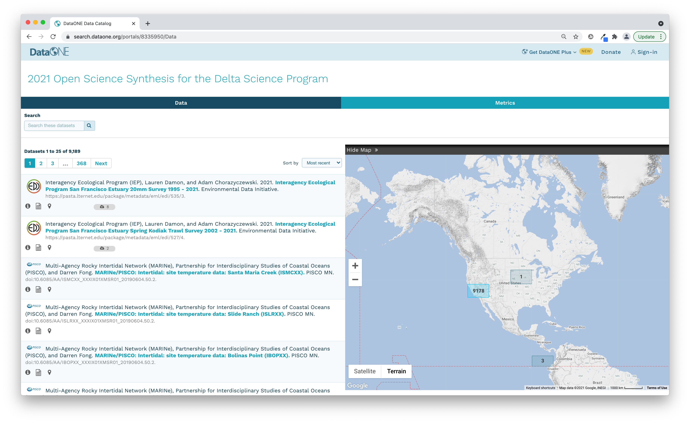
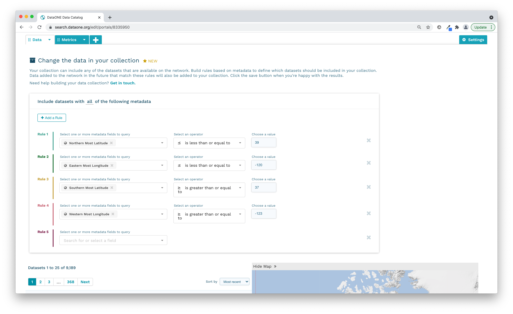

# Session 9: Hands On: Exploration of Data Resources and Synthesis Development

## Datasets of Interest

There is an excel spreadsheet of datasets of interest located in the sharepoint [here](https://deltacouncil.sharepoint.com/:x:/r/sites/Extranet-Science/Shared%20Documents/NCEAS-DSP%20working%20group/Questions%20and%20datasets.xlsx?d=w18c2ec2f348741e1b2cae309dc15c874&csf=1&web=1&e=mhVBhB). The vast majority of these datasets are already available online, in some form, which makes synthesis much easier. There are several other datasets that are not yet published, but will be published by week two of the workshop. 

This chart shows a summary of the excel spreadsheet, with links to published datasets on the left side, and hover text with more information over each bar. The datasets have been categorized (very loosely) into groups, though many of the fish datasets also contain water quality or plankton data.

```{r, echo = FALSE, message = FALSE, fig.height = 10}
library(plotly)
library(dplyr)

# Read in data
df <- read.csv("data/datasets.csv", stringsAsFactors = F) %>% 
    arrange(Classification)

df$legend <- !duplicated(df$Classification)

# Convert to dates
df$Start <- as.Date(paste0(df$Start, "-01-01"))
df$End <- as.Date(paste0(df$End, "-12-31"))

for (i in 1:nrow(df)){
    if (!is.na(df$Published.Data[i])){
            df$Published.Data.Link[i] <- paste0('<a href="', df$Published.Data[i], '">', df$Name[i], '</a>')
    }
    else if (is.na(df$Published.Data[i])){
        df$Published.Data.Link[i] <-  df$Published.Data[i]
    }

}


# Choose colors based on number of resources
cols <- RColorBrewer::brewer.pal(length(unique(df$Classification)), name = "Set3")
df$color <- factor(df$Classification, labels = cols)

# Initialize empty plot
fig <- plot_ly()

for(i in 1:(nrow(df))){
 fig <- add_trace(fig,
                 type = "scatter",
                 x = c(df$Start[i], df$End[i]),  # x0, x1
                 y = c(i, i),  # y0, y1
                 mode = "lines",
                 line = list(color = df$color[i], width = 10),
                 name = df$Classification[i],
                 showlegend = df$legend[i],
                 hoverinfo = "text",
                 # Create custom hover text
                 text = paste("Agency: ", df$Agency[i], "<br>",
                              "Parameters: ", df$Parameter.s.[i]), "<br>",
                              "Resolution:", df$Sampling.frequency)
}

fig <- layout(fig,
            xaxis = list(showgrid = F, tickfont = list(color = "black")),
            yaxis = list(showgrid = T, tickfont = list(color = "black"),
                         tickmode = "array",
                         tickvals = 1:nrow(df),
                         ticktext = unique(df$Published.Data.Link),
                         domain = c(0, 0.9)),
            hovermode = "closest",
            legend = list(orientation = "h",
                          bordercolor = "black",
                          borderwidth = 2))


fig
```

## Finding more data

If, in exploring and discussing the information above, groups decide they are missing pieces of data, searching through DataONE is a good start. We created a trial data portal on DataONE that shows just datasets in our geographic area of interest. [You can view the portal here](https://search.dataone.org/portals/8335950).



A portal is a collection of DataONE federated repository data packages on a unique webpage. This portal was constructed by defining geographic boundaries for the region of interest and it displays 9,189 data packages from within the DataONE collection of over 838K. This is a dynamic subset that will continue to grow as new data are added to repositories within the DataONE network.



Typically, a research project’s website won’t be maintained beyond the life of the project and all the information on the website that provides context for the data collection is lost. Portals can provide a means to preserve information regarding the projects’ objectives, scopes, and organization and couple this with the data files so it’s clear how to use and interpret the data for years to come. Plus, when datasets are scattered across the repositories in the DataONE network, portals can help see them all in one convenient webpage.

Portals also leverage DataONE’s metric features, which create statistics describing the project’s data packages. Information such as total size of data, proportion of data file types, and data collection periods are immediately available from the portal webpage.

[Here](https://search.dataone.org/portals/SASAP) is an example of a fully fledged data portal that contains not only searchable raw and derived data, but also pages describing the process, people, and key results of the working groups.
