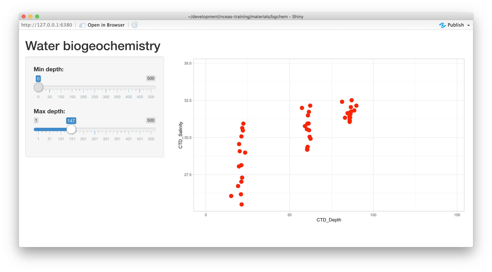
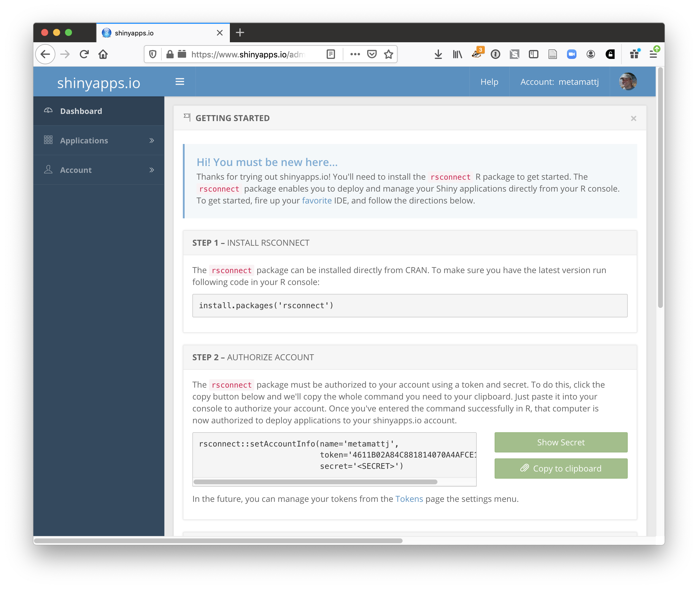
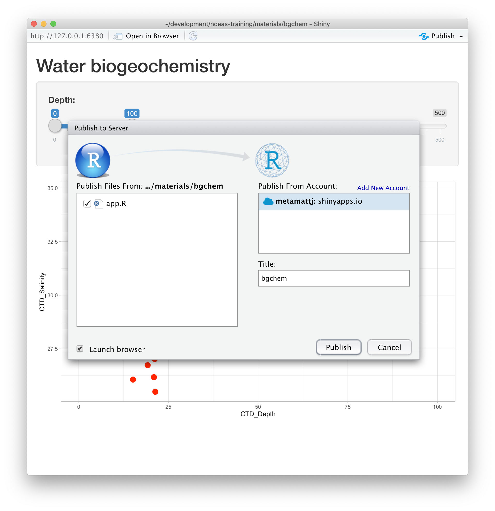

# Introduction to Shiny

## Learning Objectives

In this lesson we will:

- review the capabilities in Shiny applications
- learn about the basic layout for Shiny interfaces
- learn about the server component for Shiny applications
- build a simple shiny application for interactive plotting

## Overview

[Shiny](http://shiny.rstudio.com/) is an R package for creating interactive data visualizations embedded in a web application that you and your colleagues can view with just a web browser. Shiny apps are relatively easy to construct, and provide interactive features for letting others share and explore data and analyses.

There are some really great examples of what Shiny can do on the RStudio webite like [this one exploring movie metadata](https://shiny.rstudio.com/gallery/movie-explorer.html). A more scientific example is a tool from the SASAP project exploring [proposal data from the Alaska Board of Fisheries](https://sasap-data.shinyapps.io/board_of_fisheries/).

```{r shinyapp_sasap, echo=FALSE}
knitr::include_graphics("images/shiny-sasap-app.png")
```

Most any kind of analysis and visualization that you can do in R can be turned into a useful interactive visualization for the web that lets people explore your data more intuitively  But, a Shiny application is not the best way to preserve or archive your data.  Instead, for preservation use a repository that is archival in its mission like the [KNB Data Repository](https://knb.ecoinformatics.org), [Zenodo](https://zenodo.org), or [Dryad](https://datadryad.org). This will assign a citable identfier to the specific version of your data, which you can then read in an interactive visualiztion with Shiny.

For example, the data for the Alaska Board of Fisheries application is published on the KNB and is citable as:

Meagan Krupa, Molly Cunfer, and Jeanette Clark. 2017. Alaska Board of Fisheries Proposals 1959-2016. Knowledge Network for Biocomplexity. [doi:10.5063/F1QN652R](https://doi.org/10.5063/F1QN652R). 

While that is the best citation and archival location of the dataset, using Shiny, one can also provide an easy-to-use exploratory web application that you use to make your point that directly loads the data from the archival site.  For example, the Board of Fisheries application above lets people who are not inherently familiar with the data to generate graphs showing the relationships between the variables in the dataset.

We're going to create a simple shiny app with two sliders so we can interactively control inputs to an R function.  These sliders will allow us to interactively control a plot.

## Create a sample shiny application

- File > New > Shiny Web App...
- Set some fields:

    - Name it "myapp" or something else
    - Select "Single File"
    - Choose to create it in a new folder called 'shiny-demo'
    - Click Create

RStudio will create a new file called `app.R` that contains the Shiny application.  
Run it by choosing `Run App` from the RStudio editor header bar.  This will bring up
the default demo Shiny application, which plots a histogram and lets you control
the number of bins in the plot.


Note that you can drag the slider to change the number of bins in the histogram.

## Interactive scatterplots

Let's modify this application to plot water biogeochemistry data in a scatterplot, and allow
aspects of the plot to be interactively changed.

### Load data for the example

Navigate to this dataset by Craig Tweedie that is published on the Arctic Data Center. 
[Craig Tweedie. 2009. North Pole Environmental Observatory Bottle Chemistry. Arctic Data Center. 
doi:10.18739/A25T3FZ8X.](http://doi.org/10.18739/A25T3FZ8X), and copy the URL for the first csv file 
called "BGchem2008data.csv"

The data can be read into the application using `read.csv()`.  The data contains chemistry measurements at various times and stations.

```{r load_bgchem}
data_url <- "https://arcticdata.io/metacat/d1/mn/v2/object/urn%3Auuid%3A35ad7624-b159-4e29-a700-0c0770419941"
bg_chem <- read.csv(data_url, stringsAsFactors = FALSE)

# Sometimes you need to wrap the web address in url() on some platforms
#bg_chem <- read.csv(url(data_url, method = "libcurl"), stringsAsFactors = FALSE)
names(bg_chem)
```

### Add a simple scatterplot using ggplot

A number of chemistry parameters are sensitive to depth, so let's start by plotting `CTD_Salinitiy` as
a function of `CTD_Depth`.  We do so by switching out the histogram code for a simple ggplot, like so:

```{r server_chunk, eval=FALSE}
server <- function(input, output) {

    output$distPlot <- renderPlot({

        ggplot(bg_chem, mapping = aes(CTD_Depth, CTD_Salinity)) +
            geom_point(colour="red", size=4) +
            theme_light()
    })
}
```

If you now reload the app, it will display the simple scatterplot instead of
the histogram.  At this point, we haven't added any interactivity.

In a Shiny application, the `server` function provides the part of the application
that creates our interactive components, and returns them to the user interface (`ui`)
to be displayed on the page.

### Add sliders to set the min depth and max depth for the X axis

To make the plot interactive, first we need to modify our user interface to include
widgits that we'll use to control the plot.  Specifically, we will add a new slider
for setting the `mindepth` parameter, and modify the existing slider to be used for
the `maxdepth` parameter.  To do so, modify the `sidebarPanel()` call to include two
`sliderInput()` function calls:

```{r ui_chunk, eval=FALSE}
        sidebarPanel(
            sliderInput("mindepth", "Min depth:", min = 0, max = 500, value = 0),
            sliderInput("maxdepth", "Max depth:", min = 1, max = 500, value = 50)
        )
```

If you reload the app, you'll see two new sliders, but if you change them, they don't
make any changes to the plot. Let's fix that.

### Connect the slider values to the plot

Finally, to make the plot interactive, we can use the `input` and `output` variables
that are passed into the `server` function to access the current values of the sliders.
In Shiny, each UI component is given an input identifier when it is created, which is used as the name of the value in the input list.  So, we can access the minimum depth as `input$mindepth` and
the max as `input$maxdepth`.  Let's use these values now by adding limits to our X axis
in the ggplot:

```{r shiny_ggplot_interactive, eval=FALSE}
        ggplot(bg_chem, mapping = aes(CTD_Depth, CTD_Salinity)) +
            geom_point(colour="red", size=4) +
            xlim(input$mindepth,input$maxdepth) +
            theme_light()
```

At this point, we have a fully interactive plot, and the sliders can be used to change the
min and max of the Depth axis.



Looks so shiny!

### Negative depths?

What happens if a clever user sets the minimum for the X axis at a greater value than the maximum?
You'll see that the direction of the X axis becomes reversed, and the plotted points display right
to left.  This is really an error condition.  Rather than use two independent sliders, we can modify 
the first slider to output a range of values, which will prevent the min from being greater than
the max.  You do so by setting the value of the slider to a vector of length 2, representing 
the default min and max for the slider, such as `value = c(0,100)`.  So, delete the second slider,
rename the first, and provide a vector for the value, like this:

```{r shiny_sidebar, eval=FALSE}
        sidebarPanel(
            sliderInput("depth", "Depth:", min = 0, max = 500, value = c(0,100))
        )
```

Now, modify the ggplot to use this new `depth` slider value, which now will be returned
as a vector of length 2. The first element of the depth vector is the min, and the
second is the max value on the slider.

```{r shiny_limvector, eval=FALSE}
        ggplot(bg_chem, mapping = aes(CTD_Depth, CTD_Salinity)) +
            geom_point(colour="red", size=4) +
            xlim(input$depth[1],input$depth[2]) +
            theme_light()
```


## Shiny architecture

A Shiny application consists of two functions, the `ui` and the `server`.  The `ui`
function is responsible for drawing the web page, while the `server` is responsible 
for any calculations and for creating any dynamic components to be rendered.

Each time that a user makes a change to one of the interactive widgets, the `ui`
grabs the new value (say, the new slider min and max) and sends a request to the
`server` to re-render the output, passing it the new `input` values that the user
had set.  These interactions can sometimes happen on one computer (e.g., if the 
application is running in your local RStudio instance).  Other times, the `ui` runs on
the web browser on one computer, while the `server` runs on a remote computer somewhere
else on the Internet (e.g., if the application is deployed to a web server).

## Publishing Shiny applications

Once you've finished your app, you'll want to share it with others. TO do so, you need to
publish it to a server that is set up to [handle Shiny apps](https://shiny.rstudio.com/deploy/).  
Your main choices are:

- [shinyapps.io](http://www.shinyapps.io/) (Hosted by RStudio)
    - This is a service offered by RStudio, which is initially free for 5 or fewer apps
      and for limited run time, but has paid tiers to support more demanding apps.  You 
      can deploy your app using a single button push from within RStudio.
- [Shiny server](https://www.rstudio.com/products/shiny/shiny-server/) (On premises)
    - This is an open source server which you can deploy for free on your own hardware.
      It requires more setup and configuration, but it can be used without a fee.
- [RStudio connect](https://www.rstudio.com/products/connect/) (On premises)
    - This is a paid product you install on your local hardware, and that contains the most 
      advanced suite of services for hosting apps and RMarkdown reports.  You can
      publish using a single button click from RStudio.
      
A comparison of [publishing features](https://rstudio.com/products/shiny/shiny-server/) is available from RStudio.

### Publishing to shinyapps.io

The easiest path is to create an account on shinyapps.io, and then configure RStudio to
use that account for publishing.  Instructions for enabling your local RStudio to publish
to your account are displayed when you first log into shinyapps.io:



Once your account is configured locally, you can simply use the `Publish` button from the
application window in RStudio, and your app will be live before you know it!



## Summary

Shiny is a fantastic way to quickly and efficiently provide data exploration for your
data and code.  We highly recommend it for its interactivity, but an archival-quality
repository is the best long-term home for your data and products.  In this example, 
we used data drawn directly from the [KNB repository](http://doi.org/10.18739/A25T3FZ8X)
in our Shiny app, which offers both the preservation guarantees of an archive, plus
the interactive data exploration from Shiny.  You can utilize the full power of R and
the tidyverse for writing your interactive applications.

## Full source code for the final application

```{r shinyapp_source, eval=FALSE}
library(shiny)
library(ggplot2)

# Load our data from http://doi.org/10.18739/A25T3FZ8X, and download the first csv file 
# called "BGchem2008data.csv". The data URL is: 
data_url <- "https://arcticdata.io/metacat/d1/mn/v2/object/urn%3Auuid%3A35ad7624-b159-4e29-a700-0c0770419941"
bg_chem <- read.csv(data_url, stringsAsFactors = FALSE)
#bg_chem <- read.csv(url(data_url, method = "libcurl"), stringsAsFactors = FALSE)

# Define UI for application that draws a histogram
ui <- fluidPage(

    # Application title
    titlePanel("Water biogeochemistry"),

    # Sidebar with a slider input for number of bins 
    sidebarLayout(
        sidebarPanel(
            sliderInput("depth", "Depth:", min = 0, max = 500, value = c(0,100))
        ),

        # Show a plot of the generated scatterplot
        mainPanel(
           plotOutput("distPlot")
        )
    )
)

# Define server logic for rendering a scatterplot
server <- function(input, output) {

    output$distPlot <- renderPlot({

        ggplot(bg_chem, mapping = aes(CTD_Depth, CTD_Salinity)) +
            geom_point(colour="red", size=4) +
            xlim(input$depth[1],input$depth[2]) +
            theme_light()
    })
}

# Run the application 
shinyApp(ui = ui, server = server)
```

## A more complex example

```{r}
library(shiny)
library(ggplot2)

# load data from ADC
data_url <- "https://arcticdata.io/metacat/d1/mn/v2/object/urn%3Auuid%3A35ad7624-b159-4e29-a700-0c0770419941"
bg_chem <- read.csv(data_url, stringsAsFactors = FALSE)

# select the continuous variables we can use in the plot
var_names <- names(bg_chem)
var_names_input <- var_names[-which(var_names %in% c("Time", "Date", "Station"))]

# Define UI for application that draws a histogram
ui <- fluidPage(

    # Application title
    titlePanel("Biochemistry Data"),

    # Sidebar with a slider input for number of bins 
    sidebarLayout(
        sidebarPanel(
            selectInput("x_var",
                        "X axis",
                        choices = var_names_input),
            selectInput("y_var",
                        "Y axis",
                        choices = var_names_input),
            selectInput("color_var",
                        "Color",
                        choices = var_names_input)),

        # Show a plot of the generated distribution
        mainPanel(
           plotOutput("distPlot")
        )
    )
)

# Define server logic required to draw a histogram
server <- function(input, output) {

    output$distPlot <- renderPlot({
        
       ggplot(bg_chem, mapping = aes_string(x = input$x_var,
                                            y = input$y_var,
                                            color = input$color_var)) +
            geom_point(size = 5) +
            theme_bw() +
            # set custom blue/white/red color gradient
            scale_color_gradient2(low="blue", mid="white", high="red", midpoint = mean(bg_chem[,input$color_var])) +
            # dynamically set labels
            xlab(gsub("CTD_", " ", input$x_var)) +
            ylab(gsub("CTD_", " ", input$y_var)) +
            labs(color = gsub("CTD_", " ", input$color_var))
        
    })
}

# Run the application 
shinyApp(ui = ui, server = server)

```


## Resources

- [Main Shiny site](http://shiny.rstudio.com/)
- [Official Shiny Tutorial](http://shiny.rstudio.com/tutorial/)
