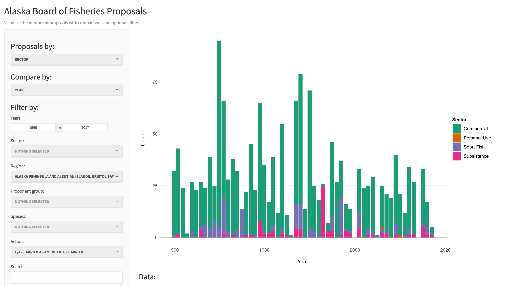
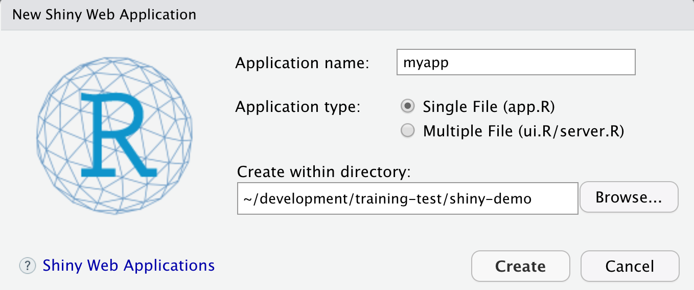
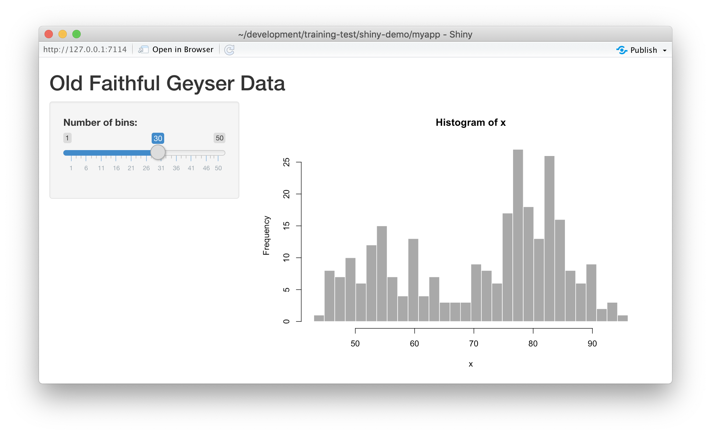

# Introduction to Shiny

## Learning Objectives

In this lesson we will:

- review the capabilities in Shiny applications
- leanr about the basic layout for Shiny interfaces
- learn about the server component for Shiny applications
- build a simple shiny application for interactive plotting

## Overview

[Shiny](http://shiny.rstudio.com/) is an R package for creating interactive data visualizations embedded in a web application that you and your colleagues can view with just a web browser. Shiny apps are relatively easy to construct, and provide interactive features for letting others share and explore data and analyses.

There are some really great examples of what Shiny can do on the RStudio webite like [this one exploring movie metadata](https://shiny.rstudio.com/gallery/movie-explorer.html). A more scientific example is a tool from the SASAP project exploring [proposal data from the Alaska Board of Fisheries](https://sasap-data.shinyapps.io/board_of_fisheries/).

```{r shinyapp_sasap, echo=FALSE}

```

Most any kind of analysis and visualization that you can do in R can be turned into a useful interactive visualization for the web that lets people explore your data more intuitively  But, a Shiny application is not the best way to preserve or archive your data.  Instead, for preservation use a repository that is archival in its mission like the [KNB Data Repository](https://knb.ecoinformatics.org), [Zenodo](https://zenodo.org), or [Dryad](https://datadryad.org). This will assign a citable identfier to the specific version of your data, which you can then read in an interactive visualiztion with Shiny.

For example, the data for the Alaska Board of Fisheries application is published on the KNB and is citable as:

Meagan Krupa, Molly Cunfer, and Jeanette Clark. 2017. Alaska Board of Fisheries Proposals 1959-2016. Knowledge Network for Biocomplexity. [doi:10.5063/F1QN652R](https://doi.org/10.5063/F1QN652R). 

While that is the best citation and archival location of the dataset, using Shiny, one can also provide an easy-to-use exploratory web application that you use to make your point that directly loads the data from the archival site.  For example, the Board of Fisheries application above lets people who are not inherently familiar with the data to generate graphs showing the relationships between the variables in the dataset.

## Lesson

We're going to create a simple shiny app with two sliders so we can interactively control inputs to an R function.  These sliders will allow us to interactively control a plot.

### Create a sample shiny application
- File > New > Shiny Web App...
- Set some fields:

    - Name it "myapp" or something else
    - Select "Single File"
    - Choose to create it in a new folder called 'shiny-demo'
    - Click Create

RStudio will create a new file called `app.R` that contains the Shiny application.  
Run it by choosing `Run App` from the RStudio editor header bar.  This will bring up
the default demo Shiny application, which plots a histogram and lets you control
the number of bins in the plot.



## Source code for the application

```{r shinyapp_source, eval=FALSE}
library(shiny)
library(ggplot2)

# Load our data
# Navigate to this dataset by Craig Tweedie that is published on the Arctic Data Center. 
# [Craig Tweedie. 2009. North Pole Environmental Observatory Bottle Chemistry. Arctic Data Center. 
# doi:10.18739/A25T3FZ8X.](http://doi.org/10.18739/A25T3FZ8X), and download the first csv file 
# called "BGchem2008data.csv"
# The data URL is: 
data_url <- "https://arcticdata.io/metacat/d1/mn/v2/object/urn%3Auuid%3A35ad7624-b159-4e29-a700-0c0770419941"
bg_chem <- read.csv(data_url, stringsAsFactors = FALSE)
#bg_chem <- read.csv(url(data_url, method = "libcurl"), stringsAsFactors = FALSE)

# Define UI for application that draws a histogram
ui <- fluidPage(

    # Application title
    titlePanel("Water biogeochemistry"),

    # Sidebar with a slider input for number of bins 
    sidebarLayout(
        sidebarPanel(
            sliderInput("mindepth", "Min depth:", min = 0, max = 500, value = 0),
            sliderInput("maxdepth", "Max depth:", min = 1, max = 500, value = 50)
        ),

        # Show a plot of the generated scatterplot
        mainPanel(
           plotOutput("distPlot")
        )
    )
)

# Define server logic required to draw a histogram
server <- function(input, output) {

    output$distPlot <- renderPlot({

        ggplot(bg_chem, mapping = aes(CTD_Depth, CTD_Salinity)) +
            geom_point(colour="red", size=4) +
            xlim(input$mindepth,input$maxdepth) +
            theme_light()
    })
}

# Run the application 
shinyApp(ui = ui, server = server)
```

## Resources

- [Main site](http://shiny.rstudio.com/)
- [Official Shiny Tutorial](http://shiny.rstudio.com/tutorial/)
