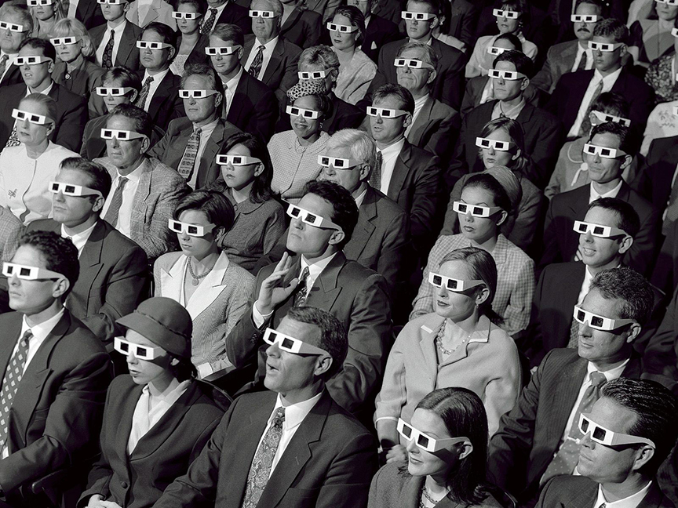
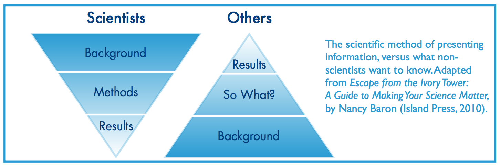
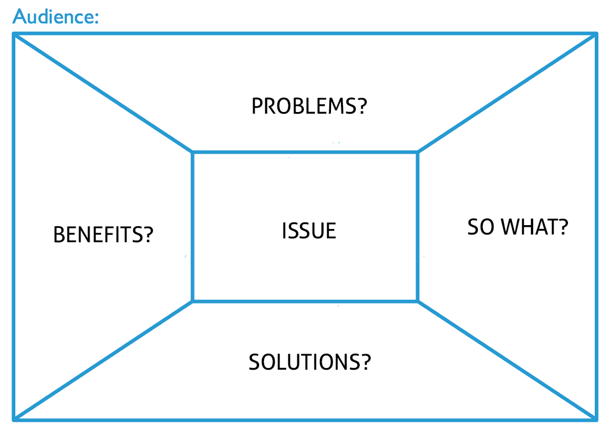
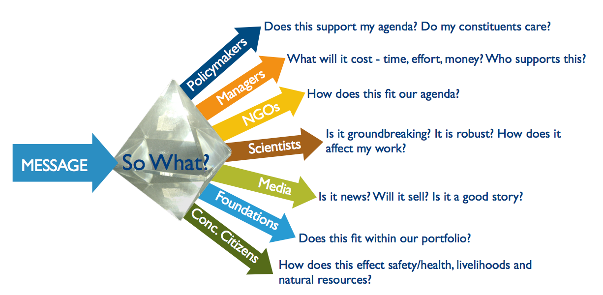
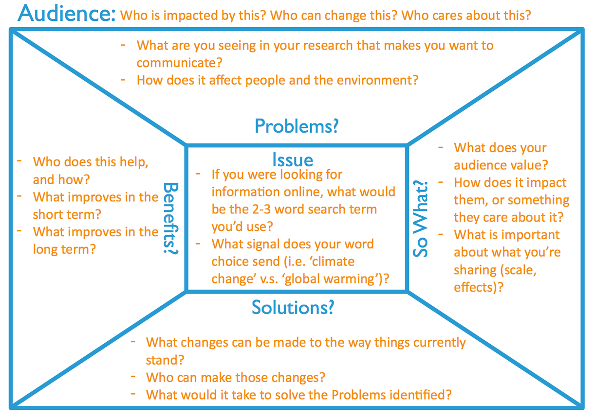

The Message Box
========================================================
width: 1440
height: 900
font-family: 'Gill Sans', 'Source Sans Pro', 'Aller', 'Helvetica'
css: ../course-overview/oss.css

### Communicating Your Science Effectively

https://www.compassscicomm.org/the-message-box-workbook

========================================================

  

Principles of Science Communication
========================================================

- Know Your Audience
- Frame Your Message
- Lead With Results
- Avoid Jargon

Know Your Audience
========================================================
 

Frame Your Message 
========================================================

Lead With Results
========================================================
 

Avoid Jargon
========================================================

 

The Message Box
========================================================

 

The Message Box
========================================================

Know Your Audience
========================================================

***

Section 1: The Issue
========================================================
- Describes the overarching issue or topic: Big Picture
- Broad enough to cover key points
- Specific enough to set up what's to come
- Concise and clear
- "Frames" the rest of the message box

Section 2: The Problem
========================================================
- The part of the broader issue that your work is addressing
- Builds upon your work and expert knowledge
- Try to focus on one problem per audience
- Often the **Problem** is your research question
- This section sets you up for **So What**

Section 3: The "So What?"
========================================================
- This is the crux of the message box
- Why should you audience care?
- What about your research is important for them to know?
- Whay are you talking to them about it?

Section 4: The Solution
========================================================
- Outlines the options for solving the **Problem**
- Can your audience influence or act upon this?
- There may be multiple solutions
- Make sure your **Solution** relates back to the **Problem**. Edit one or both as needed

Section 5: The Benefit
========================================================
- What are the benefits of addressing the **Problem**?
- What good things come from implementing your **Solution**?
- Make sure it connects with you **So What**
- **Benefits** and **So What** may be similar

Make Your Message Memorable
========================================================
- Support your message with data
- Limit the use of numbers and statistics
- Use specific examples
- Compare numbers to concepts, help people relate
- Don't use jargon
- Lead with what you know

The Message Box
========================================================

