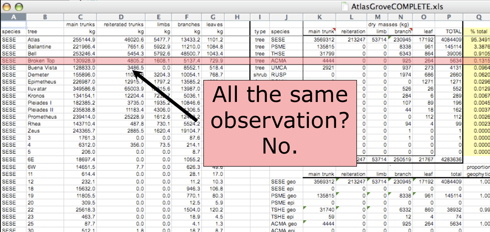
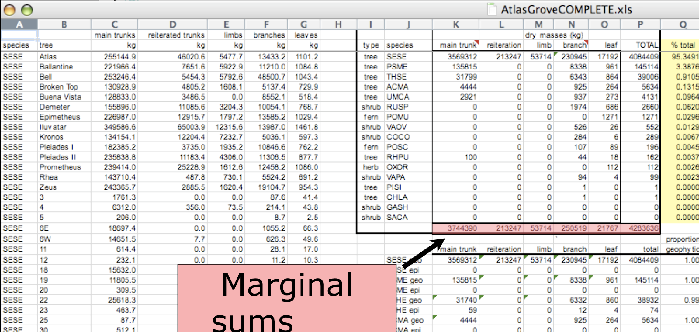
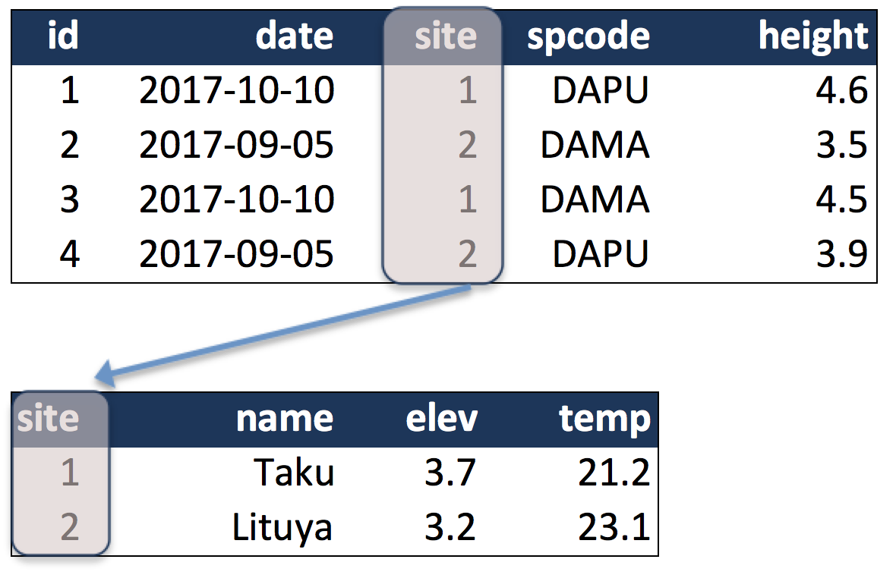
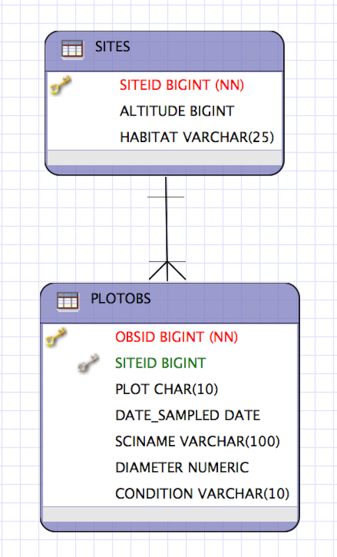

Good enough data modeling
========================================================
width: 1440
height: 900
font-family: 'Gill Sans', 'Source Sans Pro', 'Aller', 'Helvetica'
css: ../course-overview/oss.css

Open Science for Synthesis, Gulf Research Program

July 10-28, 2017

Sponsor: [Gulf Research Program, National Academy of Sciences](http://www.nationalacademies.org/gulf/index.html)

Learning outcomes
========================================================

- Understand basics of relational data models
- Learn how to design and create effective data tables in SQL
- Learn to query tables in SQL

Benefits of relational data systems
========================================================

- Powerful search and filtering
- Handle large, complex data sets
- Enforce data integrity
- Decrease errors from redundant updates

Data Organization
========================================================
title: false

Multiple tables
========================================================
title: false
transition: fade

Inconsistent observations
========================================================
title: false
transition: fade

Inconsistent variables
========================================================
title: false
transition: fade

Marginal sums and statistics
========================================================
title: false
transition: fade

Good enough data modeling
========================================================
title: false

## Tables (aka Entities)

- Separate table for entity or thing measured
- Each row represents a single observed entity
- Observations (rows) all unique

## Variables (aka Attributes)

- All values in column of the same type
- All columns pertain to the observed entity (e.g., row)

- This is *normalized* data (aka tidy data)

***

Primary and Foreign Keys
========================================================

Primary Key: unique identifier for observations

Foreign Key: reference to a primary key in another table

***

Entity-Relationship Model (ER)
========================================================

Merging data
========================================================

Simple Guidelines for Effective Data
========================================================

- Design to add rows, not columns
- Each column one type
- Eliminate redundancy
- Uncorrected data file
- Header line
- Nonproprietary formats
- Descriptive names
- No spaces

- [Borer et al. 2009. **Some Simple Guidelines for Effective Data Management.** Bulletin of the Ecological Society of America.](http://matt.magisa.org/pubs/borer-esa-2009.pdf)

Related resources
========================================================

- [Borer et al. 2009. **Some Simple Guidelines for Effective Data Management.** Bulletin of the Ecological Society of America.](http://matt.magisa.org/pubs/borer-esa-2009.pdf)
- [Software Carpentry SQL tutorial](https://swcarpentry.github.io/sql-novice-survey/)

Data modeling exercise
========================================================

- Break into project teams

- Choose two related data sets for your project
  - Should need to be integrated

- Draw an ER model for the tables
  - Indicate the primary and foreign keys

***

Acknowledgements
=========================================================

OSS2017 was funded under a grant from the [Gulf Research Program, National Academy of Sciences](http://www.nationalacademies.org/gulf/index.html)

 This work is licensed under a Creative Commons Attribution 4.0 International License.

