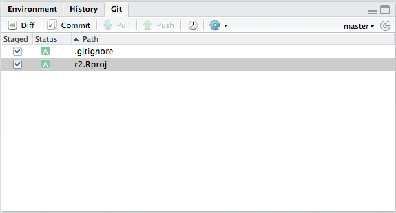

# Version control using RStudio

*Notes:* 

- It is assumed that you already know the basics of version control systems. If not, here is a good hands-on introduction to the Git version control system: <https://try.github.io/levels/1/challenges/1>
- It is also assumed that you already have used git on this computer/server. If not, you must first set up your identity; see here for more details: <https://git-scm.com/book/en/v2/Getting-Started-First-Time-Git-Setup>.

**If you want to use the RStudio interface to control git, you need to create a RStudio Project**. To do so, you should first organize your files in one folder that will become your git repository. Once this is done, you can create a new RStudio Project from the upper-right corner of the RStudio IDE window, choosing *New Project*

Now, you have two options:

* *Create the Project based on an existing folder* (e.g., you already have been working and writing code and you want to start using git versioning on this work)

* *Create the Project from scratch* based on a new empty folder

## Versioning existing work

### Create the RStudio Project

* Choose *Existing Directory* from the wizard

* *Browse* to the main folder containing your data

* *Create Project*

### Starting git version control 

Now you that have successfully created a RStudio project, you can enable the version control. Go to the *Tools* menu *-> Version Control -> Project Setup…*

This will open a new window. Change the *None* setting by choosing *Git* from the drop-down menu

Click *OK*. Answer *Yes* to the 2 following pop-ups to restart RStudio and enable git on your project.

## Versioning new work

If you are starting to work on a new project for which you have not yet started to write code, you can follow these steps to create a new git repository:

* Create a new RStudio Project from the upper-right corner of the RStudio IDE window, choosing *New Project* 

* Choose *New Directory* 

Note: The Version control option at the bottom is only to be chosen when you want to clone an existing repository.

* Choose *Empty* *Project*

* Give your project (folder) a *name*, *Browse* for its location on your drive. Finally, check the option *Create a git repository* before clicking *Create Project*.

**Congratulations, you have a new project with git versioning enabled!!**

## Using git from RStudio

Now that you have enabled git versioning for your Project, a "Git" tab should have been added to your interface next to "Environment" and "History" tabs

Note that the *.gitignore* file is automatically generated by RStudio. It lists all file formats we do not want to track, here specifically the temporary files from R and RStudio. You can edit this document to add any type of file you would like git not to track.

### Staging

To specify which files you want to track (aka staging), you need to check the boxes in front of the file names. This is the equivalent of the `git add` command.

### Committing

Then you can do your first commit -taking a snapshot of the current status of your work for the files you have decided to track (stage) -  by clicking on the *Commit* button (above your file names). This is the equivalent of the `git commit` command.

A new window should pop up. Note that certain web browsers will block this pop-up.

You need to write a descriptive message of the work accomplished from the last commit in the Commit message window, then you can click the Commit button (below the Commit message window).

Then you can hit the button *Close* and close the commit window as you would close any system windows.

All the committed files should have disappeared from the *Git* tab on the RStudio IDE. A file will reappear when you save new changes. 

And you can start the whole commit process again, once you have reached a milestone in your work!! Commit frequently!! Don't have fear of commitment.

### Pulling

Once you have committed your changes, you can `pull` the latest version of the repository from GitHub by clicking on the pull button. Conflict may happen during this steps if several persons have modified the same file. Don't worry, git will walk you through the necessary steps to fix the conflicts (see 3-git-advanced for more info on this).This is the equivalent of the `git pull` command.

### Pushing

Once you have finished the pull process, you can click on the `push` button to upload your changes to GitHub and share your work with others. This is the equivalent of the `git push` command.
 
 On the RStudio git panel, the order of the buttons from left to right matches the sequence of actions you need to follow to submit your changes to the GitHub repository!

## References

- RStudio IDE cheat sheet: [https://www.rstudio.com/wp-content/uploads/2016/01/rstudio-IDE-cheatsheet.pdf](https://www.rstudio.com/wp-content/uploads/2016/01/rstudio-IDE-cheatsheet.pdf)
- Using RStudio: [https://support.rstudio.com/hc/en-us/sections/200107586-Using-RStudio](https://support.rstudio.com/hc/en-us/sections/200107586-Using-RStudio)
- RStudio keyboard shortcuts: [https://support.rstudio.com/hc/en-us/articles/200711853-Keyboard-Shortcuts](https://support.rstudio.com/hc/en-us/articles/200711853-Keyboard-Shortcuts)
- Debugging with R Studio: [https://support.rstudio.com/hc/en-us/articles/205612627-Debugging-with-RStudio](https://support.rstudio.com/hc/en-us/articles/205612627-Debugging-with-RStudio)  
- Using git from RStudio: [https://support.rstudio.com/hc/en-us/articles/200532077-Version-Control-with-Git-and-SVN](https://support.rstudio.com/hc/en-us/articles/200532077-Version-Control-with-Git-and-SVN)
- Tips on using git and GitHub from RStudio, Hadley Wickham's [R packages](http://r-pkgs.had.co.nz/git.html#git-pull) book
