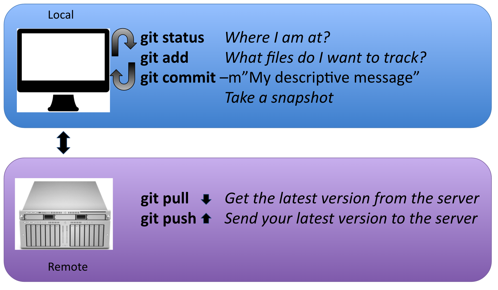

Code versioning - Working with remotes
===============================

***So far we have use git locally, on one machine***. One of the strength of Git is that it allows to share and co-edit codes and files.

## Adding remotes to your workflow

It is important that a good portion of the worflow happen on your local machine (in blue) and a part require interactions with a remote machine (in purple):



### Sequence order: 

1.) ```git add```(adding the guys you want on the picture)

2.) ```git commit -m "my descriptive message"``` (taking the picture)

-------------------------------------------  REMOTE  -------------------------------------------

3.) ```git pull``` : be sure you have the latest version of the picture album from the server)

4.) ```git push``` : send your latest version of the picture album to the server


## Working with Remote repositories

### Adding your local repository to a remote server

Within your local repository:

1. Add the remote address: ```git remote add origin https://github.nceas.ucsb.edu/brun/demo.git```
2. Do your initial push: ```git push -u origin master```

The `-u` flag sets the upstream tracking to allow argument less pull. You only need to set it once (per branch).

### Managing Merge Conflicts

The most common cause of merge conflicts happen if different another user change the same file that you have modified. It can happen during pull from a remote repository (or when merging branches).

1. If you **know for sure** what file version you want to keep:

 * keep the remote file: ```git checkout --theirs conflicted_file.txt```
 * keep the local file: ```git checkout --ours conflicted_file.txt```

*=> You still have to* ```git add``` *and* ```git commit``` *after this*

2. If you do not why there is a conflict:
  Dig into the files, looking for:

```{bash}
<<<<<<< HEAD
local version
=======
remote version
>>>>>>> [remote version (commit#)]
```

*=> You still have to* `git add` *and* `git commit` *after this*

3. You want to roll back to the situation before you started a merge: `git merge --abort`

## Branches
What are branches?  Well in fact nothing new, as the master is a branch. A branch represents an independent line of development, parallel to the master (branch). 

Why should I use branches? For 2 main reasons:

* We want the master to only keep a version of the code that is working
* We want to version the code we are developing to add/test new features (for now we mostly talk about feature branch) in our script without altering the version on the master.

### Working with branches

#### Creating and using a branch

Few commands to deal with branches:

* ```git branch```	Will list the existing branches
* ```git branch myBranchName``` 	Will create an new branch with the
							name myBranchName
* `git checkout myBranchName ` Will switch to the branch myBranchName

 In a rush? create a new branch and switch to it directly:

```{bash}
git checkout -b branchName
```


**Want to switch back to master?**

```{bash}
git checkout master
```

***=> Once you have switched to your branch, all the rest of the git workflow stays the same (git add, commit, pull, push)***

#### Creating and using a branch

Done with your branch? Want to merge your new - ready for prime time - script to the master?

1. Switch back to the master: 	```git checkout master```
2. Get the latest version of the master: ```git pull origin master```
3. Merge the branch: 			```git merge myBranchName ```
4. Delete the branch:			```git branch -d myBranchName```


## References
- General
 - Interactive git 101: [https://try.github.io/](https://try.github.io/)
 - Very good tutorial about git: [https://www.atlassian.com/git/tutorials/what-is-version-control](https://www.atlassian.com/git/tutorials/what-is-version-control)
 - Git tutorial gearde towards scientits: [http://nyuccl.org/pages/gittutorial/](http://nyuccl.org/pages/gittutorial/)
 - Git documentation about the basics: [http://gitref.org/basic/](http://gitref.org/basic/)
 - Git documentation - the basics: [https://git-scm.com/book/en/v2/Getting-Started-Git-Basics](https://git-scm.com/book/en/v2/Getting-Started-Git-Basics)
 - Comparison of git repository host services: [https://www.git-tower.com/blog/git-hosting-services-compared/](https://www.git-tower.com/blog/git-hosting-services-compared/)
 - Git terminology: [https://www.atlassian.com/git/glossary/terminology](https://www.atlassian.com/git/glossary/terminology)
 - NCEAS wiki page on git: [https://help.nceas.ucsb.edu/git?s[]=git](https://help.nceas.ucsb.edu/git?s[]=git)
- Branches
 - 	interactive tutorial on branches: [http://pcottle.github.io/](http://pcottle.github.io/)
- git workflow options:
 -  unsing git in a collaborative environment: [https://www.atlassian.com/git/tutorials/comparing-workflows/centralized-workflow](https://www.atlassian.com/git/tutorials/comparing-workflows/centralized-workflow)
