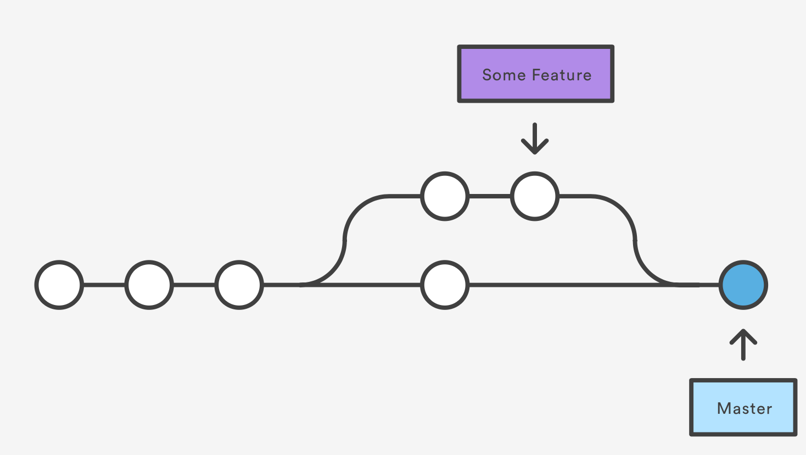

# Managing Merge Conflicts

The most common cause of merge conflicts happens when another user changes the same file that you just modified. It can happen during pull from a remote repository (or when merging branches).

1. If you **know for sure** what file version you want to keep:

 * keep the remote file: ```git checkout --theirs conflicted_file.txt```
 * keep the local file: ```git checkout --ours conflicted_file.txt```

*=> You still have to* ```git add``` *and* ```git commit``` *after this*

2. If you do not know why there is a conflict:
  Dig into the files, looking for:

```{bash}
<<<<<<< HEAD
local version (ours)
=======
remote version (theirs)
>>>>>>> [remote version (commit#)]
```

*=> You still have to* `git add` *and* `git commit` *after this*

During this process, if you want to roll back to the situation before you started the merge: `git merge --abort`

**NOTE:** By doing a `pull` before committing, you can avoid a lot of git conflicts. Your git workflow should therefore be:

1. `git add`
2. `git pull`
3. `commit -m "descriptive message"`
4. `git pull`
5. `git push`

## Example

Continuing with the `dessert` example we used in the first part of this tutorial, we now have on our local machine


# Branches



What are branches?  Well in fact nothing new, as the master is a branch. A branch represents an independent line of development, parallel to the master (branch). 

Why should I use branches? For 2 main reasons:

* We want the master to only keep a version of the code that is working
* We want to version the code we are developing to add/test new features (for now we mostly talk about feature branch) in our script without altering the version on the master.

### Working with branches

#### Creating and using a branch

Few commands to deal with branches:

* `git branch`	Will list the existing branches
* `git branch myBranchName` 	Will create a new branch with the
							name myBranchName
* `git checkout myBranchName` Will switch to the branch myBranchName

 In a rush? create a new branch and switch to it directly:

```{bash}
git checkout -b branchName
```


**Want to switch back to master?**

```{bash}
git checkout master
```

***=> Once you have switched to your branch, all the rest of the git workflow stays the same (git add, commit, pull, push)***

#### Creating and using a branch

Done with your branch? Want to merge your new - ready for prime time - script to the master?

1. Switch back to the master: 	```git checkout master```
2. Get the latest version of the master: ```git pull origin master```
3. Merge the branch: 			```git merge myBranchName ```
4. Delete the branch:			```git branch -d myBranchName```


# Next Session

[**git using RStudio**](https://nceas.github.io/oss-lessons/version-control/4-getting-started-with-git-in-RStudio.html)

# References

- General
 - Interactive git 101: <https://try.github.io/>
 - Very good tutorial about git: <https://www.atlassian.com/git/tutorials/what-is-version-control>
 - Git tutorial geared towards scientists: <http://nyuccl.org/pages/gittutorial/>
 - Git documentation about the basics: <http://gitref.org/basic/>
 - Git documentation - the basics: <https://git-scm.com/book/en/v2/Getting-Started-Git-Basics>
 - Comparison of git repository host services: <https://www.git-tower.com/blog/git-hosting-services-compared/>
 - Git terminology: <https://www.atlassian.com/git/glossary/terminology>
 - 8 tips to work better with git: <https://about.gitlab.com/2015/02/19/8-tips-to-help-you-work-better-with-git/>
 - GitPro book (2nd edition): <https://git-scm.com/book/en/v2>
 - NCEAS wiki page on git: <https://help.nceas.ucsb.edu/git?s[]=git>
- Branches
 - 	interactive tutorial on branches: <http://learngitbranching.js.org/>
 -  using git in a collaborative environment: <https://www.atlassian.com/git/tutorials/comparing-workflows/centralized-workflow>
